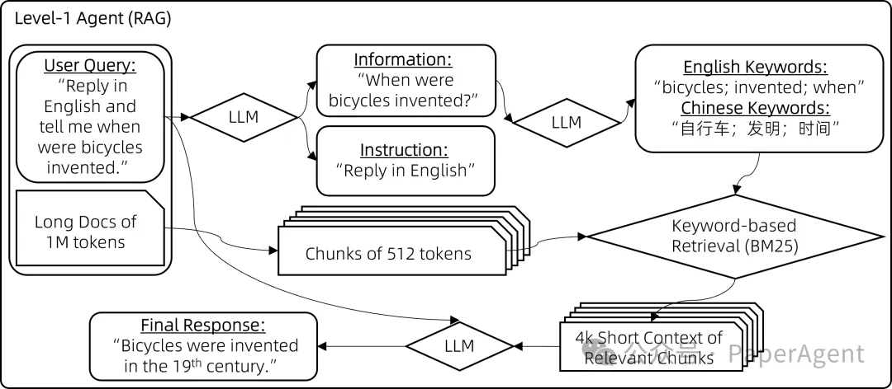
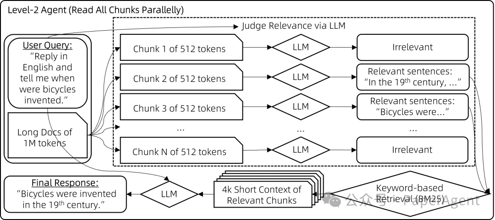
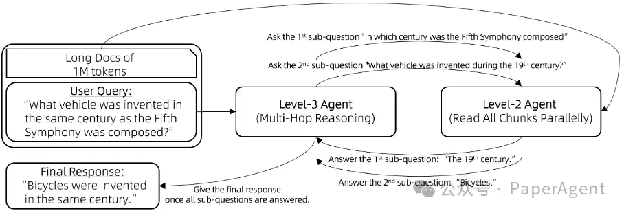
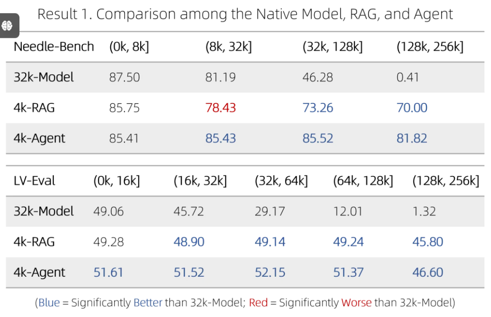
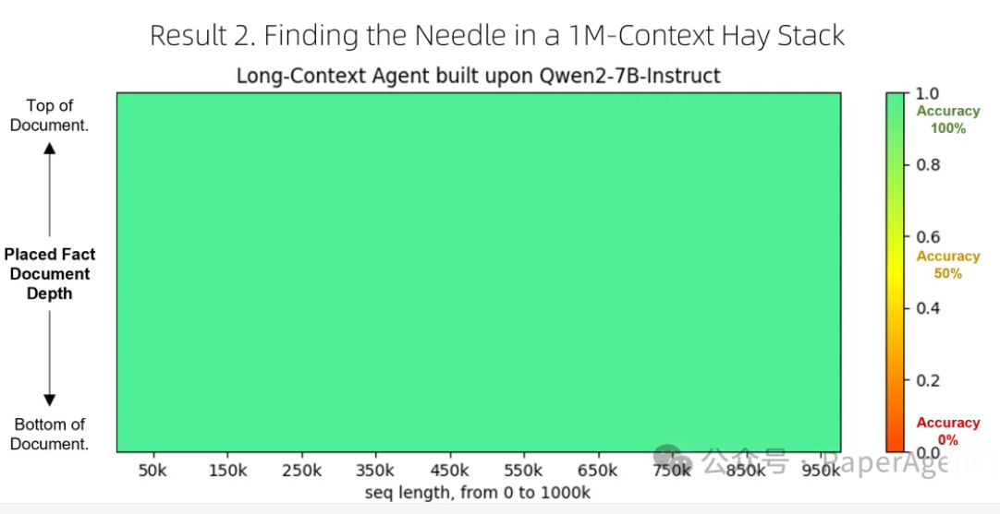

# 0. 资源

- https://qwenlm.github.io/zh/blog/qwen-agent-2405/
- https://qwenlm.github.io/blog/qwen2/

# 1. 简介

阿里在发布Qwen2之余，还发了一篇名为：“使用Qwen-Agent将上下文记忆扩展到百万量级”的博客，本意是用Qwen-Agent扩大大模型上下文窗口来处理超长文本输入，但是文中介绍了三种大模型智能问答智能体（Agent）的构建方式：
- Level-1 Agent（RAG）
- Level-2 Agent（Read All Chunks Parallelly）
- Level-3 Agent（Multi-Hop Reasoning）利用Function Calling

最终，大模型RAG问答终极之路还是Agent！

## 1.1 级别一：检索，Level-1 Agent（RAG）

问题描述：RAG问答中如何精准定位最相关的块（chunk）？

解决方案：
- 大模型Query拆解：指令信息与非指令信息分开
    - 输入："回答时请用2000字详尽阐述，我的问题是，自行车是什么时候发明的？请用英文回复。"
    - 拆解：{"信息": ["自行车是什么时候发明的"], "指令": ["回答时用2000字", "尽量详尽", "用英文回复"]}
- 大模型Query信息抽取：多语言关键词
    - 输入："自行车是什么时候发明的"
    - 提取：{"关键词_英文": ["bicycles", "invented", "when"], "关键词_中文": ["自行车", "发明", "时间"]}
- 关键词（BM25）匹配



## 1.2 级别二：分块阅读，Level-2 Agent（Read All Chunks Parallelly）

问题描述：级别一种RAG问答检索，当相关chunk与用户Query关键词重叠程度不足时效果不佳，导致这些相关的块未被检索到、没有提供给模型
解决方案：向量检索是一种方式，但是实际效果有限；提出一种暴力策略：
- 用大模型评估每个512的chunk与用户Query的相关性，不相关则输出"无"，对每个块并行执行以下策略
- 相关的句子（输出为非"无"），用它们作为搜索Query，通过BM25检索出最相关的块
- 基于上述所有检索到的上下文chunk送入大模型生成最终答案



## 1.3 级别三：逐步推理，Level-3 Agent（Multi-Hop Reasoning）

问题描述：RAG问答中多跳推理，例如Query，“与第五交响曲创作于同一世纪的交通工具是什么？”，大模型需要分两个子问题来解决：
- “第五交响曲是在哪个世纪创作的？”
- “19世纪发明的交通工具”

解决方案：工具调用（function calling）智能体或ReAct智能体

```text
向Lv3-智能体提出一个问题。
while (Lv3-智能体无法根据其记忆回答问题) {
    Lv3-智能体提出一个新的子问题待解答。
    Lv3-智能体向Lv2-智能体提问这个子问题。
    将Lv2-智能体的回应添加到Lv3-智能体的记忆中。
}
Lv3-智能体提供原始问题的最终答案。
```



一些评实验测结论：4k-Agent表现始终优于32k-Model和4k-RAG





# 参考

[1] Qwen-Agent：RAG的终极之路还是Agent！, https://mp.weixin.qq.com/s/iZjfHEe2TXCJYPAGQ6beUQ