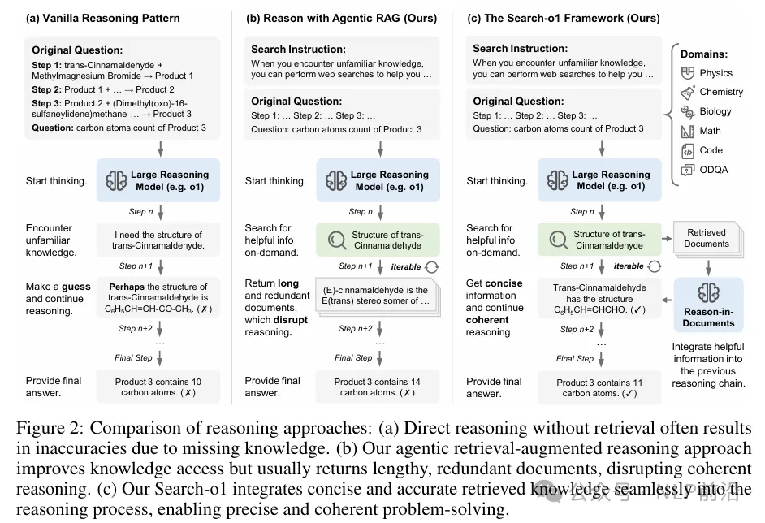
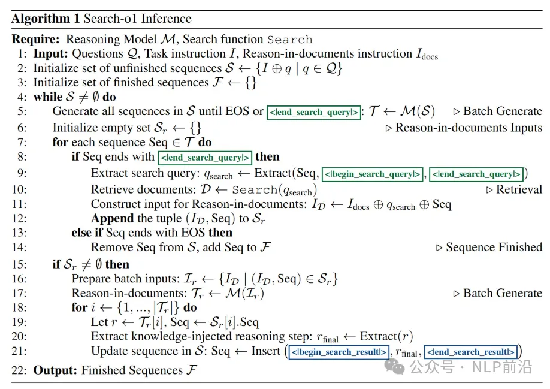
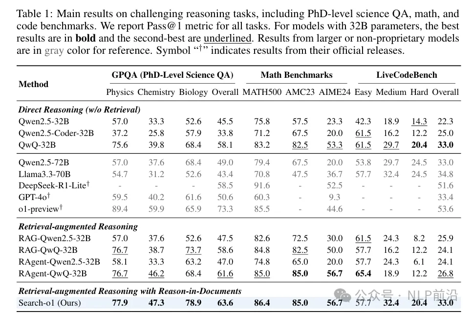

# 1. 资源

- Search-o1: Agentic Search-Enhanced Large Reasoning Models
- 项目地址： https://github.com/sunnynexus/Search-o1

像 o1 这些的 LRMs 在给出结果之前会进行大量的思考（推理过程），推理过程中，往往会出现大量不确定性的词，比如说 "perhaps"、"alternatively" 。就是说，这个过程模型可能不自信了，所以可能就会出现错误或者不连贯了。

RAG 方法可以引入外部知识，将其引入到o1推理过程中，应该就能缓解这个“不自信”了。结合需要考虑2点：

考虑到推理过程中的动态知识需求（而不是，只用问题搜索一次）

检索到的文档内容冗长的时候，怎么处理，从而不干扰模型的推理。

所以核心模块分为2大块：

Agentic RAG

当 LRMs 在推理过程中遇到知识盲点时，自动触发检索机制，召回作为一个工具使用。

Reason-in-Documents

对检索到的文档进行深入分析。提取关键信息，并将其提炼成简洁、准确的知识点。

这些知识点会无缝地融入到 LRMs 的推理过程中，避免了冗余信息带来的干扰。

推理的伪代码：

获得了不错的结果。

