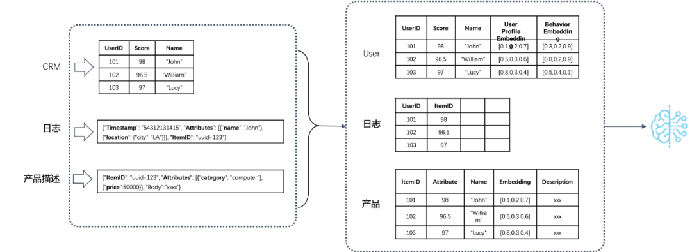
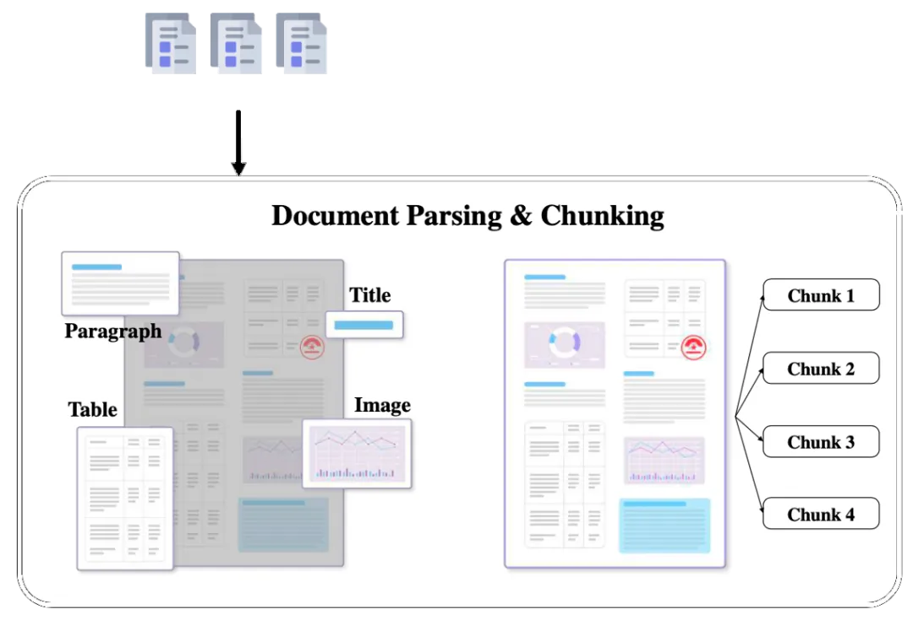

# 1. 资源

RAGflow
    - Github (1.7k Stars): https://github.com/infiniflow/ragflow
    - Demo: https://ragflow.io/

infinity
    - Github (1.5k Stars): https://github.com/infiniflow/infinity
    - The AI-native database built for LLM applications, providing incredibly fast full-text and vector search

# 2. 详细介绍
## 2.1 Infinity

AI 原生数据库 Infinity。它解决的是如何解锁 RAG 服务 B 端场景下遇到的典型问题：如何跟企业已有的数据——包括但不限于非结构化的文档、图片，还包括结构化的信息系统来结合，并解决多路召回和最终融合排序的问题。

举几个典型场景：把符合要求的简历筛出，筛选条件包含工作技能（需要向量 + 全文搜索），某类行业的工作经验（基于向量的分组聚合），期望收入，学历，地域（结构化数据）等；基于对话推荐符合个人要求的产品，可以采用多列向量来描述个人偏好，不同的列代表了用户对不同类目产品的过往使用偏好。在推荐过程中，除了采用基于用户的偏好向量进行搜索之外，还需要结合产品的过滤条件：包括是否过期，是否有优惠券，是否符合权限要求，是否有合规要求，该用户是否近期已经购买或者阅读过，等等。

这些信息，如果仅仅拿所谓“标量”字段这种方式来表征，那么产品的开发是极其复杂的：因为这需要引入额外的 ETL ，带来了维护性，以及更严重的数据一致性的问题。要知道，RAG 面临的是最终用户使用场景，它是需要业务乃至 LLM 发起请求，就立刻得到答案的，因此不能像数据中台一样仅仅为了一张报表就可以搭建一整套数据管道体系去做宽表这种额外逻辑。因此，Infinity 实际上等于向量数据库 + 搜索引擎 + 普通结构化数据查询，并保证三者的高并发和融合排序。

## 2.2 RAGflow

端到端的 RAG 引擎 RAGFlow。它解决数据的问题：因为如果不对用户数据加以区分和清晰，识别其中的语义，就容易导致 Garbage In Garbage Out。RAGFlow 包含了如下的完整 RAG 流程，确保数据从 Garbage In Garbage Out 变为 Quality In Quality Out。

具体来说， RAGFlow 的最大特色，就是多样化的文档智能处理，因此它没有采用现成的 RAG 中间件，而是完全重新研发了一套智能文档理解系统，并以此为依托构建 RAG 任务编排体系。这个系统的特点包含：

1. 它是一套基于 AI 模型的智能文档处理系统：对于用户上传的文档，它需要自动识别文档的布局，包括标题、段落、换行等，还包含难度很大的图片和表格。对于表格来说，不仅仅要识别出文档中存在表格，还会针对表格的布局做进一步识别，包括内部每一个单元格，多行文字是否需要合并成一个单元格等。并且表格的内容还会结合表头信息处理，确保以合适的形式送到数据库，从而完成 RAG 针对这些细节数字的“大海捞针”。

2. 它是一套包含各种不同模板的智能文档处理系统：不同行业不同岗位所用到的文档不同，行文格式不同，对文档查阅的需求也不同。比如：

    - 会计一般最常接触到的凭证、发票、Excel 报表；查询的一般都是数字，如：看一下上月十五号发生哪些凭证，总额多少？上季度资产负债表里面净资产总额多少？合同台账中下个月有哪些应付应收？

    - 作为一个 HR 平时接触最庞杂的便是候选人简历，且查询最多的是列表查询，如：人才库中 985/211 的 3 到 5 年的算法工程师有哪些？985 硕士以上学历的人员有哪些？赵玉田的微信号多少？香秀哪个学校的来着？

    - 作为科研工作者接触到最多的可能是就是论文了，快速阅读和理解论文，梳理论文和引文之间的关系成了他们的痛点。

这样看来凭证 / 报表、简历、论文的文档结构是不一样的，查询需求也是不一样的，那处理方式肯定是不一样。因此 RAGFlow 在处理文档时，给了不少的选择：Q&A，Resume，Paper，Manual，Table，Book，Law，通用... 。当然，这些分类还在不断继续扩展中，处理过程还有待完善。我们也会抽象出更多共通的东西，使各种定制化的处理更加容易。

3. 智能文档处理的可视化和可解释性：用户上传的文档到底被处理成啥样了，如：分割了多少片，各种图表处理成啥样了，毕竟任何基于 AI 的系统只能保证大概率正确，作为系统有必要给出这样的空间让用户进行适当的干预，作为用户也有把控的需求，黑箱不敌白箱。特别是对于 PDF，行文多种多样，变化多端，而且广泛流行于各行各业，对于它的把控尤为重要，RAGFlow 不仅给出了处理结果，而且可以让用户查看文档解析结果并一次点击定位到原文，对比和原文的差异，可增可减可改可查，如下图所示：

4. RAGFlow 是一个完整的 RAG 系统，而目前开源的 RAG，大都忽视了 RAG 本身的最大优势之一：可以让 LLM 以可控的方式回答问题，或者换种说法：有理有据、消除幻觉。我们都知道，随着模型能力的不同，LLM 多少都会有概率会出现幻觉，在这种情况下， 一款 RAG 产品应该随时随地给用户以参考，让用户随时查看 LLM 是基于哪些原文来生成答案的，这需要同时生成原文的引用链接，并允许用户的鼠标 hover 上去即可调出原文的内容，甚至包含图表。如果还不能确定，再点一下便能定位到原文，如下图所示：

接下来，我们来讲讲，RAGFlow 具体是如何利用文档结构识别模型来处理数据的。所谓文档结构模型，如下所示，是针对文档的布局进行目标识别，然后根据布局再做文字切分。这些布局识别的目标包括文档的标题，段落，语义文字块等等，尤其还会包含文档当中的图表。

在识别出这些目标之后，还需要分别对这些目标做相应处理：对于文字来说，需要首先判断文字的换行信息——这对于文字的语义理解也会产生干扰；其次需要对文字内容进行一些整理，这些整理会随着 RAGFlow 模板的不同有所区分；针对表格来说，还需要进一步识别它的内部结构，这在 AI 领域有个专门的研究课题，叫做 TSR(Table Structure Recognition 表格结构识别) 。

TSR 任务其实相对比较复杂，因为表格的定义是多种多样的，表格内部可能会出现有线条或者没有线条的情况，对于不同行的文字，判断它们是否是一个单元格是存在很大挑战的，单元格判断失误，很可能就会让表格的数字跟表格列的对应关系弄错，从而影响了对单元格内文字和数字语义的理解。我们花了很多时间来提升 TSR 的能力，最早是利用现成的 OCR 开源模型，后边也尝试过微软研究院专门针对 TSR 任务的 Transformer 模型，但是发觉这些模型处理 TSR 任务的鲁棒性依然非常不足，最后我们还是训练了自己的模型，从而让 TSR 任务表现良好。这个模型比较简单，就是基于 CNN 的目标检测模型，但是它的效果却比上边我们提到的其他模型都要好。为了降低对硬件的依赖和开销，我们甚至切换到用 YOLOv8 来做目标检测，使得仅仅利用 CPU 也可以运行文档结构识别。

关于这些，其实也有很多业内人士建议直接走 LLM 的路子，用 LLM 来做文档语义理解，从长期来看这肯定是个趋势，然而在当下来说，让 LLM 在文档结构识别上表现良好，还需要大量的数据才可以。这从我们放弃了基于 Transformer 的 TSR 模型就可以看出：同样的任务下，基于 Transformer 的模型需要更多的数据才可以表现更好，在有限数据下，我们不得不退回到传统 CNN 模型，如果是 LLM ，它需要的数据和算力更多——我们之前曾经尝试过基于多模态 LLM 进行识别的努力，相比专用小模型，它的效果还是差别比较大。从另一个方面也可以看出来，下图是我们用长上下文 LLM 对表格输出的例子：

这是原表格：

解锁对于非结构化数据的深度语义理解是 RAGFlow 追求的目标之一，我们希望在未来能够将更加 scalable 的文档结构识别模型应用到系统中。不仅如此， RAGFlow 的设计目标是让 RAG 逐渐承接起更多的复杂场景尤其是 B 端场景，因此在未来，它会接入企业的各类数据源，比如 MySQL 的 binlog，数据湖的 ETL，乃至外部的爬虫等。只有这些都被纳入 RAG 的范畴，我们才能实现如下的愿景：

再回头看前边关于 RAG 和长上下文 LLM 的争论， 显然两者一定是合作的。长上下文 LLM 当下已经逐步具备了 RAG 最不可或缺的基础能力，随着它自身逻辑推理能力地增强，再结合来自数据库，还有数据方面的改进，一定能加速 LLM 的 B 端场景走出婴儿期的进程。

RAGFlow 近期更新：将提供类似文件管理的功能，这样 RAG 可以跟企业内部文档以更灵活的方式整合。RAGFlow 中期更新，将提供面向企业级数据接入的低代码平台，同时提供问答对话之外的高级内容生成，比如长文生成等等。

Infinity 近期更新：Infinity 近期将发布第一个 release，届时将提供业界最快的多路召回和融合排序能力。

# 参考

[1] 检索增强生成引擎 RAGFlow 正式开源！仅一天收获上千颗星，https://mp.weixin.qq.com/s/eL1qXAw-NLELih5ho3IbZw
