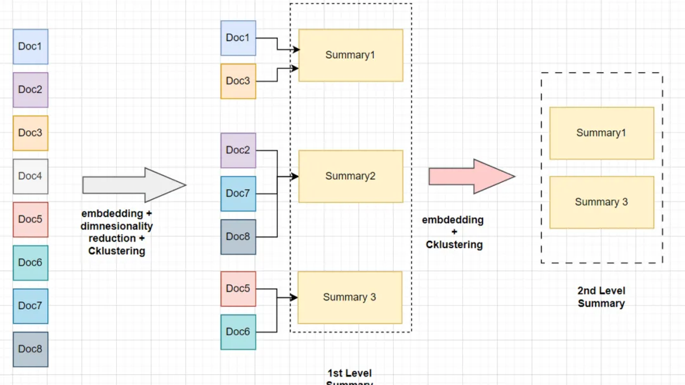
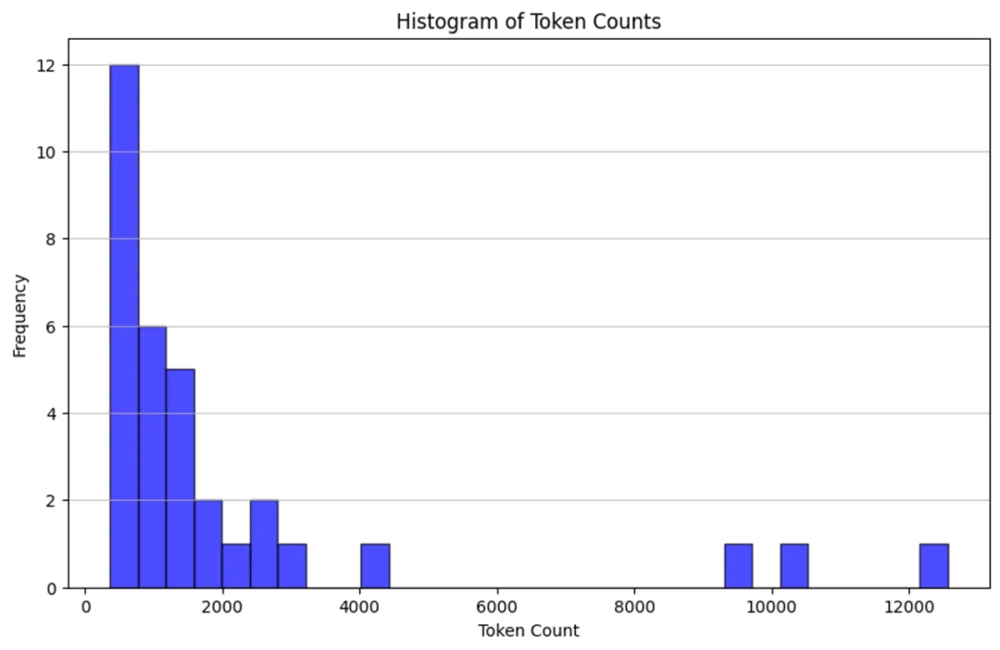
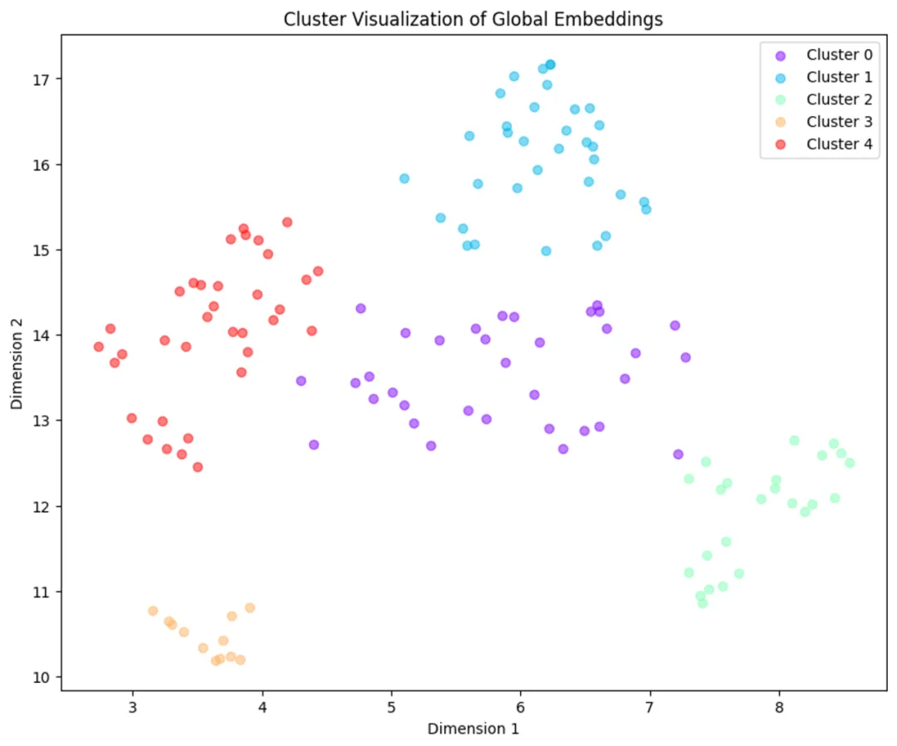

# 1. 资源

速入门 | langchain：https://python.langchain.com/docs/get_started/quickstart

RAPTOR：用于树组织检索的递归抽象处理 （arxiv.org）:https://arxiv.org/html/2401.18059v1

RAPTOR的官方实现：用于树组织检索的递归抽象处理：https://github.com/parthsarthi03/raptor/blob/master/raptor/cluster_tree_builder.py

LlamaIndex 是 LLM 应用程序的数据框架：https://github.com/run-llama/llama_index/blob/main/llama-index-packs/llama-index-packs-raptor/llama_index/packs/raptor/clustering.py

# 2. 问题

在传统的 RAG 中，我们通常会依赖于检索短文本块。但当处理需要理解长篇上下文的文档时，简单的将文档切割或仅处理其上下文显然不够。这就需要一种更合理的长文档处理方法，RAPTOR 应运而生。


# 3. 方案

递归抽象处理树组织检索（Recursive Abstractive Processing for Tree Organized Retrieval）是一种全新且强大的技术，用于以全面的方式对大型语言模型（LLM）进行索引和检索。它采用自下而上的方法，通过对文本段（块）进行聚类和总结，形成一个层级的树状结构。

RAPTOR的论文介绍了一种有趣的索引和检索文档的方法：
- 叶子代表起始文档。
- 叶子被嵌入并进行聚类。
- 然后将聚类总结成更高层次（更抽象）的信息整合，涵盖了类似文档。
- 通过递归执行这个过程，最终形成从原始文档（叶子）到更抽象总结的“树”。

这个方法可以在不同规模上应用，叶子可以是：
- 单个文档的文本块（如论文所展示）
- 完整文档（如我们下面所展示）

使用更长的上下文 LLM，可以对完整文档执行此操作。

RAPTOR 的树状结构是其功能的核心，因为它能够捕捉到文本的高层次和细节方面，这对于处理复杂的主题查询和问答任务中的多步推理特别有价值。

此过程包括将文档分割成称为块的短文本，然后使用嵌入模型对这些块进行处理。接下来，这些嵌入将被聚类算法处理。一旦形成了聚类，就使用大型语言模型（LLM）对每个聚类关联的文本进行总结。

生成的总结构成了树的节点，高层次的节点提供了更抽象的概括。



假设我们手头有8个文档块，它们属于同一个庞大的手册。与其直接对这些块进行嵌入和检索，不如在嵌入后对它们进行降维，因为对所有维度生成聚类在计算上代价过高，比如 OpenAI 嵌入的维度为1536，而常见的开源小型嵌入模型的维度为384。

接着，我们用聚类算法对降维后的数据进行聚类。然后，我们将每个聚类中的所有块的上下文进行总结。生成的总结再次进行嵌入和聚类，重复这一过程直至达到模型的词元限制（上下文窗口）。

简单来说，RAPTOR 的核心思想包括：

- 对相似文档进行聚类和总结。
- 将相关文档的信息汇总到一个总结中。
- 在需要较少上下文信息就能回答的问题上提供帮助。

# 4. 实现示例

- Langchain
- llm：zephyr-7b-beta.Q4_K_M.gguf
- 嵌入模型 — thenlper/gte-small
- 聚类算法：GMM（高斯混合模型）

安装所需的库。

```bash
!pip install -U langchain umap-learn scikit-learn langchain_community tiktoken langchain-openai langchainhub chromadb
!CMAKE_ARGS="-DLLAMA_CUBLAS=on" FORCE_CMAKE=1 pip install -qU llama-cpp-python
```

```python

import locale
def getpreferredencoding(do_setlocale = True):
  return "UTF-8"
locale.getpreferredencoding = getpreferredencoding
```

下载所需的 Zephyr 模型参数文件

```bash
!wget "<https://huggingface.co/TheBloke/zephyr-7B-beta-GGUF/resolve/main/zephyr-7b-beta.Q4_K_M.gguf>"
```

初始化大型语言模型。

```python
from langchain_community.llms import LlamaCpp
from langchain_core.callbacks import CallbackManager, StreamingStdOutCallbackHandler
from langchain_core.prompts import PromptTemplate
#
n_gpu_layers = -1  # The number of layers to put on the GPU. The rest will be on the CPU. If you don't know how many layers there are, you can use -1 to move all to GPU.
n_batch = 512  # Should be between 1 and n_ctx, consider the amount of VRAM in your GPU.
#
# Callbacks support token-wise streaming
callback_manager = CallbackManager([StreamingStdOutCallbackHandler()])
#
# Make sure the model path is correct for your system!
model = LlamaCpp(
    model_path="/content/zephyr-7b-beta.Q4_K_M.gguf",
    n_gpu_layers=n_gpu_layers,
    n_batch=n_batch,
    temperature=0.75,
    max_tokens=1000,
    top_p=1,
    n_ctx=35000,
    callback_manager=callback_manager,
    verbose=True,  # Verbose is required to pass to the callback manager
)
```

初始化嵌入模型。

```python
from langchain.vectorstores import Chroma
from langchain_community.embeddings import HuggingFaceEmbeddings
from langchain_community.vectorstores.utils import DistanceStrategy
#
EMBEDDING_MODEL_NAME = "thenlper/gte-small"

embd = HuggingFaceEmbeddings(
    model_name=EMBEDDING_MODEL_NAME,
    multi_process=True,
    model_kwargs={"device": "cuda"},
    encode_kwargs={"normalize_embeddings": True},  # set True for cosine similarity
)
```

加载数据

这里我们使用 LangChain 的 LCEL 文档作为输入数据。

```python
import matplotlib.pyplot as plt
import tiktoken
from bs4 import BeautifulSoup as Soup
from langchain_community.document_loaders.recursive_url_loader import RecursiveUrlLoader

## Helper Fuction to count the number of Tokensin each text
def num_tokens_from_string(string: str, encoding_name: str) -> int:
    """Returns the number of tokens in a text string."""
    encoding = tiktoken.get_encoding(encoding_name)
    num_tokens = len(encoding.encode(string))
    return num_tokens
#
# LCEL docs
url = "<https://python.langchain.com/docs/expression_language/>"
loader = RecursiveUrlLoader(
    url=url, max_depth=20, extractor=lambda x: Soup(x, "html.parser").text
)
docs = loader.load()

# LCEL w/ PydanticOutputParser (outside the primary LCEL docs)
url = "<https://python.langchain.com/docs/modules/model_io/output_parsers/quick_start>"
loader = RecursiveUrlLoader(
    url=url, max_depth=1, extractor=lambda x: Soup(x, "html.parser").text
)
docs_pydantic = loader.load()

# LCEL w/ Self Query (outside the primary LCEL docs)
url = "<https://python.langchain.com/docs/modules/data_connection/retrievers/self_query/>"
loader = RecursiveUrlLoader(
    url=url, max_depth=1, extractor=lambda x: Soup(x, "html.parser").text
)
docs_sq = loader.load()

# Doc texts
docs.extend([*docs_pydantic, *docs_sq])
docs_texts = [d.page_content for d in docs]
```

通过计算每篇文档的词元数量并用直方图展示，来检查我们的原始文档大小。

```python
counts = [num_tokens_from_string(d, "cl100k_base") for d in docs_texts]

# Plotting the histogram of token counts
plt.figure(figsize=(10, 6))
plt.hist(counts, bins=30, color="blue", edgecolor="black", alpha=0.7)
plt.title("Histogram of Token Counts")
plt.xlabel("Token Count")
plt.ylabel("Frequency")
plt.grid(axis="y", alpha=0.75)

# Display the histogram
plt.show()
```



检查所有文档是否在大型语言模型的上下文窗口内

```python
# Doc texts concat
d_sorted = sorted(docs, key=lambda x: x.metadata["source"])
d_reversed = list(reversed(d_sorted))
concatenated_content = "\\n\\n\\n --- \\n\\n\\n".join(
    [doc.page_content for doc in d_reversed]
)
print(
    "Num tokens in all context: %s"
    % num_tokens_from_string(concatenated_content, "cl100k_base")
)
#
# Response
Num tokens in all context: 69108
```

将文档分块，以便它们适应大型语言模型的上下文窗口。

```python

# Doc texts split
from langchain_text_splitters import RecursiveCharacterTextSplitter

chunk_size_tok = 1000
text_splitter = RecursiveCharacterTextSplitter.from_tiktoken_encoder(
    chunk_size=chunk_size_tok, chunk_overlap=0
)
texts_split = text_splitter.split_text(concatenated_content)
#
print(f"Number of text splits generated: {len(texts_split)}")
#
# Response
Number of text splits generated: 142
```

生成全局嵌入列表

它包含了每个块的语义意义嵌入。

```python
global_embeddings = [embd.embed_query(txt) for txt in texts_split]
print(len(global_embeddings[0])
###########
384
```

通过从 384 降维到 2 并可视化嵌入来生成一个简化的聚类视图。

```python

import matplotlib.pyplot as plt
from typing import Optional
import numpy as np
import umap

def reduce_cluster_embeddings(
    embeddings: np.ndarray,
    dim: int,
    n_neighbors: Optional[int] = None,
    metric: str = "cosine",
) -> np.ndarray:
    if n_neighbors is None:
        n_neighbors = int((len(embeddings) - 1) ** 0.5)
    return umap.UMAP(
        n_neighbors=n_neighbors, n_components=dim, metric=metric
    ).fit_transform(embeddings)

dim = 2
global_embeddings_reduced = reduce_cluster_embeddings(global_embeddings, dim)
print(global_embeddings_reduced[0])
#
plt.figure(figsize=(10, 8))
plt.scatter(global_embeddings_reduced[:, 0], global_embeddings_reduced[:, 1], alpha=0.5)
plt.title("Global Embeddings")
plt.xlabel("Dimension 1")
plt.ylabel("Dimension 2")
plt.show()
```

可视化聚类图



构建树

树构建过程中使用的聚类方法引入了一些有趣的概念。

GMM（高斯混合模型）

- 模拟数据点在不同聚类中的分布情况。
- 通过评估模型的贝叶斯信息准则（BIC）来确定最佳的聚类数量。

UMAP（统一流形近似和投影）

- 支持数据的聚类处理。
- 用于降低高维数据的维度。
- UMAP 通过它们的相似性帮助突出数据点的自然分组。

局部和全局聚类

- 便于在不同的尺度上分析数据。
- 有效捕捉数据内的细节和广泛模式。

阈值化

- 在 GMM 的背景下使用，以确定聚类的成员资格。
- 基于概率分布（数据点被分配给一个或多个聚类）。

```python
import matplotlib.pyplot as plt
import numpy as np
from sklearn.mixture import GaussianMixture

def get_optimal_clusters(embeddings: np.ndarray, max_clusters: int = 50, random_state: int = 1234):
    max_clusters = min(max_clusters, len(embeddings))
    bics = [GaussianMixture(n_components=n, random_state=random_state).fit(embeddings).bic(embeddings)
            for n in range(1, max_clusters)]
    return np.argmin(bics) + 1

def gmm_clustering(embeddings: np.ndarray, threshold: float, random_state: int = 0):
    n_clusters = get_optimal_clusters(embeddings)
    gm = GaussianMixture(n_components=n_clusters, random_state=random_state).fit(embeddings)
    probs = gm.predict_proba(embeddings)
    labels = [np.where(prob > threshold)[0] for prob in probs]
    return labels, n_clusters
#
labels, _ = gmm_clustering(global_embeddings_reduced, threshold=0.5)

plot_labels = np.array([label[0] if len(label) > 0 else -1 for label in labels])
plt.figure(figsize=(10, 8))

unique_labels = np.unique(plot_labels)
colors = plt.cm.rainbow(np.linspace(0, 1, len(unique_labels)))

for label, color in zip(unique_labels, colors):
    mask = plot_labels == label
    plt.scatter(global_embeddings_reduced[mask, 0], global_embeddings_reduced[mask, 1], color=color, label=f'Cluster {label}', alpha=0.5)

plt.title("Cluster Visualization of Global Embeddings")
plt.xlabel("Dimension 1")
plt.ylabel("Dimension 2")
plt.legend()
plt.show()
```


创建一个 dataframe 来检查与每个聚类相关联的文本。

```python

import pandas as pd

simple_labels = [label[0] if len(label) > 0 else -1 for label in labels]

df = pd.DataFrame({
    'Text': texts_split,
    'Embedding': list(global_embeddings_reduced),
    'Cluster': simple_labels
})
print(df.head(3))
```


```python
def format_cluster_texts(df):
    clustered_texts = {}
    for cluster in df['Cluster'].unique():
        cluster_texts = df[df['Cluster'] == cluster]['Text'].tolist()
        clustered_texts[cluster] = " --- ".join(cluster_texts)
    return clustered_texts
#
clustered_texts = format_cluster_texts(df)
#
clustered_texts
####################################################################
# Response
```

定义 RAPTOR 每一步的辅助函数

```python
from typing import Dict, List, Optional, Tuple

import numpy as np
import pandas as pd
import umap
from langchain.prompts import ChatPromptTemplate
from langchain_core.output_parsers import StrOutputParser
from sklearn.mixture import GaussianMixture

RANDOM_SEED = 224  # Fixed seed for reproducibility

### --- Code from citations referenced above (added comments and docstrings) --- ###

def global_cluster_embeddings(
    embeddings: np.ndarray,
    dim: int,
    n_neighbors: Optional[int] = None,
    metric: str = "cosine",
) -> np.ndarray:
    """
    Perform global dimensionality reduction on the embeddings using UMAP.

    Parameters:
    - embeddings: The input embeddings as a numpy array.
    - dim: The target dimensionality for the reduced space.
    - n_neighbors: Optional; the number of neighbors to consider for each point.
                   If not provided, it defaults to the square root of the number of embeddings.
    - metric: The distance metric to use for UMAP.

    Returns:
    - A numpy array of the embeddings reduced to the specified dimensionality.
    """
    if n_neighbors is None:
        n_neighbors = int((len(embeddings) - 1) ** 0.5)
    return umap.UMAP(
        n_neighbors=n_neighbors, n_components=dim, metric=metric
    ).fit_transform(embeddings)

def local_cluster_embeddings(
    embeddings: np.ndarray, dim: int, num_neighbors: int = 10, metric: str = "cosine"
) -> np.ndarray:
    """
    Perform local dimensionality reduction on the embeddings using UMAP, typically after global clustering.

    Parameters:
    - embeddings: The input embeddings as a numpy array.
    - dim: The target dimensionality for the reduced space.
    - num_neighbors: The number of neighbors to consider for each point.
    - metric: The distance metric to use for UMAP.

    Returns:
    - A numpy array of the embeddings reduced to the specified dimensionality.
    """
    return umap.UMAP(
        n_neighbors=num_neighbors, n_components=dim, metric=metric
    ).fit_transform(embeddings)

def get_optimal_clusters(
    embeddings: np.ndarray, max_clusters: int = 50, random_state: int = RANDOM_SEED
) -> int:
    """
    Determine the optimal number of clusters using the Bayesian Information Criterion (BIC) with a Gaussian Mixture Model.

    Parameters:
    - embeddings: The input embeddings as a numpy array.
    - max_clusters: The maximum number of clusters to consider.
    - random_state: Seed for reproducibility.

    Returns:
    - An integer representing the optimal number of clusters found.
    """
    max_clusters = min(max_clusters, len(embeddings))
    n_clusters = np.arange(1, max_clusters)
    bics = []
    for n in n_clusters:
        gm = GaussianMixture(n_components=n, random_state=random_state)
        gm.fit(embeddings)
        bics.append(gm.bic(embeddings))
    return n_clusters[np.argmin(bics)]

def GMM_cluster(embeddings: np.ndarray, threshold: float, random_state: int = 0):
    """
    Cluster embeddings using a Gaussian Mixture Model (GMM) based on a probability threshold.

    Parameters:
    - embeddings: The input embeddings as a numpy array.
    - threshold: The probability threshold for assigning an embedding to a cluster.
    - random_state: Seed for reproducibility.

    Returns:
    - A tuple containing the cluster labels and the number of clusters determined.
    """
    n_clusters = get_optimal_clusters(embeddings)
    gm = GaussianMixture(n_components=n_clusters, random_state=random_state)
    gm.fit(embeddings)
    probs = gm.predict_proba(embeddings)
    labels = [np.where(prob > threshold)[0] for prob in probs]
    return labels, n_clusters

def perform_clustering(
    embeddings: np.ndarray,
    dim: int,
    threshold: float,
) -> List[np.ndarray]:
    """
    Perform clustering on the embeddings by first reducing their dimensionality globally, then clustering
    using a Gaussian Mixture Model, and finally performing local clustering within each global cluster.

    Parameters:
    - embeddings: The input embeddings as a numpy array.
    - dim: The target dimensionality for UMAP reduction.
    - threshold: The probability threshold for assigning an embedding to a cluster in GMM.

    Returns:
    - A list of numpy arrays, where each array contains the cluster IDs for each embedding.
    """
    if len(embeddings) <= dim + 1:
        # Avoid clustering when there's insufficient data
        return [np.array([0]) for _ in range(len(embeddings))]

    # Global dimensionality reduction
    reduced_embeddings_global = global_cluster_embeddings(embeddings, dim)
    # Global clustering
    global_clusters, n_global_clusters = GMM_cluster(
        reduced_embeddings_global, threshold
    )

    all_local_clusters = [np.array([]) for _ in range(len(embeddings))]
    total_clusters = 0

    # Iterate through each global cluster to perform local clustering
    for i in range(n_global_clusters):
        # Extract embeddings belonging to the current global cluster
        global_cluster_embeddings_ = embeddings[
            np.array([i in gc for gc in global_clusters])
        ]

        if len(global_cluster_embeddings_) == 0:
            continue
        if len(global_cluster_embeddings_) <= dim + 1:
            # Handle small clusters with direct assignment
            local_clusters = [np.array([0]) for _ in global_cluster_embeddings_]
            n_local_clusters = 1
        else:
            # Local dimensionality reduction and clustering
            reduced_embeddings_local = local_cluster_embeddings(
                global_cluster_embeddings_, dim
            )
            local_clusters, n_local_clusters = GMM_cluster(
                reduced_embeddings_local, threshold
            )

        # Assign local cluster IDs, adjusting for total clusters already processed
        for j in range(n_local_clusters):
            local_cluster_embeddings_ = global_cluster_embeddings_[
                np.array([j in lc for lc in local_clusters])
            ]
            indices = np.where(
                (embeddings == local_cluster_embeddings_[:, None]).all(-1)
            )[1]
            for idx in indices:
                all_local_clusters[idx] = np.append(
                    all_local_clusters[idx], j + total_clusters
                )

        total_clusters += n_local_clusters

    return all_local_clusters

### --- Our code below --- ###

def embed(texts):
    """
    Generate embeddings for a list of text documents.

    This function assumes the existence of an `embd` object with a method `embed_documents`
    that takes a list of texts and returns their embeddings.

    Parameters:
    - texts: List[str], a list of text documents to be embedded.

    Returns:
    - numpy.ndarray: An array of embeddings for the given text documents.
    """
    text_embeddings = embd.embed_documents(texts)
    text_embeddings_np = np.array(text_embeddings)
    return text_embeddings_np

def embed_cluster_texts(texts):
    """
    Embeds a list of texts and clusters them, returning a DataFrame with texts, their embeddings, and cluster labels.

    This function combines embedding generation and clustering into a single step. It assumes the existence
    of a previously defined `perform_clustering` function that performs clustering on the embeddings.

    Parameters:
    - texts: List[str], a list of text documents to be processed.

    Returns:
    - pandas.DataFrame: A DataFrame containing the original texts, their embeddings, and the assigned cluster labels.
    """
    text_embeddings_np = embed(texts)  # Generate embeddings
    cluster_labels = perform_clustering(
        text_embeddings_np, 10, 0.1
    )  # Perform clustering on the embeddings
    df = pd.DataFrame()  # Initialize a DataFrame to store the results
    df["text"] = texts  # Store original texts
    df["embd"] = list(text_embeddings_np)  # Store embeddings as a list in the DataFrame
    df["cluster"] = cluster_labels  # Store cluster labels
    return df

def fmt_txt(df: pd.DataFrame) -> str:
    """
    Formats the text documents in a DataFrame into a single string.

    Parameters:
    - df: DataFrame containing the 'text' column with text documents to format.

    Returns:
    - A single string where all text documents are joined by a specific delimiter.
    """
    unique_txt = df["text"].tolist()
    return "--- --- \\n --- --- ".join(unique_txt)

def embed_cluster_summarize_texts(
    texts: List[str], level: int
) -> Tuple[pd.DataFrame, pd.DataFrame]:
    """
    Embeds, clusters, and summarizes a list of texts. This function first generates embeddings for the texts,
    clusters them based on similarity, expands the cluster assignments for easier processing, and then summarizes
    the content within each cluster.

    Parameters:
    - texts: A list of text documents to be processed.
    - level: An integer parameter that could define the depth or detail of processing.

    Returns:
    - Tuple containing two DataFrames:
      1. The first DataFrame (`df_clusters`) includes the original texts, their embeddings, and cluster assignments.
      2. The second DataFrame (`df_summary`) contains summaries for each cluster, the specified level of detail,
         and the cluster identifiers.
    """

    # Embed and cluster the texts, resulting in a DataFrame with 'text', 'embd', and 'cluster' columns
    df_clusters = embed_cluster_texts(texts)

    # Prepare to expand the DataFrame for easier manipulation of clusters
    expanded_list = []

    # Expand DataFrame entries to document-cluster pairings for straightforward processing
    for index, row in df_clusters.iterrows():
        for cluster in row["cluster"]:
            expanded_list.append(
                {"text": row["text"], "embd": row["embd"], "cluster": cluster}
            )

    # Create a new DataFrame from the expanded list
    expanded_df = pd.DataFrame(expanded_list)

    # Retrieve unique cluster identifiers for processing
    all_clusters = expanded_df["cluster"].unique()

    print(f"--Generated {len(all_clusters)} clusters--")

    # Summarization
    template = """Here is a sub-set of LangChain Expression Langauge doc.

    LangChain Expression Langauge provides a way to compose chain in LangChain.

    Give a detailed summary of the documentation provided.

    Documentation:
    {context}
    """
    prompt = ChatPromptTemplate.from_template(template)
    chain = prompt | model | StrOutputParser()

    # Format text within each cluster for summarization
    summaries = []
    for i in all_clusters:
        df_cluster = expanded_df[expanded_df["cluster"] == i]
        formatted_txt = fmt_txt(df_cluster)
        summaries.append(chain.invoke({"context": formatted_txt}))

    # Create a DataFrame to store summaries with their corresponding cluster and level
    df_summary = pd.DataFrame(
        {
            "summaries": summaries,
            "level": [level] * len(summaries),
            "cluster": list(all_clusters),
        }
    )

    return df_clusters, df_summary

def recursive_embed_cluster_summarize(
    texts: List[str], level: int = 1, n_levels: int = 3
) -> Dict[int, Tuple[pd.DataFrame, pd.DataFrame]]:
    """
    Recursively embeds, clusters, and summarizes texts up to a specified level or until
    the number of unique clusters becomes 1, storing the results at each level.

    Parameters:
    - texts: List[str], texts to be processed.
    - level: int, current recursion level (starts at 1).
    - n_levels: int, maximum depth of recursion.

    Returns:
    - Dict[int, Tuple[pd.DataFrame, pd.DataFrame]], a dictionary where keys are the recursion
      levels and values are tuples containing the clusters DataFrame and summaries DataFrame at that level.
    """
    results = {}  # Dictionary to store results at each level

    # Perform embedding, clustering, and summarization for the current level
    df_clusters, df_summary = embed_cluster_summarize_texts(texts, level)

    # Store the results of the current level
    results[level] = (df_clusters, df_summary)

    # Determine if further recursion is possible and meaningful
    unique_clusters = df_summary["cluster"].nunique()
    if level < n_levels and unique_clusters > 1:
        # Use summaries as the input texts for the next level of recursion
        new_texts = df_summary["summaries"].tolist()
        next_level_results = recursive_embed_cluster_summarize(
            new_texts, level + 1, n_levels
        )

        # Merge the results from the next level into the current results dictionary
        results.update(next_level_results)

    return results
```

构建树

```python
leaf_texts = docs_texts
results = recursive_embed_cluster_summarize(leaf_texts, level=1, n_levels=3)
```

生成最终总结。

这一步显著受到我们期望如何从向量存储中检索文档的方法的影响。基本上，有两种选择。

1、树遍历检索


树遍历从树的根层开始，并根据向量嵌入的余弦相似度，从子节点检索前 k 个文档。因此，在每个层级，它都会从子节点检索前 k 个文档。

2、折叠树检索


折叠树检索是一种更简洁的方法。它将所有的树结构折叠成一个单一层级，并根据查询向量的余弦相似度检索节点，直到达到一定的词元阈值。

在我们的代码实现中，我们将提取 dataframe 中的文本、聚类相关的文本以及最终总结的文本，并将它们组合成一个包含根文档和总结的单个大型文本列表。然后，这些文本将被存储到向量存储系统中。

```python
# Initialize all_texts with leaf_texts
all_texts = leaf_texts.copy()

# Iterate through the results to extract summaries from each level and add them to all_texts
for level in sorted(results.keys()):
    # Extract summaries from the current level's DataFrame
    summaries = results[level][1]["summaries"].tolist()
    # Extend all_texts with the summaries from the current level
    all_texts.extend(summaries)
#Final Summaries extracted
print(all_texts)
```

```python
# Now, use all_texts to build the vectorstore with Chroma
vectorstore = Chroma.from_texts(texts=all_texts, embedding=embd)
retriever = vectorstore.as_retriever()
```

构建查询引擎

```python
from langchain import hub
from langchain_core.runnables import RunnablePassthrough

# Prompt
prompt = hub.pull("rlm/rag-prompt")

# Post-processing
def format_docs(docs):
    return "\\n\\n".join(doc.page_content for doc in docs)

# Chain
rag_chain = (
    {"context": retriever | format_docs, "question": RunnablePassthrough()}
    | prompt
    | model
    | StrOutputParser()
)
```

Langchain Hub RAG 提示

```python
print(prompt)
####################### Response #####################
ChatPromptTemplate(input_variables=['context', 'question'], metadata={'lc_hub_owner': 'rlm', 'lc_hub_repo': 'rag-prompt', 'lc_hub_commit_hash': '50442af133e61576e74536c6556cefe1fac147cad032f4377b60c436e6cdcb6e'}, messages=[HumanMessagePromptTemplate(prompt=PromptTemplate(input_variables=['context', 'question'], template="You are an assistant for question-answering tasks. Use the following pieces of retrieved context to answer the question. If you don't know the answer, just say that you don't know. Use three sentences maximum and keep the answer concise.\\nQuestion: {question} \\nContext: {context} \\nAnswer:"))])
```

```python

print(prompt.messages[0].prompt.template)

####################### Response ############################
You are an assistant for question-answering tasks. Use the following pieces of retrieved context to answer the question. If you don't know the answer, just say that you don't know. Use three sentences maximum and keep the answer concise.
Question: {question}
Context: {context}
Answer:
```

Test1

```python
# Question
response =rag_chain.invoke("What is LCEL?")
print(str(response))

############# Response ######################################
 LangChain Expression Language (LCEL) is a declarative way to easily compose chains together in LangChain. It was designed from day 1 to support putting prototypes in production with no code changes, from the simplest "prompt + LLM" chain to complex chains with hundreds of steps. Some reasons why one might want to use LCEL include streaming support (allowing for the best possible time-to-first-token), async support (enabling use in both synchronous and asynchronous APIs), optimized parallel execution (automatically executing parallel steps with the smallest possible latency), retries and fallbacks (a great way to make chains more reliable at scale), access to intermediate results (useful for letting end-users know something is happening or debugging), input and output schemas (providing Pydantic and JSONSchema schemas inferred from chain structure for validation), seamless LangSmith tracing integration (maximum observability and debuggability), and seamless LangServe deployment integration (easy chain deployment).
```

```python

# Question
response =rag_chain.invoke("How to define a RAG chain? Give me a specific code example.")

################### Response ########################
To define a RAG chain in LangChain Expression Language (LCEL), you can follow these steps:
1. Create a function decorated with `@chain`. This function becomes a runnable.
2. Inside this function, create chains by composing Runnable components using the `|` operator. For example, `prompt | model | parser`.
3. Save the chain as a variable and return it.
4. Call this function using `invoke()`.

Here's an example:

```python
from langchain_core.output_parsers import StrOutputParser
from langchain_core.prompts import ChatPromptTemplate
from langchain_core.runnables import chain
from langchain_openai import ChatOpenAI

prompt1 = ChatPromptTemplate.from_template("Tell me a joke about {topic}")
prompt2 = ChatPromptTemplate.from_template("What is the subject of this joke: {joke}")

@chain
def custom_chain(text):
    prompt_val1 = prompt1.invoke({"topic": text})
    output1 = ChatOpenAI().invoke(prompt_val1)
    parsed_output1 = StrOutputParser().invoke(output1)
    chain2 = prompt2 | ChatOpenAI() | StrOutputParser()
    return chain2.invoke({"joke": parsed_output1})

custom_chain("bears")

In this example, custom_chain() is a runnable function that takes text as input and returns a chain. The chain starts with prompt1, which is passed text as the value for topic. The output of prompt1 is passed through ChatOpenAI() and StrOutputParser() to extract the joke. Then, prompt2 is executed with parsed_output1 as the value for joke. The output of prompt2 is also passed through ChatOpenAI() and StrOutputParser(). The resulting output is returned from custom_chain().
You can also use @chain with other Runnable components, such as Retriever, Memory, Fallbacks, Tools, etc., to create more complex chains for various tasks.
```

# 5. 结论

这里我们展示了如何利用先进的检索技术 RAPTOR 实现对长上下文的 RAG（检索式生成器）处理。通过构建一个基于树的结构，我们能够有效地对长文本进行处理，从而使得大型语言模型能够更加准确地理解和回应复杂的查询。这种方法不仅提高了信息检索的效率，也为处理长文本提供了一种新的视角和方法。通过递归地对文本进行聚类和总结，我们能够在保持文本核心信息的同时，大幅减少了处理所需的数据量。这种技术在处理大规模数据集、长文本或需要深入理解文本内容的应用中，都显示出了巨大的潜力和价值。

# 参考

[1] 长文本的高效处理：RAPTOR 检索技术及其在 RAG 中的应用，https://mp.weixin.qq.com/s/KqJt4-Yhab5chi8YJglMiw