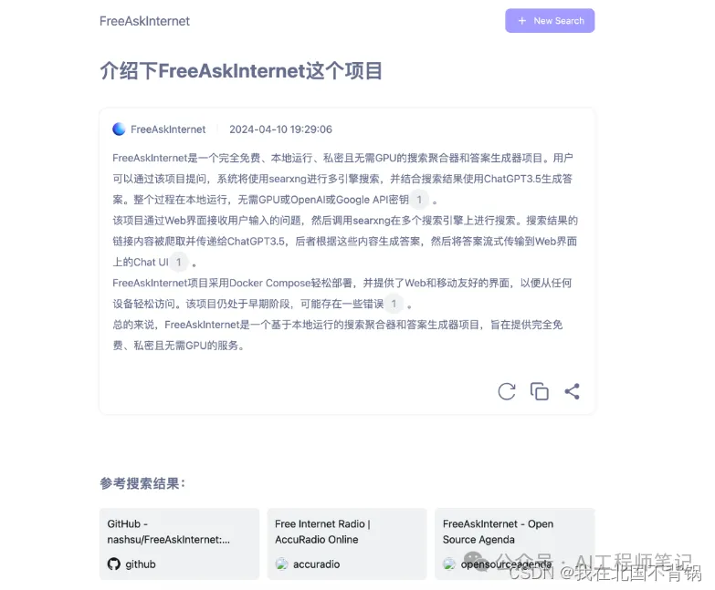

# 1. 资源

Github (6.4K Star): https://github.com/nashsu/FreeAskInternet

# 2. 简介

FreeAskInternet是一个完全免费，私人和本地运行的搜索聚合器和答案生成使用LLM，无需GPU。用户可以提出一个问题，系统通过搜索进行多引擎搜索，并将搜索结果合并到ChatGPT3.5 LLM中，根据搜索结果生成答案。所有进程在本地运行，不需要GPU或OpenAI或Google API密钥。

特点：

• 完全免费(不需要任何API密钥)

• 完全本地(不需要GPU，任何计算机都可以运行)

• 完全私有(所有东西都在本地运行，使用自定义llm)

• 运行没有LLM硬件(不需要GPU)

• 使用免费的 ChatGPT3.5 / Qwen / Kimi / ZhipuAI（GLM） API

• 自定义LLM(ollama,llama.cpp)支持

• 快速和容易部署与Docker撰写

• Web和移动友好的界面，专为Web搜索增强AI聊天，允许从任何设备轻松访问。

# 3. 工作原理

1. 系统在FreeAskInternet UI界面(本地运行)中获取用户输入问题，调用SearXNG搜索(本地运行)在多个搜索引擎上进行搜索。

2. 抓取搜索结果链接内容并传递给ChatGPT3.5 / Kimi / Qwen /知乎ai / ollama(使用自定义llm)，让llm根据该内容作为参考回答用户问题。

3. 将答案流式传输到聊天UI。

4. 支持自定义LLM设置，所以理论上是无限的LLM支持。

# 参考

[1] FreeAskInternet：完全免费的本地AI搜索引擎，一周收获6.4K Star, https://mp.weixin.qq.com/s/mfJtoErn-5bqKVwpkW8o4g
