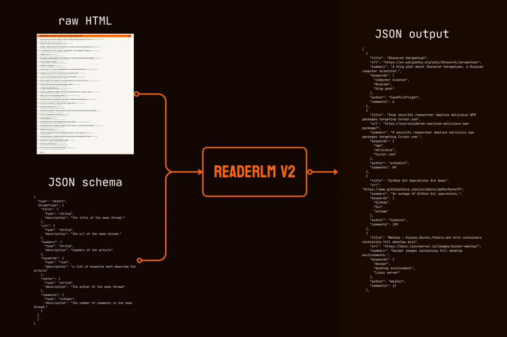
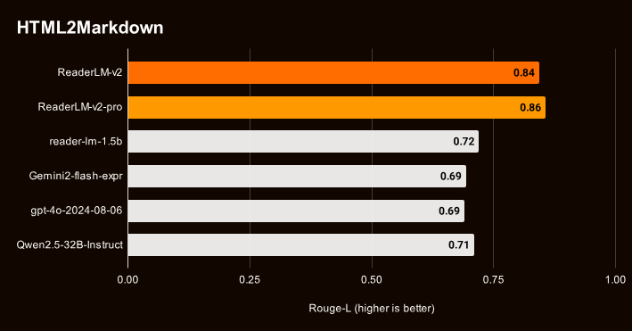
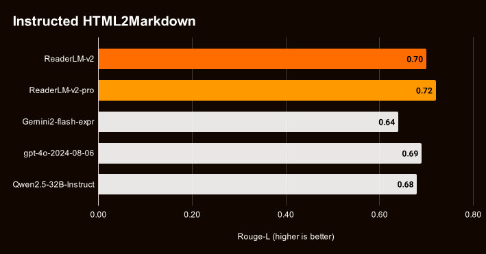
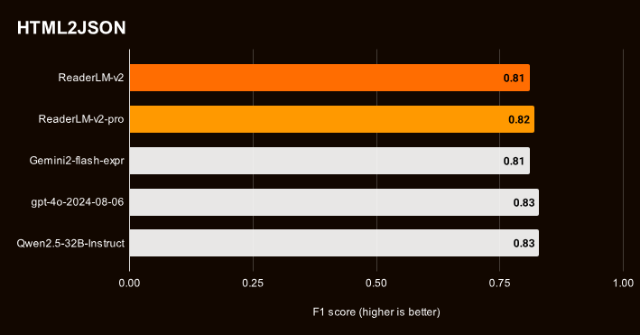
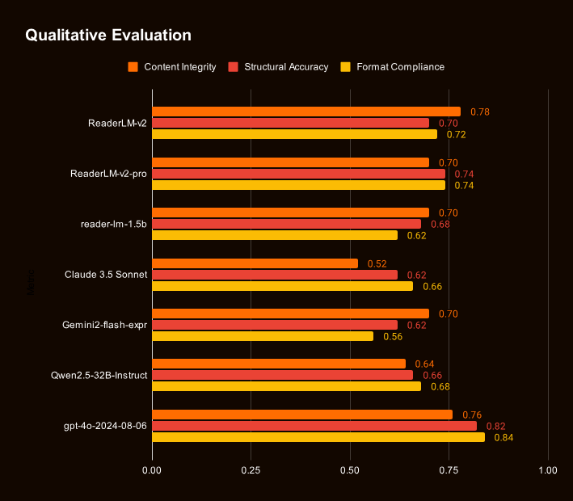
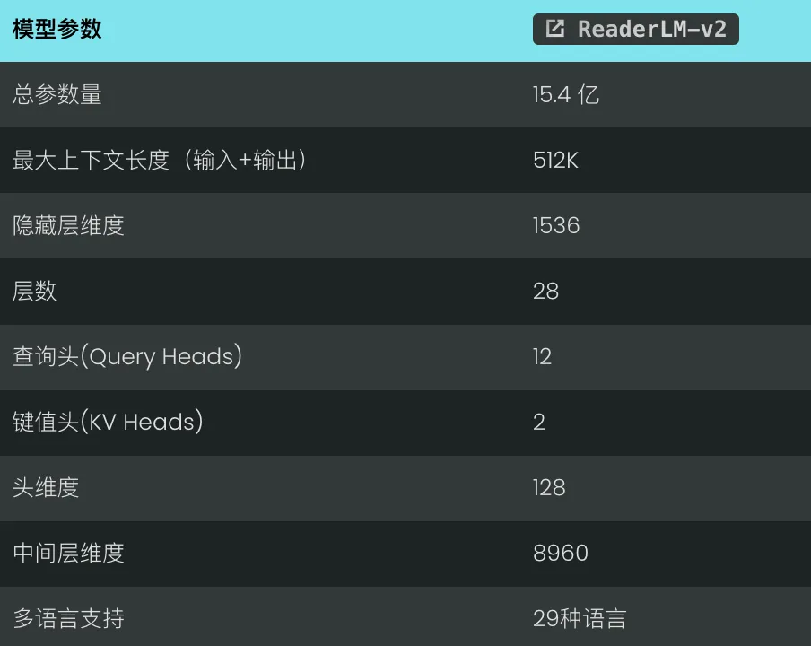
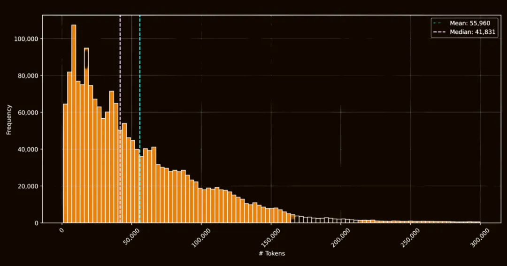
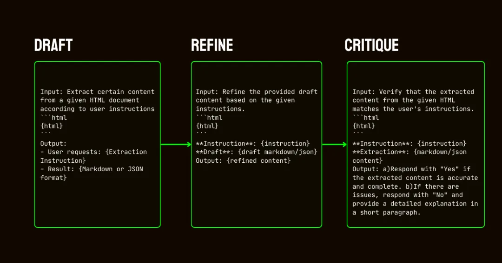
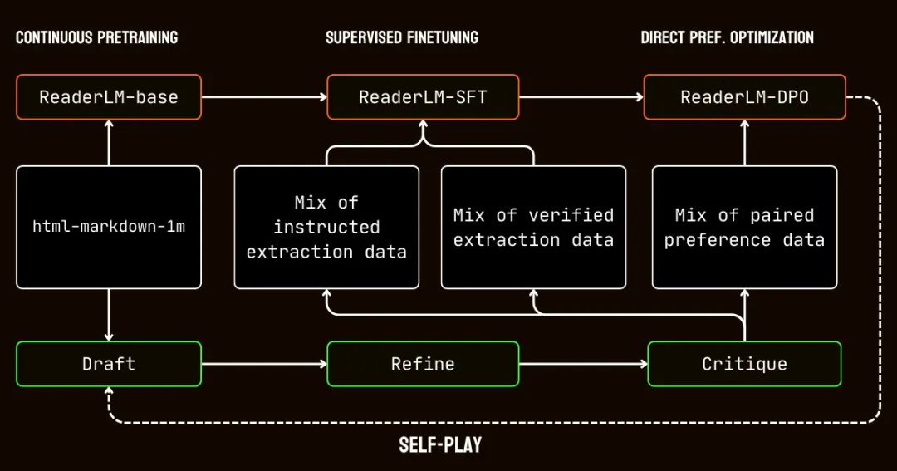

# 1. 资源

HTML 转换为干净 Markdown 的小型语言模型: reader-lm-0.5b 和 reader-lm-1.5b

它的准确性更高，在处理长文本方面表现更出色，支持高达 512K tokens 的输入输出组合长度。 并支持 29 种语言，包括中文、英语、日语、韩语、法语、西班牙语、葡萄牙语、德语、意大利语、俄语、越南语、泰语、阿拉伯语等。

🔗 官网链接: https://jina.ai/models/ReaderLM-v2

🤗 开源模型链接：https://huggingface.co/jinaai/ReaderLM-v2

# 2. 简介

ReaderLM-v2 的显著提升得益于全新的训练范式和更高质量的训练数据。 特别是在处理长文本内容和生成 Markdown 语法方面，它远超前代。

第一代模型将 HTML 转 Markdown 视为一种“选择性复制”任务，从 HTML 中提取并复制必要的内容，而 v2 则将其视为真正的翻译过程。 这一根本性的转变使得模型能够熟练运用 Markdown 语法，轻松生成代码块、嵌套列表、表格以及 LaTeX 公式等复杂元素。

除了 Markdown 转换，ReaderLM-v2 还新增了 直接 HTML 转 JSON 生成的功能



我们以 HackerNews 首页的原始 HTML 为输入，并提供了一个 JSON Schema，其中定义了需要提取的字段，包括帖子标题、URL、摘要、关键词、作者和评论数等。某些字段可以直接从 HTML 代码中提取，但另一些字段（例如关键词）则需要模型从内容中进行推断。令人惊喜的是，ReaderLM-v2 成功地提取并生成了所有这些字段，展现出令人印象深刻的准确性。

在定量和定性基准测试中，ReaderLM-v2 在 HTML 转 Markdown 任务上的表现优于 Qwen2.5-32B-Instruct、Gemini2-flash-expr 和 GPT-4o-2024-08-06 等更大的模型，同时在 HTML 转 JSON 提取任务上展现出相当的性能，而且使用的参数量明显更少。



ReaderLM-v2-pro 是专为企业客户提供的高级版本，经过了额外的训练和优化。







我们的人工评估涵盖了 10 个不同的 HTML 来源，包括英文、日文和中文的新闻文章、博客文章、产品着陆页、电子商务网站以及法律文档。测试材料包含了多行表格、动态布局、链接表格、数学公式（包括行内和显示公式）、代码块以及深度嵌套列表等具有挑战性的元素。定性评估主要关注三个关键维度，模型的评分从 1（最低）到 5（最高），然后将分数标准化到每个方面最高 1.0，以便进行比较。

这些测试结果有力地证明，一个经过精心设计的 15 亿参数模型，不仅能够与那些更大规模的模型相媲美，甚至在结构化数据提取任务中常常表现得更为出色。 从 ReaderLM-v2 到 ReaderLM-v2-pro 的逐步提升也清晰地展现了我们全新训练策略的有效性：它能在显著提高模型性能的同时，仍然保持高效的计算能力。

# 3. 使用

让模型以 JSON 格式返回所需的数据

```python
import json

schema = {
"type": "object",
"properties": {
"title": {"type": "string", "description": "News thread title"},
"url": {"type": "string", "description": "Thread URL"},
"summary": {"type": "string", "description": "Article summary"},
"keywords": {"type": "list", "description": "Descriptive keywords"},
"author": {"type": "string", "description": "Thread author"},
"comments": {"type": "integer", "description": "Comment count"}
},
"required": ["title", "url", "date", "points", "author", "comments"]
}

prompt = create_prompt(html, schema=json.dumps(schema, indent=2))
result = llm.generate(prompt, sampling_params=sampling_params)[0].outputs[0].text.strip()
```

# 4. 训练

ReaderLM-v2 模型是基于 Qwen2.5-1.5B-Instruction 构建的。这是一个以指令遵循能力和处理长上下文任务效率著称的小型基础语言模型。



## 4.1 数据准备
ReaderLM-v2 的成功在很大程度上归功于训练数据的质量。 我们构建了一个名为 html-Markdown-1m 的数据集，包含了从互联网上收集的一百万个 HTML 文档。平均而言，每个文档包含约 56,000 个词元，这充分反映了真实网络数据的长度和复杂程度。

在准备这个数据集时，我们首先对原始 HTML 文件进行清理，去除 JavaScript 和 CSS 等非必要元素，同时保留关键的结构和语义信息。清理完成后，我们使用 Jina Reader 将 HTML 文件转换为 Markdown 格式。这个转换过程主要依赖于正则表达式模式和启发式规则。



html-Markdown-1m 数据集中 HTML 文件的词元长度直方图

虽然这个过程为我们提供了一个可用的基准数据集，但也暴露了一个关键的问题：如果仅仅用这些直接转换得到的数据进行训练，模型本质上只会学习模仿 Jina Reader 所使用的那些正则表达式和启发式规则。

这一点在 reader-lm-0.5b 和 reader-lm-1.5b 模型中表现得非常明显，它们的性能天花板受到了这些基于规则的转换质量的限制。

为了解决这个问题，我们设计了一个三步流程：它依赖于 Qwen2.5-32B-Instruction 模型，对于创建高质量的合成训练数据至关重要。



ReaderLM-v2 的合成数据生成流程，由 Qwen2.5-32B-Instruction 驱动

1. 起草：我们会根据指令，先生成初步的 Markdown 和 JSON 输出。这些输出虽然多样，但常带有噪声或不一致。

2. 改进：接着我们会清理掉冗余内容，并增强结构一致性，使之符合目标格式。这一步确保了数据的干净和规范。

3. 评估：最后我们会将改进后的输出与原始指令进行对比评估。只有通过评估的数据，才能进入最终的训练集。这种迭代方式保证了训练数据的质量，满足结构化数据提取的要求。

## 4.2 训练过程

我们的训练过程包含多个阶段，专门针对处理长上下文文档的挑战。



ReaderLM v2 的训练遵循迭代过程，结合三阶段数据生成（起草-改进-评估）与自我对弈强化学习，实现持续提升。

首先，我们使用 html-Markdown-1m 数据集进行了长文本预训练。期间，我们采用了 ring-zag attention 和旋转位置编码 (RoPE) 等技术，逐步将模型的上下文长度从 32,768 个词元扩展到 256,000 个词元。为了保证训练的稳定和高效，我们使用了渐进式的训练方法，从短序列开始，逐渐增加上下文长度。

预训练之后，我们进行了 有监督微调 (SFT) 。在这一阶段，我们使用了数据准备过程中得到的精炼数据集，其中包含了 Markdown 和 JSON 提取任务的详细指令，以及改进草稿的示例。这些数据集都经过精心设计，以帮助模型学习特定的任务，如识别主要内容或遵循基于 Schema 的 JSON 结构。

然后，我们应用了直接偏好优化（DPO），让模型的输出更接近高质量的结果。在这一阶段，模型会在草稿和改进后的响应对上进行训练。通过学习优先选择改进后的输出，模型能够更好地区分精炼输出和特定任务输出之间的细微差异。

最后，我们还引入了 自我对弈强化学习。这是一个迭代的过程，模型会通过生成、改进、和评估自己的输出，来实现自我提升。这种循环让模型无需外部监督，就能持续进步。通过利用自身的评估和改进能力，模型逐步提升了生成准确和结构化输出的能力。


# 参考

[1] ReaderLM v2：HTML 转 Markdown 和 JSON 的前沿小型语言模型, https://mp.weixin.qq.com/s?__biz=MzkyODIxMjczMA==&mid=2247501992&idx=1&sn=f294955e9bee641510d41522efe13633&chksm=c21ebb3df569322bd2e69b9c63587d54d4ba38bba552fe21f39527f92baff44c7181cf60d9a1&cur_album_id=2677783163719139330&scene=189#wechat_redirect