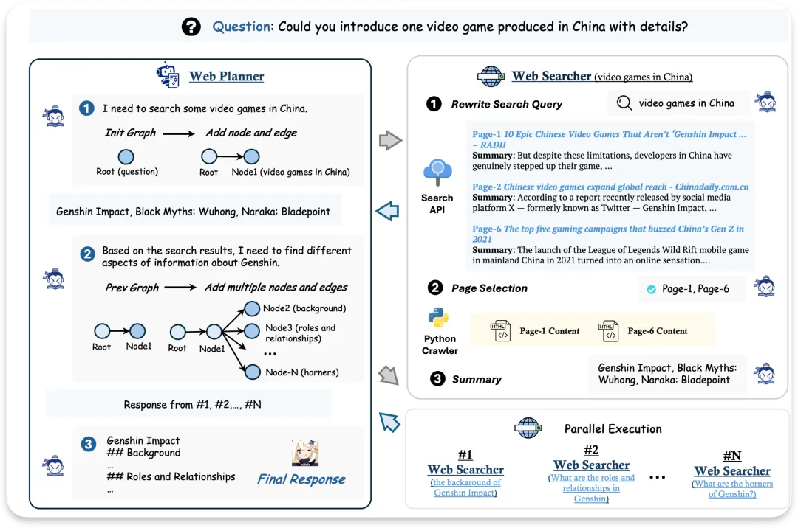

# 1. 资源
https://github.com/InternLM/MindSearch

https://mindsearch.netlify.app/

An LLM-based Multi-agent Framework of Web Search Engine (like Perplexity.ai Pro and SearchGPT)

实测：
- 只有internLM系列模型可以使用，其它模型输出无法正确解析（即便qwen2.5-72B也不行）
- InternLM-7B效果会差些，至少internLM-20B效果还行

# 2. 原理

据称基于LLM的Web搜索引擎Multi-agent框架，类似Perplexity.ai Pro 和 SearchGPT。

看完代码发现主要是由Web Planner与Web Searcher 组成：

- Web Planner 负责任务的拆解和动态规划
- Web Searcher 负责对子问题进行搜索和信息整合

