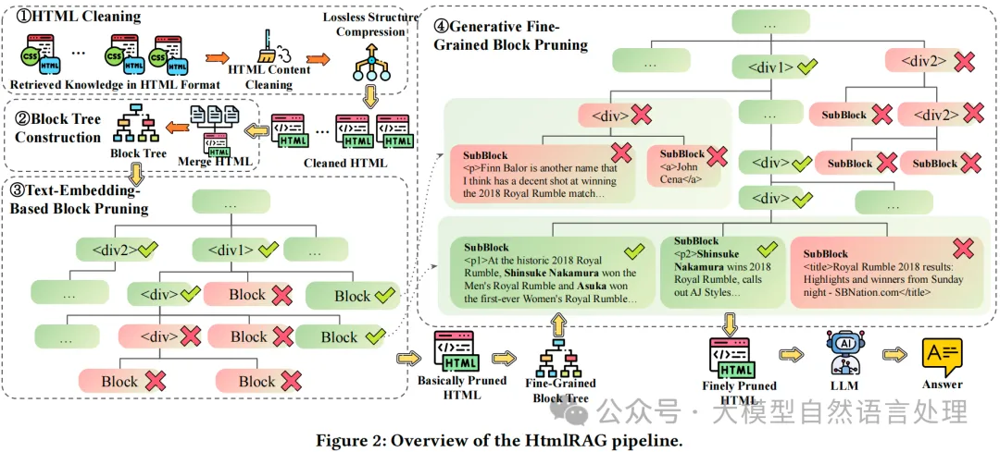
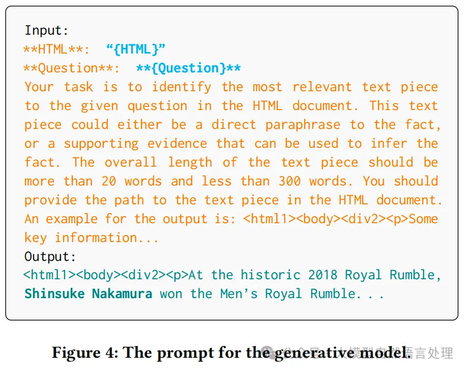
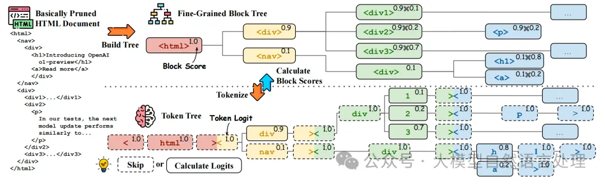
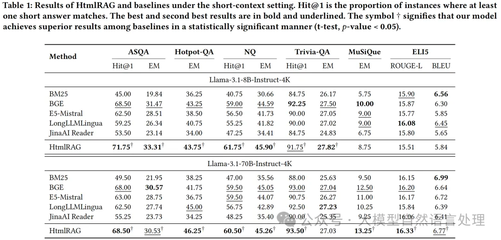
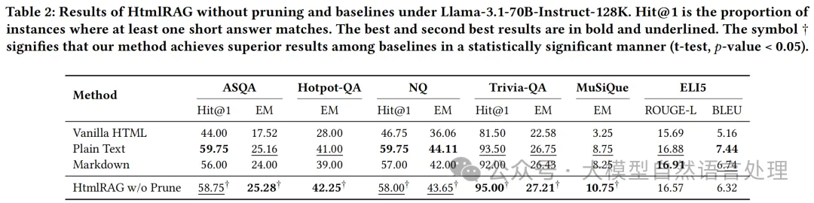
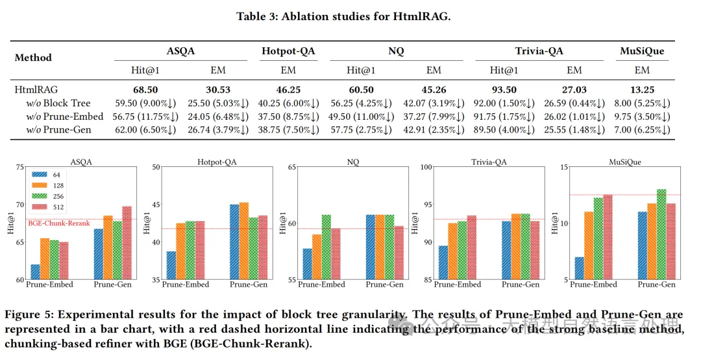

# 1. 资源

# 2. 简介

HtmlRAG 方法通过使用 HTML 而不是纯文本来增强 RAG 系统中的知识表示能力。通过 HTML 清洗和两步块树修剪方法，在保持关键信息的同时缩短了 HTML 文档的长度。这种方法优于现有基于纯文本的RAG的性能。

# 3. 原理

其实主要看下围绕html提纯思路，将提纯后的Html内容送入LLM进行增强问答。

## 3.1 HTML 清洗
由于原始 HTML 文档过长（每个超过 80K），并且不需要考虑用户查询的语义特征，因此在这个步骤中使用基于规则的方法进行预处理。这个清洗过程移除无关内容并压缩冗余结构，保留原始 HTML 中的所有语义信息。清洗后的 HTML 适合于配备长上下文 LLM 的 RAG 系统，并且不希望在生成前丢失任何信息。清洗后的 HTML 还是后续 HTML 修剪的基础。

### 3.1.1 HTML 内容清洗
从网络上检索到的 HTML 文档包含大量对人类用户不可见的额外内容，如 HTML 标签、CSS 和 JavaScript。大多数 HTML 标签提供丰富的结构信息，帮助 LLM 理解 HTML，而 CSS 和 JavaScript 内容提供的帮助有限。具体的清洗步骤几乎是无损的：

1. 移除 CSS 样式、注释和 JavaScript。
2. 清理冗长的 HTML 标签属性。

### 3.1.2 无损结构压缩
在大多数 HTML 文档中，原始 HTML 结构包含冗余。对 HTML 结构进行以下压缩而不丢失语义信息：

1. 合并多层单嵌套标签。例如，将 <div

some text

 简化为 
some text
。
2. 移除空标签，如 

。

## 3.2 块树构建
为了整体修剪所有检索到的 HTML 文档，我们首先将所有检索到的 HTML 文档连接在一起，并使用 Beautiful Soup 解析为单个 DOM 树。使用 DOM 树修剪 HTML 是最自然的方式，但 DOM 树过于细粒度，导致大量的节点和深树结构带来巨大的计算成本。

考虑到上述问题，我们提出了一种优化的树结构来建模 HTML，这种结构不是那么细粒度。理想情况下，树结构的粒度可以根据不同的修剪需求进行调整。我们称之为“块树”，并设置每个块的最大单词数maxWords  来控制块树的粒度。在构建块树时，我们从 DOM 树开始，合并碎片化的子节点到它们的父节点，并将其视为一个块。我们可以递归地合并块或子节点到它们的父节点，以形成更大的块，条件是块的单词数不超过maxWords  。合并后，无法合并的原始叶节点也被视为块。

## 3.3 基于块树的 HTML 修剪
块树基础的 HTML 修剪包括两个步骤，这两个步骤都在块树结构上进行。第一个修剪步骤使用嵌入模型来修剪 HTML 清洗模块输出的结果，而第二个步骤使用生成模型来修剪第一个修剪步骤输出的结果。

### 3.3.1 基于文本嵌入的块修剪
该步骤的目标是在保持关键信息的同时，缩短检索结果的 HTML 文档长度。通过删除与用户查询相关性较低的块，可以减少输入到LLM中的冗余信息，从而提高生成效率和质量。

步骤

1. 从每个块中提取纯文本内容。使用文本嵌入模型计算这些文本内容与用户查询的相似性得分。通常，嵌入模型会将文本转换为向量表示，并计算这些向量之间的相似性。

2. 贪心算法修剪：使用贪心算法来选择要删除的块。算法会从相似性得分最低的块开始删除，直到 HTML 文档的总长度满足设定的上下文窗口要求。删除块时，可能会重新出现冗余的 HTML 结构（如多层嵌套标签或空标签），因此需要重新调整 HTML 结构，以确保其简洁性和正确性。

3. 重新调整 HTML 结构：在删除块后，检查并合并多层单嵌套标签（例如，将 <div

...

 简化为 
...
）。移除空标签（如 

），以进一步简化 HTML 结构。

### 3.3.2 生成模型的细粒度块修剪

生成模型的细粒度块修剪提示词

如下图，为了进一步细粒度地修剪块，扩展了修剪后块树的叶节点，构建了一个更细粒度的块树。由于生成模型具有较长的上下文窗口，可以全局建模块树。生成模型计算每个块的得分，得分由唯一序列的生成概率给出，序列由从根标签到块标签和文本的HTML标签路径表示。最后，根据块得分，应用类似的贪心算法获得最终的修剪HTML。

块得分计算。使用分词器将块树转换为标记树，相应的HTML标签和标记用相同的颜色标记。标记生成概率位于右上角，虚线框中的标记不需要推理。块树的右上角显示块概率，可以从相应的标记概率推导出来。

# 4. 实验效果

HtmlRAG的消融研究及块树粒度影响的实验结果

# 参考

[1] HtmlRAG：RAG系统中，HTML比纯文本效果更好, https://mp.weixin.qq.com/s?__biz=Mzg4NjI0NDg0Ng==&mid=2247487358&idx=1&sn=2ee7d893cfab848a0f368d88e2430db8&chksm=cf9ddbfff8ea52e96115621a3eac23df9c593131eb3fb37d11d8cf7486a8621501476624f43b&cur_album_id=3313888966244319232&scene=189#wechat_redirect