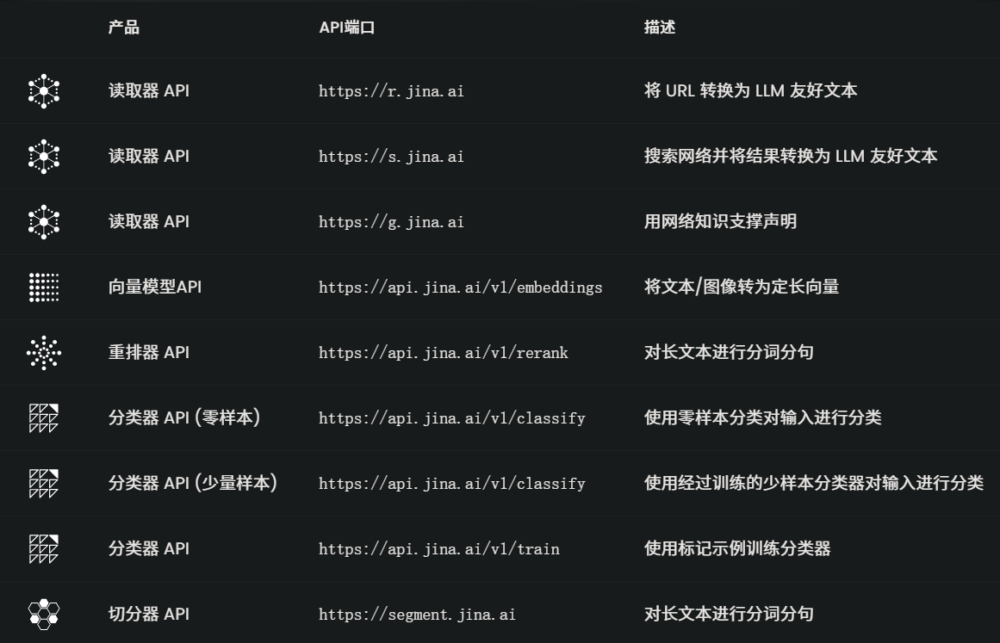
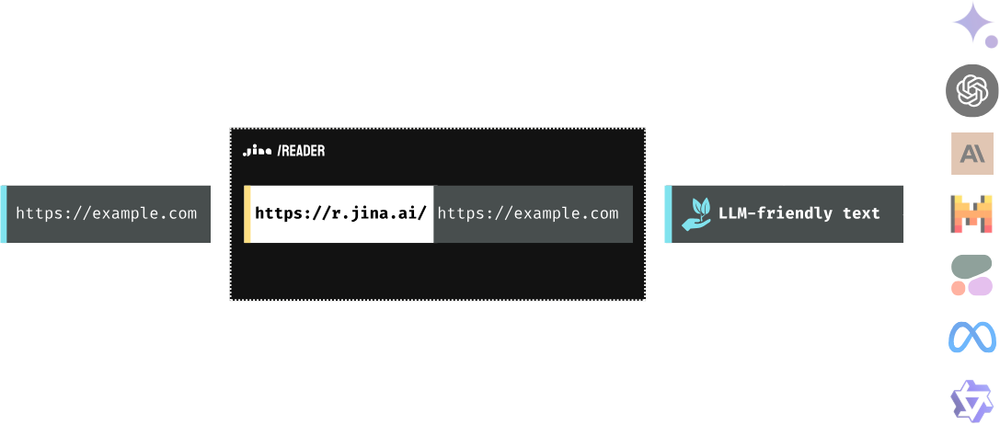
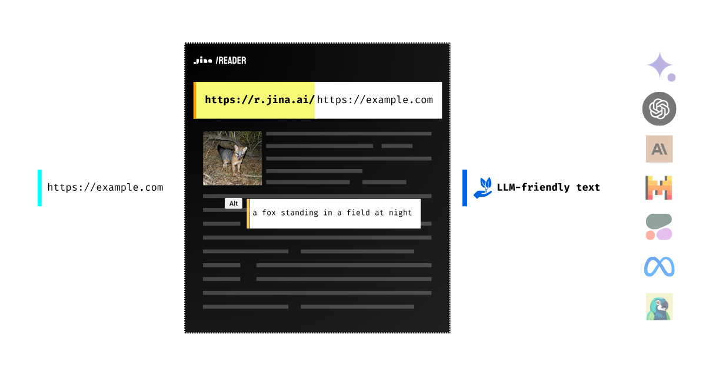
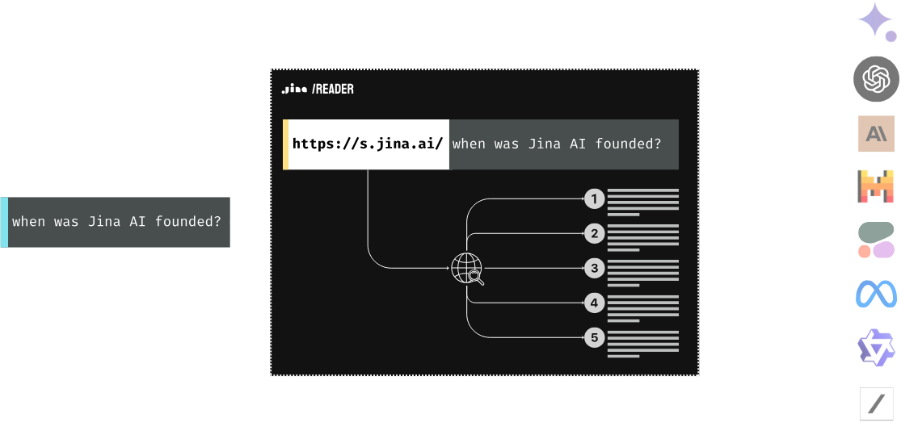
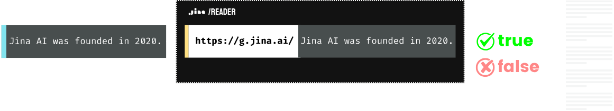
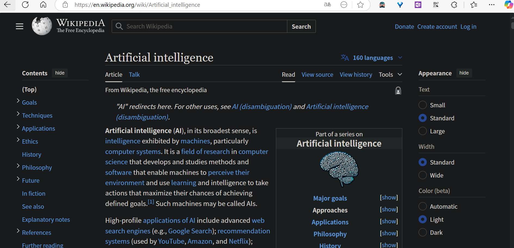
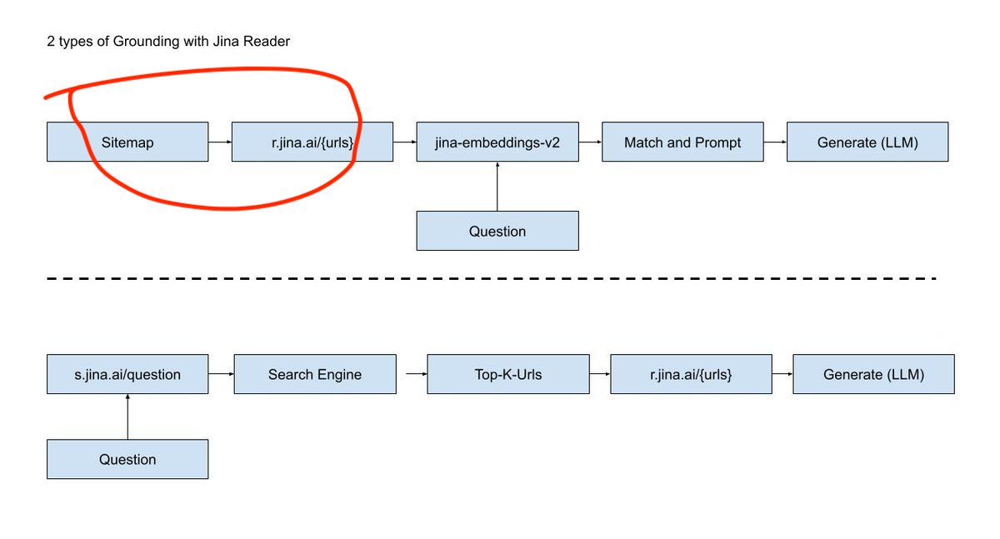

# 1. 资源

- Github (7.4k stars): https://github.com/jina-ai/reader
- 使用代码Google Colab: https://colab.research.google.com/drive/1uoBy6_7BhxqpFQ45vuhgDDDGwstaCt4P#scrollTo=5LQjzJiT9ewT
- 功能及接口使用详解：https://jina.ai/reader/
- 收费情况：1M token非商用场景免费
- 功能简要：
  - 网页爬取：返回一个适合大模型输入的结构化文本。
- 使用：
  - 网页爬取：对于任意一个URL，只需在前面添加 r.jina.ai 即可解析出网页内容。
    - 支持识图，利用VLLM模型，给图片加标题
    - 可以读取PDF文件
  - 搜索：给定一个问题，返回几个相关网页。
  - 事实核查：给定的陈述，使用实时网络搜索结果对其进行基准化验，并返回事实性分数和使用的确切参考资料。

# 2. 流程简介

## 2.1 网页爬取流程

支持识图，利用VLLM模型，给图片加标题

## 2.2 搜索流程

## 2.3 事实核查流程

# 3. 网页解析效果

https://en.wikipedia.org/wiki/Artificial_intelligence

# 4. 使用流程

