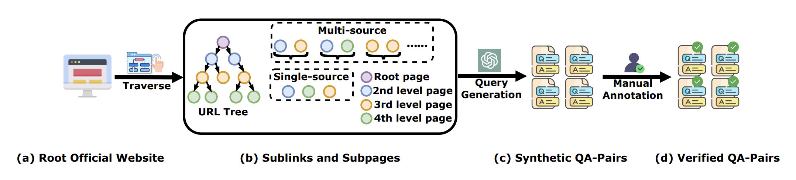
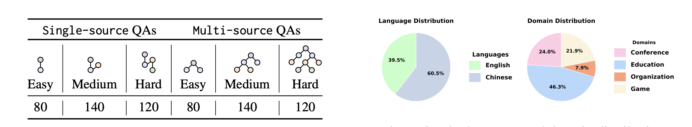
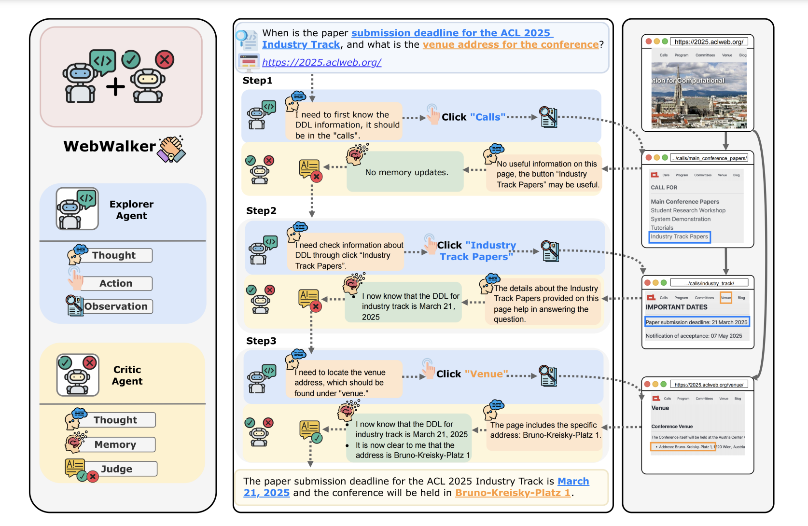
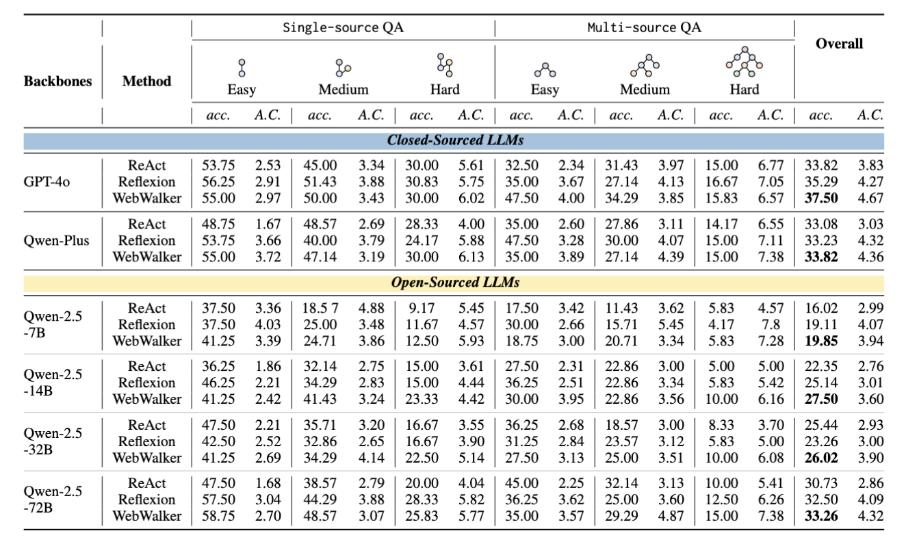
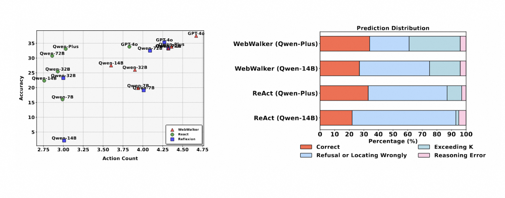
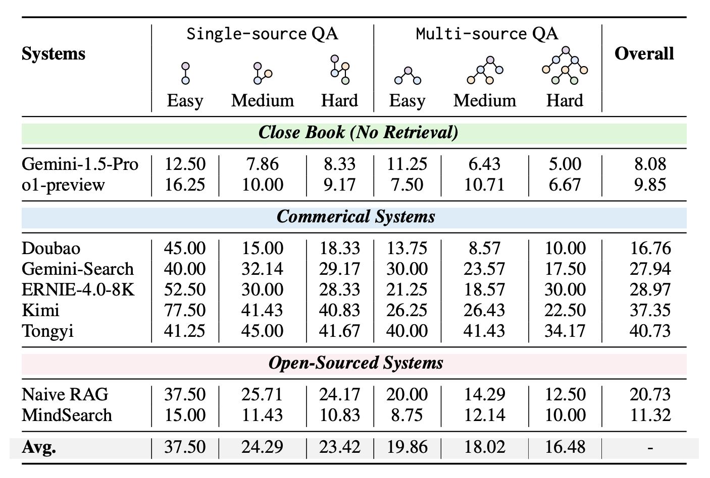

# 1. 资源

- 论文：
    - 论文题目：WebWalker: Benchmarking LLMs in Web Traversal
    - 论文地址：https://arxiv.org/pdf/2501.07572
- Github (301 stars): https://github.com/Alibaba-NLP/WebWalker
- 介绍论文：https://alibaba-nlp.github.io/WebWalker/
- 数据集：https://huggingface.co/datasets/callanwu/WebWalkerQA?row=0
  - 数据集中只有链接，没有原始文本，需要自己爬取
- Demo
  - Huggingface (存在报错，无法试用): https://huggingface.co/spaces/callanwu/WebWalker

# 2. 简介

阿里开源：全面提升基于网页搜索的RAG性能新方法
WebWalker‌是一个通过explorer-critic范式模拟人类网页导航的multi-agent框架，旨在解决大型语言模型（LLM）在处理复杂、多层次信息时的局限性。WebWalker由通义实验室提出，主要用于评估LLM在网页遍历任务中的能力。

背景和动机  
传统搜索引擎如谷歌和百度主要通过横向搜索网页，无法像人类一样通过逐步点击等操作获取更多细节，限制了LLMs处理复杂、多层信息的能。文章提出的WebWalker通过系统性地遍历网站子页面，挖掘更深层的内容。

具体实现方法   
1. 构造了一个用来评估LLMs执行网络遍历任务能力的基准测试，包括680个查询，涵盖4个真实世界场景，超过1373个网页。给定初始网站URL和查询，系统需要通过遍历网页来收集足够的信息以最终回答查询。
2. 设计了一个多智能体框架，模拟人类在网络中的导航行为，通过探索-批评范式来提取信息。探索智能体基于ReAct框架构建，利用思想-行动-观察范式进行网络遍历。批评智能体负责维护记忆并基于探索者智能体的探索生成响应。

文章局限性
1. WebWalkerQA基准测试包含680个查询，但与一些其他基准相比规模较小，可能限制了模型性能的全面评估。
2. 当前的工作主要利用HTML-DOM解析可点击按钮，没有利用视觉模态，如截图，这可能限制了模型处理更复杂场景的能力。
3. WebWalker是通过提示而非额外训练来驱动的，可能需要进一步的调整来帮助LLM学习有效的网络遍历。

# 3. 数据

构建了一个具有挑战性的基准测试 WebWalkerQA，它由来自 1373 个网页的四个真实场景的 680 个查询组成。



数据采集。使注释过程具有成本效益，并且 准确，我们采用两阶段漏斗注释 策略，将基于 LLM 的注释与人工注释相结合。在第一阶段，GPT-4o， 执行初始注释，然后执行第二个注释 阶段，众包人工注释者进行质量控制和筛选以优化最终 结果。



数据统计。通过这种使用 LLM 的数据构建方法 和人类参与，我们获得了 680 个 WebWalkerQA 问答对。 WebWalkerQA 包含两种类型的数据：多源 QA 和单源 QA。 我们将问题分类 分为三个难度级别：简单、中等、 和 hard，基于 i 的值，它表示相应子页面的深度。 WebWalkerQA 包含四个现实世界的领域：会议、组织、教育和游戏，根据一个双语数据集 这包括中文和英文。

# 4. 原理



思考然后探索。Explorer 代理逐步浏览 Web 环境。它与网页交互，专注于 HTML 按钮和可点击的链接来决定下一步要去哪里。在每个步骤中，代理都会观察当前页面，其中包括页面内容和可单击链接列表。根据此观察结果，它选择一个链接以进一步探索。决策过程考虑了所有先前行动和观察的顺序，形成有助于指导探索的“历史”。此过程一直持续到批评代理决定已收集足够的信息或达到预先设定的探索步骤限制。

然后想想 Critique。批评者代理介入以评估 Explorer 代理所取得的进度。在每个探索步骤之后，评分员会评估当前状态，包括查询、最新页面观察和所选作。它维护一个内存，该内存会根据到目前为止收集的相关信息进行增量更新。批评者决定收集的信息是否足以回答查询。如果是这样，批评家会制定并提供答案。如果没有，则继续探索。此迭代过程可确保探索是有目的的，并专注于收集必要的信息以解决查询。

# 5. 实验



代理的结果。闭源模型的表现优于 开源模型在性能和效率方面都有所体现。对于开源模型，性能 并且效率会随着模型大小的增加而提高。 我们提议的 WebWalker 框架优于 Reflexion 的 Reflectionion 执行任务，而 React 的性能则优于 React。我们 仅从正确开始计算作计数 （A.C.） 执行，并且随着模型大小的增加，A.C. 增长，表示较大的 LLM 已增强 远程信息搜索能力。甚至 使用 GPT-4o 作为其 backbone 未超过 40%，突出显示 WebWalkerQA 提出的挑战。



进一步分析。更进一步 右上角表示 Web 遍历越有效和越持久。我们观察到 增加模型大小或引入反射 对每个动作的过程中都可以解决一定的 因此需要多步骤解决方案的问题 在 Web 遍历任务。 这 使用 ReAct 框架的参数数量相对较少的模型缺乏探索信息深度的能力，使得 判断 作，无论相关信息是否 已找到。它倾向于 “放弃 ”并展示 不耐烦的特征。内存简介 来管理长上下文，同时增加 在 model parameters 中，提供证据证明 现象源于长久的干扰 具有 noisey information 的上下文和固有的 功能。 可以观察到，随着深度的增加或所需源数量的增加，获取解析查询所需信息的难度会变得更大，从而导致准确性性能下降。



RAG 系统的结果。我们首先在 Close 下评估性能 使用最先进的模型 OpenAI o1 和 Gemini-1.5-Pro 进行书籍设置，无需检索。然后，我们访问 几个商业和开源 RAG 系统。 商业和开源 RAG 系统在 WebWalkerQA 上的性能都相对较差，其中 最好的结果来自通义，只有 达到 40%。 此外，随着难度的增加，信息深度越来越深，性能往往会变差。

```text
调查结果 （i）：RAG 系统努力应对需要有效 Web 的关键挑战 遍历。
```


标准 RAG 系统可以看作是 对相关文档的水平搜索以响应查询，而 WebWalker 可以被视为一种垂直探索方法。WebWalker 可以无缝集成到标准 RAG 中 获取深度信息并增强的系统 解决问题的能力。据观察，集成后，性能在所有难度下都有所提高 级别，尤其是在多源类别中。

```text
发现 （ii）：WebWalker 可以成为代理 RAG 系统中的一个模块，实现垂直探索。
```

我们放大 K 的数量 ∈ {5， 10， 15， 20， 25} 研究推理期间缩放的影响 阶段。图 9 显示了纵向扩展的结果，其中 K 值越大，性能越好，验证了 在一定范围内垂直扩展的可行性。

```text
发现 （iii）：扩大挖掘链接的过程可能代表 RAG 系统中垂直勘探的潜在方向。
```

# 参考

[1] 阿里开源：全面提升基于网页搜索的RAG性能新方法, https://mp.weixin.qq.com/s/wuz0GL3fro_I1CtKzp8pqQ
[2] WebWalker: Benchmarking LLMs in Web Traversal, https://alibaba-nlp.github.io/WebWalker/