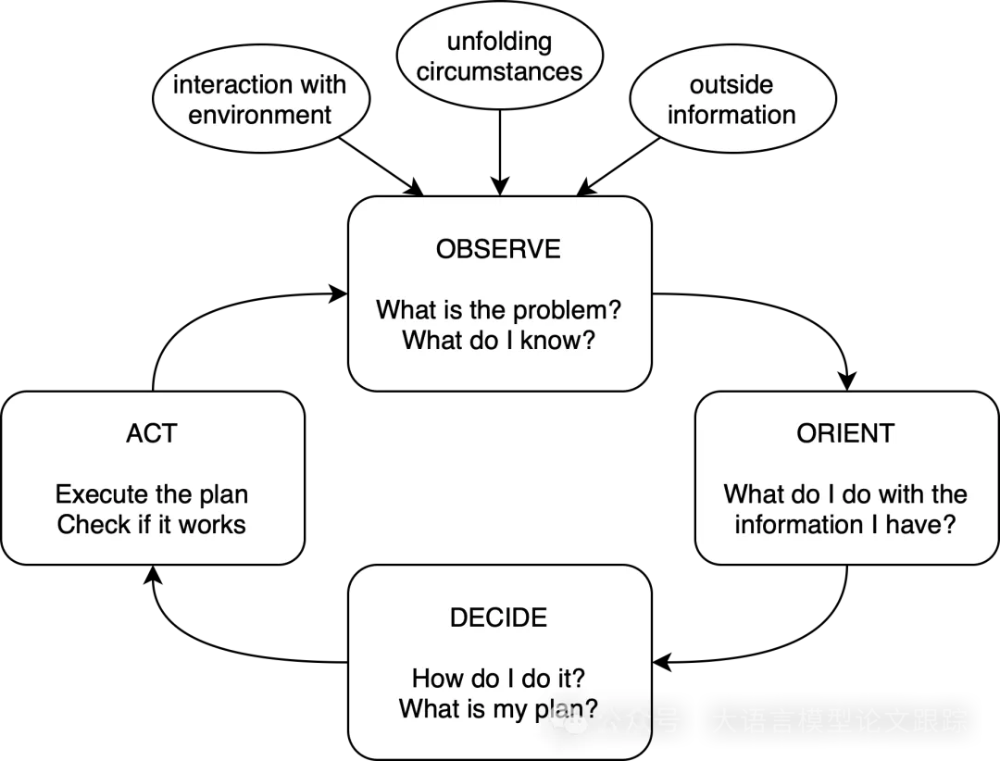
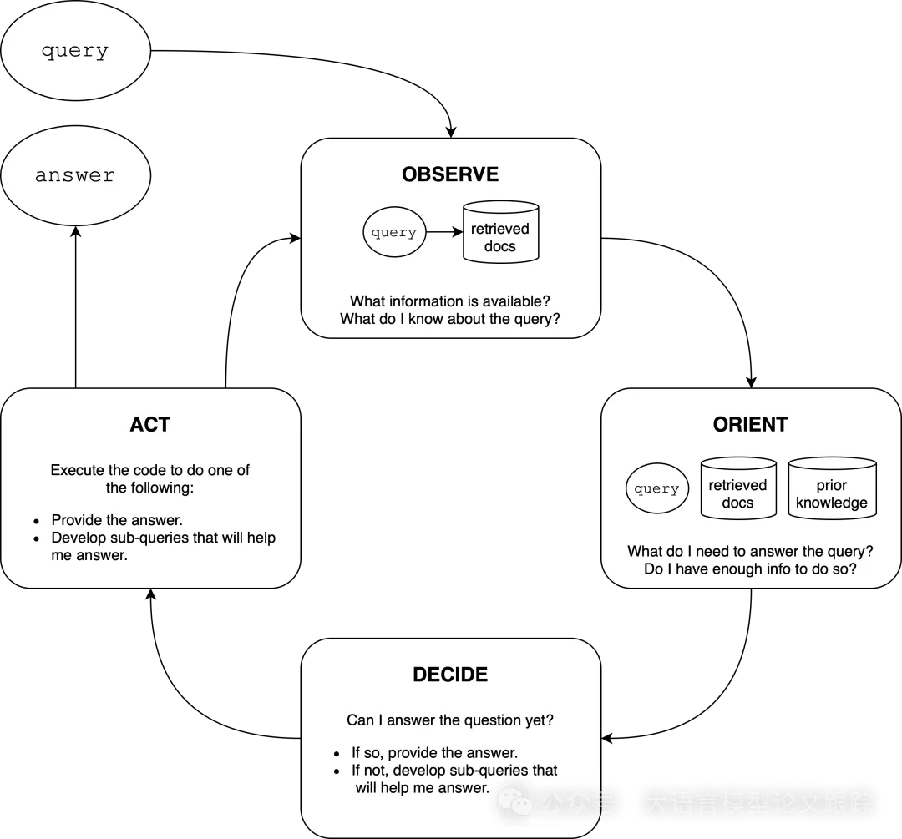
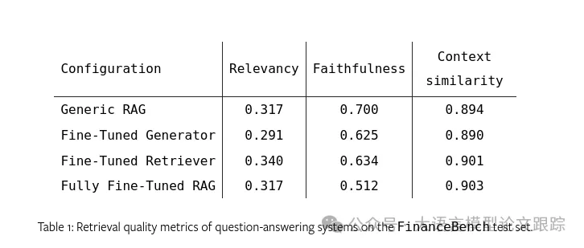
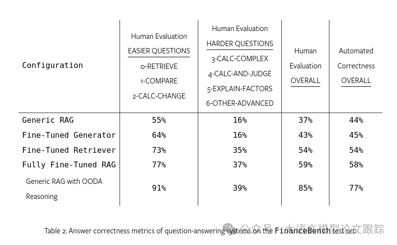

# 0. 资源

- 使用Aitomatic开源的OpenSSA框架实现OODA策略

论文：
- Enhancing Q&A with Domain-Specific Fine-Tuning and Iterative Reasoning: A Comparative Study
- https://arxiv.org/abs/2404.11792

# 1. 简介

使用FinanceBench SEC 财务文件数据集

提高RAG效果的话，可以从以下三个方面入手：

- 优化的检索器：一个能够更精确地捕捉特定领域专业术语中关键词汇的深层含义和隐含意义的嵌入模型；

- 改进的生成器：一个对特定领域逻辑和期望的展示格式有深入了解的大型语言模型Agent应用（LLM）；

- 迭代式、多步骤推理：一种结合了基于RAG的查询、必要性与充分性推理、任务分解和结果验证的机制，这些通常是人类为确保结果准确性而执行的活动。

# 2. 方案

## 2.1 微调Embedding模型

对BAAI的bge-large-en模型进行了微调。常规流程包括使用LlamaIndex库的“句子分割器”将文本文档分割成语义块，然后利用OpenAI的GPT-3.5生成每个块的问题-上下文对，以构建合成数据集进行微调，并执行5轮微调训练。在客户关系管理系统等已有自然问答结构的应用场景中，我们可以直接提取问题-上下文对，无需通过大型语言模型Agent应用（LLM）生成。在本文讨论的金融分析特定应用案例中，我们从FinanceBench公共数据集中随机选取了100对问题-上下文对进行微调。

## 2.2 微调LLM

微调LLM需要高质量的对话历史样本，包括查询-答案对。在RAG系统的推理阶段，用户的消息将与文档文本相结合，以便LLM能够据此生成答案。然而，LLM的微调通常只专注于查询-答案对，以确保回答行为仅依赖于查询本身，而非检索到的文档。

在作者的实验中，利用OpenAI的微调API对gpt-3.5-turbo-0125模型进行微调。针对本文讨论的金融分析案例，我们直接从FinanceBench公共数据集中随机抽取了100对查询-上下文样本，随后进行了5轮的微调训练。为保持一致性，我们采用了与前文提到的嵌入模型微调部分相同的随机样本集。

## 2.3 迭代推理

OODA推理模式
观察-定向-决策-行动（OODA）循环是一种成熟的迭代推理框架，它强调在复杂环境中进行持续的适应和决策。由军事战略家约翰·博伊德提出，OODA循环已被广泛应用于商业、体育、医疗等多个领域。

OODA循环包含四个主要步骤：

- 观察：搜集有关环境和当前问题的信息；

- 定向：分析搜集的信息，更新对情境的理解，并提出可能的解决方案或行动；

- 决策：评估各种可能的解决方案或行动，并基于当前理解选择最合适的方案；

- 行动：执行选定的解决方案或行动，并监测其对环境的影响。

OODA循环的迭代特性使得可以根据环境反馈进行不断的优化和调整。通过这四个步骤的循环往复，代理可以逐步深化对问题的理解，提出更加贴切的解决方案，做出更明智的决策。

在问答系统的领域，OODA循环有助于将复杂问题拆解为更易解答的简单问题，整合并理解来自多个RAG查询的数据点，并确保内部逻辑的一致性。融入OODA循环的问答系统能够逐步提升对问题的理解，检索出更为相关的信息，生成更精准、更符合情境的答案。这种迭代方法有助于克服许多现有的大型语言模型Agent应用（LLMs）和AI系统所采用的单次输入-处理-输出的数据流限制。

将OODA循环整合进基于RAG的问答系统，需要将循环的四个阶段与RAG流程的各个部分相对应。

构建OODA推理机制

为引导生成模型条理清晰地完成任务推理，我们采用了Aitomatic开源的OpenSSA框架，该框架融合了OODA循环迭代机制。执行任务时，推理器会通过逻辑推理得出结论。在推理过程中，模型会根据任务描述中的指示和工具，对当前任务不断进行OODA循环迭代。这包括利用现有资源持续搜集数据（观察），思考当前情境及新信息的适配性（定向），依据累积知识与任务目标做出选择（决策），并运用现有工具执行决策（行动）。OODA循环的迭代为模型提供了一个稳定且明确的框架，以达成任务目标，并允许它根据实时信息灵活调整策略。

# 3. 评估

## 3.1 检索质量评估

利用LlamaIndex评估工具箱提供的自动化检索品质指标，该工具箱使用大语言模型Agent应用（LLM）来核实检索文档与查询、答复和参考文档之间的相关度。

• 相关性：评估答复是否与上下文信息吻合，不相关得0分，相关得1分。

• 忠实度：衡量答复是否有检索到的上下文支持，无支持得0分，有支持得1分。

• 上下文相似度：通过计算上下文映射到嵌入空间后的余弦相似度，衡量检索到的上下文与参考上下文的语义差异。余弦值若低于0.8则得0分，高于0.8则得1分。

## 3.2 回答质量评估

使用自动化准确度指标和人工评分相结合的方法，来评价问答系统生成的最终答案的正确性，以参考答案为标准。

- 自动化准确度：我们采用LlamaIndex的CorrectnessEvaluator，根据回答与参考答案的相关性，对回答进行1至5分的评分，并为每个评分提供理由，确保评分一致性。1分代表不相关回答，2至3分代表相关但可能存在错误的回答，4至5分代表完全正确回答。为与人工评定的二元分数保持一致，我们将这些分数转换为百分比形式。

- 人工准确度：我们同时开展人工评估，依据FinanceBench参考数据，对生成的回答进行正确性评定。通过观察不同难度问答问题类别的表现，我们能够洞悉各种问题类型的性能提升。这种定性评价为我们提供了关于所提框架在现实世界中的应用性和有效性的深刻见解。

## 3.3 评估结果

为了完成测试，作者设计了几种配置组合：

- 通用RAG配置：使用bge-large-en模型与gpt-3.5-turbo-0125。

- 微调生成器的RAG配置：使用bge-large-en模型搭配经过微调的gpt-3.5-turbo-0125。

- 微调检索器的RAG配置：使用经过微调的bge-large-en模型与gpt-3.5-turbo-0125。

- 完全微调的RAG配置：使用经过微调的bge-large-en模型与同样微调过的gpt-3.5-turbo-0125。

- 集成OODA推理的通用RAG配置：使用bge-large-en模型、gpt-3.5-turbo-0125及OODA推理流程。

所有系统均采用相同的VectorStoreIndex处理文档，选取前十名文档，并运用基础LlamaIndex提供的默认RAG提示。

测试集涵盖了FinanceBench公开测试集中除用于训练的100题外的其余41个有效问题。

上表概括了不同技术配置在FinanceBench测试集问题上的检索质量得分。由于OODA推理过程包含多轮迭代检索，与RAG系统的单步检索过程不具有一一对应的可比性，故未在此表中展示。

答案准确性评估结果

上表汇总了在FinanceBench测试集中不同配置所获得的自动化评分以及人工评判的二元准确度评分。请注意，自动化准确性评分已从原始的1至5分的评分标准转换为百分比形式。“总体”得分反映了整个测试集的表现。而“简单”和“困难”问题的得分则分别基于第3.2节所述的相应子集进行评估。

# 4. 结论

1. 微调组件模型带来的RAG准确率提升

   采用微调检索器、微调生成器或全面微调的RAG系统，相较通用RAG有更佳表现。尤其是在FinanceBench数据集上，我们实现了最高可达20个百分点的准确率提升。微调检索器模型在提升准确率方面，比微调生成器更为显著。这一点尤为重要，因为与微调用于生成的大型语言模型Agent应用（LLMs）相比，微调用于检索的嵌入模型成本更低廉，工作量更小。

2. OODA推理集成带来的RAG准确率提升

   将迭代推理机制如OODA与RAG引擎结合，能显著增强系统性能。具体而言，通用RAG集成OODA推理的配置，在FinanceBench数据集上的准确率提升了高达50个百分点。这一发现表明，OODA作为一种通用的推理机制，当与相关信息源结合使用时，在特定领域的任务中显著提升了准确率。在FinanceBench数据集上，通用OODA配置的性能超过了完全微调的RAG，准确率差距达到了20至25个百分点。

# 参考

[1] 如何大幅的提高RAG在领域知识的准确性，https://mp.weixin.qq.com/s/yvJEEhC07ZEtK9hDRd8Alg