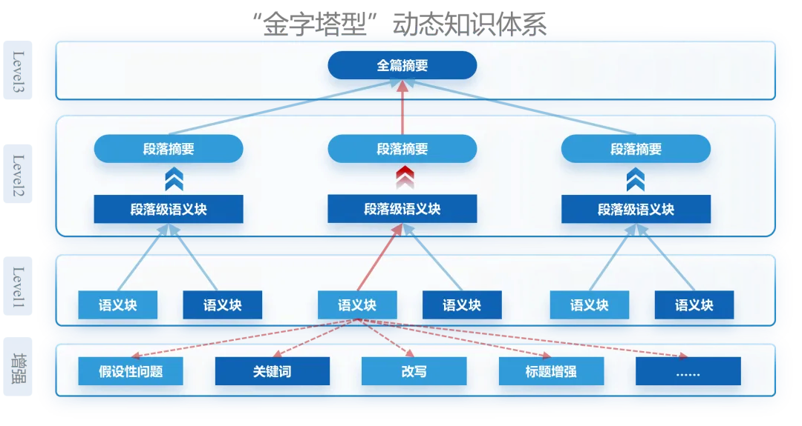
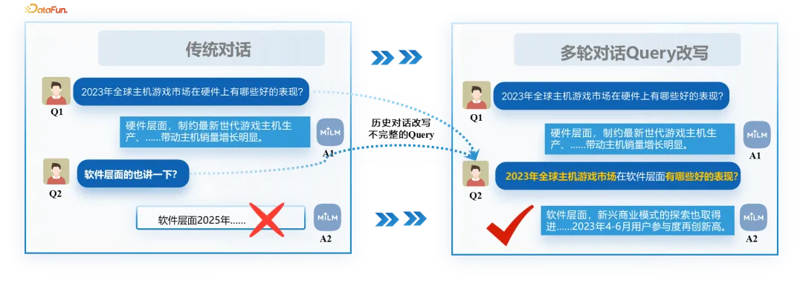
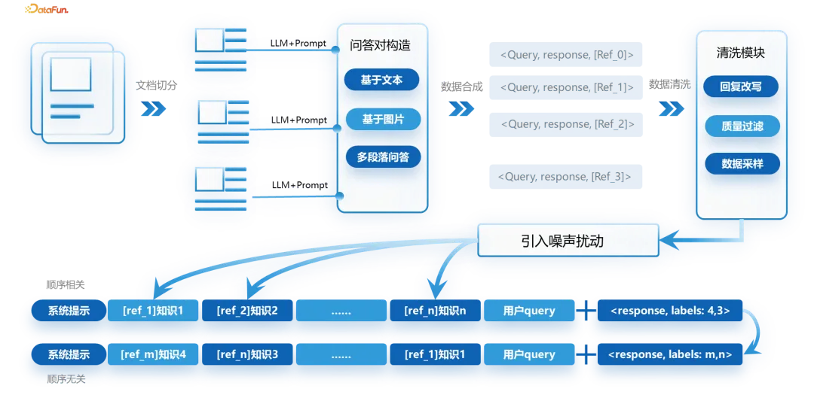
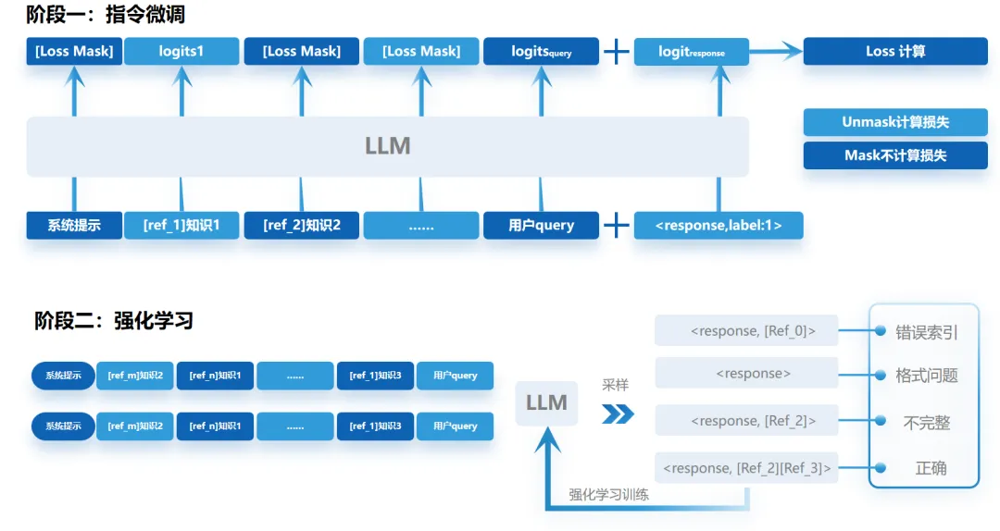
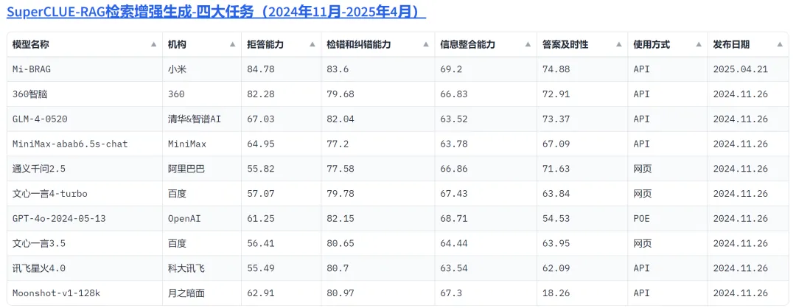
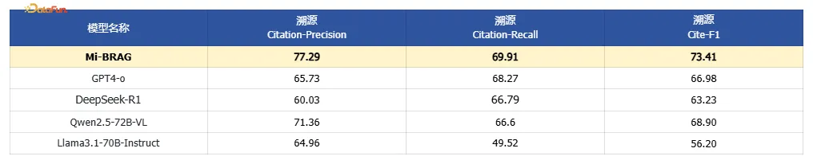

# 1. 架构

# 2. 检索

**多维语义增强，离线结合更专业化**

团队通过多维度语义索引，突破单一 embedding 或关键词匹配的模式，采用多维度索引为每个知识片段生成多维度语义标签。当文档进入系统时采用：智能提炼渐进式内容摘要、生成关联性假设问题、提取文本所属关键词、多视角内容改写等手段增强知识提升 Chunk 的表征能力。

**用户 Query 理解的增强**

生成驱动的语义空间对齐：首先大模型根据原始 Query 生成具有启发性的假设性文档，这一过程能够弥补查询和文档的语义偏差，解决了传统方法中因查询表达模糊或者简短导致语义稀疏的问题；

结构化分解的检索目标：其次，基于本文逻辑划分 claim 后，为每个 claim 定制一个专用于验证性搜索的子查询，这一过程将原始查询转化为多个细粒度的检索目标，为复杂查询任务提供更灵活的中间表示(<claim>、<query>)；

相关性驱动的动态增强：最后，将与原始 Query 高度相关的子查询(<search>True)及其 claim 整合，不相关的子查询(<search>False)则过滤，进而对向量通道中的 Query 进行增强，赋予 Query 更强大且精准的语义内涵，这一过程筛选出高度相关的片段作为增强的依据，避免引入生成的噪声，平衡了语义扩展与精准性。

# 3. 生成

为了提升模型的多模态上下文理解和关键信息提取能力，我们引入一种动态掩码方案，对通用模型进行领域二次训练。我们分别对数据和模型训练都进行了优化，具体地：

（1）训练数据生成的创新

目前业界的开源数据集在构造流程上不够完善，同时领域内容不全或引用数据质量不高，都影响了模型的对齐效果。我们团队广泛收集了行业文档、社会报告、说明书、论文、新闻等多领域文档，构建的数据尽可能涵盖多模态理解的任务形式，如：纯文本问答、纯图片问答、图片结合文本问答以及跨文档总结等。此外，每条数据还标记了正确答案的溯源片段，用于 RAG 场景下的生成及溯源的诉求。然而，现阶段训练数据远不够，由于开源数据集的质量并不高，也并没有一套固定的上下文格式，因此团队自行搭建了一套用于数据获取及组织细化的语义分割的逻辑，具体构造数据流如下分为文档切分、问答对构造、数据合成、数据清洗、引入噪声、顺序增强等环节，其中噪声是通过在线检索的方式获取，这样获得的噪声片段更符合真实场景的分布。经过实验发现，训练数据的扩充以及范式的调整能为溯源准确率带来 20% 的绝对提升。

除此之外，我们还采用了数据扰动的增强方案。具体而言，通过精心设计的数据采样机制，在文档切分前的原始语料中保留了一定比例的 HTML 原生网页内容，这些未经清洗的原始数据天然携带丰富的噪声标签特征。在文本分块处理环节，我们还引入了可控的随机空格与换行符的插入，通过参数化调节特殊字符的分布概率，使模型在字符级表示层面获得鲁棒性特征提取能力。这种双重增强策略不仅有效模拟了真实场景下的非规范化文本数据分布，更在模型训练过程中形成了隐式的正则化效应，从而显著提升了模型对非规范文本输入的泛化能力。

（2）训练策略优化创新

传统 LLM 微调（SFT）方案使用损失掩码（loss mask）屏蔽系统（系统提示词+检索返回片段）和用户输入（用户查询 query），使模型专注学习回复的生成模式。然而，我们注意到在 RAG 生成场景，回复通常和一少部分的输入（即：正确答案溯源片段）具有强相关性。为了让模型显式学习 RAG 场景下原文-问题-回答的映射关系，我们在训练中对损失掩码进行调整：针对每条数据，我们将正确答案溯源片段和 query 的损失（loss）计入训练，保留非相关溯源片段的 loss mask。通过这种动态调整损失掩码的训练方式，模型学习理解并准确提取问题相关的关键信息，用于答案生成。实验表明，该方案显著提升了模型的多模态理解与关键信息提取能力，尤其是涉及多文档信息整合的场景。

强化微调阶段，小米大模型团队设计了基于多维度规则的奖励机制，包括细粒度证据索引、反思 token 以及输出格式等维度。借助 GRPO 等强化学习算法，依据模型输出的参考答案进行评分，进而动态调整模型参数，不断优化模型在思考、细粒度证据生成以及反思生成范式等方面的表现。强化微调较 SFT 版本满足率提升 12%，溯源准确率提升 22%。

# 4. 评测

使用SuperCLUE-RAG 评估结果：

第三方评测机构 SuperCLUE 通过单文档问答、多文档问答及搜索问答三大典型场景的综合评估，小米 2025 年 4 月在 SuperCLUE-RAG 生成能力评测中荣登榜首。这主要归功于 Mi-BRAG 在抗噪声数据处理与信息整合方面的创新数据构建方法，以及其突破性的模型训练范式。

（来源：第三方评测机构 SuperCLUE，链接：https://superclueai.com/）

ASQA 开源数据集评估结果：

ASQA 是一个长格式的事实类数据集，测试集中的每个问题，需要多个简短答案来涵盖对问题的不同解释。因此，模型要综合多份文件中的信息进行回答。小米团队测试了 Mi-BRAG 和业界大模型在 ASQA 测试集上的表现，评测过程主要关注多文档生成溯源准召率。（小米大模型基于 ALCE 中提出的评测流程[ALCE:Enabling Large Language Models to Generate Text with Citations https://arxiv.org/pdf/2305.14627]，制定统一的提示词，对 Mi-BRAG 和业界开源模型的溯源能力进行测试）

# 参考

[1] 小米 Mi-BRAG 智能引擎：全模态文档问答与细粒度溯源的创新实践, https://mp.weixin.qq.com/s/EgmnKuBjhbq5MU1q1XraDQ