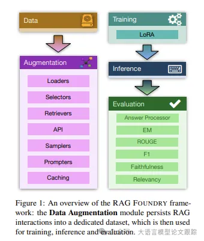
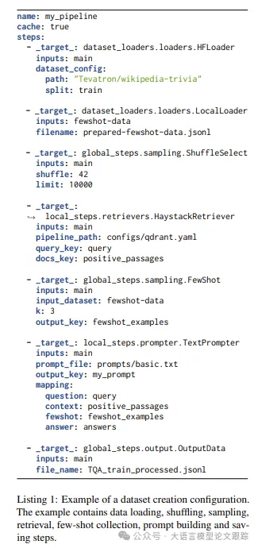

# 1. 资源

- Github: https://github.com/IntelLabs/RAGFoundry
- 论文：https://arxiv.org/pdf/2408.02545

# 2. 原理

该库由四个核心模块构成：数据生成、训练、推理和评估。每个模块都通过配置文件进行封装和控制，确保了模块间的输出输入兼容性。

## 2.1 数据

前两个步骤分别从Hugging Face库和本地路径加载数据集。

- 第三步从主数据集中随机抽取并选取了10,000个样本。

- 第四步启动了一个基于Haystack的检索流程，用已加载数据集中的问题作为查询，检索相关文段，并将结果存储在docs_key中。检索步骤可以使用不同的检索流程或框架）。

- 第五步从辅助数据集中选取了3个少量样本，这紧随在一个提示生成步骤之后，该步骤加载了一个提示模板，并根据预定义的映射字典替换了所有信息。

- 最后，保存数据集到本地路径。

## 2.2 训练

该模块建立在广泛认可的TRL2训练框架之上，并支持诸如LoRA这样的高级而高效的训练技术。

## 2.3 评估

局部度量标准可以应用于单个样本，例如精确匹配（Exact Match, EM）

全局度量标准则基于整个数据集运行，如分类度量中的召回率（Recall）。

# 参考

[1] RAG Foundry：开源RAG框架，数据、推理、测评一条龙，https://mp.weixin.qq.com/s/edy5zoKnIjDK9o3QofkCYw