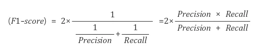
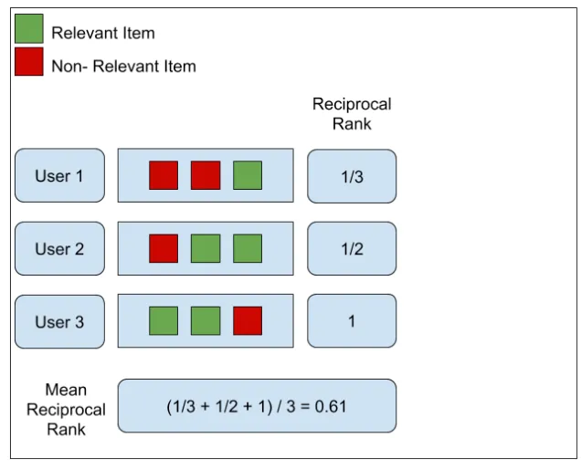
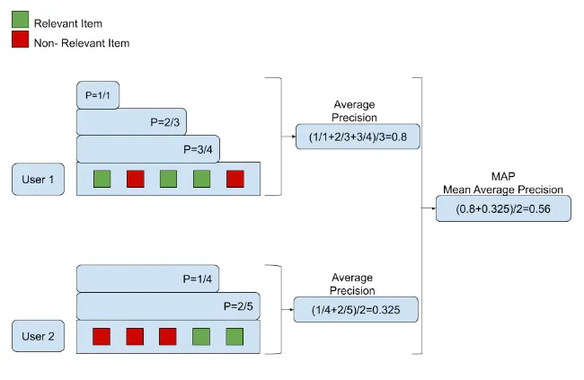
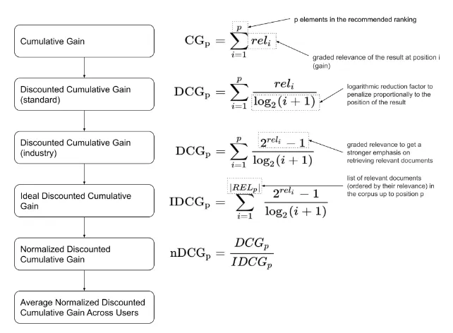

# 1. 简介

# 2. 检索评估指标

## 2.1 F1 score

F1 score is the harmonic mean of Precision and Recall.

## 2.2 MRR (Mean Reciprocal Rank)

MRR (Mean Reciprocal Rank) is the average of Reciprocal Rank of the most relevant passage.

## 2.3 MAP (Mean Average Precision)

MAP(Mean Average Precision) is exactly what it sounds like: the average of Average Precision (AP), or the average of the averages.

Calculate in this order: Precision → Average Precision → Mean Average Precision

## 2.4 NDCG (Normalized Discounted Cumulative Gain)

Calculate in this order: CG → DCG → IDCG → NDCG

1. CG
    Cumulated Gain (CG) literally means the cumulative sum of relevance.
    
    However, in the case of CG, if the types of passages in TopN are the same, a model with more relevant passages ranked higher may perform equally well as a model with less relevant passages.

    Therefore, we don't use this value directly, but use the DCG with a discount.

2. DCG

    Discounted Cumulated Gain (DCG) is the sum of the relevance divided by the logarithmic rank.

    Logarithmicizing the ranking results in a modest increase in value, and dividing relevance by this value indicates that the impact of relevance is smaller the further down the ranking you go.

    In DCG, discounted means to reduce the influence of these later rankings, so that the value of the DCG is more influenced by the relevance of higher-ranked items and less influenced by the relevance of lower-ranked items.

    

3. IDCG

   The Ideal Discounted Cumulated Gain (IDCG) is the most ideal value of the DCG result. It is absolute and not directly related to the model.

4. NDCG

   The normalized Discounted Cumulated Gain (nDCG) refers to the normalized DCG, which means that the DCG for the model's ranking is divided by the ideal DCG, or IDCG, to give a value between 0 and 1.

   

   NDCG = DCG / IDCG

# 参考

[1] 给RAG系统做一次全面「体检」，亚马逊开源RAGChecker诊断工具，https://mp.weixin.qq.com/s/x4o7BinnwvTsOa2_hegcrQ