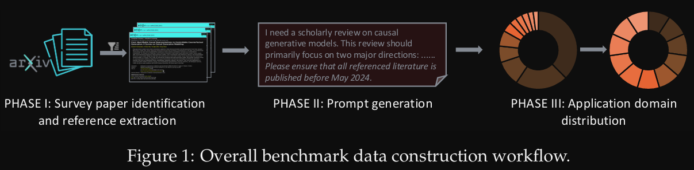
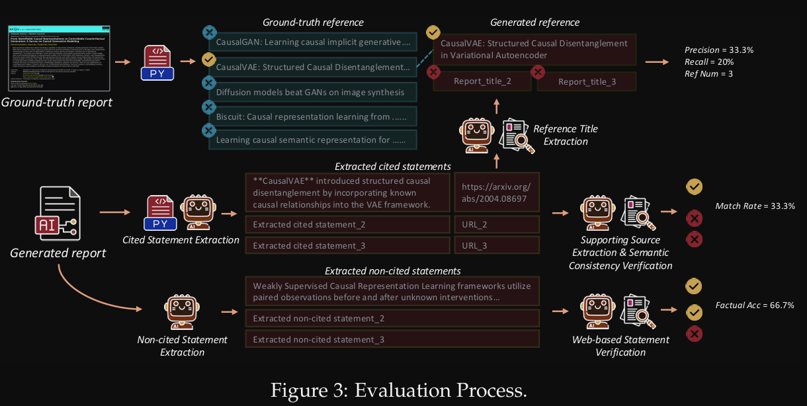
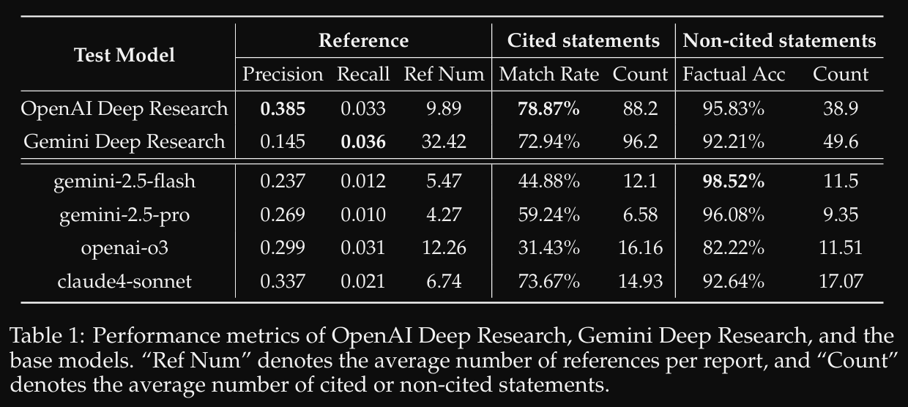

# 1. 资源

- Github (23 stars)：https://github.com/ByteDance-BandAI/ReportBench
- 论文：
  - ReportBench: Evaluating Deep Research Agents via Academic Survey Tasks
  - 字节，2025.8.14
  - https://arxiv.org/pdf/2508.15804#:~:text=In%20this%20paper%2C%20we%20propose%20ReportBench%2C%20a%20systematic,research%20reports%20generated%20by%20large%20language%20models%20%28LLMs%29.

评估聚焦于两个关键维度：（1）引用文献的质量与相关性，以及（2）生成报告中陈述的忠实性与真实性。ReportBench利用arXiv上高质量发表的综述论文作为黄金标准参考，通过逆向提示工程从中提取领域特定的提示，并建立一个全面的评估语料库。此外，我们在ReportBench中开发了一个基于智能体的自动化框架，该框架通过提取引用和陈述，对照原始来源检查引用内容的忠实性，并利用网络资源验证非引用声明，系统分析生成报告。

# 2. 数据集构建

1. 抓取arXiv文章
2. 文章分析：利用文章，让LLM方向生成prompt，从句子、段落、细节三方面提取文章主旨、方法
3. 抽取文章使用的引文
4. 分类：利用Gemini 2.5 Pro对文章标题和摘要进行分类，平衡领域



第二步中的提示词：

```text
Sentence-level prompt
 A single sentence that succinctly defines the overarching academic
 field covered by the survey.
 Paragraph-level prompt
 A short paragraph elaborating the research area, its main
 subtopics, and the methodological perspectives covered in the
 survey.
 Detail-rich prompt
 A detailed question that comprehensively describes the specific
 research domain, key research directions, and the methodological
 approaches of interest. Additional constraints may be included,
 such as preferred conferences or journals, language of the cited
 literature (e.g., English, Chinese), participating institutions or
 laboratories.
```

# 3. 评估方案

利用在数据集构建过程生成的prompt进行评估

1. 仅对比引文：对比生成文章使用的引用是否全
2. 有引文时，对比生成内容和引文
3. 不在引文中的，使用互联网+多个agent评判



# 4. 实验



