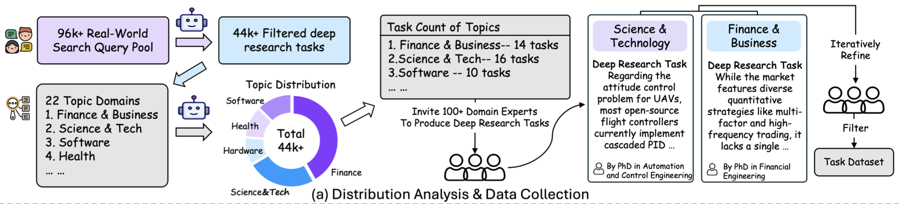
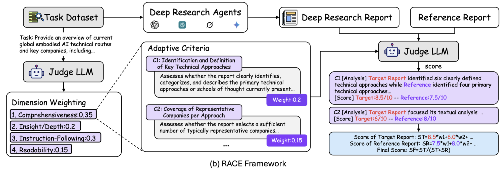
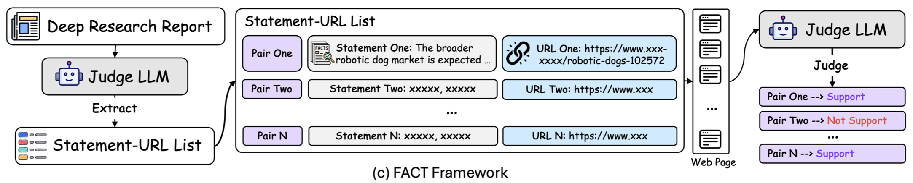
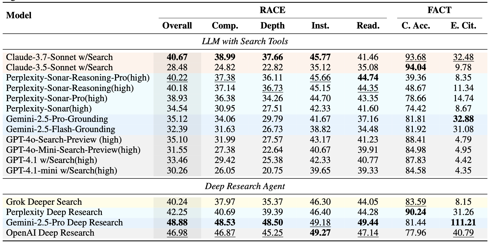
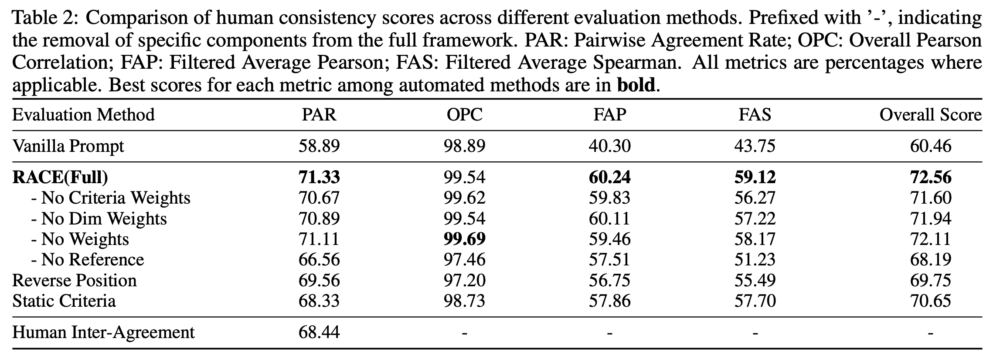

# 1. 资源

- 论文名称：DeepResearch Bench: A Comprehensive Benchmark for Deep Research Agents
  - 论文地址：https://arxiv.org/pdf/2506.11763
  - 2025.6.13
- Github (351 stars): https://github.com/Ayanami0730/deep_research_bench

# 2. 数据构建

概括：真实问题筛选 -> WebOrganizer主题分类 -> 每个主题选择数量

---

研究团队首先收集了96,147条来自支持网络搜索的LLM聊天机器人的原始用户查询，并对其进行严格的匿名化处理，以保护用户隐私。

基于这些真实查询，团队使用DeepSeek-V3-0324模型进行筛选，最终得到44,019条符合深度研究任务定义的查询。

这些任务需要代理进行多轮网络搜索、收集信息、执行分析并生成高质量报告，真正反映了现实世界中用户对深度研究的需求。

为了对这些深度研究查询进行分类，研究团队采用了WebOrganizer提出的主题分类法，选择了22个不同的主题领域。

通过对LLM分类结果的统计汇总，团队获得了这些查询在各个主题上的分布，直观展示了现实世界中用户对不同领域深度研究的需求情况。

基于这一真实世界的用户需求分布，研究团队确定了DeepResearch Bench中每个主题领域的目标任务数量。

考虑到运行深度研究代理和评估其结果所需的大量资源，团队按比例压缩了这一分布，形成了包含100个任务的最终数据集，其中中文和英文任务各占50个。

这一压缩过程精心确保了基准保持与观察到的现实世界分布相同的主题平衡。

# 3. 评估方法

研究团队提出了两个互补的评估框架：RACE和FACT

- RACE: 动态生成标准和打分权重，和参考报告对比打分
- FACT： 评判要点在引文中是否提及

## 3.1 RACE：报告质量的多维度评估

RACE（Reference-based Adaptive Criteria-driven Evaluation framework with Dynamic Weighting）框架旨在评估生成报告的质量。

长期研究报告的评估面临着重大挑战，现有的使用固定清单或静态评分标准的方法难以适应多样化的任务、专业领域和深度研究任务的细微质量方面。

为了应对这些挑战，RACE框架采用了基于参考的自适应标准驱动评估方法，并结合动态加权，充分利用了LLM作为评判者（LLM-as-a-Judge）的方法。

RACE通过以下三个关键步骤实现更具适应性和鲁棒性的评估：

动态权重与自适应标准生成：RACE首先基于领域专业知识建立了四个顶级正交维度：全面性（Comprehensiveness）、洞察力/深度（Insight/Depth）、遵循指令性（Instruction-Following）和可读性（Readability）。对于每个任务，评判LLM通过多次试验获得每个维度的权重，并取平均值作为最终权重，确保评估与任务意图一致。随后，对于每个维度，评判LLM生成一组量身定制的标准及其相应权重，这些标准对于评估该维度内的报告而言是清晰且可操作的。

基于参考的评分：初步实验表明，孤立地对报告进行评分往往会产生区分度不足的结果，模型倾向于给出一致的高分，从而掩盖了真正的质量差异。为了缓解这一问题，RACE采用了基于参考的评分策略。对于每个任务，选择一份高质量的报告作为参考。所有维度的生成标准被聚合到一个综合列表中，评判LLM然后根据每个标准分析目标报告和参考报告，为两份报告生成每个标准的分数列表，用于最终得分计算。

整体得分计算：最后，RACE计算目标报告的整体质量得分。首先，通过使用标准权重对标准级别的分数进行加权来计算维度级别的分数。然后，这些维度级别分数通过维度权重加权，产生中间整体分数。最终，目标报告的得分是相对于参考报告的得分来确定的。

## 3.2 FACT：信息检索的可靠性评估

为了评估报告内容的事实依据以及代理检索和利用基于网络的信息的有效性，研究团队提出了FACT（Framework for Factual Abundance and Citation Trustworthiness）框架。

该框架通过以下自动化步骤评估DRAs：

陈述-URL对提取和去重：研究团队使用评判LLM从DRAs生成的报告中提取离散陈述及其相应的引用源URL。然后，评判LLM检查这些对，以识别多个与同一URL相关联的陈述描述完全相同事实的情况。在这种情况下，只保留一个有代表性的陈述-URL对，确保每个独特的事实主张只被表示一次。

支持判断：每个独特的陈述-URL对都要经过支持评估。研究团队使用Jina Reader API检索网页的文本内容，然后评判LLM评估该内容是否提供了足够的证据支持该陈述。这导致对每个对的二元判断（“支持"或"不支持”），确定引用是否准确地为主张提供了依据。

引用指标计算：基于这些支持判断，研究团队计算了两个主要指标：引用准确性（Citation Accuracy）和每个任务的平均有效引用（Average Effective Citations per Task）。引用准确性衡量代理引用的精确性，反映其用适当来源为陈述提供依据的能力；每个任务的平均有效引用量化了代理每个任务检索和呈现的有价值、可验证支持的信息量。

通过这两个框架的结合，研究团队能够全面评估DRAs在报告生成和信息检索两个关键方面的表现，为DRAs的发展提供了明确的方向。

# 4. 性能对比

主流DRAs的性能大比拼

利用DeepResearch Bench和RACE、FACT评估框架，研究团队对当前主流的深度研究代理和支持网络搜索的LLM进行了全面评估，揭示了这些系统在各种任务中的表现。

在RACE框架的评估中，在深度研究代理（DRA）类别中，基于Gemini-2.5-Pro的深度研究代理在整体性能上领先。OpenAI深度研究代理也表现出强大的能力，在遵循指令维度上超过了Gemini-2.5-Pro深度研究代理。

这表明不同维度在某种程度上是解耦的，并且足够强大的评判LLM能够捕捉模型在这些不同维度上的性能差异。

值得注意的是，这些顶级代理的分数相对接近，这是RACE采用的基于参考的相对评分的特点。

然而，后续实验显示这些RACE分数与人类判断之间存在强烈的线性相关性，表明该框架有效地捕捉了模型之间有意义的性能差异。

实际上，这些分数与人类评估高度线性相关，只是映射到不同的参考框架（类似于45分和50分与人类评分的90分和100分进行比较）。因此，我们应该关注分数之间的排名和比例差异，而不是绝对分数值。

可以观察到，OpenAI深度研究代理和Gemini-2.5-Pro深度研究代理表现相当，均显著优于其他两个深度研究代理。而Perplexity深度研究代理略优于Grok深度搜索。

在支持搜索工具的LLM中，Claude-3.7-Sonnet表现令人印象深刻，其总分超过了Grok深度搜索，这可能归因于Claude被允许执行多轮网络搜索。Perplexity-Sonnet-Reasoning-Pro(high)也表现出类似的性能。

当查看不同模型在各个主题上的分数时，可以观察到各个模型在不同主题任务上保持相对稳定的性能，展示了RACE评估框架的稳健性。

有趣的是，研究团队发现，对于交通主题中的中文任务，所有模型的表现都低于各自的平均水平，表明这一特定问题集呈现出更高的难度。

在FACT框架的评估结果中，除Grok外，深度研究代理往往比支持搜索工具的LLM包含更多的有效引用。

值得注意的是，Gemini-2.5-Pro深度研究代理在其最终报告中平均获得111.21个有效引用，显著优于其他模型。这一发现与其在RACE框架的"全面性"维度中的最高分一致。

然而，Gemini-2.5-Pro深度研究代理和OpenAI深度研究代理的引用准确性与Perplexity深度研究代理相比存在明显差距，表明Perplexity深度研究代理在准确回忆检索文本中的相关内容方面具有更强的能力。

在支持搜索工具的LLM中，Claude-3.7-Sonnet获得了第二高的有效引用数量，并表现出强大的引用准确性；这也与其在RACE框架中获得最佳总分一致。

## 4.1 RACE框架的人类一致性验证

评估深度研究报告的质量仍然是一项开放性任务。

因此，为了验证RACE框架的有效性，研究团队必须评估其与人类判断的一致性。

团队使用DeepResearch Bench中的50个中文任务进行了实验，这些任务由四个不同的代理生成报告。对于每个任务，三名领域专家注释者对这些报告进行评分。

为了收集人类判断，研究团队招募了70多名具有硕士学位和相关领域专业知识的注释者。他们使用自定义界面，仅根据基本评分标准对报告的四个维度和整体性能进行评估，以尽量减少偏见。每个注释者最多被限制评估三个查询，以确保观点的多样性。

为了验证评估方法与人类判断之间的一致性，研究团队设计了四个指标，量化与人类评估的不同方面的一致性：

成对一致率（Pairwise Agreement Rate）：衡量在比较报告对时，评估方法的偏好与人类专家的偏好匹配的频率。它反映了框架在复制所有任务中人类比较判断方面的可靠性。

整体皮尔逊相关性（Overall Pearson Correlation）：量化评估方法的平均模型分数与人类专家的平均模型分数之间的线性关系。它展示了框架的绝对评分与所有深度研究助手模型的人类评估的一致性。

过滤平均皮尔逊相关性（Filtered Average Pearson） 和 过滤平均斯皮尔曼相关性（Filtered Average Spearman）：在计算每个任务的平均相关系数时，个体不一致性对结果的影响可能比全局相关性更明显。为了解决这个问题，研究团队首先过滤掉专家判断一致性低的任务，即移除组内相关系数（ICC）为负的任务。ICC是评估评分者一致性的统计量，负值表示评分者间信度差。应用这一过滤标准后，实验中保留了37个任务，形成了一个具有更高专家共识的子集。然后计算两个互补指标：过滤平均皮尔逊相关性和过滤平均斯皮尔曼相关性。这些过滤指标共同提供了更稳健的评估，衡量自动化评估与不同任务中一致的人类判断的一致性。

实验结果显示，RACE（完整版）表现出最强的整体性能，显著优于 vanilla 基线和其他RACE变体。

值得注意的是，其成对一致率也超过了人类专家之间观察到的一致率。这些结果共同表明，RACE能够可靠且准确地评估深度研究报告，高效地实现了与人类判断的高度一致性。

此外，利用RACE框架，研究团队还比较了几种领先的专有LLM作为评判LLM时的性能和成本。结果显示，Gemini 2.5 Pro Preview不仅实现了最佳的整体性能，还保持了具有竞争力的平均成本（每个查询0.13美元），仅高于o4-mini。因此，为了有效平衡性能和成本，研究团队选择Gemini 2.5 Pro Preview作为最终框架中的评判LLM。

# 5. 展望未来：DeepResearch Bench的意义与局限

DeepResearch Bench的推出填补了深度研究代理评估领域的空白，为这一快速发展的领域提供了首个全面的基准测试工具。

通过100个精心设计的博士级研究任务，涵盖22个不同领域，该基准真实反映了现实世界中对深度研究的需求。

RACE和FACT评估框架的提出，为全面评估DRAs的报告生成质量和信息检索能力提供了创新方法。这些框架与人类判断的高度一致性，确保了评估结果的可靠性和有效性。

然而，研究团队也坦诚地指出了当前工作的局限性：

基准规模：创建真实反映研究挑战的任务需要大量的专业知识和努力。100个任务的规模虽然经过精心设计，但在统计稳健性和主题覆盖方面仍有扩展空间。未来的发展将优先考虑在保持质量标准的同时扩大基准规模。

领域覆盖偏差：尽管研究团队尽了最大努力，但在筛选和选择过程中可能无意中引入了偏差。未来的迭代将纳入更多具有专业领域知识的外部评审员，以实现各领域更平衡的代表性。

人类评估吞吐量：评估研究报告本身具有内在挑战，一份报告可能包含数十页密集的技术内容和复杂的分析。即使对于博士级别的评估人员，彻底的审查通常也需要30-60分钟，而评估多个报告则会成倍增加这一负担。目前的人类评估样本虽然足以验证RACE框架，但规模仍然有限，容易受到个体差异的影响。研究团队计划进行更广泛的标注活动，以加强统计置信度并完善自动化指标，从而保持与人类判断的一致性。

DeepResearch Bench的推出旨在通过提供一个强大的框架来开发更强大的深度研究代理，显著加速研究和创新。

这可以普及先进的研究方法，赋能更广泛的各领域用户。然而，强大的DRAs的进步也带来了值得认真考虑的社会挑战，包括如果不经过严格验证可能产生复杂的错误信息、过度依赖可能导致批判性思维和手动研究技能下降的风险，以及可能放大潜在模型和它们处理的海量网络数据中固有的偏差。

通过包括事实依据（FACT）和质量评估（RACE）的多方面评估，DeepResearch Bench旨在通过促进更可靠、透明和负责任的AI代理的发展，为缓解这些风险迈出一步。

持续的警惕、对AI安全和伦理的持续研究，以及多方利益相关者的参与，对于确保这些强大的工具以有利于社会的方式开发和部署，同时最大限度地减少潜在危害至关重要。

研究团队已经开源了DeepResearch Bench和这些框架的关键组件（https://github.com/Ayanami0730/deep_research_bench），以加速基于LLM的实用代理的发展。这一举措无疑将推动深度研究代理领域的快速进步，为人工智能在知识工作中的应用开辟新的可能性。

随着DeepResearch Bench的不断完善和扩展，我们有理由相信，未来的深度研究代理将在准确性、可靠性和实用性方面达到新的高度，成为人类知识探索和创新的强大伙伴。

# 参考

[1] 深度研究代理的终极考验：DeepResearch Bench 横空出世, https://blog.csdn.net/qq_42540492/article/details/149135212