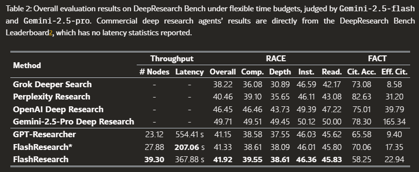
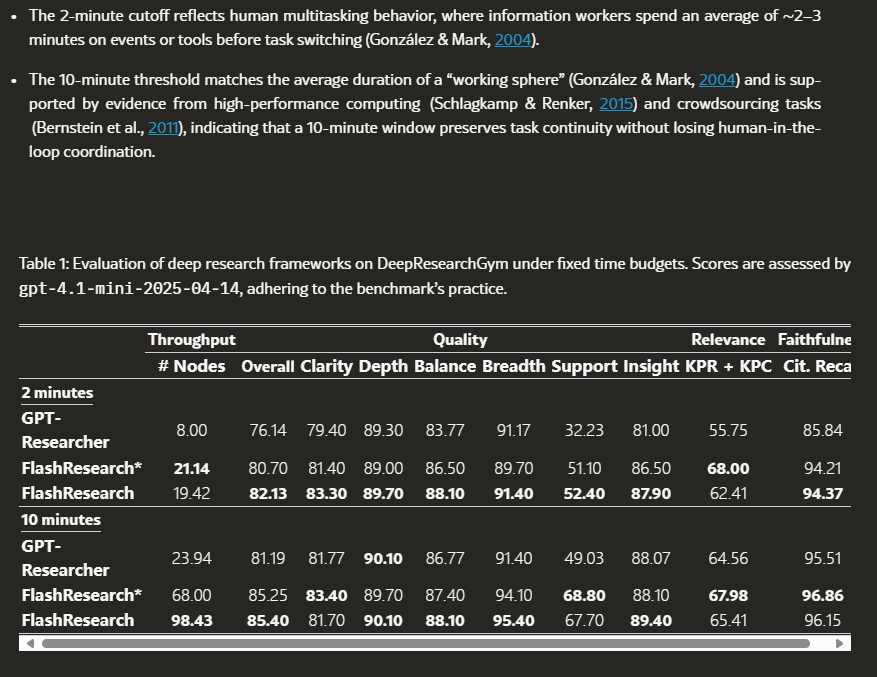

DeepResearchGym (Coelho et al., 2025) is an open-source evaluation sandbox for deep research systems. The benchmark consists of the top 1,000 complex, high-engagement non-factoid queries from the Researchy Questions dataset (Rosset et al., 2025).

 It employs an LLM-as-a-judge protocol to assess generated reports along three dimensions:

- Quality Rates organization, clarity, and coherence of the synthesis. Prefers well-structured, readable reports that integrate evidence into concise, actionable takeaways.
- Relevance Judges whether the report directly answers the user’s intent, covering the key sub-questions and constraints in the prompt. Penalizes omissions and off-topic content.
- Faithfulness Assesses whether the cited evidence supports claims. Rewards correctly grounded statements and flags contradictions, unsupported claims, or hallucinations.

