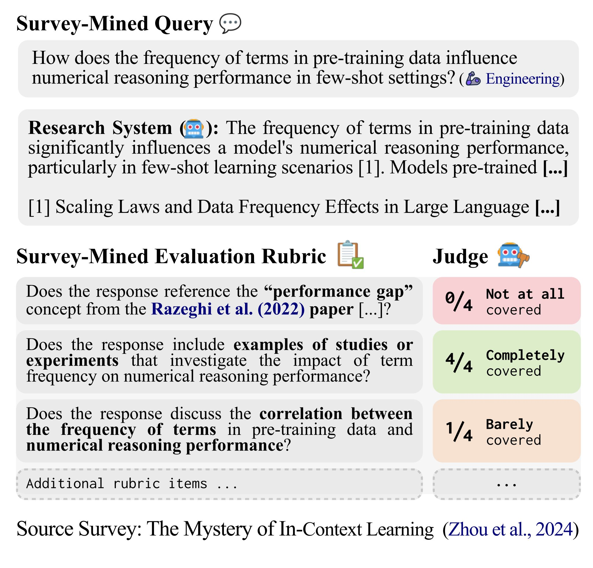
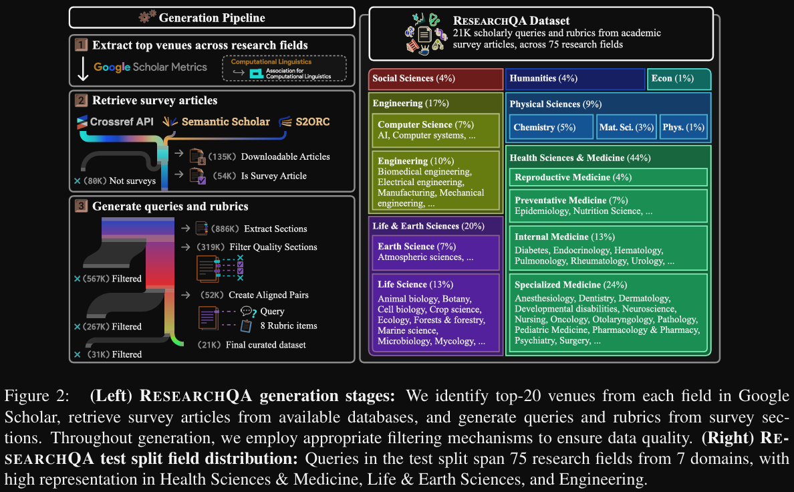

- ResearchQA: Evaluating Scholarly Question Answering at Scale Across 75 Fields with Survey-Mined Questions and Rubrics
  - https://arxiv.org/abs/2509.00496
  - 2025.8.30
- Github (4 stars): https://github.com/realliyifei/ResearchQA
Data:
- huggingface.co/datasets/realliyifei/ResearchQA
- Website: cylumn.com/ResearchQA

评估对研究查询的长篇回答在很大程度上依赖于专家注释者，这限制了对像人工智能这样的领域的关注，因为研究人员可以方便地征求同事的帮助。然而，研究专长是广泛存在的：综述文章综合了分布在文献中的知识。我们推出了ResearchQA，这是一个通过将75个研究领域的综述文章提炼成21,000个查询和160,000个评分项来评估大型语言模型系统的资源。每个评分项与来自综述部分的查询共同得出，列出了特定查询的答案评估标准，即引用文献、进行解释和描述局限性。来自8个领域的31名博士注释者的评估表明，96%的查询支持博士级的信息需求，87%的评分项应在系统响应中用一句话或更多进行处理。利用我们的评分标准，我们能够构建一个自动成对评判系统，与专家判断的协议率达到74%。我们利用ResearchQA分析18个系统在超过7,600次成对评估中的能力差距。我们评估的没有参数或检索增强系统在覆盖评分项方面超过70%，而排名最高的自主系统显示出75%的覆盖率。错误分析显示，排名最高的系统完全满足的引用评分项不足11%，局限性项为48%，比较项为49%。我们发布我们的数据，以促进更全面的多领域评估。

RESEARCHQA是一个综合评估框架，旨在通过21,000个查询和160,000个自定义评分标准，评估大型语言模型在75个研究领域回答学术问题的能力，揭示了显著的能力差距，并为学术问答系统的未来改进提供指导。
论文试图解决什么问题？
本文试图解决以下问题：
任务目标
本文重点评估大型语言模型（LLM）系统在不同研究领域对学术查询的响应能力。
当前困难与挑战
由于需要专家注释者，评估研究查询的长篇答案极具挑战性。
现有基准的规模有限，主要局限于熟悉的工程领域，阻碍了更广泛的评估。
缺乏适当专家的经济可得性，导致全面评估的困难。
研究动机
研究文献的快速增长使得专家和非专家都难以跟上各领域的最新进展。
需要一个标准化的评估框架，以评估LLM在75个研究领域的能力，填补当前评估方法的空白。
RESEARCHQA的开发旨在促进对LLM能力的更广泛评估，并突出现有的弱点，以指导未来学术问答系统的改进。
论文提出的方法是什么？
本文提出了RESEARCHQA框架，旨在评估大型语言模型（LLM）系统在75个研究领域中对学术查询的响应能力。论文中提出的关键方法包括：
查询和评估标准的提炼：该框架从学术调查文章中提炼出21,000个查询和160,000个评估标准，为评估答案质量提供了标准化的标准。
专家注释者的验证：31名博士注释者对查询和评估标准的质量进行了验证，确保96%的查询反映了博士生的信息需求。
基于标准的评估：评估标准包括评估答案质量的具体标准，如引用的必要性、比较和因果效应的描述。
对多个系统的评估：该框架评估了18个不同的LLM系统，识别出在引用和局限性等方面的能力差距。
未来改进的指导：评估结果突显了LLM能力的现有弱点，为学术问答系统的未来改进提供了指导。
总体而言，RESEARCHQA旨在促进对LLM能力在学术研究背景下的更广泛和标准化的评估。
在哪些数据上进行了实验？
本文对以下数据集进行了实验：
RESEARCHQA
描述：一个全面的数据集，旨在评估大型语言模型（LLM）系统在75个研究领域中对学术查询的响应能力。
规模：21,000个查询。
划分：
训练集：16.9K个查询。
验证集：703个查询。
测试集：3.7K个查询，通过从每个领域抽取至少50个查询，确保广泛的领域覆盖。
MTEB（大规模文本嵌入基准）
描述：用于评估各种模型在检索嵌入任务中表现的基准。
结果：E5-Mixtral模型和LLM2Vec在该基准上表现优于最先进的双向嵌入模型。
信息检索基准
描述：用于评估模型在信息检索任务中有效性的基准。
结果：NV-Embed模型在该基准上超越了所有现有基线。
这些数据集用于评估各种自回归语言模型的性能及其与双向编码器的比较。实验突显了微调的自回归模型在检索任务中性能的显著提升。

