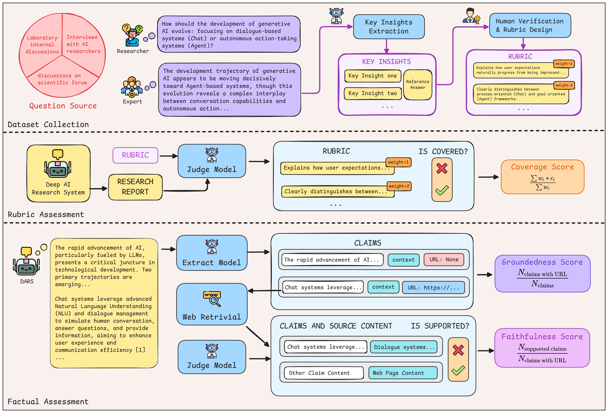
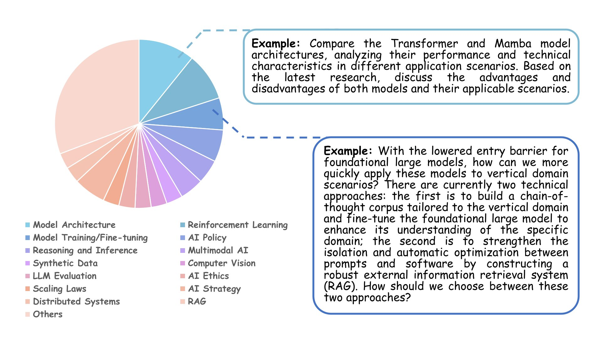
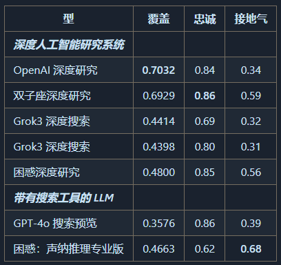
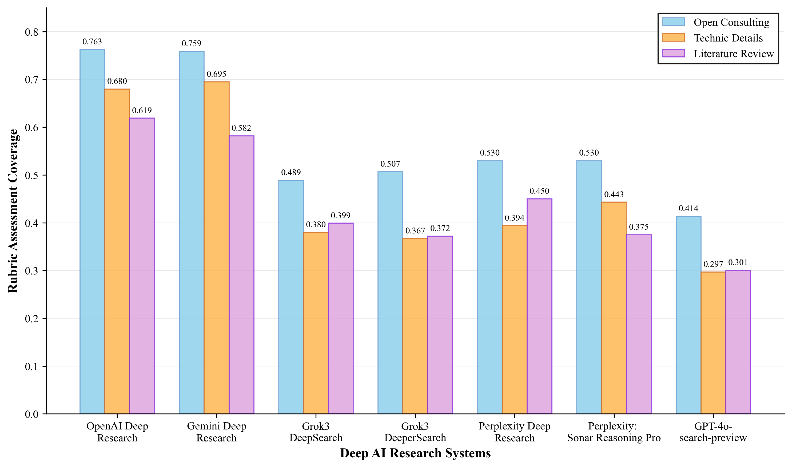

- Github (35 stars): https://github.com/GAIR-NLP/ResearcherBench
- ResearcherBench: Evaluating Deep AI Research Systems on the Frontiers of Scientific Inquiry

概述
随着深度人工智能研究系统 （DARS） 变得越来越复杂，对评估方法的需求越来越大，这些方法可以评估其作为真正的研究合作伙伴的潜力，而不仅仅是信息检索工具。ResearcherBench 是一个全面的评估基准，专门用于评估 DARS 在前沿科学问题上的能力，提供：

前沿研究问题数据集：来自真实科学场景的 65 个专业策划的研究问题，涵盖 35 个不同的人工智能研究主题
双重评估框架：将专家设计的洞察质量评分标准评估与引文准确性和可靠性的事实评估相结合
全面的 DARS 评估：对领先的商业系统进行系统评估，以了解当前的功能和局限性
🏗️ 基准建设
数据收集策略
ResearcherBench 采用严格的数据收集方法来确保前沿研究问题的真实性和质量。我们确定了持续生成高质量前沿研究问题的三个主要背景：

实验室内部研究讨论：研究人员积极应对未解决的技术挑战
专访领先的人工智能研究人员：揭示新兴研究方向和悬而未决的问题
科学论坛讨论：从业者讨论实施挑战和理论差距
数据集组成
我们编制了一个包含 65 个研究问题的数据集，这些问题是从现实世界的科学场景中专业挑选的，例如实验室讨论和访谈，涉及 35 个不同的人工智能主题（例如模型架构、强化学习、人工智能政策和伦理），分为三种类型：技术细节、文献综述和开放咨询。

🔬 评估框架
ResearcherBench引入了双重评估框架，通过评分标准评估和事实评估来全面评估DARS绩效。我们将专家设计的标准评估与自动事实验证相结合，以捕捉生成的研究内容的理解深度和可靠性。

1. 评分标准评估
关键洞察提取：我们采用 Claude-3.7-Sonnet 从多个不同的上下文来源进行分析，并提取需要深度思考和跨域综合的关键洞察。这种自动提取过程生成包含高价值见解的综合参考材料，然后作为人类专家注释的辅助材料。

人类专家评分标准设计：经验丰富的研究人员将提取的见解转化为加权评估标准（1-3 等级），创建一个结构化框架，捕捉预期研究贡献的广度和深度。

评估方法：对于每个问题，我们评估 DARS 回答是否涵盖专家设计的评分标准中指定的关键见解，并计算这些回答的加权覆盖率分数。

2. 事实评估
声明提取：我们采用提取模型来提取 DARS 生成的报告中的所有事实声明及其相应的上下文段落。提取模型还检查是否可以使用报告中的相应引文 URL 检索每个声明。

引文支持验证：对于每个 URL-claim-context 三元组，我们从 URL 源中提取文本内容，然后使用判断模型对提取的内容是否支持相应的声明进行二元评估。

评估方法：我们计算两个指标来评估事实准确性的不同方面。忠实度分数衡量引文支持其相应主张的准确性，而基础性分数则评估响应内容的整体引文覆盖率。

📊 评估结果
主要性能
我们对领先的深度人工智能研究系统的评估揭示了有关其当前能力的重要见解：

跨问题类型的表现

如下图所示，与其他类别相比，所有系统在开放式咨询问题上都表现出更好的性能，顶级系统实现了 76%+ 的覆盖率。在开放咨询问题上的卓越表现验证了我们的假设，即 DARS 系统作为创新研究构思合作伙伴而不是精确的技术实施指南特别有效。

