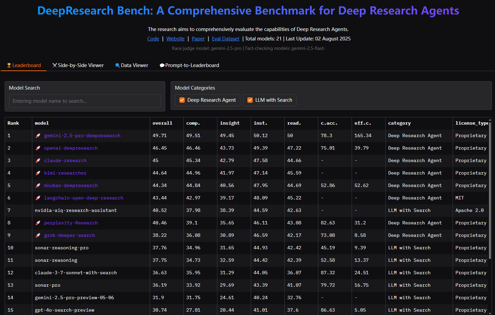

Deep Research 的leaderboard: 
- 框架对比：gemini最好，开源langchain-open-deep-research最好
  - https://huggingface.co/spaces/Ayanami0730/DeepResearch-Leaderboard
- 模型选型对比：Claude 4.5 Sonnet， GPT-5 (low)最佳
  - https://futuresearch.ai/deep-research-bench/
  - https://evals.futuresearch.ai/

最好的开源：https://github.com/langchain-ai/open_deep_research

📊 Column Descriptions
Rank: Model ranking based on overall score
model: Model name (🚀 = Deep Research Agent)
overall: Overall Score (weighted average of all metrics)
comp.: Comprehensiveness - How thorough and complete the research is
insight: Insight Quality - Depth and value of analysis
inst.: Instruction Following - Adherence to user instructions
read.: Readability - Clarity and organization of content
c.acc.: Citation Accuracy - Correctness of references
eff.c.: Effective Citations - Relevance and quality of sources
category: Model category
license_type: The software license type of the model/service
💡 Tip: Model names are clickable when links are available. Visit the GitHub repositories for more details!
