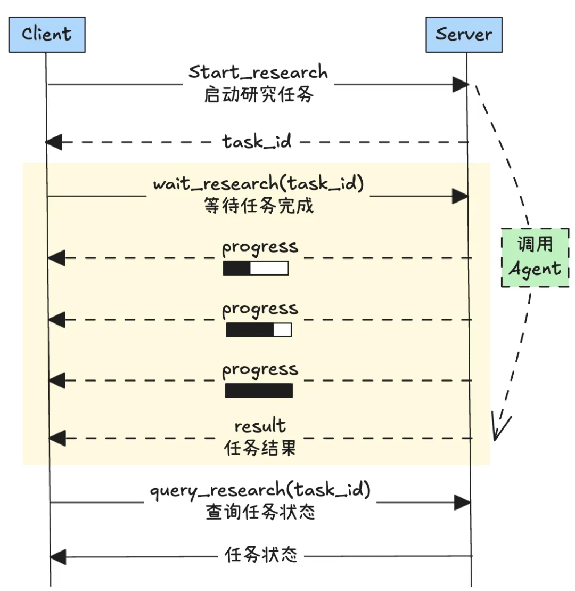

本文源码：https://github.com/pingcy/mcp-deepresearch


DeepResearch Agent：LangGraph开发的智能体。为了简化，我们采用对Google的一个开源项目（ gemini-fullstack-langgraph-quickstart）做“魔改”。
MCP Server：借助MCP SDK开发，提供并开放以下主要Tool：
start_research：启动深度研究任务，该工具会返回任务ID（task_id）
cancel_research：取消某个研究任务，输入任务ID
wait_research：等待并接收某个任务的“流”输出，用来观察任务过程，该工具会持续到任务结束，中途中断不影响任务进行
query_research：查询某个任务的当前状态与结果，该工具会立刻返回

Client应用：调用MCP Server完成深度研究任务的客户端，这里用来测试。
该架构下，一个典型的DeepResearch过程的MCP客户端与服务端的交互如下：



Google的这个开源项目是一个完整的端到端的简单版的DeepResearch应用，包含前端与后端。这里我们“借用”它的后端应用，这是一个LangGraph框架的Agent，其工作流设计如下：


对其做如下主要修改：
将Gemini模型修改成了使用本地Ollama的qwen3模型
将使用的Google搜索工具改成使用tavily API搜索
对涉及到的提示词（查询生成、结果反思以及结果生成）适当调整

在进行下一步之间，可以对这个DeepResearch Agent做独立测试，确保其能够正常调用与输出。注意使用流式调用这个Agent，以方便跟踪与显示中间过程：

```python
# 流式执行Graph
    async for chunk in graph.astream(initial_state, config=config):
        step_count += 1
        
        #stream_mode=updates时，会在每个节点后输出节点名称与节点返回信息
        for node_name, node_output in chunk.items():
            print(f"📍 步骤 {step_count}: {node_name}")
            
            if node_name == "generate_query":
                if "query_list" in node_output:
                    print(f" 🧠 智能查询生成:")
```

构建异步的MCP DeepResearch Server

准备好Agent后，现在我们将把其“包装”成一个可以共享使用的MCP Tool。由于我们期望该任务能够异步运行，并可以随时查询任务状态与结果，因此这里构建一个MCP Server中的任务管理器（TaskManager）。其职责是：
对服务端异步研究任务进行管理，包括任务创建、启动、取消与状态更新。
任务变化的状态图与相关接口的关系如下：


任务管理器的基本定义如下：

```python
class ResearchTaskManager:
    def__init__(self):
        self.tasks: Dict[str, Dict[str, Any]] = {}
        self.task_futures: Dict[str, asyncio.Task] = {}

    def create_task(self, research_query: str) -> str:
        """创建新的研究任务并返回任务ID"""
...

    async def start_task(self, task_id: str) -> None:
        """启动研究任务，在这里调用上面的DeepResearch Agent"""
...

    def get_task(self, task_id: str) -> Optional[Dict[str, Any]]:
        """获取任务信息"""
...

    def update_task(self, task_id: str, updates: Dict[str, Any]) -> None:
        """更新任务信息"""
...
    
    async def cancel_task(self, task_id: str) -> str:
        """取消指定的研究任务
...
```


# 参考

[1] MCP实战｜从0到1构建异步 DeepResearch 工具，支持进度推送与超时控制, https://mp.weixin.qq.com/s/O92Of0NPrUeu3ZLJdKQZBg