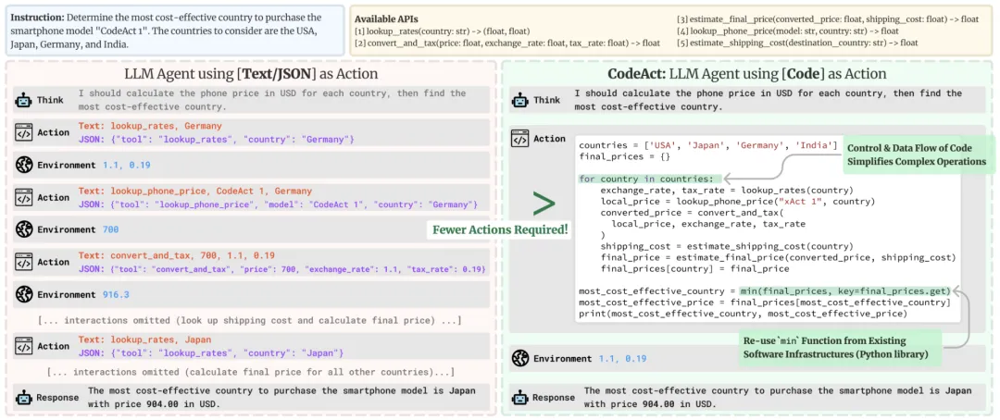
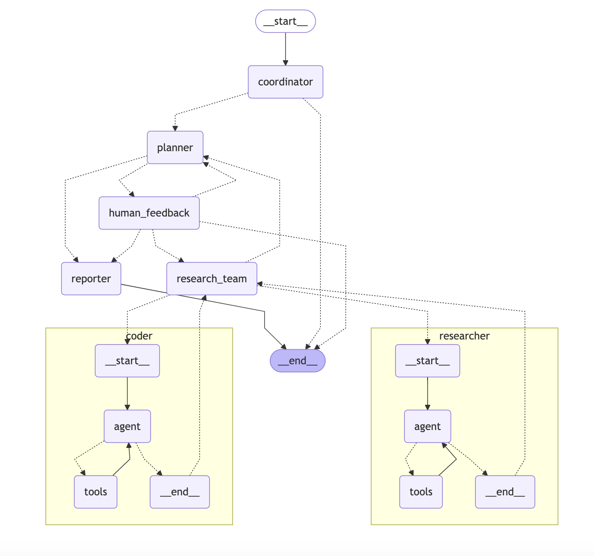
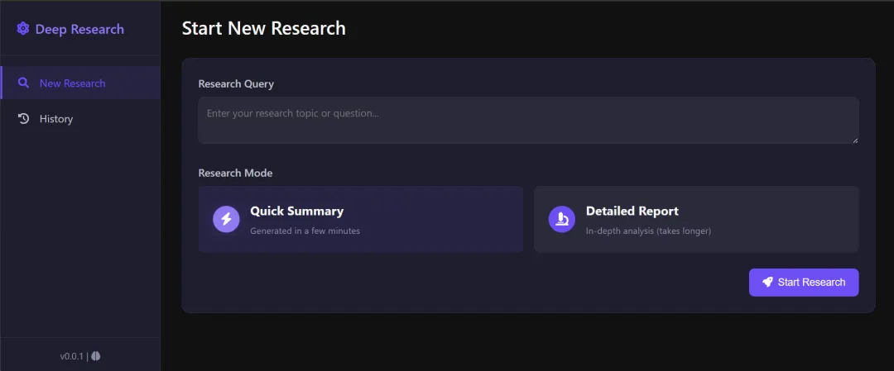

# 1. 简介

**什么是Deep Research，为什么需要开源平替？**

OpenAI近期推出了一款名为Deep Research的高级AI研究工具，旨在帮助用户高效完成复杂的研究任务。该工具基于OpenAI最新的o3模型，专为网络浏览和数据分析优化。

**主要功能**

1. 多步骤信息收集与推理：Deep Research能够自主进行多步骤的网络调查，快速整合来自互联网的海量信息，包括文本、图像和PDF文件。
2. 专业级报告生成：通过分析和综合数百个在线资源，Deep Research能在5到30分钟内生成一份带有详细引用的专业报告，大幅缩短传统研究所需时间。

**应用场景**
1. 学术研究：学生和研究人员可以利用Deep Research快速获取相关领域的深入资料，辅助论文写作和课题研究。
2. 市场分析：企业可以使用该工具进行市场调研、竞争对手分析及产品比较等，支持商业决策。
3. 产品评估：消费者能够借助Deep Research对比不同产品的特性和评价，做出明智的购买决策。

总的来说，Deep Research作为OpenAI推出的深度研究产品，旨在通过自动化的信息收集和分析，帮助用户高效完成复杂的研究任务。不过目前，Deep Research仅向美国地区的OpenAI Pro用户开放，成本需要每月200美金，且每月仅能进行100次查询。

**相比传统RAG，Deep Research有何亮点与不足**

相对于之前的RAG（Retrieval-Augmented Generation），该方案有三点突破：

1. 额外判定逻辑：通过添加判定逻辑，提高答案的准确性。Deep Research 可以采用多源验证、逻辑推导等质量控制机制，确保研究结果的可靠性，并避免了传统 RAG 中存在的盲目检索和过度检索问题。相比之下，传统 RAG 在信息整合和验证方面可能不够完善
2. 搜索结果为主：答案更多来源于搜索结果，而非大模型生成。大模型主要负责内容总结和相关性判定，从而提高答案的可信度。
3. 深度思考与复杂任务处理：Deep Research 能够像人类研究员一样自主进行多步骤的互联网研究，理解信息、整合资源，并根据新发现调整研究计划，这种自主性和多步骤解决问题的能力，普通RAG难以做到。

优点很突出，但缺点也不容忽视，从前面给出的实现方案中不难看出，Deep Research 除了响应速度较慢、对算力、网络都有着更高需求之外，其答案的主要信息来源依然还是公开的网络搜索结果。

# 2. 开源项目
## 2.1 联网版
### 2.1.1 Hugging Face复现版

- https://huggingface.co/blog/open-deep-research
- https://github.com/huggingface/smolagents/tree/main/examples/open_deep_research
- https://openai.com/index/introducing-deep-research/

### 2.1.2 Jina-ai复现版本

- Github (2.5k stars): https://github.com/jina-ai/node-DeepResearch
- 代码是typescript和javascript编写，不适合后端和算法的同学魔改
- 主要目标是搜索，而不是回答问题
- 与 OpenAI/Gemini/Perfasciity 的“深度研究”不同，我们只专注于通过迭代过程找到正确的答案。
- 存在收费

### 2.1.3 deep-research
- Github(12.5k stars): https://github.com/dzhng/deep-research
- 目前星最高的deep research开源项目
- 相比别的，出了可以深度搜索，也结合广度搜索
- 代码是typescript和javascript编写，不适合后端和算法的同学魔改

特点：
- 迭代研究：通过迭代生成搜索查询、处理结果并根据结果进行更深入的研究来执行深入研究
- 智能查询生成：使用 LLM 根据研究目标和以前的发现生成有针对性的搜索查询
- 深度和广度控制：可配置参数来控制研究的广度（广度）和深度）
- 智能随访：生成后续问题以更好地了解研究需求
- 综合报告： 生成包含发现和来源的详细 markdown 报告
- 并发处理：并行处理多个搜索和结果处理以提高效率

### 2.1.4 open-deep-research

- Github (4.2k stars): https://github.com/nickscamara/open-deep-research
- firecrawl.dev/extract
- 代码是typescript和javascript编写，不适合后端和算法的同学魔改
- 包含前端，利用firecrawl爬虫，可以搜索及爬取网页内容

### 2.1.5 ollama-deep-researcher

- Github (2.3k stars): https://github.com/langchain-ai/ollama-deep-researcher
- langgraph+ollama+deepseek r1-8b本地简易复现版

### 2.1.6 open_deep_research

- Github (2.3k stars): https://github.com/langchain-ai/open_deep_research

支持的搜索工具：
- Tavily API - General web search
- Perplexity API - General web search
- Exa API - Powerful neural search for web content
- ArXiv - Academic papers in physics, mathematics, computer science, and more
- PubMed - Biomedical literature from MEDLINE, life science journals, and online books
- Linkup API - General web search
- DuckDuckGo API - General web search
- Google Search API/Scrapper - Create custom search engine here and get API key here

## 2.2 本地知识库版

### 2.2.1 deep-searcher

- Github (742 stars): https://github.com/zilliztech/deep-searcher

**特点：**
- 私有数据搜索：在保证数据安全的同时，最大化利用企业内部数据。必要时，它可以集成在线内容以获得更准确的答案。
- Vector Database Management：支持 Milvus 和其他 Vector 数据库，允许数据分区以实现高效检索。
- 灵活的嵌入选项：与多种嵌入模型兼容，以实现最佳选择。
- 多个 LLM 支持：支持 DeepSeek、OpenAI 和其他大型模型，用于智能问答和内容生成。
- Document Loader：支持本地文件加载，Web 爬虫功能正在开发中。

**模块支持：**   

🔹 嵌入模型  
   - Pymilvus 内置嵌入模型
   - OpenAI （ 需要 env 变量）OPENAI_API_KEY
   - VoyageAI （ env 变量 必填）VOYAGE_API_KEY  

🔹 LLM 支持  
   - DeepSeek（需要 env 变量）DEEPSEEK_API_KEY
   - OpenAI （ 需要 env 变量）OPENAI_API_KEY
   - SiliconFlow （ env 变量 必填）SILICONFLOW_API_KEY
   - TogetherAI （ 需要 env 变量）TOGETHER_API_KEY

🔹 文档加载器  
   - 本地文件
   - PDF（带 txt/md）加载器
   - 非结构化 （正在开发） （ 和 env 变量是必需的）UNSTRUCTURED_API_KEYUNSTRUCTURED_URL

🔹 网络爬虫  
   - FireCrawl （ env 变量必填）FIRECRAWL_API_KEY
   - Jina Reader （ env 变量 必填）JINA_API_TOKEN
   - Crawl4AI （您应该第一次运行命令）crawl4ai-setup

🔹 矢量数据库支持  
   - Milvus（与 Zilliz 相同)

**实现思路：**  
1. 步骤一，问题分析：大模型分析用户输入问题，确定回答该问题所需的角度和步骤。目前许多大模型（如DeepSeek、ChatGPT、Gemini等）只需勾选推理选项即可生成这一过程。
2. 步骤二，在线搜索：根据生成的问题逐一进行在线搜索，并获取搜索结果的前k项，将其内容反馈给大模型。
3. 步骤三，内容总结：大模型根据在线内容总结出简洁答案。
4. 步骤四，答案判定：将所有内容汇总后，由大模型判断答案是否完整、准确。

如果完整准确，则输出最终答案。

如果达到设定的循环次数或token上限，也输出最终答案。

否则，生成新的问题，重新进入第一步，同时将历史解决信息带入下一次循环。

### 2.2.2 local-deep-research

- Github (1.5k stars): https://github.com/LearningCircuit/local-deep-research

LearningCircuit 团队开发了一款名为 Local Deep Research 的强大 AI 研究助手

支持本地和在线搜索，javascript前端

特点：
- 详细的研究报告：包含完整的分析过程、引用来源和结论，为用户提供深入洞察。
- 快速摘要：提供简洁明了的总结，帮助用户快速获取关键信息。
- 引用追踪与验证：工具会列出所有引用的来源，并提供验证信息，确保研究结果的可靠性。
- PDF 导出功能：用户可以将研究结果导出为 PDF 文档，方便分享和存档。

多源搜索集成：

- Wikipedia 适用于一般知识查询和事实核实。
- arXiv  适用于科学和学术研究，访问预印本和论文。
- PubMed  适用于生物医学文献、医疗研究和健康信息查询。
- DuckDuckGo  提供无需 API 密钥的常规网络搜索。
- The Guardian  提供高质量的新闻报道和文章（需要 API 密钥）。
- SerpAPI  提供 Google 搜索结果（需要 API 密钥）。
- Google 可编程搜索引擎  提供自定义搜索体验（需要 API 密钥和搜索引擎 ID）。
- 自动选择搜索源：工具会根据用户查询内容，自动选择最合适的搜索引擎，例如：
- 本地 RAG 搜索：用户可以使用向量嵌入技术搜索本地文档，实现对私有文档的搜索。
- 全网页内容检索：工具能够检索整个网页内容，而不仅仅是片段。
- 来源过滤与验证：工具会对搜索结果进行过滤和验证，确保信息的准确性和可靠性。
- 可配置的搜索参数：用户可以根据需求调整搜索参数，例如搜索范围、时间范围等。