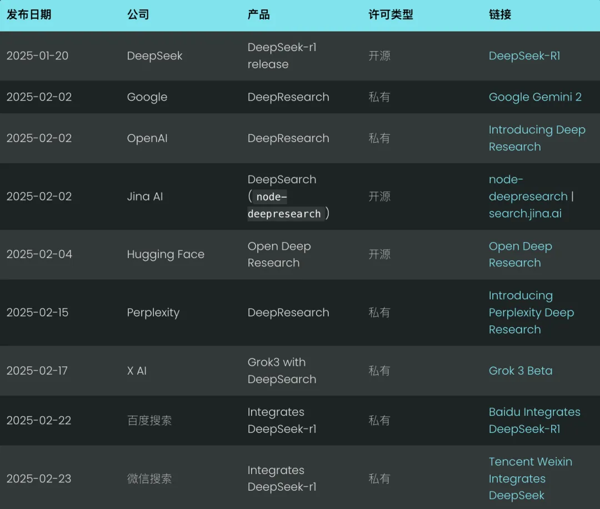
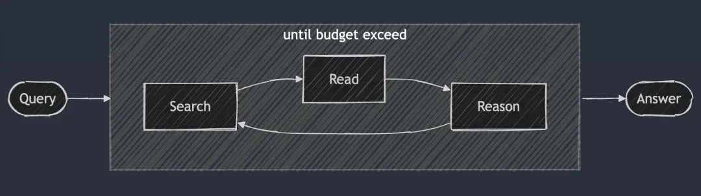
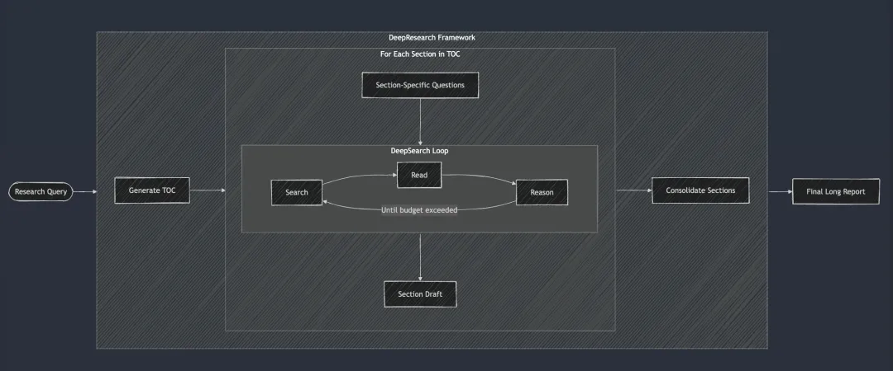
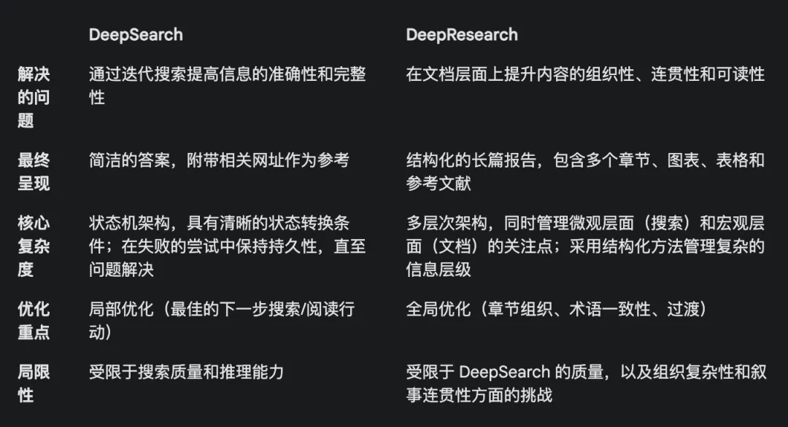
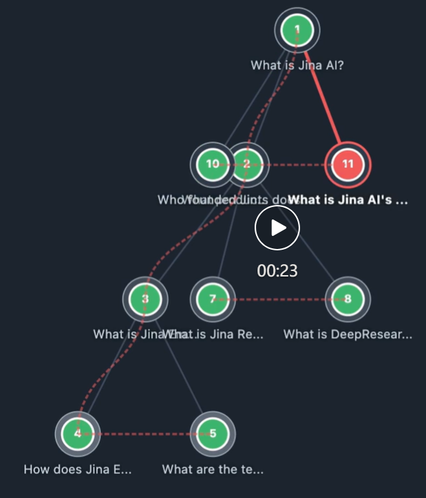

# DeepSearch 与 DeepResearch 的设计和实现

个人评价：

优点：
- jina反其道行之，更侧重利用多不不停的深度检索有用知识
- 整体流程相比其它DeepResearch更加精巧

缺点：
- 没有python的实现版
- 整个流程中的子步骤还是相当多，略为繁琐，而且中间又很多的判定和动作选择，模型不一定能准确的判断
- 适合离线问答任务，在线交互会比较慢

# 1. 资源

jina版本更倾向DeepSearch

开源链接 (javascript实现)：https://github.com/jina-ai/node-DeepResearch



# 2. 简介

**Deep Search**

DeepSearch 的核心理念是通过在搜索、阅读和推理三个环节中不断循环往复，直到找到最优答案。 搜索环节利用搜索引擎探索互联网，而阅读环节则专注于对特定网页进行详尽的分析（例如使用 Jina Reader）。推理环节则负责评估当前的状态，并决定是应该将原始问题拆解为更小的子问题，还是尝试其他的搜索策略。



DeepSearch - 持续搜索、阅读网页、推理，直到找到答案（或超出 token 预算）。

与 2024 年的 RAG 系统不同，RAG 一般只运行一次搜索-生成过程，DeepSearch 执行多次迭代，需要明确的停止条件。这些条件可以是基于 token 使用限制，或者失败尝试的次数。

在 search.jina.ai 尝试 DeepSearch，观察 <thinking>中的内容，看看你是否能发现循环发生的位置。

换个角度来看，DeepSearch 可以被视作一个配备了各类网络工具（比如搜索引擎和网页阅读器）的 LLM Agent。这个 Agent 通过分析当前的观察结果以及过往的操作记录，来决定下一步的行动方向：是直接给出答案，还是继续在网络上探索。这就构建了一种状态机架构，其中 LLM 负责控制状态间的转换。

在每一个决策点，你都有两种可选方案：你可以精心设计提示词，让标准的生成模型产生特定的操作指令；或者，也可以利用像 Deepseek-r1 这样专门的推理模型，来自然而然地推导出下一步应该采取的行动。然而，即使使用了 r1，你也需要定期中断它的生成过程，将工具的输出结果（比如搜索结果、网页内容）注入到上下文之中，并提示它继续完成推理过程。

归根结底，这些都只是实现细节而已。无论你是精心设计提示词，还是直接使用推理模型，它们都遵循 DeepSearch 的核心设计原则：搜索、阅读和推理的持续循环。

**Deep Research**

DeepResearch 是在 DeepSearch 的基础上，增加了一个结构化的框架，用于生成长篇的研究报告。它的工作流程一般从创建目录开始，然后系统性地将 DeepSearch 应用于报告的每一个所需部分：从引言到相关工作、再到方法论，直至最后的结论。报告的每个章节都是通过将特定的研究问题输入到 DeepSearch 中来生成的。最后将所有章节整合到一个提示词中，以提高报告整体叙述的连贯性。



**DeepSearch vs DeepResearch**

很多人容易把 DeepSearch 和 DeepResearch 混为一谈。但在我们看来，它们解决的是完全不同的问题。DeepSearch 是 DeepResearch 的构建模块，是后者赖以运转的核心引擎。

DeepResearch 的重心是撰写高质量、可读性强的长篇研究报告。这不仅仅是搜索信息，更是一项系统工程，需要整合有效的可视化元素（如图表、表格），采用合理的章节结构，确保子章节之间逻辑顺畅，全文术语一致，避免信息冗余，并运用流畅的过渡句衔接上下文。这些要素与底层的搜索功能并没有直接关联，因此我们更将 DeepSearch 作为公司发展重点。

总结 DeepSearch 和 DeepResearch 的区别，详见下表。值得一提的是，DeepSearch 和 DeepResearch 都离不开长上下文和推理模型，但原因略有不同。

DeepResearch 生成长报告需要长上下文，这很好理解。而 DeepSearch 虽然看起来是搜索工具，但为了规划后续操作，它也需要记住之前的搜索尝试和网页内容，所以长上下文同样不可或缺。



# 2. 原理

DeepResearch 的核心在于其循环推理机制。与大多数 RAG 系统试图一步到位地回答问题不同，我们采用了一种迭代循环的方式。它会持续搜索信息、阅读相关来源并进行推理，直到找到答案或耗尽 token 预算。以下是这个大型 while 循环的精简骨架：

```javascript
// 主推理循环
while (tokenUsage < tokenBudget && badAttempts <= maxBadAttempts) {
  // 追踪进度
  step++; totalStep++;

  // 从 gaps 队列中获取当前问题，如果没有则使用原始问题
  const currentQuestion = gaps.length > 0 ? gaps.shift() : question;

  // 根据当前上下文和允许的操作生成提示词
  system = getPrompt(diaryContext, allQuestions, allKeywords,
                    allowReflect, allowAnswer, allowRead, allowSearch, allowCoding,
                    badContext, allKnowledge, unvisitedURLs);

  // 让 LLM 决定下一步行动
  const result = await LLM.generateStructuredResponse(system, messages, schema);
  thisStep = result.object;

  // 执行所选的行动（回答、反思、搜索、访问、编码）
  if (thisStep.action === 'answer') {
    // 处理回答行动...
  } else if (thisStep.action === 'reflect') {
    // 处理反思行动...
  } // ... 其他行动依此类推
}
```

为了保证输出的稳定性和结构化，我们采取了一个关键措施：在每个步骤中，有选择地禁用某些操作。 

比如，当内存里没有 URL 时，我们会禁止 “visit” 操作；如果上次的回答被拒绝，我们会阻止 Agent 立即重复 “answer” 操作。这种约束机制能引导 Agent 沿着正确的方向前进，避免在原地打转。

## 2.1 **系统提示词**

在系统提示词的设计上，我们使用 XML 标签来定义各个部分，这样可以生成更健壮的系统提示词和生成内容。同时，我们发现直接在 JSON Schema 的 description 字段中加入字段约束，效果更好。诚然，像 DeepSeek-R1 这样的推理模型，理论上可以自动生成大部分提示词。但考虑到上下文长度的限制，以及我们对 Agent 行为的精细控制需求，这种显式地编写提示词的方式在实践中更可靠。

```javascript
function getPrompt(params...) {
  const sections = [];

  // 添加包含系统指令的 Header
  sections.push("你是一个高级 AI 研究助理，擅长多步骤推理...");

  // 添加已积累的知识片段（如果存在）
  if (knowledge?.length) {
    sections.push("<knowledge>[知识条目]</knowledge>");
  }

  // 添加之前行动的上下文信息
  if (context?.length) {
    sections.push("<context>[行动历史记录]</context>");
  }

  // 添加失败的尝试和学习到的策略
  if (badContext?.length) {
    sections.push("<bad-attempts>[失败的尝试]</bad-attempts>");
    sections.push("<learned-strategy>[改进策略]</learned-strategy>");
  }

  // 根据当前状态定义可用的行动选项
  sections.push("<actions>[可用行动定义]</actions>");

  // 添加响应格式指令
  sections.push("请以有效的 JSON 格式响应，并严格匹配 JSON schema。");

  return sections.join("\n\n");
}
```

## 2.2 **遍历知识空白问题**

在 DeepSearch 中，“知识空白问题”指的是在回答核心问题之前，Agent 需要先补足的知识缺口。Agent 不会直接尝试回答原始问题，而是会识别并解决那些能够构建必要知识基础的子问题。

这种处理方式非常优雅。

```javascript
// 在“反思行动”中识别出知识空白问题后
if (newGapQuestions.length > 0) {
  // 将新问题添加到队列的头部
  gaps.push(...newGapQuestions);

  // 始终将原始问题添加到队列的尾部
  gaps.push(originalQuestion);
}
```

它创建了一个带轮转机制的 FIFO（先进先出）队列，遵循以下规则：

1. 新的知识空白问题会被优先推到队列头部。
2. 原始问题始终位于队列尾部。
3. 系统在每个步骤都从队列头部提取问题进行处理。

这种设计的精妙之处在于，它为所有问题维护了一个共享的上下文。也就是说，当一个知识空白问题被解决后，获得的知识可以立即应用于所有后续问题，最终也会帮助我们解决最初的原始问题。

## 2.3 **IFO 队列 vs 递归**

除了 FIFO 队列，我们还可以采用递归的方式，这其实对应于深度优先搜索策略。对于每一个“知识空白”问题，递归都会创建一个全新的调用栈，拥有独立的上下文。系统必须彻底解决每一个知识空白问题（及其所有潜在的子问题）之后，才能返回到父问题。

举个例子，一个简单的 3 层深度知识空白问题递归，圆圈内的数字标注了解决问题的顺序。



在递归模式下，系统必须先完全解决 Q1（及其可能衍生的子问题），才能继续处理其他问题！这与队列方法形成鲜明对比，队列方法会在处理了 3 个知识空白问题之后，就会重新回到 Q1。

在实际应用中，我们发现递归方法很难控制预算。因为子问题可能会继续衍生新的子问题，没有明确的指导原则，很难确定应该为它们分配多少 Token 预算。跟复杂的预算控制和可能出现的延迟返回问题比起来，递归带来的清晰上下文隔离优势就显得有点微不足道了。相反，FIFO 队列的设计则很好地平衡了深度和广度，确保系统不断积累知识，逐步改进，并最终回到原始问题，而不是深陷于潜在的无限递归泥潭里。

## 2.4 查询重写

我们遇到的一个颇有意思的挑战，是如何有效地重写用户的搜索查询：

```javascript
// 在搜索行为处理器中
if (thisStep.action === 'search') {
  // 搜索请求去重
  const uniqueRequests = await dedupQueries(thisStep.searchRequests, existingQueries);

  // 将自然语言查询重写为更有效的搜索表达式
  const optimizedQueries = await rewriteQuery(uniqueRequests);

  // 确保不重复之前的搜索
  const newQueries = await dedupQueries(optimizedQueries, allKeywords);

  // 执行搜索并存储结果
  for (const query of newQueries) {
    const results = await searchEngine(query);
    if (results.length > 0) {
      storeResults(results);
      allKeywords.push(query);
    }
  }
}
```

我们发现，查询重写的重要性远超预期，甚至可以说是决定搜索结果质量的最关键因素之一。一个优秀的查询重写器，不仅能将用户的自然语言转化为更适合 BM25 算法处理的关键词形式，还能扩展查询，从而覆盖不同语言、语调和内容格式下的更多潜在答案。

在查询去重方面，我们最初尝试过基于 LLM 的方案，但发现难以精确控制相似度阈值，效果并不理想。最终，我们选择了 jina-embeddings-v3。它在语义文本相似度任务上的出色表现，让我们得以轻松实现跨语言去重，而且不必担心非英语查询被误判过滤。说来也巧，最终发挥关键作用的，居然是 Embedding 模型。一开始我们也没打算把它用于内存检索，但意外地发现它在去重任务上表现得非常高效。

## 2.5 爬取网页内容

网页抓取和内容处理也是至关重要的一环，我们在此使用了 Jina Reader API。除了完整的网页内容，我们还会收集搜索引擎返回的摘要片段，作为后续推理的辅助信息。这些片段可以看作是对网页内容的精简概括。

```javascript
// 访问行为处理器
async function handleVisitAction(URLs) {
  // 规范化并过滤已访问过的 URL
  const uniqueURLs = normalizeAndFilterURLs(URLs);

  // 并行处理每个 URL
  const results = await Promise.all(uniqueURLs.map(async url => {
    try {
      // 获取并提取内容
      const content = await readUrl(url);

      // 存储为知识
      addToKnowledge(`What is in ${url}?`, content, [url], 'url');

      return {url, success: true};
    } catch (error) {
      return {url, success: false};
    } finally {
      visitedURLs.push(url);
    }
  }));

  // 根据结果更新日志
  updateDiaryWithVisitResults(results);
}
```

为了方便追踪，我们对 URL 进行了规范化，并限制了每个步骤访问的 URL 数量，以控制代理的内存占用。

## 2.6 内存管理

多步推理的一个关键挑战是如何有效管理代理内存。我们设计的内存系统区分了什么算作"记忆"，什么算作"知识"。但无论如何，它们都是 LLM 提示词上下文的一部分，用不同的 XML 标签分隔：

```javascript
// 添加知识条目
function addToKnowledge(question, answer, references, type) {
  allKnowledge.push({
    question: question,
    answer: answer,
    references: references,
    type: type,  // 'qa', 'url', 'coding', 'side-info'
    updated: new Date().toISOString()
  });
}

// 记录步骤到日志
function addToDiary(step, action, question, result, evaluation) {
  diaryContext.push(`
第 ${step} 步，你对问题：“${question}” 采取了 **${action}** 行动。
[详情与结果]
[评估（如有）]
`);
}
```

考虑到 2025 年 LLM 的超长上下文趋势，我们选择放弃向量数据库，转而采用上下文记忆的方法。Agent 的记忆由上下文窗口内的三部分组成：获得的知识、访问过的网站以及失败尝试的日志。这种方法让 Agent 能够在推理过程中直接访问完整的历史记录和知识状态，无需额外的检索步骤。

## 2.7 答案评估
我们还发现，答案生成和评估放在不同的提示词中完成效果更好。在我们的实现中，当收到新问题时，我们首先确定评估标准，然后逐一进行评估。评估器会参考少量示例来进行一致性评估，这比自我评估更可靠。

```javascript
// 独立评估阶段
async function evaluateAnswer(question, answer, metrics, context) {
  // 根据问题类型确定评估标准
  const evaluationCriteria = await determineEvaluationCriteria(question);

  // 逐一评估每个标准
  const results = [];
  for (const criterion of evaluationCriteria) {
    const result = await evaluateSingleCriterion(criterion, question, answer, context);
    results.push(result);
  }

  // 判断答案是否通过整体评估
  return {
    pass: results.every(r => r.pass),
    think: results.map(r => r.reasoning).join('\n')
  };
}
```

## 2.8 预算控制
预算控制并非仅仅为了节省成本，而是要确保系统在预算耗尽前充分处理问题，避免过早返回答案。自 DeepSeek-R1 发布以来，我们对预算控制的思路已经从单纯的节省预算转向了鼓励更深入的思考，力求高质量的答案。

在我们的实现中，我们明确要求系统在尝试回答之前识别知识缺口。

```javascript
if (thisStep.action === 'reflect' && thisStep.questionsToAnswer) {
  // 强制深入推理，添加子问题
  gaps.push(...newGapQuestions);
  gaps.push(question);  // 别忘了原始问题
}
```

通过灵活启用和禁用某些操作，我们可以引导系统运用能够加深推理的工具。

```javascript
// 在回答失败后
allowAnswer = false;  // 强制代理进行搜索或反思
```

为了避免在无效路径上浪费 token，我们限制了失败尝试的次数。当接近预算上限时，我们会启动“野兽模式”，确保无论如何都给出一个答案，避免空手而归。

```javascript
// 启动野兽模式
if (!thisStep.isFinal && badAttempts >= maxBadAttempts) {
  console.log('Enter Beast mode!!!');

  // 配置提示，引导果断回答
  system = getPrompt(
    diaryContext, allQuestions, allKeywords,
    false, false, false, false, false,  // 禁用其他操作
    badContext, allKnowledge, unvisitedURLs,
    true  // 启用野兽模式
  );

  // 强制生成答案
  const result = await LLM.generateStructuredResponse(system, messages, answerOnlySchema);
  thisStep = result.object;
  thisStep.isFinal = true;
}
```

野兽模式的提示信息刻意写得比较夸张，明确告知 LLM：现在必须果断决策，基于现有信息给出答案！

```javascript
<action-answer>
🔥 启动最高战力！ 绝对优先！ 🔥

首要指令：
- 消除一切犹豫！ 给出回答，胜过沉默！
- 可采取局部策略 – 运用所有已知信息！
- 允许重复利用之前的失败尝试！
- 拿不定主意时：基于现有情报，果断出击！

绝不允许失败！ 务必达成目标！ ⚡️
</action-answer>
```

这确保了即使面对困难或模糊的问题，我们也能给出一个可用的答案，而不是一无所获。

# 3. 结论
DeepSearch 可以说是搜索技术在应对复杂查询方面的一次重要突破。它将整个流程拆解为独立的搜索、阅读和推理步骤，克服了传统单轮 RAG 或多跳问答系统诸多局限。

在开发过程中，我们也在不断反思：站在 2025 年的时间节点，面对 DeepSeek-R1 发布后整个搜索行业的剧变，未来的搜索技术底座应该是什么样的？现在涌现了哪些新的需求？哪些需求已经过时？哪些需求其实是伪需求？

回顾 DeepSearch 的整个实现过程，我们认真总结出了：哪些是意料之中、必不可少的要素，哪些是当初想当然、实际上并不需要的，以及哪些是完全没预料到、最终却变得至关重要的。

首先，一个能生成规范格式输出（比如 JSON Schema）的长上下文 LLM 是非常必要的。也许还需要一个推理模型，提升行动推理和查询扩展的能力。

查询扩展也绝对是刚需，无论是使用 SLM、LLM，还是专门的推理模型来实现，都是绕不开的环节。但做了这个项目后，我们发现 SLM 可能不太适合这个任务，因为查询拓展必须是天生支持多语言的，而且不能仅仅局限于简单的同义词替换或关键词提取。它得足够全面，具备涵盖多语言的 Token 基础（这样规模很容易达到 3 亿参数），还得足够智能，能够跳出思维定势。所以，单靠 SLM 进行查询扩展可能是行不通的。

网页搜索和网页阅读能力，毫无疑问是重中之重，幸好我们的 [Reader (r.jina.ai)] 表现非常出色，不仅功能强大，而且有良好的扩展性，这也激发我对如何改进我们的搜索端点（s.jina.ai）的诸多灵感，在下一次迭代中可以重点优化。

向量模型是有用的，但用到的地方完全出乎意料。 我们本来以为它会用于内存检索，或者配合向量数据库来压缩上下文，但事实证明都不需要。最终，我们发现将向量模型用于去重效果最好，本质上是一个 STS（语义文本相似度）任务。由于查询和知识缺口的数量通常在数百个范围内，不需要动用向量数据库，直接在内存中计算余弦相似度就完全足够了。

我们没有采用 Reranker 模型，但从理论上讲，它可以根据查询、URL 标题和摘要片段来辅助判断哪些 URL 应该优先访问。对于 Embeddings 和 Reranker 模型来说，多语言能力是基本要求，因为查询和问题都是多语言的。长上下文处理对 Embeddings 和 Reranker 模型有一定帮助，但并非决定性的因素。我们没有遇到任何由向量使用导致的问题，这可能得益于 jina-embeddings-v3 优秀的上下文长度，达到了 8192 token）。综合来看，jina-embeddings-v3 和 jina-reranker-v2-base-multilingual 仍然是我的首选，它们具备多语言支持、SOTA 性能，以及良好的长上下文处理能力。

Agent 框架最终被证明是不必要的。 在系统设计上，我们更倾向于贴近 LLM 的原生能力，避免引入不必要的抽象层。Vercel AI SDK 在适配不同 LLM 供应商方面提供了很大的便利，极大地减少了开发工作量，只需修改一行代码即可在 Gemini Studio、OpenAI 和 Google Vertex AI 之间切换。代理内存管理是有意义的，但为此引入专门的框架还值得商榷。我个人认为，过度依赖框架可能会在 LLM 和开发者之间筑起一道屏障，其提供的语法糖可能会成为开发者的负担。许多 LLM/RAG 框架已经验证了这一点。拥抱 LLM 的原生能力，避免被框架束缚，才是更明智的选择。

# 参考

[1] DeepSearch 与 DeepResearch 的设计和实现, https://mp.weixin.qq.com/s/-pPhHDi2nz8hp5R3Lm_mww