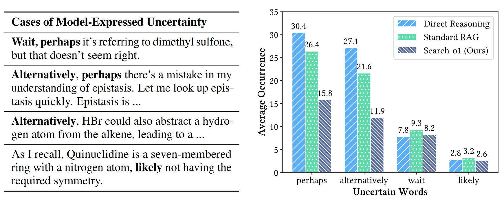
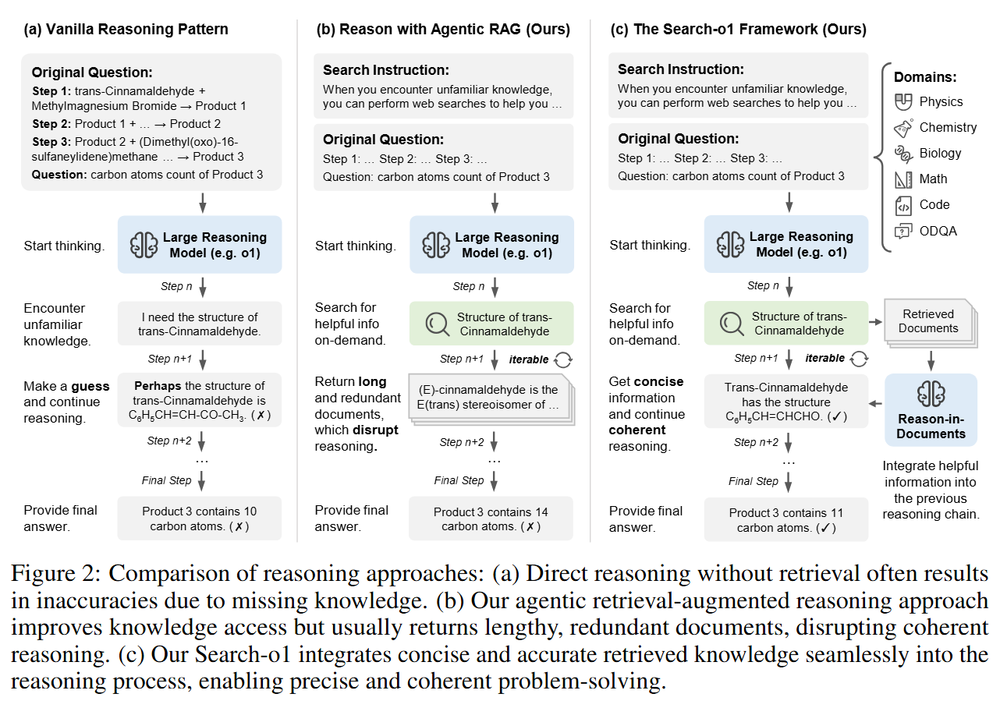
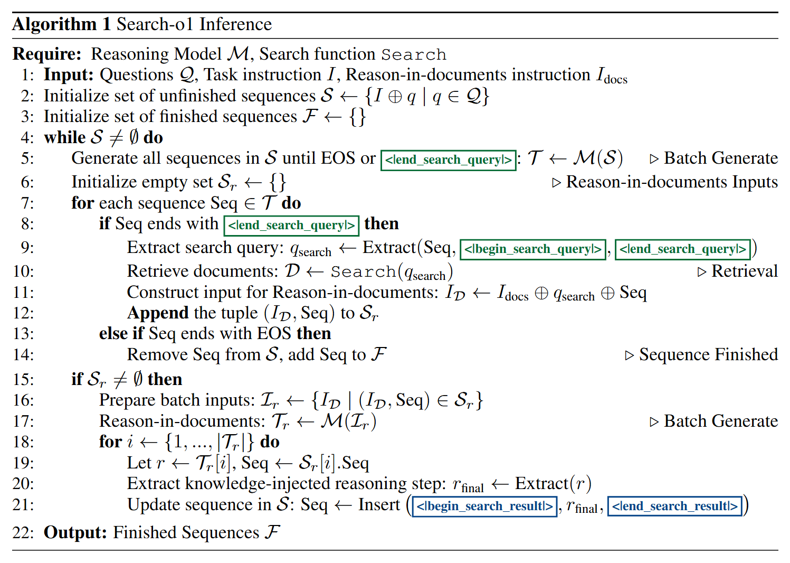
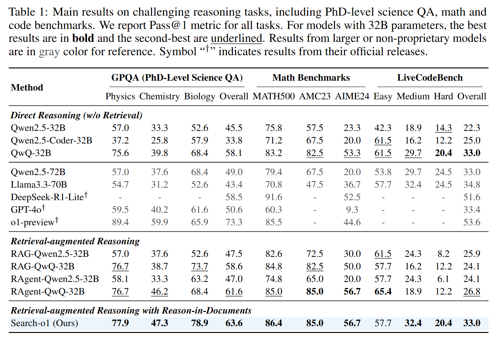
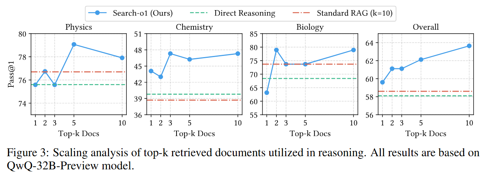
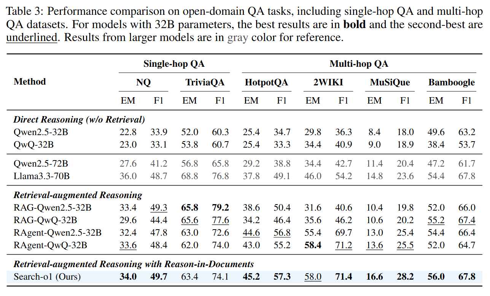
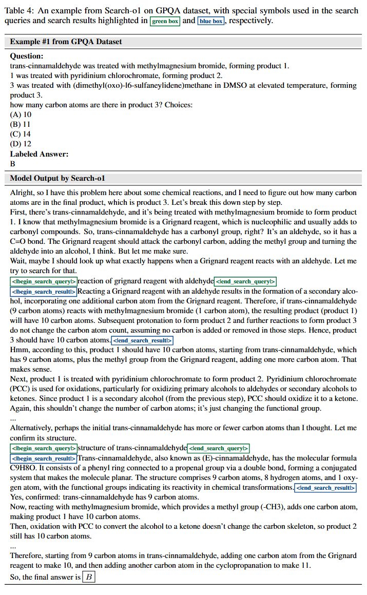
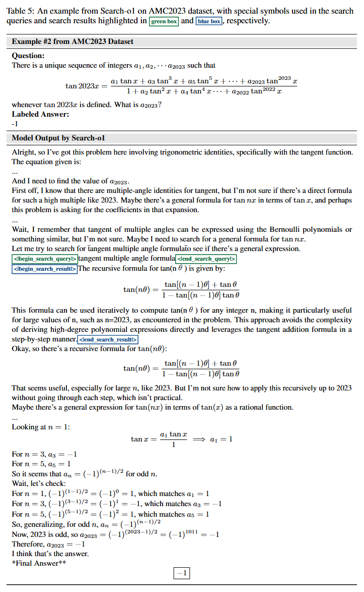
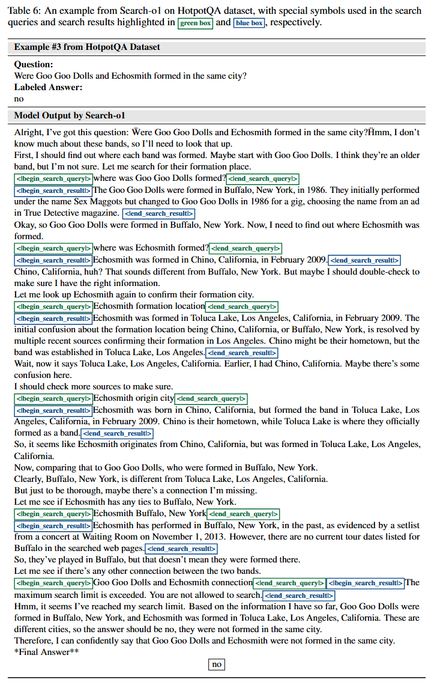

# 1. 资源

- Github (684 stars): https://github.com/sunnynexus/Search-o1
- 博客：https://search-o1.github.io/
- 论文：
  - https://arxiv.org/abs/2501.05366
  - Search-o1: Agentic Search-Enhanced Large Reasoning Models
  - 2025.1.9，清华&人民大学

# 2. 介绍

近年来，OpenAI-o1 和 Qwen-QwQ 等推理模型展示了令人印象深刻的逐步推理能力。然而，这些模型在长链推理过程中经常面临知识不足的挑战，导致推理过程存在不确定性和潜在错误。为了应对这一挑战，我们提出了一个新的框架——Search-o1——旨在通过自主知识检索来提高大型推理模型的可靠性和适用性。

Search-o1 集成了代理检索增强生成 （RAG） 机制和 Reason-in-Documents 模块，以在推理过程中动态获取和整合外部知识。这种方法允许推理模型在遇到不确定的知识点时自主检索相关信息，从而提高推理链的连贯性和准确性。对科学、数学和编码中复杂推理任务的广泛实验，以及六个开放域 QA 基准测试，证明了 Search-o1 的强大性能。该框架增强了大型推理模型在复杂推理任务中的可信度和适用性，为更可靠和通用的智能系统铺平了道路。

# 3. 问题

大型推理模型通过广泛的强化学习实现长步、渐进式推理，使其适用于科学、数学和编码等复杂领域。这种“慢思考”方法不仅增强了推理的逻辑连贯性和可解释性，而且还引入了一个重要问题：知识不足。在推理过程中，模型可能会遇到不确定的知识点，导致错误在整个推理链中传播，影响最终答案的质量。

初步实验表明，在处理复杂问题时，类似于 OpenAI-o1 的推理模型在每个推理过程中平均会遇到 30 多个不确定术语实例，例如“可能”和“可能”。这不仅增加了推理的复杂性，也使推理过程的手动验证更具挑战性。因此，在推理过程中自动补充必要知识对于增强大型推理模型的可信度至关重要。

使用 QwQ-32B-Preview 分析推理不确定性。左：在推理过程中识别的不确定单词的示例。

右图：GPQA 菱形集中每个输出的高频不确定词的平均出现次数。

为了克服上述挑战，我们提出了 Search-o1 框架。该框架集成了自主检索增强生成（Agentic Retrieval-Augmented Generation）机制和文档推理模块，以在推理过程中动态获取和集成外部知识。

# 4. 原理

Search-o1 框架通过将外部知识检索无缝集成到其推理过程中，同时保持思维链的连贯性，解决了大型推理模型 （LRM） 中的知识不足问题。如图所示，我们提出了三种方法的比较分析：vanilla reasoning、agentic retrieval-augmented generation （RAG） 和我们提出的 Search-o1 框架。

- 原版推理模式：考虑图 （a） 中的示例，其中任务涉及确定三步化学反应最终产物中的碳原子数。当遇到知识空白（例如，“反式肉桂醛的结构”）时，原版推理方法会步履蹒跚。如果无法获得准确的信息，模型必须依赖于假设，这可能会导致在后续推理步骤中出现级联错误。
- 代理 RAG：为了弥合推理过程中的知识差距，我们构建了代理 RAG 机制（图 （b）），使模型能够在需要时自主检索外部知识。当出现不确定性时（例如化合物的结构），该模型会生成有针对性的搜索查询（例如，“反式肉桂醛的结构”）。但是，直接插入检索到的文档（通常包含详细和切线信息）可能会破坏推理流程并损害连贯性。
- 搜索 o1：我们的 Search-o1 框架（图 （c））通过合并 Reason-in-Documents 模块扩展了代理 RAG 机制。该模块将检索到的文档压缩为重点推理步骤，这些步骤整合了外部知识，同时保持了推理链的逻辑流程。它考虑当前搜索查询、检索到的文档和现有的推理链，以生成连贯的步骤。此迭代过程将持续，直到得出最终答案。以下部分提供了代理 RAG、Reason-in-Documents 和 Search-o1 推理过程的详细说明。

推理方法的比较，包括 （a） 原版推理模式，（b） 我们与代理 RAG 的推理方法，以及（c） 我们的 Search-o1 框架，该框架使用代理 RAG 和文档推理模块增强大型推理模型。

对于每个问题，Search-o1 推理首先将任务说明与特定问题相结合。当推理模型生成推理链时，它可能会创建标有特殊符号的搜索查询。检测到搜索查询时，它会触发对相关外部文档的检索。然后，这些文档由 Reason-in-Documents 模块处理，该模块提取并提炼必要的信息。精炼后的知识被重新整合到推理链中，确保模型包含必要的外部信息，同时保持连贯和逻辑流程，最终导致全面的推理过程和最终答案。

为了有效地处理多个问题，Search-o1 框架使用批量推理机制来同时处理所有问题。它首先为每个问题初始化推理序列，然后为所有序列并行生成标记。当按任何顺序标识搜索查询时，框架将批量检索必要的文档。然后，Reason-in-Documents 模块将这些文档集中细化，并将相关信息插入回每个相应的推理链中。已完成的推理序列将移动到已完成的集合中，而正在进行的推理序列将继续处理。这种并行方法显著提高了系统的效率和同时管理多个输入的能力。

# 5. 实验

我们评估了 Search-o1 在具有挑战性的推理任务（包括 GPQA、数学和编码）和开放域 QA 任务（包括单跳和多跳 QA 任务）上的表现。结果展示了 Search-o1 的卓越性能，证实了搜索机制在推理过程中有效地满足了模型的知识要求。

具有挑战性的推理任务的主要结果，包括博士水平的科学 QA、数学和代码基准测试。

用于推理的 top-k 检索文档的缩放分析。所有结果均基于 QwQ-32B-Preview 模型。

# 6. 个案研究

GPQA 数据集上 Search-o1 的案例研究 #1，主干模型为 QwQ-32B-Preview。

AMC2023数据集上 Search-o1 的案例研究 #2，主干模型为 QwQ-32B-Preview。

HotpotQA 数据集上 Search-o1 的案例研究 #3，主干模型 QwQ-32B-Preview。

# 参考

[1] Search-o1：代理搜索增强的大型推理模型, https://search-o1.github.io/