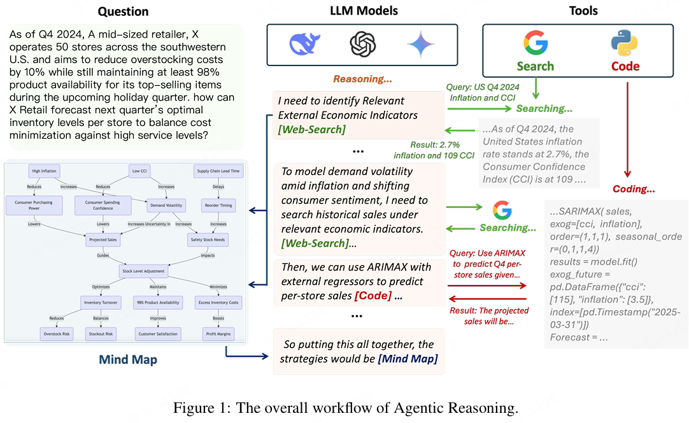
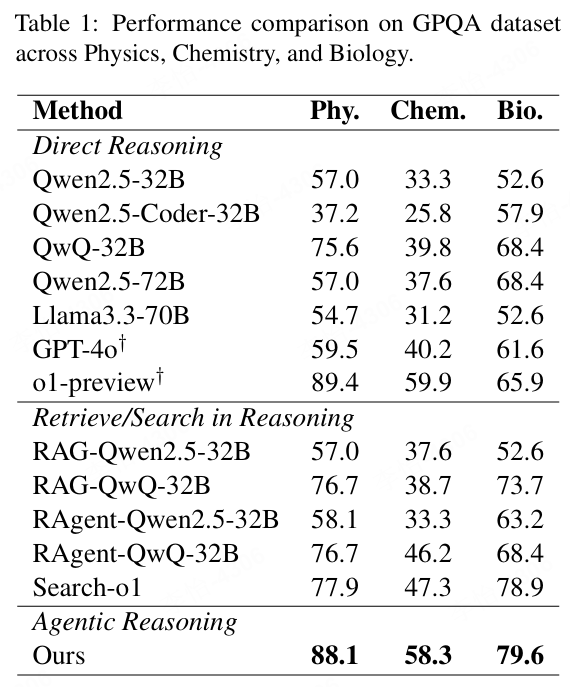
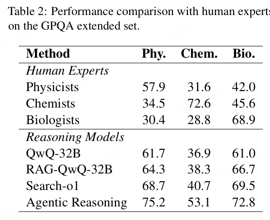
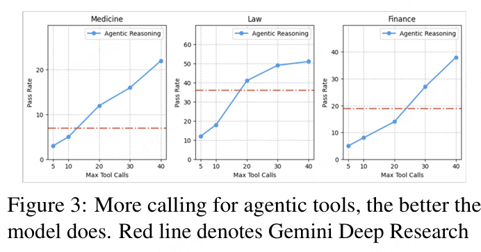
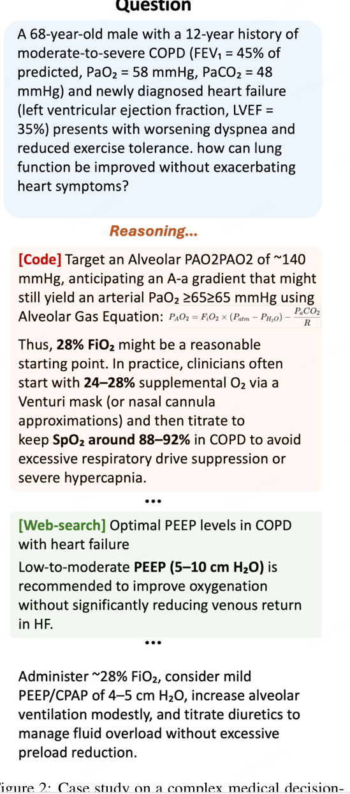

# 1. 资源

- Github (365 stars): https://github.com/theworldofagents/Agentic-Reasoning
- Paper:
  - Agentic Reasoning: Reasoning LLMs with Tools for the Deep Research
  - https://arxiv.org/abs/2502.04644
  - 2025.02.07, 牛津大学

该框架类openai deep researcher, 增加了代码和记忆能力

# 2. 原理

在推理过程中，它使用专门的标记来请求外部LLM代理的帮助。

- 这些token包括：
- 网络搜索标记
- 编码标记
- 思维导图调用标记

当检测到任何这些标记时，模型会暂停推理，并生成一个特定的查询以及推理上下文作为消息发送给适当的Agentic LLM

## 2.1 **每个LLM代理是如何工作的**

**网络搜索代理**

该Agent使用工具执行网络搜索并检索相关文档。

与直接使用原始网页不同，这些网页首先经过处理和过滤，然后提取最相关的内容并动态集成到推理链中。相当于在该agent内部，他自己也完成了非常多自主的工作。

**Coding代理**

根据LLM的消息推理，用户查询和思维导图中的推理上下文，该代理生成代码，使用编译器执行并以自然语言返回结果。

这样可以轻松将响应集成到推理链中。

**思维导图代理**

该代理将推理上下文结构化并存储为结构化知识图谱。

这种方法借鉴了一项先前的ArXiv研究，该研究首先使用社区聚类将推理上下文分成不同的组，并使用LLM为每个组生成摘要。

# 3. 实验

实验表明，与其他经过RL训练的开源/闭源推理LLM和RAG增强的LLM相比， Agentic Reasoning在GPQA数据集的Diamond集上表现是最好的。

该数据集包括物理、化学和生物学的博士级选择题，其Diamond集包括这些学科中最具挑战性的198个问题。 

Agentic Reasonging在这些来自三个学科的所有问题上都优于Gemini深度研究

# 4. 案例

# 参考

[1] 超越博士生水平的开源“Agentic Reasoning” 效果超越Google Deep Research(附项目代码) https://mp.weixin.qq.com/s/Yg5fOGtdSj_NBhULAGaPyg