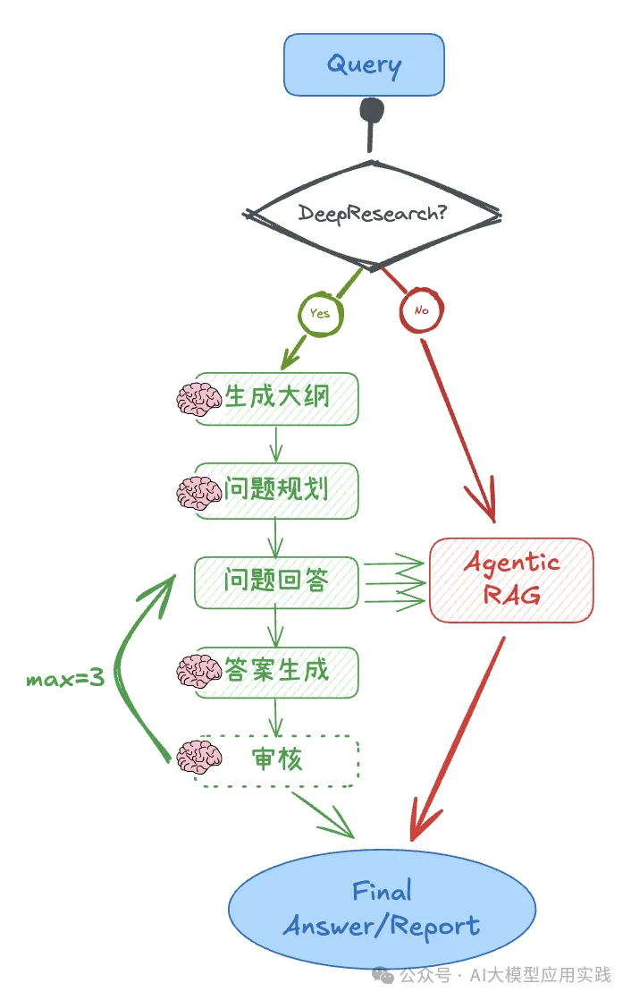
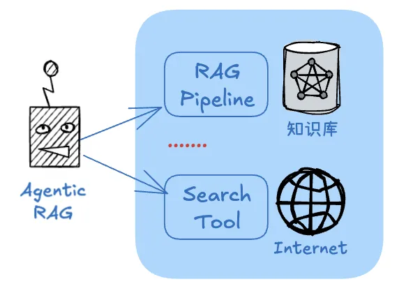
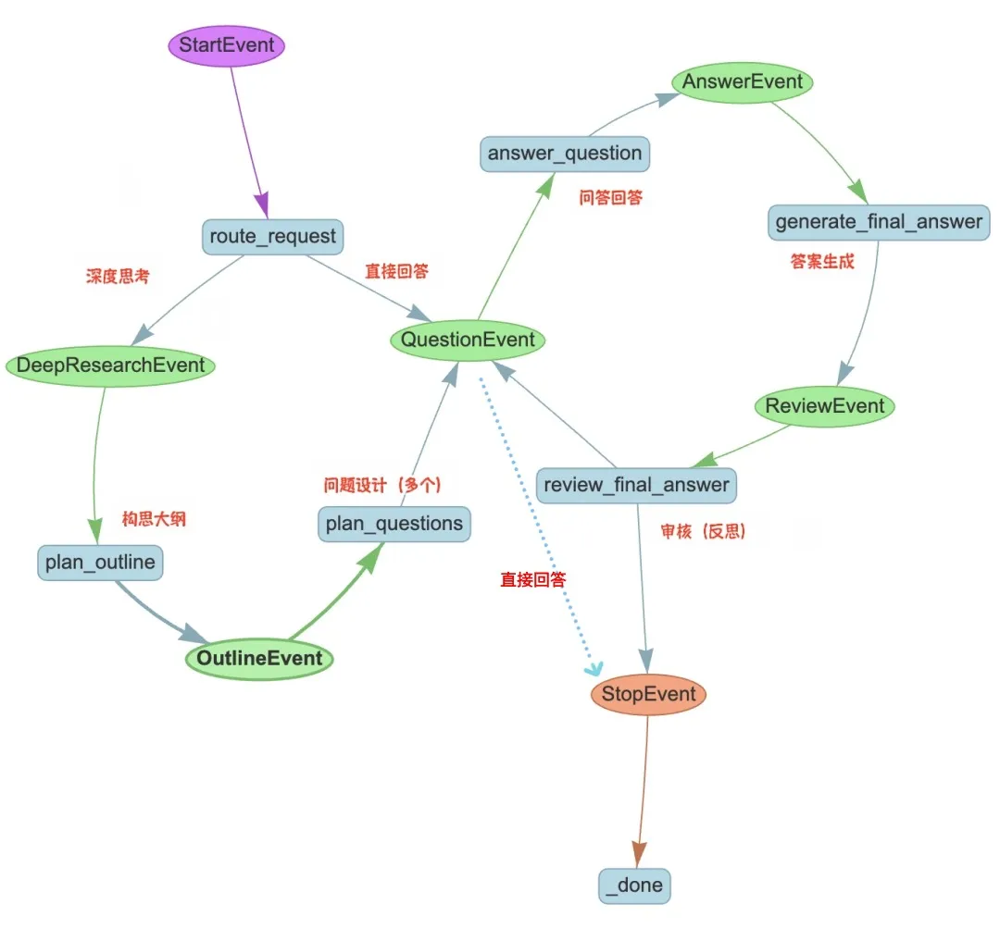

# 1. 方案介绍

- 借助DeepSeek思考与规划研究大纲、并提出针对性的问题
- 借助RAG引擎来回答这些提出的问题，答案作为参考知识
- 综合这些问题及答案，并根据规划的大纲生成最终研究结果



流程详细描述如下：

1. 为了让这个Agent既能够支持简单的事实性问答，也能切换做深入的研究，设计DeepResearch这样的开关，把选择权交给用户；
2. 如果无需深度思考，则直接调用Agentic RAG回答问题；
3. 如果需要深度思考，则进入如下流程：
   - 生成大纲：借助DeepSeek的深度思考能力，根据输入主题先构建一个研究大纲，确保输出的结构化与全面性
   - 问题规划：基于大纲生成一份必要的研究问题清单，以有效的检索到研究所需要的知识
   - 问题回答：获得这些问题的答案，这个步骤借助已构建好的Agentic RAG系统来获得，以确保获得参考信息的准确性。这一步可以并行开展
   - 起草答案：将搜集到的问题与答案，结合规划的提纲，交给LLM进行创作，生成研究结果的草稿
   - 内容审核：审查草稿的完整性、准确性与连贯性，并确定是否需要修改或增补，并输出新的问题来进一步搜集信息
   - 最终输出：在经过指定次数的迭代后，输出最终结果

可以看到，RAG系统在这成为了后端的一个“研究工具”。为了更具扩展性，我们借助Agentic RAG方法来实现，并增加了搜索引擎作为补充的知识来源：



这种Agentic RAG可以更灵活的跨越多个数据源（比如不同的知识库/文档）、跨越多种类型RAG管道（比如回答事实性问题与总结性问题）及互联网搜索工具等来回答问题，以提供研究需要的参考信息。

这样的工作流程优势在于：通过先推理大纲与假设性问题来提高信息获取的覆盖面与引用密度，同时又能借助RAG检索私有知识，提高准确性；同时还利用反思模式来提高最终的生成质量。当然缺点是流程较长，但对于这样的研究是可以接受的。

# 2. 实现：Agentic RAG应用

现在来实现这个具有“深度思考”能力的Agentic Workflow，我们采用的工具为：

- Agentic RAG系统使用LlamaIndex+Chroma向量库+gpt-4o-mini
- Workflow编排使用LlamaIndex Workflows
- deepseek-r1模型作为大纲生成、研究报告创作
- gpt-4o-mini用作问题规划、报告审核

首先来实现这里的Agentic RAG应用，对于无需“深度思考”的问题，这个应用就是直接回答问题的主体。构建基本过程如下：

- 创建一个/多个RAG查询管道（如有需要，可支持多模态）
- 将这些查询管道“工具化”
- 创建一个网络搜索工具
- 将RAG与搜索工具交给一个FunctionCalling的Agent使用即可

核心代码参考（可根据需要调整关键词）：

````python
......
#RAG查询引擎
query_engine = vector_index.as_query_engine(similarity_top_k=5,llm=llm_openai)
query_tool = QueryEngineTool.from_defaults(query_engine=query_engine,name=f'query_tool_{name}',
                                               description=f'用来查询DeepSeek-R1的技术细节')

...
#搜索工具
search_tool = FunctionTool.from_defaults(fn=web_search,name = 'search_tool',description='用来搜索网络以获取信息')

#RAG agent
rag_agent = FunctionCallingAgent.from_tools(
[query_tool,search_tool],
llm=llm_openai,
system_prompt="""
你是一个问题回答专家。你必须使用工具查询技术细节或搜索网络信息，并始终用中文回答问题。
* 尽量保留工具返回中的Markdown图片信息。* 如果一个工具无法回答问题，请尝试另一个工具。
不要基于先验知识或编造。""")
````

# 3. 实现：编排Workflow

我们基于LlamaIndex的Workflows来构建（当然你完全也可以使用LangGraph），根据上面的设计，这个workflow编排后的可视化如下：



这里的核心步骤（在LlamaIndex中称作step）包括：

- route_request: 根据是否需要深度思考做路由
- plan_outline: 思考与规划研究大纲，使用deepseek
- plan_questions: 根据研究的大纲设计问题，使用gpt-4o
- answer_question: 并行调用已经创建Agentic RAG获得问题答案
- general_final_answer: 根据大纲、问题/答案生成结果，deepseek
- review_final_answer: 检查审核，如果没有问题或达到最大迭代次数，则结束；否则生成新的问题，返回answer_question获取更多信息

整个过程的重点是精心设计每个step的提示词，剩下的工作以调用LLM与RAG为主，并不复杂。以其中的问题设计（plan_questions）这个step为例：

```python
# 根据大纲提出一些问题
    @step()
    async def plan_questions(
        self, ctx: Context, ev: OutlineEvent
    ) -> QuestionEvent:

        #事件中的大纲信息，并保存到上下文，后面步骤中要用
        outline = ev.outline
        await ctx.set("outline", outline)

        #上下文中获取原始问题
        query = await ctx.get("original_query")

        #Prompt提示
        prompt = f"""你需要根据输入的问题和回答大纲制定一系列问题，这些问题将帮助获得完成大纲所需的事实：
        * 你不能假设任何现有的知识
        * 问题需要涵盖大纲中的所有主要要点
        * 每一个问题必须自洽完整，不能依赖于上下文
        * 你的输出应该是一个问题列表，每个问题在新的一行
        * 问题最多不超过5个
        ----------------
        输入问题：{query}
        ----------------
        回答大纲：{outline}"""

        #生成问题（调用LLM）
        response = await llm_openai.acomplete(prompt)

        #取出<think>部分，如果你使用deepseek-r1才需要
        response = re.sub(r"<think>.*?</think>", "", str(response), flags=re.DOTALL)
        questions = response.split("\n")
        questions = [x for x in questions if x]

        #问题数量
        await ctx.set("num_questions", len(questions))

        #触发下一个step，并传递问题
        #这里会触发并行处理
        for question in questions:
           ctx.send_event(QuestionEvent(question=question))
```

再比如回答问题（answer_question)这一步：

```python
@step()
async def answer_question(
  self, ctx: Context, ev: QuestionEvent
) -> AnswerEvent:

  #取出问题
  question = ev.question

  #调用上面创建的agentic rag获得答案
  response = await rag_agent.aquery(question)

  #如果打开“深度思考”，则触发下一步；否则就结束！
  if (await ctx.get("deepresearch")):
      return AnswerEvent(question=question, answer=str(response))
  else:
      return StopEvent(result=str(response))
```

# 参考

[1] DeepSeek-R1 x Agentic RAG：构建带"深度思考"开关的知识研究助理｜深度长文, https://mp.weixin.qq.com/s/XG1q7BE6FAZTruQNbvefFg