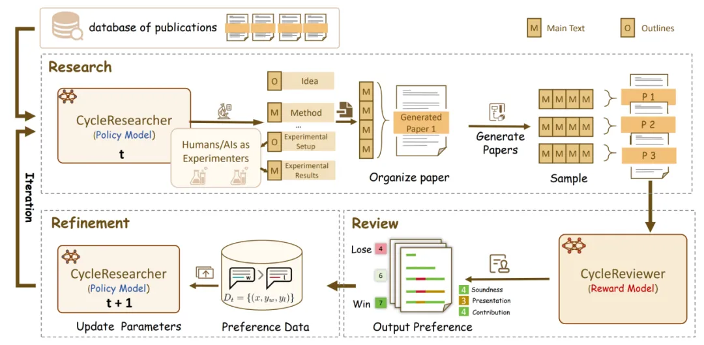

# 1. 资源

- 论文链接：https://openreview.net/forum?id=bjcsVLoHYs
- 网页链接：https://ai-researcher.net/
- 代码链接：https://github.com/zhu-minjun/Researcher

开源套件包含：

1. 不同规模模型：所有模型均支持本地部署

    - CycleResearcher：提供 12B、72B 和 123B 三种规模
    - CycleReviewer：提供 8B、70B 和 123B 三种规模
    - DeepReviewer：提供 7B 和 14B 两种规模 

2. 大规模训练数据集： 
   - Review-5K：包含 4,989 篇论文的专业评审数据
   - Research-14K：包含 14,911 篇高质量论文的结构化数据
   - DeepReview-13K：包含 13,378 篇论文的多维度深度评审数据

3. 详尽教程： 

   - CycleResearcher 教程：https://github.com/zhu-minjun/Researcher/blob/main/Tutorial/tutorial_1.ipynb
   - CycleReviewer 教程：https://github.com/zhu-minjun/Researcher/blob/main/Tutorial/tutorial_2.ipynb
   - DeepReviewer 教程：https://github.com/zhu-minjun/Researcher/blob/main/Tutorial/tutorial_3.ipynb
   - CycleResearcher 首次实现了通过强化学习进行科研过程的自动迭代改进，它能够模拟完整的科研流程，包括文献综述、研究构思、论文撰写，以及模拟实验结果。

# 2. 简介

研究团队主要干了三件事情：
- 数据集： 发布了两个大规模数据集 Review-5k 和 Research-14k，用于评估和训练学术论文评审和生成模型。
- CycleResearcher 模型： 可以生成质量接近人类撰写预印本的论文（评分 5.36 分），实现 31.07% 的接受率。
- CycleReviewer 模型： 一个做论文评审的模型，在平均绝对误差 (MAE) 方面显示出令人鼓舞的结果，与人类评审员相比，平均绝对误差（MAE）降低了 26.89%。

创新点详细解读：

1. 高质量数据集与模型规模化：为训练 CycleResearcher，研究团队专门构建了包含近 1.5 万篇高质量学术论文的数据集（Research-14K），数据来源覆盖了 ICLR、NeurIPS、ICML、ACL、EMNLP、CVPR 和 ICCV 等顶级会议。提供了多个不同规模的模型（12B、72B、123B），满足不同科研需求。
2. 强化学习与迭代反馈机制：如图二所示，CycleResearcher 的核心技术，在于其采用迭代式偏好优化（Iterative SimPO）的训练框架，这一方法使得在线强化学习（Online RLHF）成为了可能。这个框架包含两个关键模型：策略模型 (CycleResearcger) 和奖励模型 (DeepReveiwer)。
3. 指令微调（SFT）热身阶段：策略模型 CycleResearcher 负责生成论文的各个部分，它首先会进行广泛的文献综述，从输入的 bib 文件中获取所有参考文献及其摘要，全面了解研究背景。然后，它会交替生成论文的大纲和正文，确保逻辑流畅。具体来说，它会先生成动机和大纲中的主要思想，然后生成标题、摘要、引言和方法部分。接下来，概述实验设置和结果，随后生成实验设计和模拟结果（注意，这里的实验结果是模拟的）。最后，它会分析实验结果并形成结论。整个过程就像一位经验丰富的科研人员在撰写论文一样，有条不紊，逻辑清晰。奖励模型 CycleReviewer 则负责模拟同行评议，对生成的论文进行评估和反馈。它会从多个维度对论文进行打分，并给出具体的评审意见。
4. 迭代反馈训练阶段：研究人员首先通过拒绝采样获取样本，通过 CycleReviewer 的打分构成偏好对，两个模型相互配合，通过强化学习的方式不断优化，CycleResearcher 根据 CycleReviewer 的反馈不断改进自身的论文生成策略，CycleReviewer 则根据 CycleResearcher 生成的论文不断提高自身的评审能力。两个模型交互反馈，不断优化策略。在 Iterative SimPO 算法中，SimPO 算法虽然可以帮助 AI 区分 “好” 论文和 “坏” 论文，但它不能保证 AI 生成的文本是流畅的。因此，我们将 SimPO 损失和 NLL 损失结合起来，让 AI 模型既能写出高质量的论文，又能保证文本的流畅性。
5. 实验结果：CycleResearcher 生成论文的模拟评审平均得分达到 5.36 分，超过目前 AI Scientist 的 4.31 分，且十分接近人类真实预印本的平均水平（5.24 分）。同时，CycleResearcher 论文的接受率达到了 35.13%，远高于 AI Scientist 的 0%。

# 参考

[1] ICLR 2025 | 真正「Deep」的「Research」，通过强化学习实现可自主进化的科研智能体来了！https://mp.weixin.qq.com/s?__biz=MzA3MzI4MjgzMw==&mid=2650962482&idx=2&sn=b0d5b15e10d3ea34c276c946b2893f95&chksm=84e7be4cb390375ab6195e125d7b0f4f6b9edb5f3f66f26b12d2343bca69d4db8319af71c461&cur_album_id=3661496204539314177&scene=189#wechat_redirect