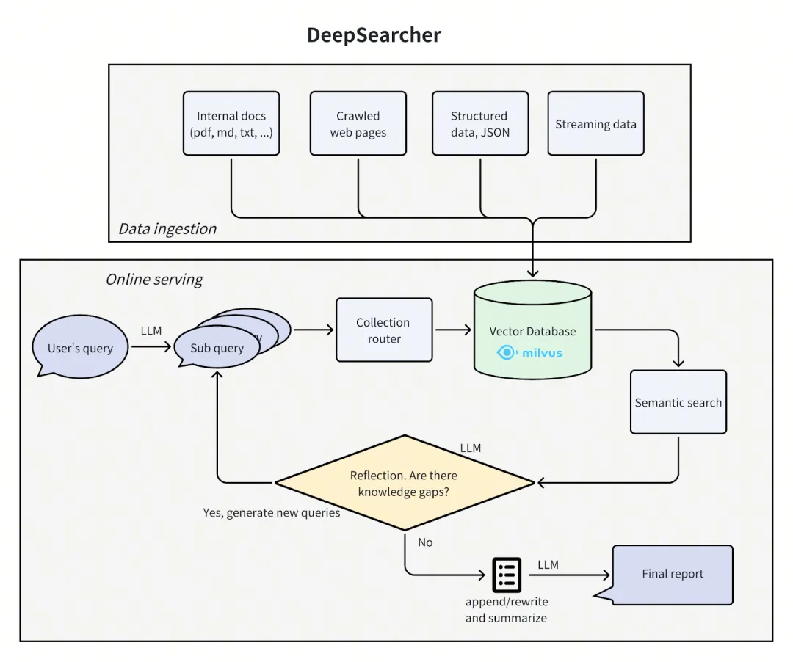

# 1. 资源

- github (): https://github.com/zilliztech/deep-searcher

# 2. 原理



第一步：定义并细化问题

在 DeepSearcher 的设计中，我们会采用渐进式问题细化策略。

用户最初提出的查询首先会被分解为多个子查询。以查询“How has The Simpsons changed over time?”(辛普森一家随着时间的推移发生了什么变化？)为例，它生成的初始子查询如下文所示：

```text
Break down the original query into new sub queries: [
  'How has the cultural impact and societal relevance of The Simpsons evolved from its debut to the present?',
  'What changes in character development, humor, and storytelling styles have occurred across different seasons of The Simpsons?', 
  'How has the animation style and production technology of The Simpsons changed over time?',
  'How have audience demographics, reception, and ratings of The Simpsons shifted throughout its run?']
```

第二步：研究与推理

在将查询分解为子查询之后，Agent 的研究推理就开始了。大致来说，这部分有四个步骤：路由决策、混合检索、反思和迭代优化。

（1）路由

我们的数据库包含来自不同来源的多个表格或集合。如果我们能够将语义搜索限制在与当前查询相关的那些来源上，效率将会更高。

我们可以让大语言模型（LLM）以 JSON 格式返回结构化输出，以便能轻松地将其输出内容转化为关于下一步行动的决策。

（2）混合检索

选定了各种数据源后，搜索步骤我们可以使用 Milvus 进行相似度搜索。与市面上常见的DeepResearch复现方案类似，源数据已经被预先进行了分块、向量化处理，并存储在向量数据库中。

对于 DeepSearcher 而言，有了本地和指定范围的在线检索数据源，大模型就不会做漫无目的的全网检索，更加高效便捷。

（3）反思

与市面上常见的Deep Research复现方案不同的是，DeepSearcher还引入了 动态反思形式，即将先前的输出作为上下文输入到一个提示中，通过多轮问答识别信息盲区：

（4）迭代优化
相比市面上常见的DeepResearch复现方案，DeepSearcher还采用智能循环控制策略，当反思模块检测到信息缺口时，会不断自动触发新一轮研究，直到大模型判定可以退出循环并生成报告。

以我们前面查询的"辛普森一家"为例，系统通过两轮迭代补充了配音团队变迁、流媒体适配策略等深度信息。

第三步阶段：结构化综合

最后一阶段，大模型会基于拆解后的子问题，以及对应的检索到的数据对其进行综合，生成一份完整的报告。以下是创建该提示的代码：

# 参考

[1] 开源|十天1500+star，深度解读DeepSearcher核心技术架构, https://mp.weixin.qq.com/s/SZ1FdWJolW3-cJnekEorUg