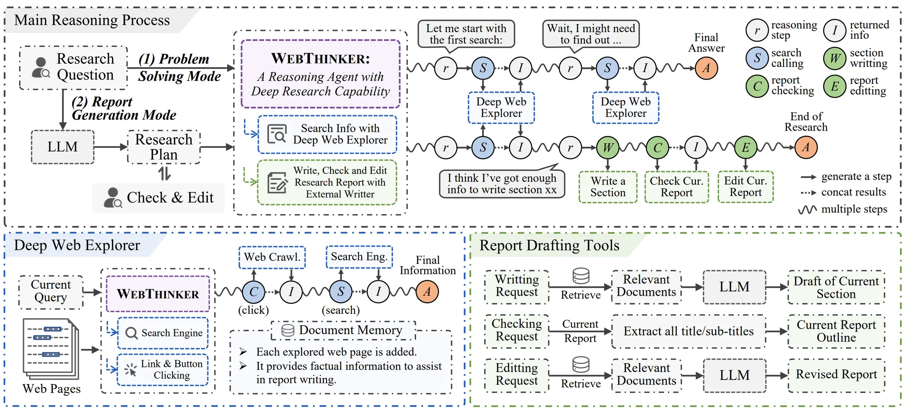
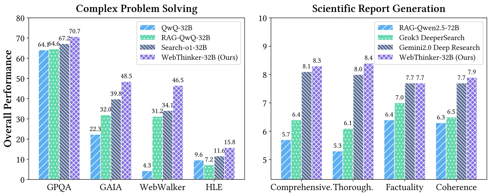

# 1. 资源

- Github (652 stars):  https://github.com/RUC-NLPIR/WebThinker
- 论文：WebThinker: Empowering Large Reasoning Models with Deep Research Capability
  - https://arxiv.org/abs/2504.21776
  - https://huggingface.co/papers/2504.21776

**亮点**
- 增加了自己思考执行任务的流程
- 提供自动规划、搜索和分章节生成报告的能力
- 使用crawl4ai及bing search
- 提供预处理后的测评数据

# 2. 原理

WebThinker 使推理模型能够自主进行 Web 搜索和网页导航，以在其推理过程中获取外部知识。这种方法显著减少了知识密集型领域研究人员收集信息的时间和成本。此外，WebThinker 允许 LRM 在思考和搜索时起草章节内容，生成直接解决用户研究问题的全面、定制报告。

主要特点：

我们引入了一个 Deep Web Explorer，它使 LRM 能够搜索、通过单击交互式元素（如链接或按钮）导航页面并提取相关信息。根据初始搜索结果，LRM 可以启动后续搜索并遍历更深的链接，直到收集到所有相关信息。
对于科学报告，我们的自主思考-搜索和草稿策略将实时知识搜索与报告创建相结合。我们为 LRM 配备了三个专用工具：（1） 为特定章节起草内容，（2） 检查当前报告，以及 （3） 编辑报告——确保报告保持全面、连贯并适应新的见解。
我们正在开发基于 RL 的训练策略，通过利用复杂任务的大规模推理轨迹来优化端到端任务性能。利用推理的准确性、工具使用和最终输出，我们构建了用于在线 DPO 训练的偏好对，使模型能够逐步提高其研究能力。

# 3. 性能

我们使用的基准测试分为两种类型：

- 复杂推理基准：
  - 博士级科学 QA：GPQA（198 道题）
  - 通用 AI 助手：GAIA（103 道题）
  - Web 探索：WebWalkerQA（680 个问题）
  - 极难推理题：人类的最后一次考试 （HLE） （500 题）
- 科学报告评估：
  - 一般开放式推理题：推理-v1-20m（30 道题）

