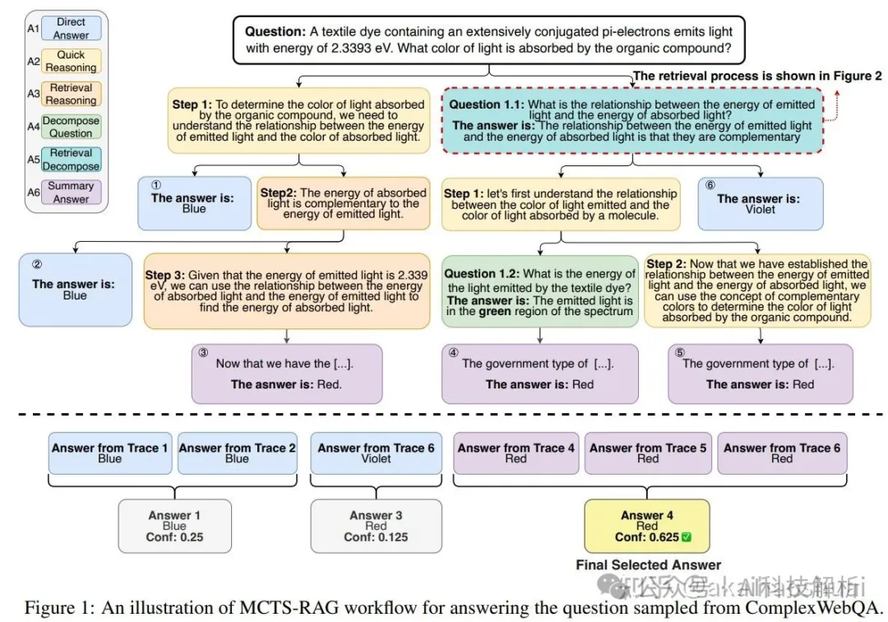

# 1. 资源

MCTS-RAG（MCTS多结果融合）

https://github.com/yale-nlp/MCTS-RAGMCTS-RAG: Enhancing Retrieval-Augmented Generation with Monte Carlo Tree Search

本文通过将MCTS的推理和搜索能力与自适应检索机制相结合，动态整合检索和推理，以提高小规模语言模型的推理能力和知识获取效率。

检索过程包括以下步骤：

查询生成（R1）：如果检测到知识缺口，模型生成搜索查询。

查询执行（R2）：使用外部检索工具获取最相关的信息。

知识反思（R3）：评估检索到的数据的相关性和一致性，以确定其是否包含在推理过程中。

总结回答（R4）：整合精炼的信息，使模型能够回答子问题或推进推理。

在MCTS探索结束时，通过投票机制和候选解决方案的一致性分析选择最佳答案。

结论：就是每一步都对当前结果尝试N种（N<6）推理方案，最终将所有路径的最终结果聚合，得到最终答案。实验发现，每次rollout的方案越多，尝试的次数越多，结果越准确。

# 参考

[1] LLM之RAG最新进展：边思考边搜索的迭代式生成, https://mp.weixin.qq.com/s/Lvq0vH2GpvVq_zsSCo7S9w