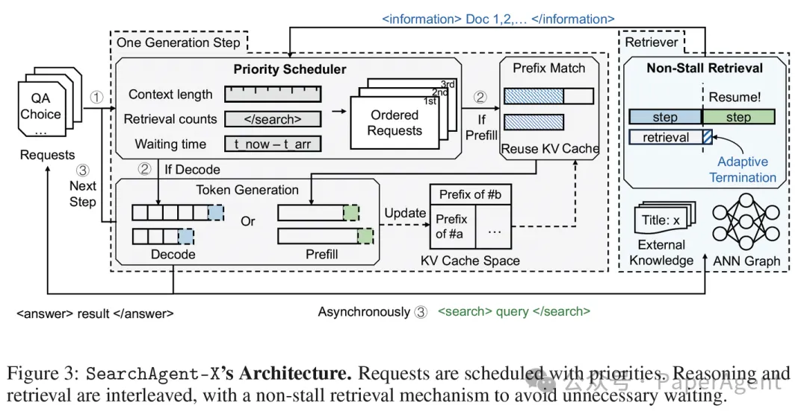

# 1. 资源

- 论文: https://arxiv.org/abs/2505.12065
- 开源: https://github.com/tiannuo-yang/SearchAgent-X

核心再优化kv cache及一些策略提速deep research

# 2. 原理

这项来自南开大学和伊利诺伊大学厄巴纳-香槟分校的研究，深入剖析了这些效率瓶颈，并提出了一套名为 SearchAgent-X 的高效推理框架。实践表明，SearchAgent-X 实现了 1.3至3.4倍 的吞吐量提升和 1.7至5倍 的延迟降低，同时不牺牲最终的答案质量。

基于上述洞察，SearchAgent-X 通过智能调度与自适应检索，最大限度减少延迟，最大化GPU资源利用率，尤其提升KV-cache的有效利用。

1. 利器一：优先级感知调度 (Priority-Aware Scheduling)
为解决不当调度问题，SearchAgent-X 构建了一种优先级感知的任务排序机制，避免高价值任务被意外打断。

• 调度依据：不再“先来后到”，而是综合考虑三个指标来决定谁更重要：
a. 已完成的检索次数：检索越多，越可能有高缓存复用价值；
b. 当前序列的上下文长度：同样指向更长的、可复用的缓存。
c. 请求的等待时间：确保公平，避免“饿死”老请求。

• 核心理念：这种策略旨在“让最有价值的计算优先”，优先服务那些能最大化GPU与缓存利用率的任务，以减少资源浪费。
2. 利器二：无停顿检索 (Non-Stall Retrieval)
为缓解检索停滞，SearchAgent-X 引入了“非阻塞检索”机制。

• 执行逻辑：检索模块会动态判断：
a. 检索结果的成熟度：当新找到的资料带来的质量提升甚微，即达到“收益递减点”时，认为结果已足够好。
b. LLM引擎的就绪状态：判断LLM是否已准备好进行下一轮计算。

• 核心理念：当检索结果足够成熟 且 LLM引擎就绪时，SearchAgent-X 便停止检索。
这种机制是“合适时机，果断放手”，从而让生成无需等待，实现检索-推理间的自适应同步，实现了异步检索与生成流程的自适应对齐。