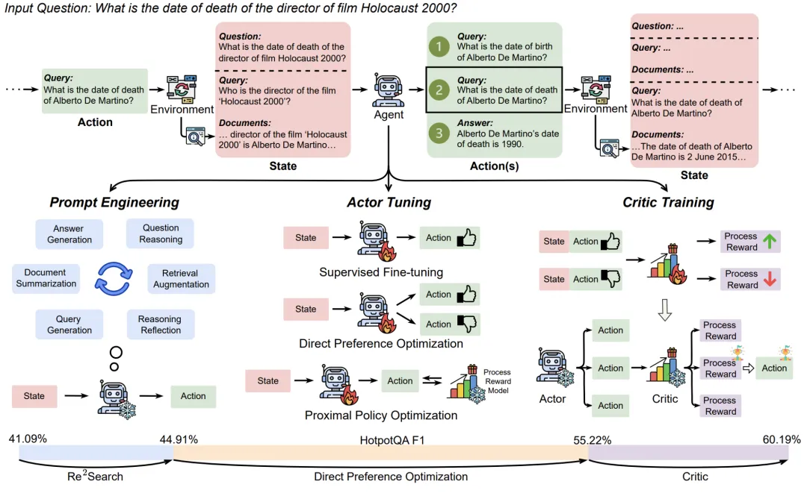
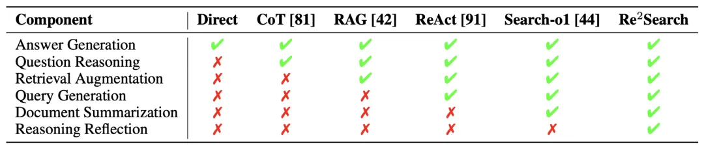
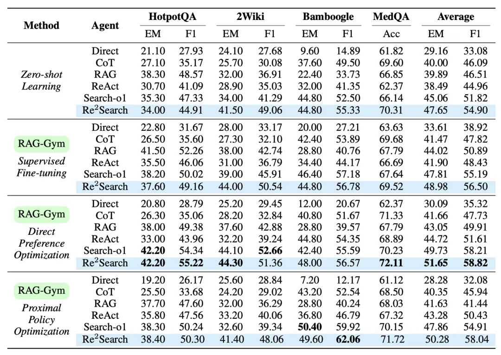
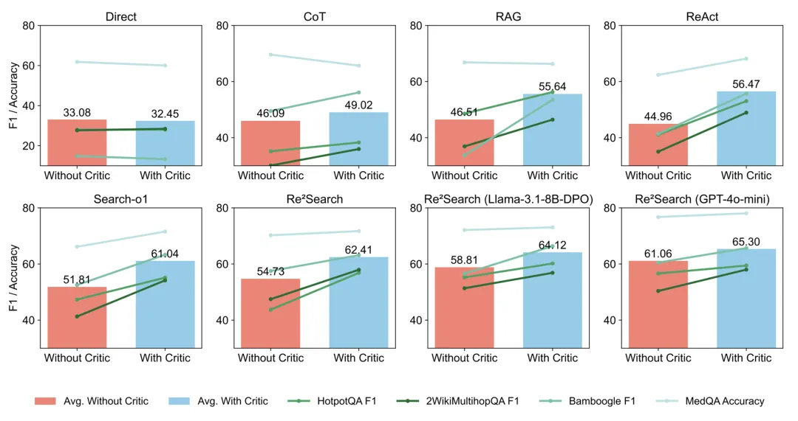
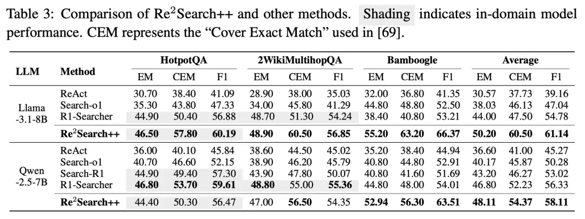

# 1. 资源

- 论文
  - RAG-Gym: Systematic Optimization of Language Agents for Retrieval-Augmented Generation
  - https://arxiv.org/abs/2502.13957
  - 2025.5.31， 
- Github(80 stars): https://github.com/RAG-Gym/RAG-Gym
- 博客：https://rag-gym.github.io/

# 2. 问题及背景

传统的检索增强生成（RAG）技术已在一定程度上提升了 LLM 的知识获取能力。更进一步，「智能体式 RAG」（agentic RAG）允许 LLM 与知识库进行多轮、适应性的信息检索和互动。然而，如何高效优化这些智能体仍是一个挑战。

现有的一些方法，例如以 Search-R1 为代表的工作，采用了基于结果监督（outcome supervision）的强化学习（RL）进行优化。这类方法主要根据最终答案的正确性来给予奖励，虽然直接，但也存在局限性。由于忽略了对中间步骤的精细化指导，模型可能「歪打正着」地得到正确答案，其间的搜索行为或推理过程却可能并非最优，这导致模型在遇到未曾见过的新问题或新领域时，泛化能力有限，表现可能大幅下滑。

那么，有没有一种更注重「过程」的优化范式呢？

针对这一痛点，来自弗吉尼亚大学、美国国立卫生研究院、伊利诺伊大学香槟分校等机构的研究者们推出了 RAG-Gym 平台。它倡导并实现了一种基于过程监督（process supervision）的系统性优化框架。RAG-Gym 的核心理念是：优质的最终答案源于高质量的中间决策。因此，它不仅关注结果，更强调对智能体在信息检索和推理过程中的每一步行动（如生成的搜索查询、对信息的筛选与整合）进行细致的评估和优化。

# 3. 原理

RAG-Gym 主要从以下三个维度对 RAG 智能体进行「强化训练」，实现精细化的过程优化。三个维度的优化同时作用后，Llama 8B 可以在 HotpotQA 数据集上获得接近 50% 的效果提升。

**维度一：提示工程革新 —— Re²Search 智能体**

有效的提示是引导 LLM 行为的关键。RAG-Gym 在总结现有智能体功能（如答案生成、问题推理、查询生成等）的基础上，创新性地提出了一种名为 Re²Search（Reasoning, Reflection, and Search）的新型智能体架构。

Re²Search 的核心亮点在于其独特的「推理反思」（Reasoning Reflection）机制。这意味着智能体在做出最终行动之前，会：（1）首先根据当前所有信息构建一个初步的推理和答案。（2）反思其推理链条，找出其中哪些论断是缺乏当前信息支持的、未经证实的声明。（3）基于这些「疑点」，生成高度针对性的搜索查询，以获取缺失的关键信息来完善答案。

这种设计使得搜索行为与答案构建过程更紧密地结合。研究者们对比了多种智能体架构的功能组件，Re²Search 是唯一集齐了包括「推理反思」在内的六大关键组件的智能体。

在多种模型和数据集上的测试表明，仅仅通过提示工程的改进，Re²Search 相较于标准提示方法，性能已有显著提升 。例如，在 HotpotQA 数据集上，零样本学习设定下的 ReAct F1 评分为 41.09%，而 Re²Search 则达到了 44.91%（具体效果可参照原文 Table 2 中的零样本学习部分）。

**维度二：「智能体」调优 —— LLM 决策能力的精进**

「智能体」（Actor）即 LLM 本身，其参数的优化对提升决策质量至关重要。RAG-Gym 支持通过细粒度的过程监督（fine-grained process supervision）来调优智能体，即不仅关注最终答案的正确性，更对中间的每一步决策（如生成的搜索查询或中间思考）进行评估和奖励 。

研究团队评估了三种主流的 LLM 后训练算法：监督微调（SFT）、直接偏好优化（DPO）和近端策略优化（PPO）。实验结果进一步证明，对于 ReAct、Search-o1 和 Re²Search 这类需要多步推理和与环境互动的智能体，由于其训练过程涉及到生成高质量的查询，DPO 和 PPO 通常优于 SFT，能在多数任务上带来更显著的性能提升。DPO 通过利用「偏好动作」与「非偏好动作」的对比数据进行学习，能更有效地指导模型生成高质量的中间步骤 。例如，Re²Search 经过 DPO 调优后，在 HotpotQA 上的 F1 分数从 44.91%（零样本）提升到了 55.22%。

**🧐 维度三：「评判器」训练 —— 引入外部决策辅助**

除了优化 LLM 本身，RAG-Gym 还引入了「评判器」（Critic）的训练和使用。这个 Critic 模型作为一个外部评估者，专门用于预测给定状态-动作对 (s,a) 的过程奖励，即评估智能体在某一步生成的动作（如搜索查询）的质量 。

Critic 在推理阶段的运作方式是：LLM 针对当前状态生成多个候选动作，Critic 对这些候选动作进行打分，系统选择得分最高的动作执行 。这种机制带来了两种显著好处：（1）普适性提升：实验表明，无论是基础的 LLM（如Llama-3.1-8B）还是经过 DPO 调优的 LLM，甚至是如 GPT-4o-mini 这样的其他模型，在引入同一个训练好的 Critic 后，其在多个数据集上的性能均有显著提升；（2）「即插即用」模块：训练好的 Critic 可以作为独立的增强模块，应用于那些不便进行直接微调的 LLM（例如闭源模型），为提升其 RAG 能力提供了一条有效途径 。

**🏆 集大成者：Re²Search++，性能与泛化性的新高度**

通过整合上述三大优化方向的最佳实践——即采用 Re²Search 智能体架构、通过 DPO 进行 LLM 调优，并在推理时辅以 Critic 进行动作选择——研究者们构建了优化后的  Re²Search++ 智能体。

在与当前一些依赖结果监督（outcome supervision）的强化学习方法（如 Search-R1, R1-Searcher，这些方法通常需要数千个训练问题）的比较中，Re²Search++ 展现了其优越性。它不仅在这些方法声称的训练领域内（如 HotpotQA）取得了可比甚至更好的成绩，更在未参与训练的「域外」数据集上实现了显著超越，平均 F1 得分相对提升了 3.2% 至 11.6%。这突显了 RAG-Gym 基于细粒度过程监督所带来的强大泛化能力，有效缓解了仅依赖结果奖励可能导致的过拟合问题。

**💡 RAG-Gym 的更多实践洞察**

除了上述核心优化手段，RAG-Gym 的研究还提供了其他有价值的实践启示：

1. 过程奖励的来源质量至关重要：研究比较了不同「过程奖励」的来源（详见原文 Table 4 ），发现使用如 GPT-4o 这样前沿的 LLM 进行标注，其提供的过程奖励质量最高，与人类专家偏好对齐度达到 85.85%，并且基于此训练的奖励模型在所有测试数据集上均表现最佳 。

2. 训练数据规模的影响：训练样本量对性能有何影响？原文 Figure 3 显示，通常智能体性能会随着训练样本量的增加而提升，但存在边际效益递减的现象，尤其是在样本量从 500 增加到 1000 时，某些数据集上的性能增益趋于平缓 。对于特定复杂领域（如 MedQA），少量数据（如 250 个样本）甚至可能导致性能略低于零样本基线，需要更多数据（如 1000 个样本）才能有效捕捉领域特性并实现超越 。

3. 推理时采样动作数量的影响：在推理时，让 Critic 从更多候选动作中进行选择，通常能带来性能提升（具体见原文 Figure 4）。例如，在 HotpotQA 和 Bamboogle 数据集上，F1 分数随着采样动作数量的增加而持续上升 。但这种提升同样存在收益饱和点，过多的采样可能不会带来显著的额外好处 。

# 参考

[1] 超越 Search-R1！RAG-Gym 全方位优化搜索智能体, https://mp.weixin.qq.com/s/nOL0sz6eHHMYRlZ97N7Ubw