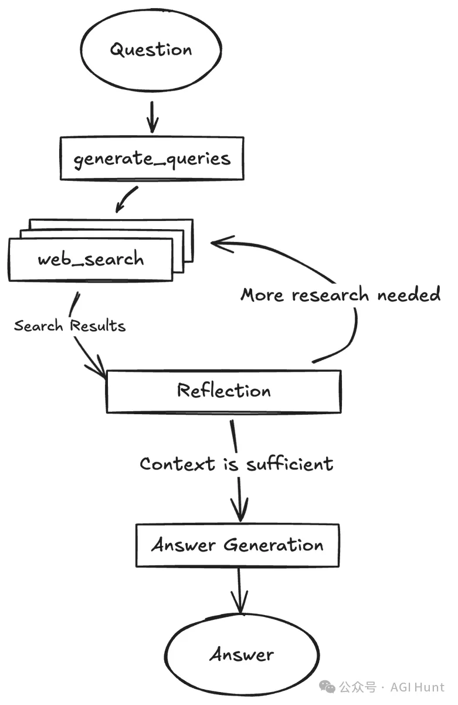

# 1. 资源

https://github.com/google-gemini/gemini-fullstack-langgraph-quickstart

核心特性：

🔄 智能体通过研究和反思迭代循环，直到收集到足够的信息 

🔍 动态查询生成、通过Gemini原生Google搜索工具进行网络研究，以及反思推理 

🧠 支持不同的搜索强度（低、中、高），可调节搜索的广度和深度 

🛠️ React前端、LangGraph后端、Tailwind CSS + Shadcn UI组件 

🐳 可轻松在本地运行或通过Docker部署 

📄 答案包含来自收集的网络资源的引用

生成初始查询：基于用户输入，使用Gemini模型生成一组初始搜索查询。

网络研究：对每个查询，使用带有Google搜索API的Gemini模型查找相关网页。

反思与知识缺口分析：智能体分析搜索结果，判断信息是否充足或是否存在知识缺口。这个反思过程也使用Gemini模型。

迭代优化：如果发现缺口或信息不足，它会生成后续查询并重复网络研究和反思步骤（最多可配置的循环次数）。

完成答案：一旦研究被认为充分，智能体使用Gemini模型将收集的信息综合成连贯的答案，包括来自网络资源的引用。
