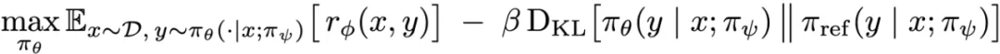
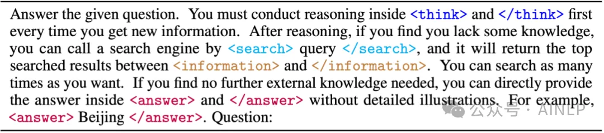
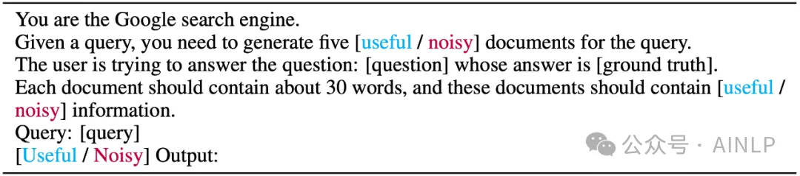
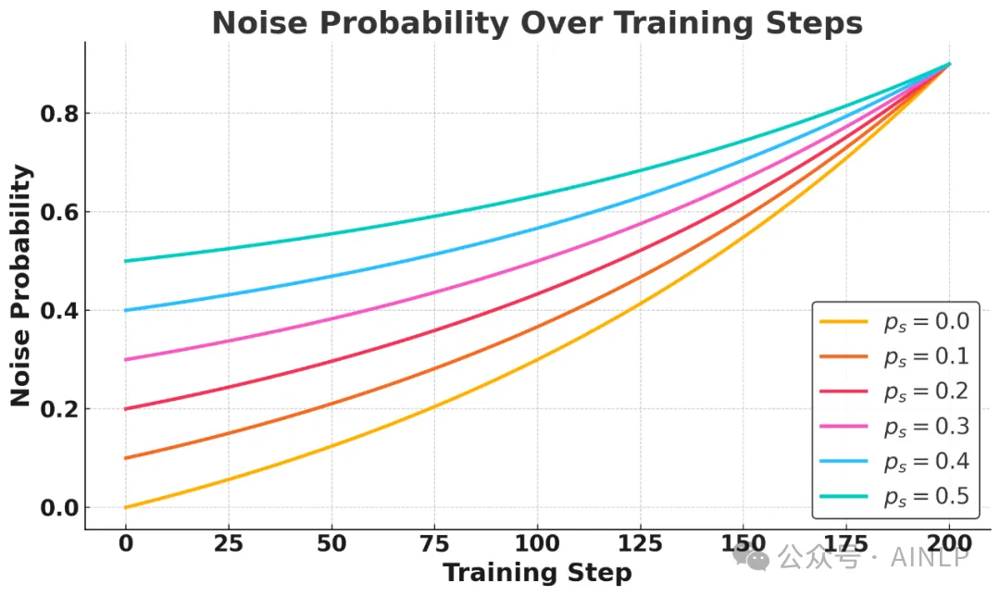
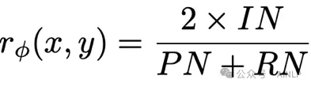
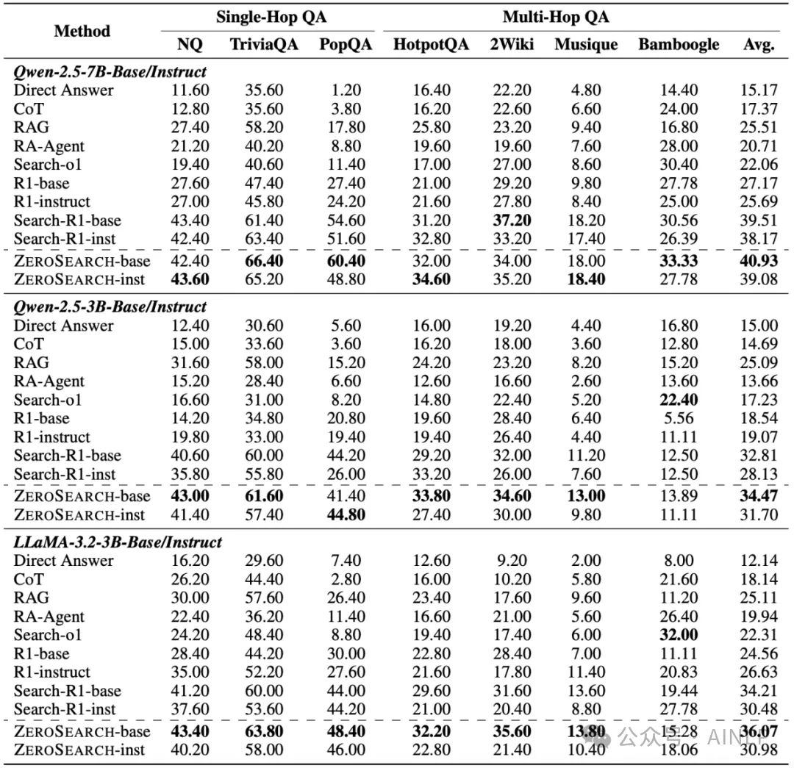
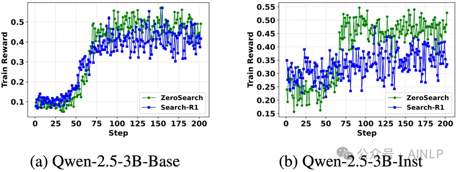
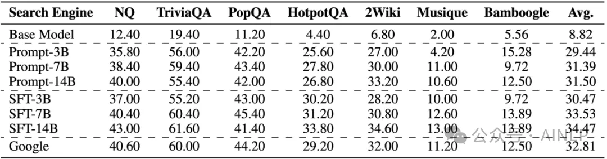
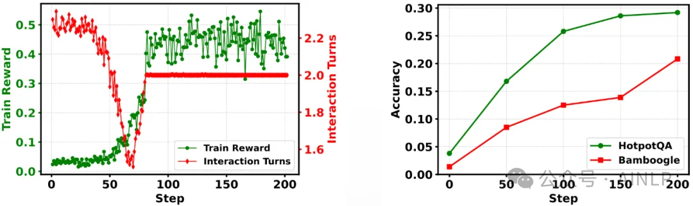
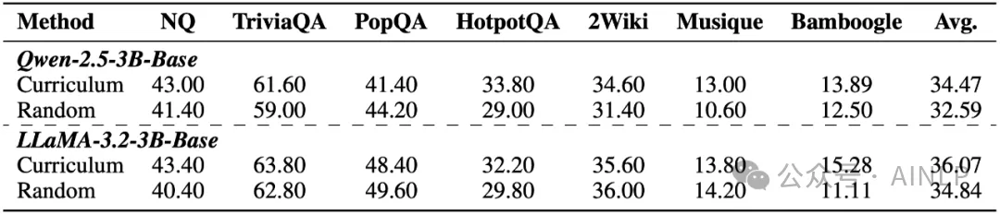

# 1. 资源

论文标题：ZeroSearch: Incentivize the Search Capability of LLMs without Searching

论文地址：https://arxiv.org/pdf/2505.04588

代码地址：https://github.com/Alibaba-NLP/ZeroSearch

项目主页：https://alibaba-nlp.github.io/ZeroSearch

Huggingface 主页：https://huggingface.co/collections/sunhaonlp/zerosearch-v2-6827f4ee6b6265069d443d4e

# 2. 问题

信息检索能力对提升大语言模型 (LLMs) 的推理表现至关重要，近期研究尝试引入强化学习 (RL) 框架激活 LLMs 主动搜集信息的能力，但现有方法在训练过程中面临两大核心挑战：

文档质量不可控：真实搜索引擎返回内容不可控，训练过程易受噪声干扰。

搜索 API 成本高昂：Rollout 阶段频繁调用搜索 API，训练成本极高。

为了解决这些问题，我们提出了 ZeroSearch 框架 —— 无需真实搜索，直接用大语言模型模拟搜索引擎，并引入课程学习策略，在显著降低 88% 成本的同时，在多项任务上性能超过依赖真实搜索引擎的方法。

# 3. 原理

无需搜索的强化学习框架

传统训练方法需要在 Rollout 阶段频繁与真实搜索引擎交互，产生大量 API 开销，而大语言模型在预训练阶段积累了丰富的世界知识，具备根据 query 返回相关信息的能力，因此 ZeroSearch 创新性地引入大语言模型作为模拟搜索引擎（Simulation LLM），无需真实搜索，即可为策略模型生成检索文档，大幅降低了训练成本：

为了避免策略模型记住由 Simulation LLM 生成的文档，我们对文档进行了损失屏蔽（Loss Masking），仅对策略模型自己生成的 token 进行损失计算。

结构化训练模板

ZeroSearch 无需初始监督微调（SFT），直接对预训练语言模型进行强化学习训练，通过采用结构化的训练模板，引导模型在每一轮交互中划分思维步骤：

<think > 对已有信息分析，明确下一步行动 </think>

<search > 提炼搜索 query </search>

<answer > 总结推理过程，形成最终答案 </answer>

这种结构化模板提升了模型推理路径的清晰度和可解释性，格式化的输出便于提取最终答案进行奖励计算。

搜索模拟微调

直接通过 Prompt 指导 LLM 生成的模拟检索内容，往往与真实搜索引擎返回的检索内容风格差异较大，且质量不稳定。为了解决这些问题，我们采用了模拟微调策略，具体包含以下三步：

轨迹采集：从策略模型与真实搜索引擎的交互中采集 Query-Document 对

质量评估：利用 Qwen-Max 作为评审，对文档进行有用性判别

监督微调：构建高质量训练集，进行轻量级微调 (2 万条数据，7B 模型训练时间仅需 30 分钟)

此外我们还在 Prompt 内引入原始问题的正确答案，从而扩充 Simulation LLM 的知识边界。

基于课程学习的文档生成策略

经过微调的 Simulation LLM 可通过调整在 Prompt 中添加 Useful/Noisy 指令，灵活控制生成文档的质量。基于这一能力，我们进一步引入了课程学习策略，通过逐步降低文档质量，循序渐进地提升训练难度，从而更有效地激发模型的推理能力。

为实现训练难度的平滑过渡，我们设计了一个指数函数来控制 Noisy 文档的生成概率：

训练初期：训练难度上升缓慢，模型能够稳步学习基本的输出格式以及任务逻辑。

训练后期，训练难度快速上升，从而促使模型不断强化其推理能力与鲁棒性。

该由易到难的训练过程能够持续激发策略模型的推理能力，有效提升强化学习训练的稳定性与最终表现。

奖励函数设计

在实验中，我们发现使用 Exact Match 作为奖励会诱导模型生成冗长内容以 “碰中” 答案，出现 Reward Hacking 问题，我们改用 F1 Score 作为奖励指标，更加关注输出的准确性与简洁性，有效抑制了冗余答案的产生。此外，我们发现模型在训练中即便不显式监督输出格式，也能生成结构规范的回答，因此没有引入格式奖励。

# 4. 实验结果

ZeroSearch 超越所有基线方法，该性能优势在域内以及域外数据集上均得以体现，展示了我们方法的鲁棒性。

ZeroSearch 的表现优于依赖真实搜索引擎的方法 Search-R1，凸显其在大规模强化学习中替代真实搜索引擎的潜力。

ZeroSearch 展现了强大的泛化能力，随着模型参数量增加，其性能进一步提升，体现了良好的扩展性。

与真实搜索引擎对比

ZeroSearch 与真实搜索的奖励趋势相似，随着训练的推进，ZeroSearch 和 Search-R1 的奖励分数都稳步上升。

ZeroSearch 的奖励提升更加显著，虽然在训练初期 ZeroSearch 的奖励值低于 Search-R1，但它最终实现了超越，并且波动更小。

ZeroSearch 在基础模型和指令微调模型中都展现了良好的泛化能力，在这两类模型下，ZeroSearch 的奖励表现都持续提升。

模拟搜索设定对比

相对于 Base Model，不同类型的 Simulation LLM 均可有效激发策略模型的搜索能力。

基于 Prompt 的方法效果较差，主要由于其生成的文档风格与真实搜索引擎差异较大，且质量不稳定，难以支撑稳定训练。

经过微调的 Simulation LLM，即便仅有 3B 参数量，也能显著提升策略模型性能；随着模型规模扩大，性能进一步提升：SFT-7B 可达到与 Google 相当的效果，SFT-14B 甚至实现超越 Google 的性能。

交互轮数研究

训练初期：交互轮数迅速下降，奖励缓慢上升

此阶段模型尚未掌握搜索调用机制，经常产生冗余交互，检索效果不佳。

训练中期：交互轮数迅速回升，奖励同步显著提升

模型逐渐学会如何高效调用搜索引擎，能够获取准确信息，回答质量显著提高。

训练后期：交互轮数和奖励趋于稳定

模型已适应数据集的跳数分布，交互策略逐步固化，在课程学习设定下，模型需提升推理能力以应对更低质量文档，从而维持较高奖励水平。

课程学习策略研究

实验结果表明，Curriculum（由易到难）训练策略显著优于 Random（随机难度）训练策略，验证了该训练范式在激发模型推理能力方面的有效性。

与 Random 类似，真实搜索引擎在训练过程中难以控制文档难度，导致模型缺乏系统性的能力提升路径，从而限制了推理能力的持续进化。

# 5. 总结

本文提出了 ZeroSearch，一种无需真实搜索引擎即可激活大语言模型搜索能力的强化学习框架，我们使用轻量级的监督微调将 LLM 转变为一个检索模块，在 RL 训练阶段，我们基于课程学习逐步降低检索模型生成文档的质量，通过不断提升检索难度，逐步激发策略模型推理能力。

大量实验表明，ZeroSearch 使用 3B 参数规模的模型作为检索模块时即可激发语言模型检索能力，7B 模型的检索性能已接近真实搜索引擎，而 14B 模型甚至实现了超越。此外，ZeroSearch 对基础模型和指令微调模型均具有良好的泛化能力，并可兼容多种 RL 算法，具备极强的适应性与可扩展性。

# 参考

[1] 成本暴降88%！通义实验室、北大发布ZeroSearch，无需搜索即可激活LLM检索能力, https://mp.weixin.qq.com/s/_Xd5idtHq_z1a50CirARvQ