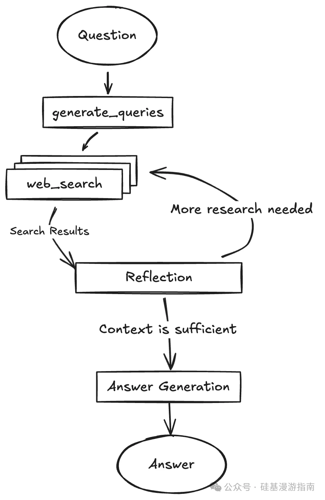

项目地址：https://github.com/google-gemini/gemini-fullstack-langgraph-quickstart

Google Gemini 团队开源的 gemini-fullstack-langgraph-quickstart 项目，展示了使用 LangGraph 和 Google 的 Gemini 模型构建研究增强型对话式 AI 的示例。示例项目构建了一个能够自主进行深度研究、反思并提供带引用答案的 AI 智能体。这个项目提供了一个完整的全栈应用示例，让开发者能够快速上手，将创新想法变为现实。

项目构建了一个 AI Agent，其核心能力包括：

• 智能查询生成：AI 智能体能根据用户问题，自动生成精准的搜索查询。
• 深度网络研究：通过集成 Google Search API，智能体可以进行实时的网络搜索，获取所需信息。
• 反思与迭代：智能体具备“反思”能力，能判断信息是否充足，并根据需要进行多轮迭代研究，直到找到满意的答案。
• 带引用答案生成：最终，智能体能综合所有信息，生成带有清晰引用来源的答案，确保信息的可信度。

# 参考

[1] Gemini 开源了全栈 LangGraph 快速启动项目：开发者的新利器, https://mp.weixin.qq.com/s/wLYIr1AQyI7sUsr5ipdWOA