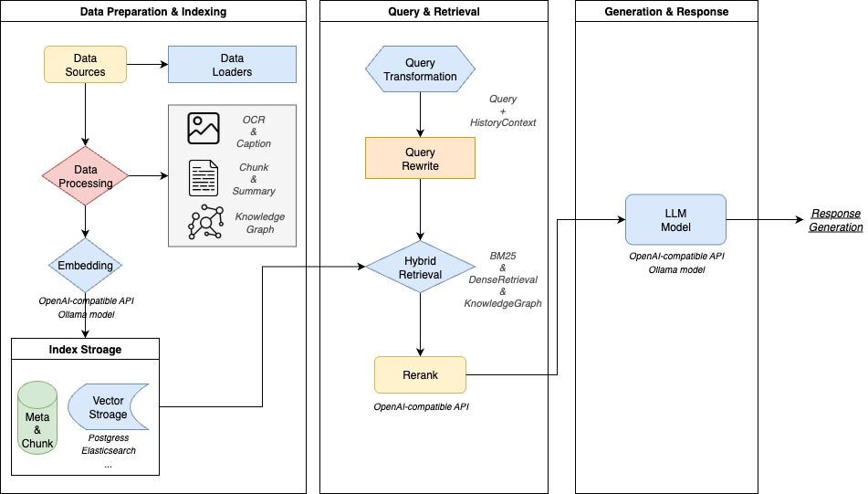
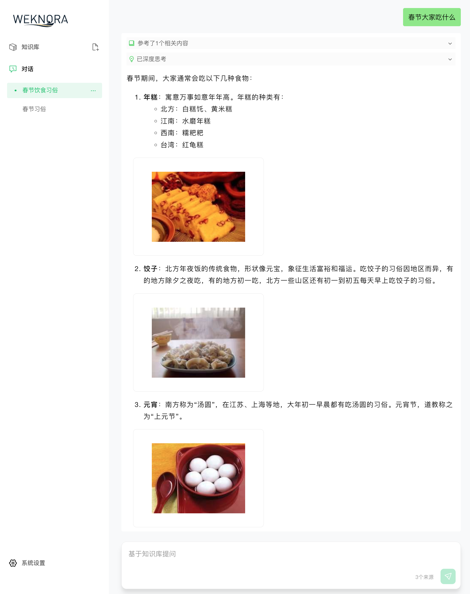

- Github (1.1k stars): https://github.com/Tencent/WeKnora
- 官网： https://weknora.weixin.qq.com

WeKnora（维娜拉） 是一款基于大语言模型（LLM）的文档理解与语义检索框架，专为结构复杂、内容异构的文档场景而打造。

框架采用模块化架构，融合多模态预处理、语义向量索引、智能召回与大模型生成推理，构建起高效、可控的文档问答流程。核心检索流程基于 RAG（Retrieval-Augmented Generation） 机制，将上下文相关片段与语言模型结合，实现更高质量的语义回答。



**特点**
核心特性
```text
🔍 精准理解：支持 PDF、Word、图片等文档的结构化内容提取，统一构建语义视图
🧠 智能推理：借助大语言模型理解文档上下文与用户意图，支持精准问答与多轮对话
🔧 灵活扩展：从解析、嵌入、召回到生成全流程解耦，便于灵活集成与定制扩展
⚡ 高效检索：混合多种检索策略：关键词、向量、知识图谱
🎯 简单易用：直观的Web界面与标准API，零技术门槛快速上手
🔒 安全可控：支持本地化与私有云部署，数据完全自主可控
```

