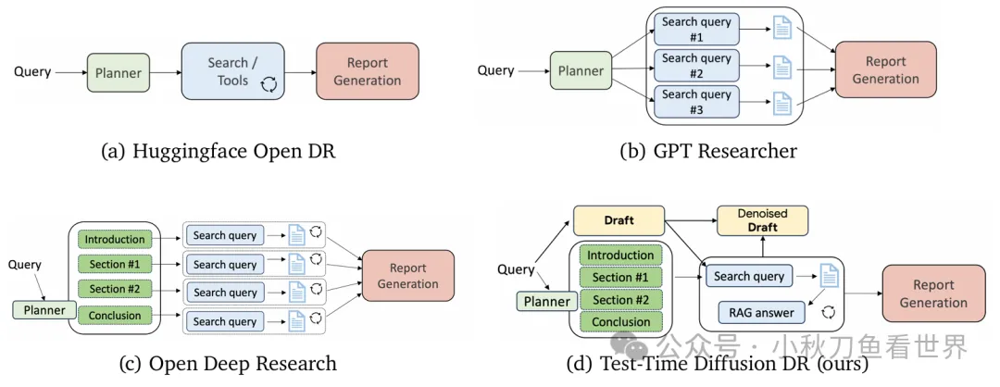
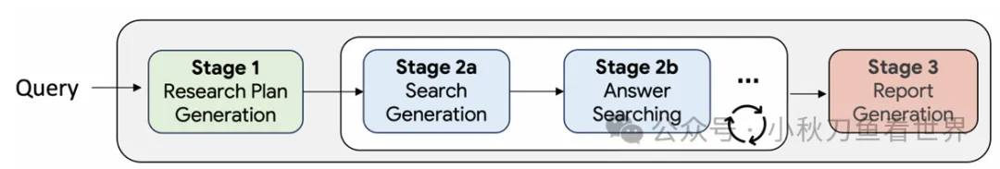
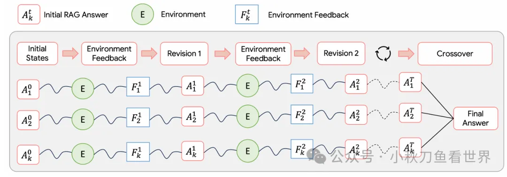
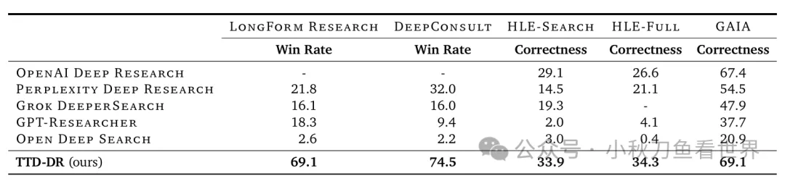

# 1. 资源

- 论文：
    - https://www.alphaxiv.org/abs/2507.16075v1
    - Google, 2025.7.21
    - Deep Researcher with Test-Time Diffusion

# 2. 原理

首先我们对比一下市面上开源的Deep Research框架：
- Open DR：这个架构比较简单，也是大多数开源框架的架构。具体流程就是先生成一个plan，然后使用search tools或者MCP，不断的搜索信息，并且由模型判断信息是否已经充足，如果充足，则停止搜索进行report的写作，否则继续搜索。
- GPT Reseacher：这个是将用户问题先进行分解，针对每个子查询进行搜索，然后将搜索结果合并在一起，开始report的写作。
- Open Deep Research：这个我比较喜欢的框架，也是我拿来打比赛的框架。模型先生成一个plan，然后根据plan的内容生成查询，针对每个子章节分别搜索和写作，最后将各个章节组合在一起生成report。
- TTD-DR：这就是我们要介绍的框架了。一开始模型不仅生成一个plan，还生成了一个draft，然后根据后续的搜索，不断的改进这个draft，形成最后的report。

TTD-DR这个框架有两个特点：（1）边写边搜。一边搜新的知识，一边补充原来生成的草稿。这个过程就是所谓的denoising。（2）各个子模块相对独立，都有各自的优化流程，这样就能减少因为过长的流程而造成信息损失。

**TTD-DR细节**

1. Backbone Deep Research Agent

   

   这里有一个主干Agent，其实就是前面我们介绍的Open DR的架构。所以我们就不详细介绍了。

2. Component-wise Self-Evolution

   

   接下来是自进化的过程：模型生成多个初始答案，然后每个答案由一个LLM-as-judge根据评分标准来进行打分和进行评价，然后再交给模型重新生成答案。打分和修订这两步循环往复，一直到满足停止的条件。最后将答案融合到一起。

3. Report-level Denoising with Retrieval
   
   上面的自进化过程可以融入backbone的任何阶段，也包含大纲的生成和改进。模型根据用户问题，直接生成一个初始的回答，这个回答肯定包含很多的错误和幻觉，这些可以被看成是“noise”。接下来通过自进化过程的循环的改进和打分，这个过程就是“denoising”。这样一边写一边改，就完成了整个报告质量的提升。

# 3. 效果

从结果看，超过了Openai 的DR，比Perplexity还要牛。
好了，所有的细节都已经讲完了，最后讲一下如果你要写一个这样的框架，需要什么呢？
首先你需要一个强大的底座模型，比如Gemini-2.5-pro，它能够调度里面的所有组件的运行，支持Tool calls 或者MCP。然后agent框架的选择有很多，你可以使用langgraph或者Google Agent Development Kit (ADK)。最后你需要一个强大的搜索引擎来支持整个RAG系统，这里推荐Google search，当然你也可以用其他的商业搜索引擎api。

# 参考

[1] 一种Deep Researcher的新思路, https://mp.weixin.qq.com/s/npZlB6NxnZLDUG7Rc6L1LQ