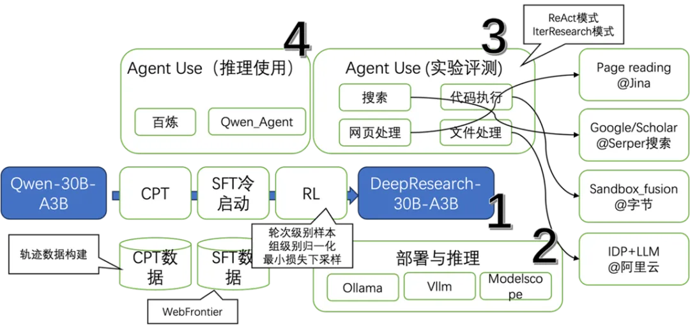
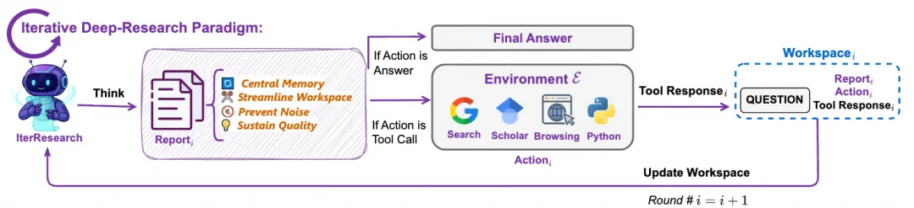
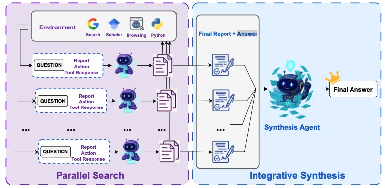
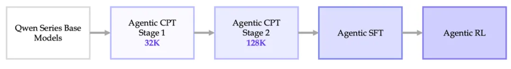
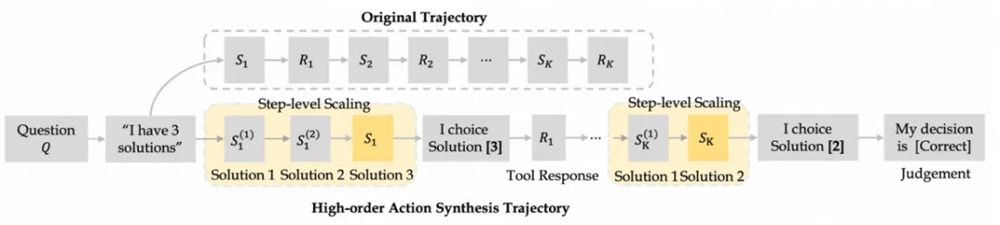

# 1. 资源

项目 Github地址：

https://github.com/Alibaba-NLP/DeepResearch

开源模型 Tongyi-DeepResearch-30B-A3B：

https://ModelScope.cn/models/iic/Tongyi-DeepResearch-30B-A3B/

Tongyi DeepResearch 技术报告: 

https://tongyi-agent.github.io/blog/introducing-tongyi-deep-research/

# 2. 原理

## 2.1 架构流程

根据用途，这几个模块可以组合使用，大家如果

- 想研究模型，选择1+2+3；
- 想研究Agent，选择3；
- 想体验/开发应用，选择4；
- 想知道为什么宇宙终极问题的答案是42，发邮件给我/编辑的邮箱，并配上一个doge表情。

图展示了一种合成轨迹的方式，考虑一个问题Q，原始数据的轨迹是图上方的Original Trajectory，从轨迹中用步骤级别展开，图上的“I have 3 solutions”,“I choose Solution[3]”等就是关键的步骤，对这些步骤，扩展为多个可能的分支。比如在”I have 3 solutions”时，分别得到三个候选的solution，图上显示是串形得到的（也许也可以并行？）然后对于其中任何一个，往后展开（rollout）。熟悉强化学习和AlphaGo的朋友们对这个应该很熟悉。对于轨迹，拆分成动作数据，包含单步的规划、推理动作和多步的决策动作。这个拆分维度是很有启发性的，这三个维度可以较为全面的覆盖Agent对于LLM能力的需求。换言之，可以从这三个角度去评判“LLM是否胜任Agent”，也能指导各种Agent中LLM的升级迭代。

但这类似轨迹构造做法都有个两个小小的问题：构造数据的样本采纳率不高，并且非常低效。

首先，展开过程中，会产生大量无用的尝试，导致rollout的样本中，真正可用的高质量数据不多。其次，这个过程很慢，特别是对工具的调用环节，在代码中，作者们准备了一个多线程并行。在知乎上，有一名自称项目作者提到“一条轨迹的价格远比想象中昂贵”，也从侧面反映了采样问题对此类研究的制约。回到合成数据阶段，可以明确知道的是，该项目的作者们做了很多的探索，期待更详细的报告。

在Tongyi DeepResearch提出了一个新的Agent模式，叫做IterResearch。和大家熟知的ReAct模式相比，IterResearch有两个关键点：

良好维护的核心报告，

动态维护的工作空间。

ReAct中，模型的上下文会快速的被工具调用的结果所占用，比如一个打开网页的工具调用，就能一次性用掉10k+的上下文。这不仅会严重占用可怜的LLM上下文窗口，而且会产生严重的污染问题——模型会忘记之前的问题和分析思路。所以在IterResearch中，选择了将工具调用的结果所组成的工作空间动态维护，而把核心的分析思路等放在一个专门的核心报告。这种做法可以理解为是针对多步工具调用中的上下文折叠压缩，这个设计也是此项目在长周期Agent（long-horizon）的关键设计。很可惜的是，这个IterResearch的代码并未随着开源，仓库中只提供了ReAct的代码。

部分解读者[10]推测，IterResearch模式就是论文[12]中提到的heavy版本。如果成立，则可以通过论文实验得知此项工作带来的增量是巨大的，比如在Humanity’s Last Exam中，IterResearch 比ReAct要高7.9pt，在BrowserComp上要高14pt。

IterResearch和ReAct在训练中，还有诸多的不同，这不仅仅体现在数据上，还体现在数据并行和采样上。项目作者并未透露DeepResearch-30B-A3B采用哪种方式训练。我推断有两种可能：

还存在一个DeepResearch-30B-A3B-Heavy并未放出，而且DeepResearch-30B-A3B-heavy采用了IterResearch方式训练。本次开源的DeepResearch-30B-A3B仅仅用ReAct方式训练。

IterResearch和ReAct在训练框架中实现了兼容，目前开放的DeepResearch-30B-A3B也可能可以在IterResearch上工作。

最后，让我们回顾一下前面那个问题：“ Agent的增强训练（CPT）究竟需要增强什么？”从这个项目中的数据合成策略上看，Agent的CPT可以增强单步的规划、推理动作和多步的决策动作。注意这是一个更接近于充分，也许非必要的条件。在没有更明确的共识之前，这是一个很棒的参考答案。

## 2.2 数据合成

这个阶段的数据，该项目引入了一种新的web数据合成方法WebFrontier，有三个要点：

种子数据生成，使用网页数据，文档和电子书作为基础，首先将其清洗并处理成chunk，利用一个模型对其生成种子QA对，这种做法在大部分数据合成中都存在。

迭代式复杂度升级，这里包含一个自举的过程，由一个agent装备工具（就是本DeepResearch中的四个工具：通用搜索，学术搜索，网页浏览，和代码执行），在要求此Agent改进问题和答案。显然这个过程是为了增加数据与DeepResearch场景的契合度，并且此阶段得到数据的过程并直接评估数据质量，而是尽可能用上工具。

质量控制，这个阶段是掐头去尾，即去除过于简单和过于难（可能是不正确的）样本，首先是通过一个不带工具的Agent去试图求解，如果问题能被解决就说明太简单了，过滤掉；然后是一个强力模型配置工具组成的Agent去试图求解，如果能通过则保留。对于未能求解的再经过一次人工审核，回收部分样本。

WebFrontier是一个很有趣的数据构建方式，它采用了“种子”-“扩展”-“评估”等经典套路，而且其中扩展阶段使用本项目整体的工具集合。总体设计思路上是对场景（评测数据，工具）深度绑定的，这种类似于过拟合的绑定，带来的潜在问题是跨团队的复现与跨场景的效果下降[13]。

## 2.3 强化学习

强化学习的基础优化算法选择了GSPO[8]，注意到在报告[2]中提到的是GRPO，在Arxiv提到的是GSPO[12]。这两种在目前都比较成熟，我们重点看看DeepResearch的项目中，有哪些改动。

在训练策略上，将每条完整的轨迹自然的分解为多个训练样本，让每一个轮次对应一个样本，而传统的方式是每条轨迹对应一个训练样本（mono-contextual）。假设一个问题有 G 条轨迹，每条轨迹平均有 T 个轮次，那么传统方法只能得到 G 个样本，而该方法可以得到 G * T 个样本。这个做法能提高数据的利用率，但是有一个小的信用分配问题：虽然每个轮次都被视为独立样本，但最终任务的成功或失败是由整条轨迹决定的。如何将最终的奖励（或惩罚）公平、准确地分配给轨迹中的每一个中间轮次，是一个经典难题。

组级别的优势归一化，所有轮次的样本被放在一起进行组级别的优势归一化（group-level advantage normalization）。这意味着，无论一个样本来自研究的早期、中期还是晚期，它们都在同一个标准下被评估和学习。这会有利于模型不会只偏向于学习“开头怎么想”或“结尾怎么答”，而是能均衡地掌握整个研究过程中每一阶段的推理和综合能力。

为了兼顾轨迹长度差异带来的每个batch样本总数不固定的问题，加入了一个最小损失下采样，将数据库下采样为数据并行规模的整数倍。

另外，IterResearch的工作模式，使得状态仅包含“上一轮的报告”和“最近的工具响应”。如果“报告”的综合能力不足，未能完全捕捉之前所有轮次的关键信息，那么模型在当前轮次的决策就会基于一个有损的、不完整的历史摘要。换言之，这个方式对报告的质量有着非常严重的依赖，如果报告生成模块本身有幻觉或者遗漏问题，对整体的影响可能是致命的。

最后，项目作者团队在Infra上，还有个很棒的设计，即双环境策略。它包含一个模拟环境，和一个真实环境。在模型演化中，先在模拟环境中作快速迭代，再应用到真实环境中，可以参考websailer-v2和Environment Scaling[15]。

# 参考

[1] 从3个核心问题，全面看懂通义DeepResearch, https://mp.weixin.qq.com/s/Gz3cBhIBarg21OL7MoKzsg
[2] 阿里开源通义DeepResearch：智能体训练全流程揭秘, https://mp.weixin.qq.com/s/li6W2S89sDDwXyJ_FcNG-Q