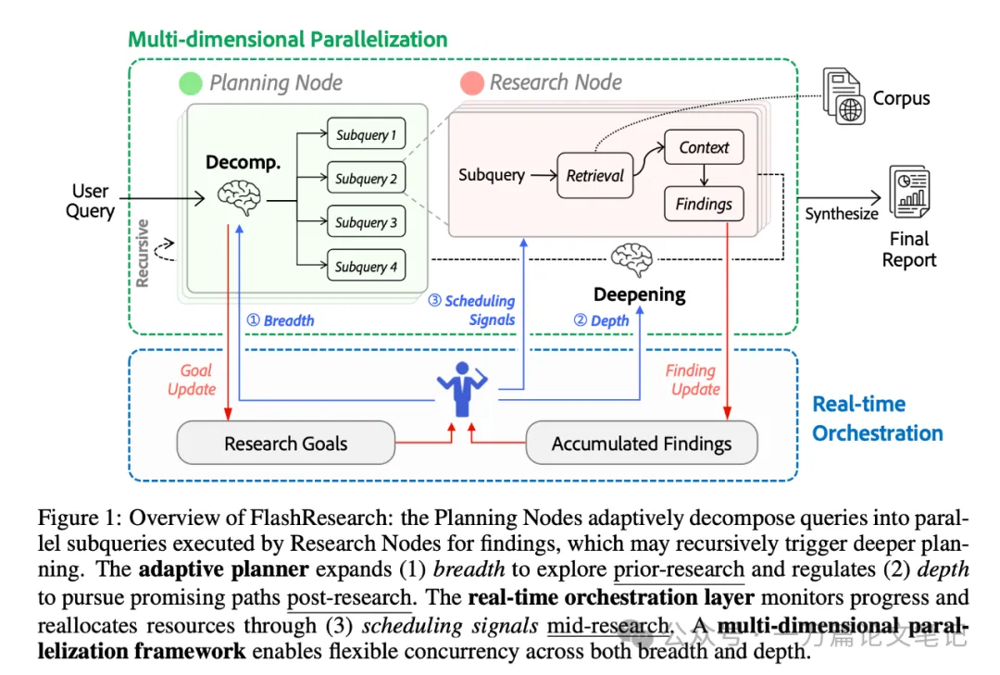
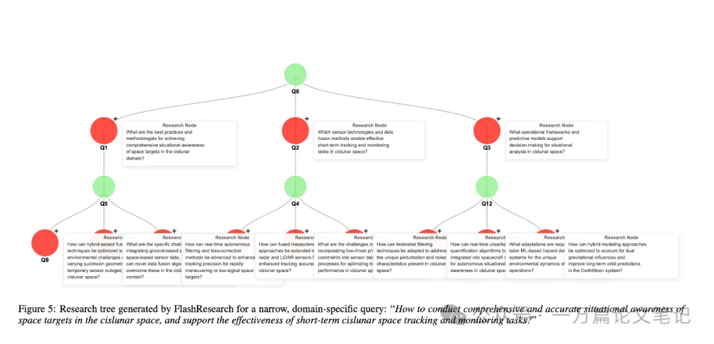
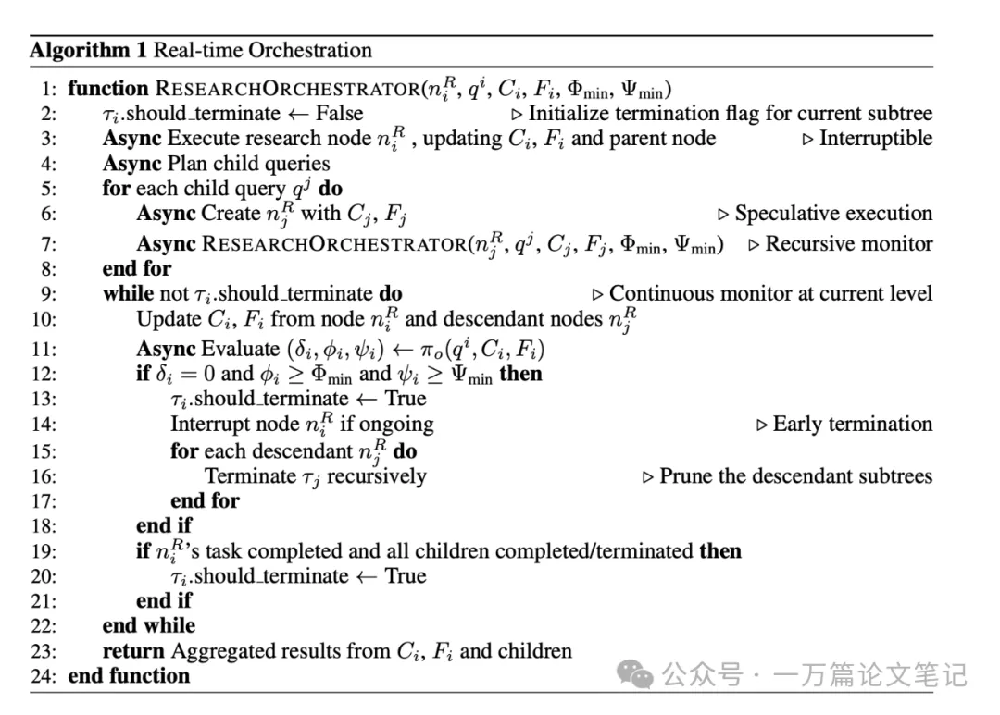
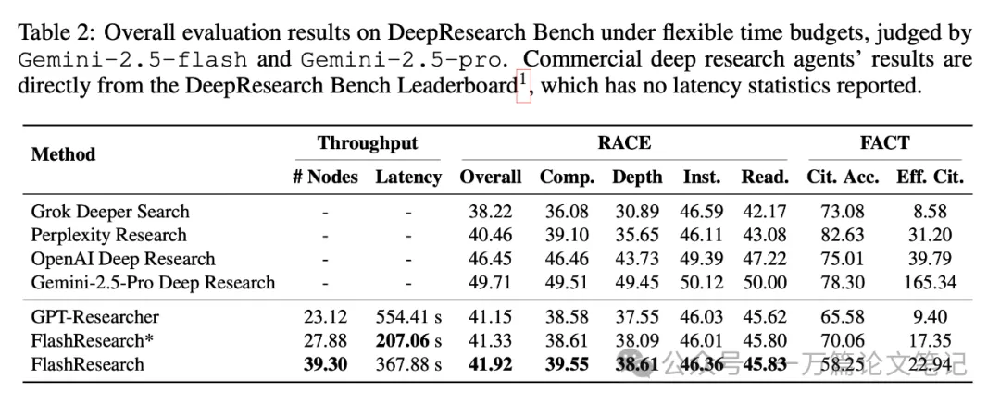

本文来自UT Austin和Adobe Research 团队，论文链接：FlashResearch: Real-time Agent Orchestration for Efficient Deep Research

顺序执行（Sequential Bottleneck）带来的时间成本瓶颈 多数agent系统以“串行”方式执行，一个子任务完成后再开始下一个，导致推理轨迹（reasoning trajectory）太长、延迟高（几十分钟起）、实时性方面用户体验较差。我自己使用的比较频繁，虽然多数时候心里已经对报告生成的时间有较长预期了，但是提交query后，为了不浪费时间，往往就做别的事情去了，等到报告生成再回头看内容，最大的问题就出现了：思维的连贯性早已被打断。可能刚才写query的时候还有其他的想法，经过这么几分钟做别的事情，早已忘了。。。

静态计划（Static Planning）的不灵活性 多数agent系统在一开始就针对用户输入的query决定了任务分解结构（包括搜索depth和搜索breadth）， 但是后期执行的时候可能面临各种突发情况，比如某个query检索结果不理想，多个query返回答案冲突，这个时候如果还是根据最开始生成的plan执行后续动作，显然不够合理。

本文作者显然也有类似的经历或想法，因此本文作者从动态plan和执行效率为契机，提出了FlashResearch，一个基于multi-agent system架构的、以adaptive plan为核心的、注重子任务实时调度和（多维度）并发执行的agent系统。




FlashResearch 的几个创新点可以概括为：

 自适应规划（Adaptive Planner） 作者认为序列执行deep research 任务不合理，应该按照树结构（tree）来组织编排query的执行，那么问题来了，tree的宽度和深度如何设定？静态设置显然不合理，由此提出了adaptive planner，动态决定“要开多少个分支（breadth）”和“子任务的深度（depth）”， 并且根据当前子任务复杂度和中间结果动态调整资源。

实时编排层（Real-time Orchestration Layer） 作用是监控子任务进度，当某一分支没什么用或者目标已满足时，立即终止不再执行，节省计算资源。此外受到投机解码（speculative decoding）启发，在子任务层级提出了投机执行（Speculative Execution），也就是即使父任务还没完成也可以立即启动子任务的执行，避免等待时间。

多维度并行框架（Multi-dimensional Parallelization） 同时支持“宽度breadth并行”（多个子任务）和“深度depth并行”（深入不同层级的推理路径），以及前面提到的投机执行。

再来说一个核心概念：树。论文中提到树中包含2类节点，planning node和research node，由于本文没开源，我自己的理解是：planning node是llm agent拆解当前的query，生成多个独立的新query（sub query，或者说是子任务），research node是则是agent系统调用search tool获取针对新query的feedback。

可以回顾下基于TIR(tool-integrated reasoning)实现的deep research agent，agent针对用户的query会思考，生成搜索query（类比planning node），然后调用search engine获取query的feedback（类比research node）。



本文将deep research 任务形式化为一个树结构优化问题（Tree-Structured Optimization）：

Root (query)  

```text
Root (query)  
├─ 子任务 1 → 检索/推理 → 可再分解为子子问题  
├─ 子任务 2 → 检索/推理  
└─ 子任务 3 ...
```


系统分为三层：

Adaptive Research Planner

决定分支数 （树宽度，breadth）和深度（树深度，depth）。

像开放性问题比如“气候变化的影响”就需要侧重广度搜索，而精细化的专业问题如“deep research agent的发展历程”侧重深度搜索。

Real-time Orchestrator 

具体看算法流程吧，也没开源：



Parallel Execution Engine

简单来说，就是能并行执行的都并行。

最后看个树结构的例子，加深印象。


实验

两个实验数据集：DeepResearchGym 和DeepResearchBench 。后者我们也写过论文解读。



# 参考

[1] FlashResearch: 基于Tree结构调度+自适应planning+并行执行的Deep Research Agent框架, https://mp.weixin.qq.com/s/r-ywel8SAbzSd9y76Y0CQg