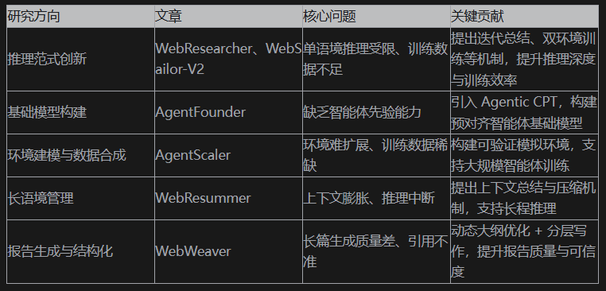
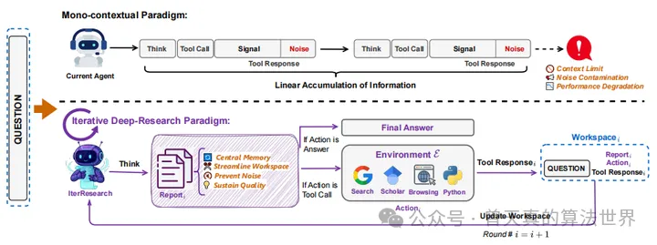
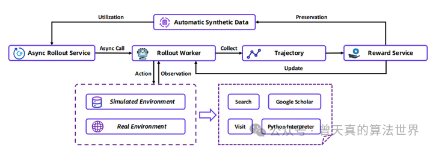
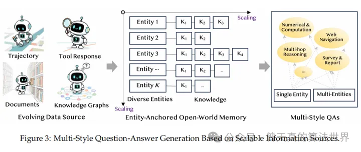
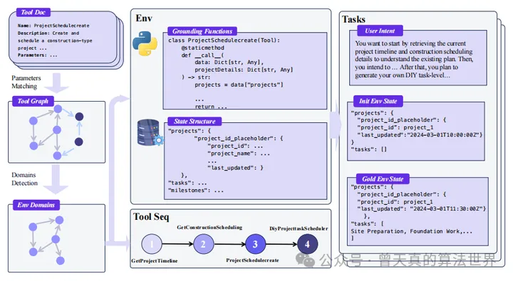
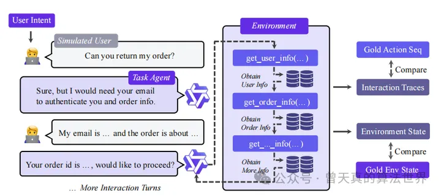
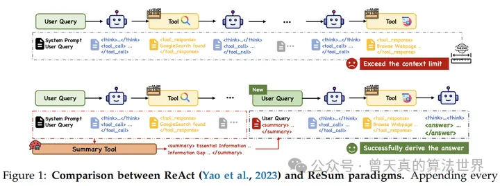
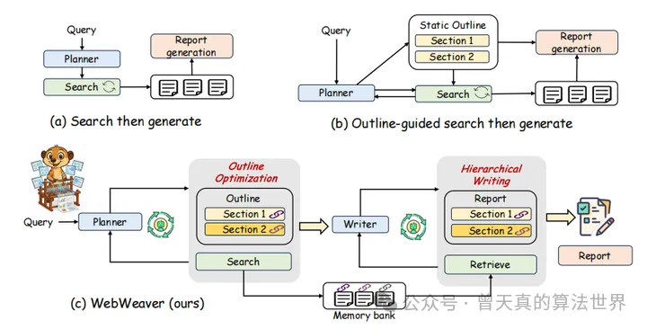

# 1. WebResearcher: IterResearch + WebFrontier + Research-Synthesis

解决单语境长程推理“认知空间窒息”与“噪声不可逆污染”

1.1 迭代式深度研究范式 IterResearch  

把「一次性长上下文」改为「多轮 MDP」：每轮只保留 <Question, Report_i-1, (Action, Tool-Resp)_i-1> 三张牌，强制模型在 8k 左右 tokens 内完成思考-行动-观察-总结四步。  

引入「中央记忆 Report」：每轮用 LLM 把新证据与旧报告做「冲突消解-整合-更新」，输出一份高密度、带引用的「活文档」。  

实验：在 Humanity’s Last Exam 上把 26.6%(OpenAI-DeepResearch) 提升到 36.7%，平均轮数 12 轮仍保持稳定准确率。

1.2 可扩展数据引擎 WebFrontier  

三阶段自举：种子 QA → 工具增强复杂度递增（知识扩展-抽象-交叉验证-计算化）→ 质量过滤。  

用工具调用痕迹做「难度标签」：仅保留「基模型错 + 工具增强后对」的样本，自动落入“能力间隙”区间。  

产出 800k 高质量轨迹，单轮平均 9.3 次工具调用；消融显示去掉复杂度递增环节，HLE 下降 5.1%。

1.3 Test-time 缩放框架 Research-Synthesis  

并行跑 n 个 IterResearch-Agent，每份只回传「最终报告+答案」给合成 Agent，用 235B 模型在 32k 上下文内做「多报告融合」。  

Pass@1 随 n 几乎线性增长到 n=8，BrowseComp-en 从 37.3%→51.7%，成本仅线性增加，无“边际收益骤降”。

# 2. WebSailor-V2: 高密度知识图谱 + 双环境 RL

后训练同时学行为+对齐」导致优化冲突，提出“好数据+稳环境”两板斧

2.1 SailorFog-QA-2 数据集  

图构建：从 Wiki 实体出发，用搜索-浏览-阅读主动制造「环状结构」与「多跳依赖」，密度比 v1 提升 3.4×。  

不确定性泛化：除传统“模糊化”外，新增时序错位、数值区间、实体歧义、因果倒置等 7 类不确定性，覆盖 92% 的复杂查询模式。  

子图采样：随机游走 + Weisfeiler-Lehman 去重，保证 50k 子图两两不同构。

2.2 双环境强化学习  

Sim 环境：离线 Wikipedia + 自建工具栈，单卡 1k QPS，0 API 费用；支持任意并发做算法消融。  

Real 环境：统一调度层封装 SerpAPI/Jina/GoogleScholar，具备限流-重试-缓存-降级，训练阶段 99.3% 调用成功。  

两环境闭环：Sim 侧做超参搜索与数据筛选，Real 侧做最终策略收敛；BrowseComp-EN 上 30B-A3B 模型从 24.4%(SFT)→35.3%(RL)。

# 3. 后训练同时学行为+对齐」导致优化冲突，提出“好数据+稳环境”两板斧

2.1 SailorFog-QA-2 数据集  

图构建：从 Wiki 实体出发，用搜索-浏览-阅读主动制造「环状结构」与「多跳依赖」，密度比 v1 提升 3.4×。  

不确定性泛化：除传统“模糊化”外，新增时序错位、数值区间、实体歧义、因果倒置等 7 类不确定性，覆盖 92% 的复杂查询模式。  

子图采样：随机游走 + Weisfeiler-Lehman 去重，保证 50k 子图两两不同构。

2.2 双环境强化学习  

Sim 环境：离线 Wikipedia + 自建工具栈，单卡 1k QPS，0 API 费用；支持任意并发做算法消融。  

Real 环境：统一调度层封装 SerpAPI/Jina/GoogleScholar，具备限流-重试-缓存-降级，训练阶段 99.3% 调用成功。  

两环境闭环：Sim 侧做超参搜索与数据筛选，Real 侧做最终策略收敛；BrowseComp-EN 上 30B-A3B 模型从 24.4%(SFT)→35.3%(RL)。

# 3. AgentFounder: Agentic Continual Pre-Training

「通用基座缺乏智能体先验」→ 在预训练阶段就注入工具-规划-推理分布

3.1 First-order Action Synthesis (FAS)  

零监督：把搜索日志、拒绝轨迹、CommonCrawl 转成「实体-知识」内存，再采样生成「问题-规划-首步动作」三元组；  

规划动作：让 LLM 仅写“下一步搜什么”而不真调用 API，成本下降 98%，生成 120M 轨迹。  

推理动作：对同一问题先让模型“盲答”得 A1，再给予知识修正得 A2，保留中间思维链，生成 18M 条“自我修正”样本。

3.2 Higher-order Action Synthesis (HAS)  

对每条真实轨迹做“步级扩展”：每步生成 N 个候选 thought-call，拼成 (N+1)×K 决策空间；  

用最终成败做对比学习，把“选错-选对”转成「决策-优势」信号，增强模型对分叉点的敏感度。  

实验：在相同 50B tokens 下，FAS+HAS 比纯 FAS 在 BrowseComp-zh 提升 3.1%，在 HLE 提升 1.8%。

3.3 两阶段 CPT 训练  

Stage-1：32K 上下文 + 200B tokens，学「短链工具+规划」；  

Stage-2：128K 上下文 + 100B tokens，学「长链决策+跨段依赖」。  

结果：AgentFounder-30B 在 10 个基准全部刷新开源 SOTA，HLE 首次突破 30%(31.5%)。

# 4. AgentScaler: 环境即数据库 + 两阶段领域特化

真实 API 贵、LLM 模拟假」→ 把工具映射为可执行代码，自动构建可验证的离线环境

4.1 自动化环境构建  

收集 3 万级真实 API → 参数向量相似度建图 → Louvain 聚类得分域 → 为每域生成数据库模式；  

工具程序化：每支 API 自动转写成 Python 函数，读写操作直接落库，天然支持「状态可回溯」；  

任务生成：在图上做“有向游走”采样动作链，再随机初始化库状态，保证轨迹逻辑一致且可验证。

4.2 两阶段智能体经验学习  

Stage-1：跨域混合数据学「通用工具调用」；  

Stage-2：单域数据学「上下文相关参数化」；  

过滤漏斗：格式合法性 → 终止状态一致性 → 动作-参数精确匹配；保留 42% 轨迹，训练稳定不崩。

4.3 实验结果  

τ-bench、τ2-bench、ACEBench 上，AgentScaler-30B-A3B 平均准确率 75.7%，超越 1T 参数开源模型 Kimi-K2(77.4%→73.7%)，与闭源 GPT-o3 持平；4B 模型即可打平 30B 级对手，验证环境 scaling 的样本效率优势。

# 5. ReSum：解决长程搜索中的上下文瓶颈

核心贡献：

1. 提出 ReSum 范式：周期性上下文压缩

问题背景：ReAct 范式在长程搜索任务中会因上下文不断增长而耗尽 token 预算，导致任务中断。

解决方案：ReSum 在搜索过程中周期性调用总结工具，将历史交互压缩为结构化的摘要（包含证据和信息缺口），然后基于摘要继续推理，实现“无限探索”。

2. 专用摘要模型：ReSumTool-30B

基于 Qwen3-30B-A3B 微调，专门用于从冗长交互中提取关键证据、识别信息缺口、提出下一步行动建议。

相比通用大模型（如 DeepSeek-R1-671B），ReSumTool 在摘要质量和任务导向性上更优，部署成本更低。

3. 强化学习适配框架：ReSum-GRPO

提出 ReSum-GRPO 算法，使智能体适应“摘要条件推理”模式。

将长轨迹分段为多个训练片段，统一使用轨迹级奖励，并通过优势广播机制训练模型从摘要中恢复推理状态。

4. 实验验证

在 GAIA、BrowseComp-en、BrowseComp-zh 等长程搜索任务中，ReSum 相比 ReAct 平均提升 4.5%，ReSum-GRPO 再提升 8.2%。

WebResummer-30B（ReSum-GRPO 训练后）仅用 1K 训练样本，在 BrowseComp-zh 上达到 33.3% Pass@1，超越多个开源大模型。

# 6、WebWeaver：开放式深度研究（OEDR）的结构化生成

# 参考

[1] Agent深度研究的狂欢：通义-Agent实验室论文六连发，一起看看, https://mp.weixin.qq.com/s/B-l57oNVXClyeDHBEEzO6g