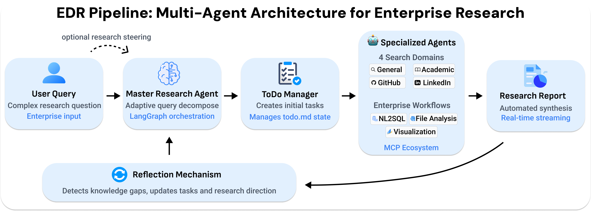

- github (439 stars): https://github.com/SalesforceAIResearch/enterprise-deep-research
- Enterprise Deep Research: Steerable Multi-Agent Deep Research for Enterprise Analytics
  -  https://arxiv.org/abs/2510.17797
  - 2025.10.20

我们推出企业深度研究 （EDR），这是一个集成了以下内容的多智能体系统：

- 用于自适应查询分解的主计划代理。
- 四个专业搜索代理（常规、学术、GitHub、LinkedIn）。
- 基于 MCP 的可扩展工具生态系统，支持 NL2SQL、文件分析和企业工作流。
- 可视化代理，提供数据驱动的见解。
- 反射机制，通过可选的人机交互指导来检测知识差距并更新研究方向。
- 实时转向命令，用于持续改进研究。

