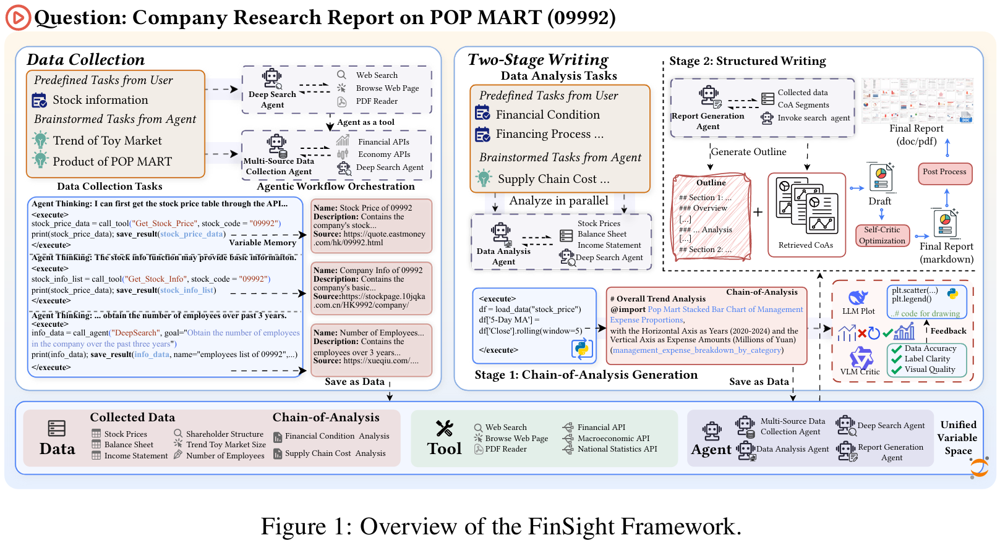
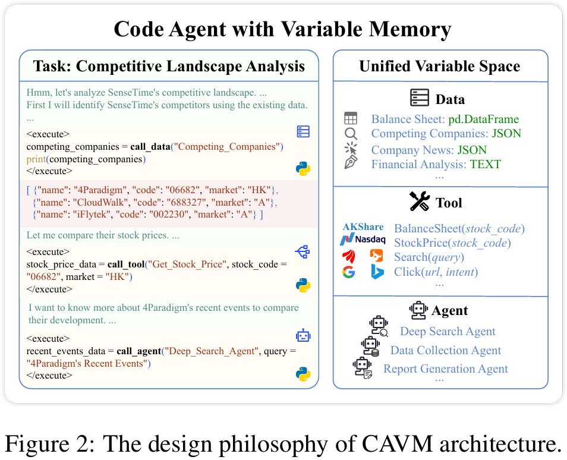
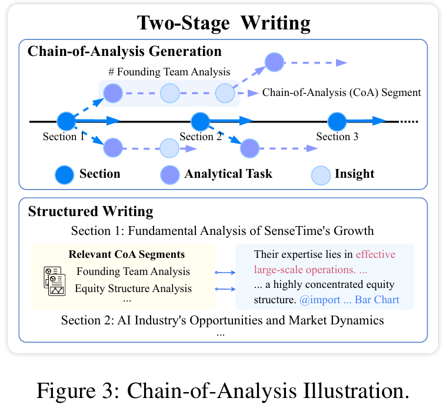
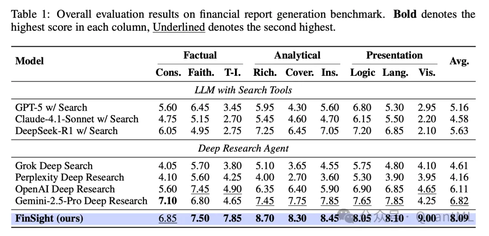
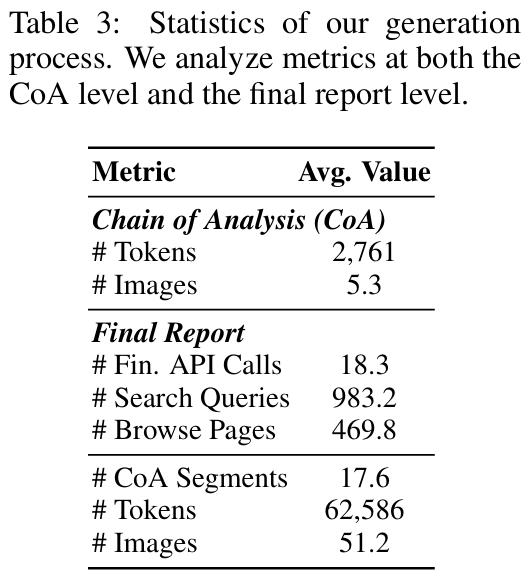
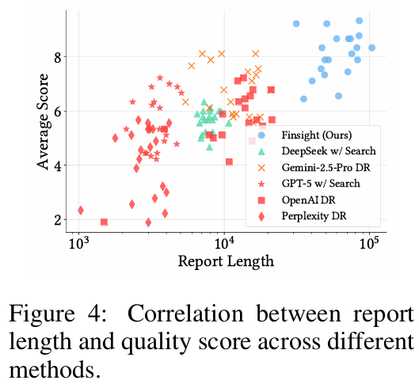
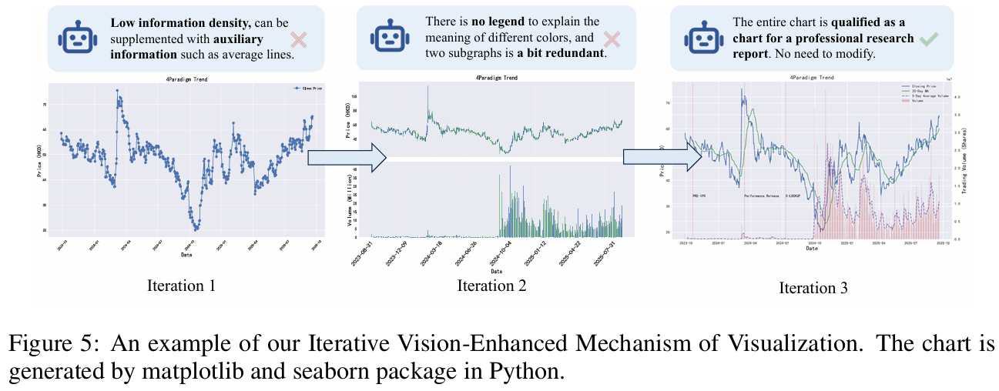

# 1. 资源

- FINSIGHT: TOWARDS REAL-WORLD FINANCIAL DEEP RESEARCH
- https://arxiv.org/pdf/2510.16844
- 2025.10.19

生成专业级的金融研究报告是一项兼具劳动密集与智力挑战的复杂任务，当前的人工智能系统尚难完全胜任。为应对此挑战，论文提出了一种名为FinSight（Financial InSight）的新型多智能体（Multi-Agent）框架，旨在自动化生成高质量、多模态的金融报告。

FinSight框架的核心是带可变内存的编码智能体（Code Agent with Variable Memory, CAVM）架构。该架构创新性地将外部数据、定制工具与各类智能体统一整合到一个可编程的变量空间中，通过执行代码来实现灵活的数据采集、深度分析与报告生成。为确保报告的视觉呈现达到专业水准，框架引入了迭代式视觉增强机制（Iterative Vision-Enhanced Mechanism），该机制能够逐步将原始的视觉输出精炼为符合金融行业标准的图表。此外，一个精巧的两阶段写作框架（Two-Stage Writing Framework）负责将精炼的“分析链”（Chain-of-Analysis）片段扩展为逻辑连贯、引证清晰的图文报告，确保了内容的分析深度与结构完整性。

在针对不同公司和行业的深度研究任务中进行的实验表明，FinSight在事实准确性、分析深度和呈现质量等多个维度上均显著超越了包括顶尖深度研究系统在内的所有基线模型，为实现媲美人类专家的自动化报告生成探索出一条清晰可行的路径。

# 2. 原理

价值数十亿美元的投资决策高度依赖于金融研究报告的质量与时效性。然而，面对海量的金融数据和对快速高质量分析的迫切需求，撰写此类报告依然是一项艰巨的任务。尽管近年来人工智能，特别是大型语言模型在推理、搜索与研究方面取得了显著进展，但在自动化生成满足数据准确性、分析深度和多模态内容整合高标准的完整金融研究报告方面，仍存在巨大挑战。

现有方法普遍存在以下三大局限：

1. 缺乏金融领域知识整合：多数系统为通用搜索场景设计，未能有效整合实时的、异构的金融数据（包括非结构化的新闻、公告与结构化的财务数据）。
2. 多模态支持与可视化能力有限：几乎所有现有方法都只能生成纯文本报告，缺乏图表、表格等对信息传递至关重要的可视化元素。
3. 分析深度不足：现有方法大多依赖于固化、单次执行的数据收集与报告生成流程，无法根据中间发现动态调整研究策略，从而限制了最终报告的洞察力。

**方法论**

为克服上述挑战，FinSight多智能体系统被设计用于模拟金融专家的认知流程与分析工作流。该系统包含三个核心阶段：

- 数据收集（Data Collection）：汇集最新的异构数据，并将其组织成结构化的多模态记忆库。
- 数据分析（Data Analysis）：在一个交互式环境中，通过与数据、工具和智能体的多轮互动，提炼出简明扼要的“分析链”序列。
- 报告生成（Report Generation）：遵循预设大纲，将数据和分析链转化为格式规范、图文并茂的专业级金融报告。

FinSight的技术基石是CAVM架构，它将所有数据、工具和智能体统一映射到一个可通过代码访问和操作的可编程变量空间中。这一设计充分利用了语言模型的代码生成能力，实现了从底层数据操作到高层工作流编排的灵活扩展。

同时，为解决多模态生成与分析深度的核心难题，框架集成了两大专门机制：

- 迭代式视觉增强机制：该机制利用视觉语言模型（VLM）对代码生成的图表进行批判性反馈，通过迭代修正，直至图表质量满足专业标准。
- 两阶段写作框架：首先，将洞察浓缩为一系列简明的“分析链”片段；随后，报告生成智能体以此为结构化基础，创作出内容完整、上下文感知、图文引用紧密结合的深度报告。

# 3. 实验
## 3.1 数据集与评估指标
由于金融报告生成领域缺乏标准的评估基准，研究团队构建了一个高质量的评测体系。

- 数据集：该数据集涵盖了公司和行业两个层面的研究目标。公司层面，从权威金融平台筛选了覆盖不同市场、行业和市值的多元化公司名单；行业层面，则选取了关注度高、代表性强的行业作为研究对象。为确保评估的权威性，团队收集了由专业券商机构撰写的深度分析报告作为“黄金标准参考报告”。这些参考报告均经过严格筛选，篇幅超过20页，且包含20个以上的图表。最终，数据集包含20个样本（10个公司和10个行业）。
- 评估指标：设计了涵盖三个维度的9个自动化评估指标，每个指标评分范围为0-10分。
  - 事实准确性（Factual Accuracy）：
    - 核心结论一致性：与参考报告的核心结论是否一致。
    - 文本忠实度：论点是否有恰当的引文支持。
    - 图文一致性：文本描述与视觉元素是否协
  - 信息有效性（Information Effectiveness）：
    - 信息丰富度：报告包含的独立信息点的数量。
    - 信息覆盖率：对参考报告中关键信息的覆盖比例。
    - 分析洞察力：是否提供批判性分析和前瞻性建议
  - 呈现质量（Presentation Quality）：
    - 结构逻辑：报告的组织结构是否清晰连贯。
    - 语言专业性：是否使用规范的金融术语。
    - 图表表现力：可视化元素的运用效果和美学质量。

## 3.2 基线模型
FinSight与两类主流基线模型进行了对比：

- 带搜索工具的大语言模型（LLMs with Search Tools）：包括 OpenAI GPT-5、DeepSeek-R1 和 Claude-4.1-Sonnet。
- 深度研究智能体（Deep Research Agents）：包括 Gemini-2.5-Pro Deep Research、Grok Deep Search、OpenAI Deep Research 和 Perplexity Deep Research 等顶尖商业化产品。

## 3.3 实现细节
FinSight的骨干模型主要使用DeepSeek-V3，写作阶段则采用具备更强推理能力的DeepSeek-R1。搜索部分利用Google Search API，评估则使用Gemini-2.5-Pro多模态模型。

## 3.4 主要结果
实验结果（见表1）显示，FinSight在总分上以8.09的成绩遥遥领先，显著优于所有基线模型，包括Gemini Deep Research（6.82）和OpenAI Deep Research（6.11）等强大的商业对手。这一结果有力地证明了FinSight多智能体框架在撰写深度金融报告方面的卓越效能。

具体来看：

- 在事实准确性方面，FinSight在文本引用的忠实度和图文一致性上得分最高，这归功于其“分析链”中设计的标识符机制。值得注意的是，其结论一致性得分（6.85）略低于Gemini Deep Research（7.10）。案例分析表明，这是因为FinSight优先进行全面的数据搜集以追求更深刻的洞察，从而得出了更多由数据驱动的、更细致的发现，而非传统搜索方法生成的简化结论。
- 在分析质量方面，FinSight的优势更为明显，在信息丰富度、关键信息覆盖率和洞察力三个指标上均位居榜首。
- 在呈现质量方面，该系统在逻辑、语言和可视化方面全面领先，尤其在可视化一项上取得了9.00的极高分，远超其他方法，充分展示了其先进的多模态呈现能力。

# 4. 消融研究与分析
## 4.1 消融研究
为验证关键模块的贡献，研究团队进行了消融实验，主要发现如下：

- 移除迭代式视觉增强机制：导致呈现质量（从8.0降至7.5）和分析质量（从7.9降至7.2）显著下降。原因是报告写作过程依赖于对生成图表的分析，低质量的视觉效果直接削弱了基于图表的洞察能力。
- 移除两阶段写作框架（即将分析与写作合并为一步）：导致分析质量（从7.9骤降至5.9）和事实准确性（从7.0降至6.4）大幅下滑，证明了“先分析、后写作”策略的有效性。
- 移除动态搜索（即在分析和写作阶段不再进行额外的信息检索）：导致所有维度性能均出现显著下降，凸显了在研究过程中持续获取新知识对于确保报告全面性和准确性的必要性。

## 4.2 深入分析
- 生成过程的统计分析： 数据显示，FinSight的生成过程是深度且全面的。平均每个“分析链”片段包含2,761个token和5.3张图片。一份完整的报告则由约17.6个“分析链”片段综合而成，最终篇幅达到62,586个token和51.2张图片。为支撑如此丰富的内容，系统平均每份报告执行983.2次搜索查询和469.8次页面浏览。
- 图像生成分析： 迭代式视觉增强机制的效果是惊人的。以一张股票图表为例，初始版本（迭代1）仅为一条简单的价格曲线，信息密度低。经过VLM的反馈（如“缺少图例”、“信息密度低”），系统在第二轮迭代（迭代2）中增加了成交量副图。在第三轮迭代（迭代3）中，系统进一步将价格与成交量整合到双坐标轴中，并增加了移动平均线和关键事件标注，最终形成了一张信息丰富、专业美观的复合图表。这表明该机制是弥合自动化图表生成与专家级可视化之间差距的关键。
- 报告长度与质量分析： 通过对比不同方法生成的报告长度与质量得分（见图4），可以发现FinSight的输出高度集中在图表的右上象限，即报告不仅篇幅长（通常超过20,000词），而且质量得分始终保持在高位。这得益于其两阶段写作框架，通过先生成结构化、信息密集的“分析链”，确保了最终报告的深度与连贯性。 相比之下，基线模型的表现则不尽人意。简单的“LLM+搜索”方法受限于单次生成模式，报告普遍较短。而其他深度研究智能体（如OpenAI DR）的输出点在图上分散，表明其性能极不稳定，报告篇幅的增加并不总能带来质量的提升。

相关工作
- 深度研究系统：现有的深度研究框架，无论是基于ReAct思想的智能体还是多智能体协作系统，普遍在多模态处理和特定领域（如金融）应用方面存在局限。它们通常以文本为中心，缺乏原生的图像生成能力，并且难以整合实时的市场数据和生成专业级图表。
- 金融领域的LLM智能体：已有的金融AI系统或专注于股价预测，或在报告生成上采用单轮流程，导致分析深度不足。尽管一些开源工作提供了丰富的工具和数据接口，但它们缺乏一个精心设计的、用于生成综合性深度报告的框架。

# 5. 结论

本论文成功构建并验证了一个名为FinSight的多智能体系统，专用于生成高质量、多模态的金融研究报告。其核心创新在于CAVM架构，它将数据、工具和智能体整合到一个统一的可编程空间中，实现了由代码驱动的动态分析。同时，迭代式视觉增强机制和两阶段写作框架分别解决了专业级图表生成和长篇报告写作的难题。

全面的实验证明，FinSight的性能在多个关键维度上均显著超越了现有 SOTA 基线。这项工作不仅验证了多智能体、代码驱动方法的有效性，也为自动化金融分析领域的发展开辟了新的道路，展现了其变革行业的巨大潜力。
