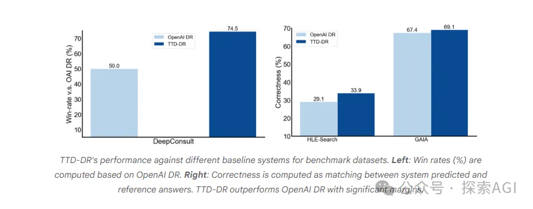
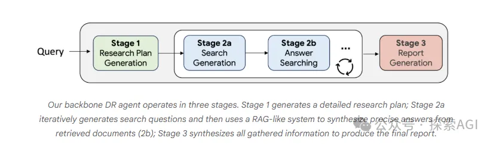
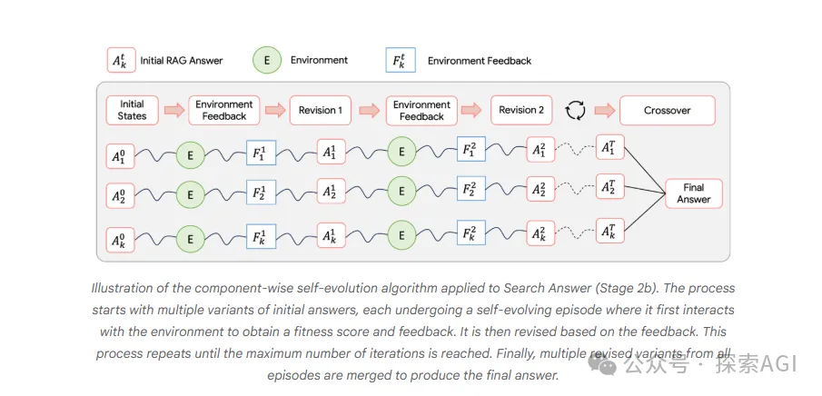
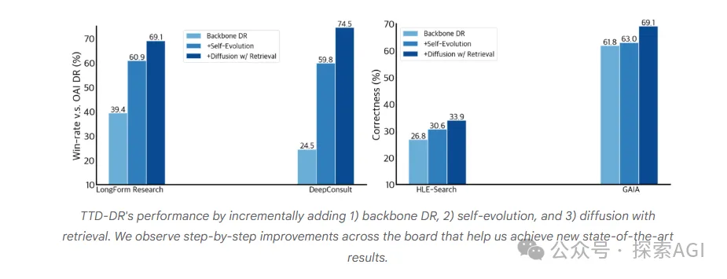
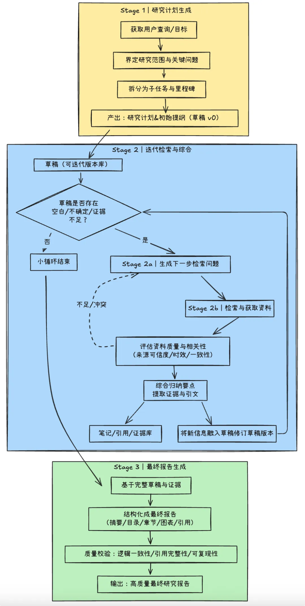

# 1. 资源

这个新的算法已经在 Google Agentspace 可以试用，地址： https://cloud.google.com/agentspace/docs/research-assistant

博客地址：https://research.google/blog/deep-researcher-with-test-time-diffusion

# 2. 原理

大多数Agent的工作模式是“规划-检索-然后-生成”，他们想打破这个范式，让AI像一个真正的人类专家一样做研究。

先打草稿，然后不断检索、学习来迭代修正，最终降噪成一篇高质量的报告。

需要注意的是，标题的Diffusion，跟真正的扩散模型没有半毛钱关系。

从结果来看，这套新的框架，暴捶了  OpenAI Deep Research。

反思
过去，我们先规划-> 搜集 -> 撰写 的模式有什么问题呢？

比如：根据你的问题，拆解出几个关键词。

去数据库或网络上搜索相关信息。

把搜到的信息汇总、提炼，生成一份报告。

这个流程本身没问题，但它缺少全局观。

AI并不知道最终要讲一个什么故事，它只是完成填空。

导致报告常常前后矛盾，重点不突出。

谷歌的想法
从人的角度来看，写一个好的报告。

会先基于已有知识，快速形成一个初步大纲和草稿（可能一般），然后再带着问题去查漏补缺，用新找到的信息来修正和丰富草稿，如此反复，直到报告变得完美。

这个过程，像是 Diffusion （将一堆噪声的图片逐步去噪）。

具体的流程如下：

生成计划
AI会根据你的需求，生成一个初步的研究计划和一份非常粗糙的草稿。

迭代检索、修正
接下来，Agent会把这份草稿作为上下文，反过来思考：“为了让这份报告更好，我下一步最需要什么信息？” 然后它会生成新的检索问题，找到答案后，再用这个新答案来“降噪”——修正和升级整个报告草稿。

循环往复
这个用草稿指导检索，用检索优化草稿的过程会一直循环，直到AI认为报告质量已经足够高。

这样的好处是，整个研究过程始终有一个明确的目标和主线，所有后续的信息检索都是为了让最终的故事更连贯、更深入，而不是东拼西凑。

黑科技
除了上面大的流程，还有2个小技巧优化。

AI自己给自己找茬
在每一个环节（比如生成检索问题、总结答案），AI都不是一次就过。

内部会同时生成多个不同的版本（Initial states），然后让一个 LLM 来打分和提供修改意见（Environmental feedback），接着根据意见进行修改（Revision），最后再把所有版本中最精华的部分融合（Cross-over），形成一个最高质量的输出。

相当于，每一步都进行了深度的头脑风暴和自我批判，确保了过程中的每一步的写作都是非常的高质量的。

报告级降噪
当Agent找到新的信息，它会重新审视和修改整篇报告草稿。

这里不是直接插入到某个模块，保证了新知识能被完美地融入现有的逻辑框架，甚至可能引发对整个报告结构的重塑。

结果
这些不局限于写作，在需要多步推理和深度检索的 GAIA 等任务上，也全面优于OpenAI DeepResearch。

从下图中可以看到，仅有基础的 Backbone DR 架构时，表现不如 OpenAI。但一旦加上自我进化和扩散式降噪后，性能就一路狂飙，实现了反超。

---

---

1. 研究计划生成（Stage 1）
根据用户查询生成详细的研究计划与提纲（草稿v0），为后续研究确定方向和分解子任务。
2. 迭代检索与综合（Stage 2）
围绕草稿中尚不完备的部分，反复执行“小循环”：生成下一步的搜索问题（Stage 2a），检索相关资料，并综合出答案（Stage 2b），然后将新信息融入草稿进行修订。修订可能包括：
补充细节论据
纠正前文错误
增强论述连贯性等
这个阶段会循环执行多次，不断丰富和完善草稿内容。
3. 最终报告生成（Stage 3）
当检索迭代结束后，代理基于完整的草稿和所有中间资料，生成高质量的最终研究报告。
那么什么时候迭代结束呢
系统检测到草稿中的关键问题都已得到充分解答，或者经过多轮检索草稿不再发生显著变化时，代理会终止循环进入最后的报告定稿阶段（Stage 3）。
上述流程中的 Stage 2 是TTD-DR的核心所在，也是代表其“扩散过程”的主体循环。草稿在这里逐步去噪、增补细节，向终稿逼近。
什么时候、什么地方需要进一步“检索”以增补细节呢？
TTD-DR设计的一个重要机制大致为：如果草稿中某个论点证据不足，系统会自动生成针对该论点的问题去搜索新数据，并据此加强该部分内容 。这种基于反馈的主动检索确保了报告逐步臻于完备，不会遗漏重要信息点。

# 参考

[1] 谷歌开源新Deep Research范式，教Agent学会真正的思考。https://mp.weixin.qq.com/s/e_1dGQRLfc_fGAZrQEsLVw
[2] 如何改变AI研究范式？谷歌DeepResearch新方法TTD-DR原理与实现 | 原理篇, https://mp.weixin.qq.com/s/VtkFVBdLBkq-_wmEtcn_Zg