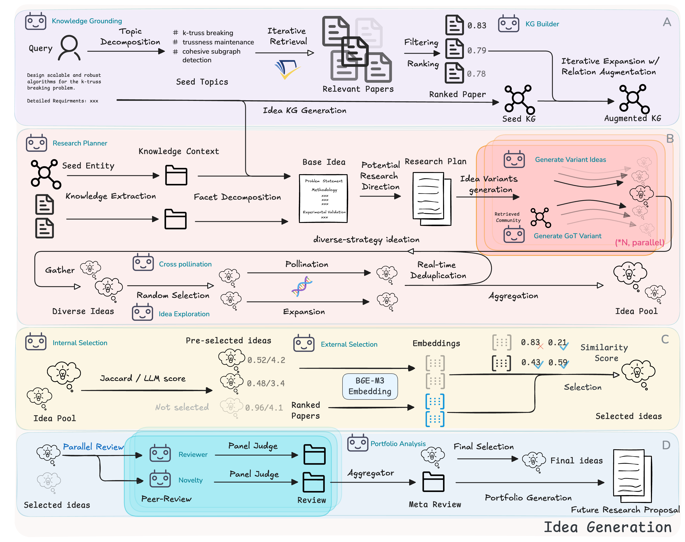

# 1. 资源

- Github (16): https://github.com/valleysprings/TrustResearcher
- 论文；原文:AutoResearcher: Automating Knowledge-Grounded and Transparent Research Ideation with Multi-Agent Collaboration
  - 地址:https://arxiv.org/abs/2510.20844

# 2. 原理

TrustResearcher 通过编排一个实用的、文献意识的管道来选择一个主题并产生一套完善的研究想法：

通过 Semantic Scholar API 检索相关论文，并发、速率限制、重试、重复数据删除和相关性/引文排名。
构建主题锚定的知识图谱，以在构思过程中维护外部内存。
通过计划、分面分解、探索和自我批评过度产生想法，然后删除重复项。
使用加权标准和可配置的独特性阈值快速评估候选者。
检查检索到的纸张的辨异度以避免重叠。
并行运行审稿人、新颖性和校对代理，并将结果聚合为干净的输出。
结果是一个结构化的 JSON 工件（加上人类可读的摘要）和流程的综合日志。

TrustResearcher 集成了一个完全具有文献意识的多智能体工作流程，将检索、推理和审查联系起来，确保新颖性和证据基础。

🔑 主要特点
文献引导管道 – 在构思之前进行高信号检索，具有并发性、合理的默认值和自适应退避。
知识图谱内存 – 根据主题（可选地从上传的文档）构建的轻量级图，以锚定下游推理。networkx
稳健生成 – 计划 + 分面分解 + 思维图 （GoT） 探索 + 具有自动重复数据删除的自我批评。
快速筛选 – 加权、可配置的选择，具有显着性阈值。
并行深度审查 – 审稿人、新颖性和校对代理并行运行并产生综合评估。
Web UI – 通过多会话控制和实时日志对端到端流程进行交互式可视化。
可重现的输出 – 具有时间和成本跟踪的结构化 JSON 结果，以及用于多轮细化和 LLM 对话重播的日志。
🧭 管道概述
结构化知识策展→ LLM 引导的主题分解、语义学者检索和增量 KG 构建。（实现：文献检索+知识图谱构建）
多元化创意生成→规划+思维图推理+多策略创意变体+迭代自我提炼。（实施：创意生成）
多阶段创意选择→加权内部评分和基于外部嵌入的过滤。（实现：内部+外部选择）
专家小组审查和综合→审查员和新颖性代理对最终想法进行评分，并将其综合到排名的作品集中。（实施：详细审查+最终选择+作品集分析）

# 参考

[1] AI4S | AutoResearcher: 用多智能体协作实现知识驱动且透明的科研创意自动化, https://mp.weixin.qq.com/s/omYHFeeA6HL4KAKuz1qCXw