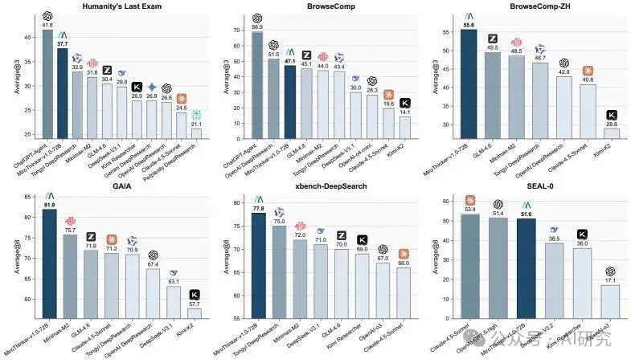
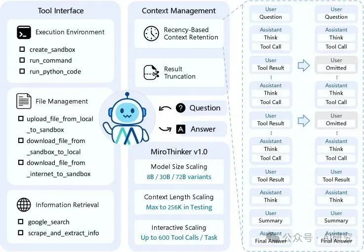
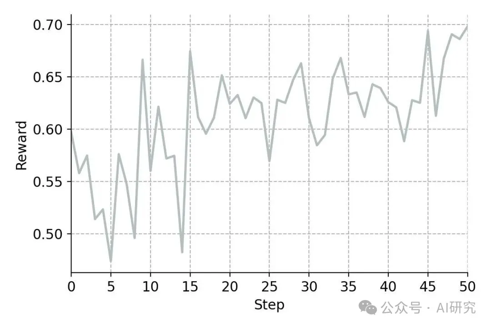

# 1. 资源

- 论文标题：MiroThinker: Pushing the Performance Boundaries of Open-Source Research Agents via Model, Context, and Interactive Scaling
- ArXiv URL：http://arxiv.org/abs/2511.11793v2
- Github (967 stars): https://github.com/MiroMindAI/MiroThinker

# 2. 原理

这就是最新开源的研究型Agent——MiroThinker，为我们揭示的答案。它不仅仅是一个更大的模型或更长的上下文窗口，而是开创性地提出了交互缩放（Interaction Scaling）作为性能提升的“第三维度”，在多个基准测试中超越了所有现有开源Agent，性能直逼GPT-5等顶级闭源模型。

什么是交互缩放？
过去，我们提升AI能力主要靠两条路：

1. 模型缩放：把模型做得更大（如从7B到70B）。
2. 上下文缩放：让模型能“看”得更长（如从4K到200万字）。
但MiroThinker的研究发现，这还不够。尤其对于需要复杂推理和信息搜集的“研究型”任务，Agent需要不断与外部环境（如搜索引擎、代码执行器）互动，形成“思考-行动-观察”的循环。

交互缩放，就是系统性地训练模型，使其能处理更深、更频繁的Agent-环境交互。

这与简单的让模型在测试时“多想几步”完全不同。后者在没有外部反馈的情况下，推理链越长，错误累积的风险就越大。而交互缩放则利用环境反馈和外部信息来实时纠错、优化路径，让Agent的思考更有深度和韧性。

MiroThinker的架构揭秘
MiroThinker基于经典的ReAct（Reasoning and Acting）范式构建，但为了支撑超高频率的交互，其在架构上做了精巧的设计。

其核心组件包括：

• 模块化工具接口：提供了一个强大的工具箱，包括用于安全执行代码的Linux沙箱、文件管理系统，以及高效的信息检索工具。
• 智能信息检索：它的网页抓取工具并非简单地复制粘贴全文，而是内置了一个轻量级LLM（如Qwen3-14B），能根据任务需求，智能提取最相关的信息。这极大地提升了信息获取的效率。
• 高效上下文管理：要在256K的窗口内容纳600次工具调用，上下文管理至关重要。MiroThinker采用了两种聪明的策略：
1. 近期记忆保留（Recency-Based Context Retention）：研究发现，Agent的下一步行动主要依赖于最近的几次观察。因此，MiroThinker只在上下文中保留最新的几次工具输出全文，而早期的输出则被省略，从而为更长的交互腾出空间。
2. 结果截断：对于过长的代码执行或命令输出，系统会自动截断，并附上[Result truncated]标签，防止上下文溢出。

海量、高质量的训练数据：MiroVerse v1.0
为了训练出具备深度交互能力的模型，研究团队构建了一个名为 MiroVerse v1.0 的大规模合成数据集。

这个数据集的生成过程极为复杂，首先通过知识图谱技术将维基百科、网页等数据源构建成复杂的多文档问答对（MultiDocQA），然后通过一个强大的Agent轨迹合成框架，将这些问答对转化为高质量的“思考-行动-观察”轨迹数据。

通过这种方式，MiroThinker在训练阶段就学习了如何处理需要多步推理、跨文档信息整合的复杂任务。

三阶段训练法：从模仿到创造
MiroThinker的训练流程分为三个精心设计的阶段，使其从一个模仿者成长为一个创造者。

1. 监督微调（SFT）：模型首先学习模仿专家轨迹，掌握基本的工具使用和推理模式。
2. 偏好优化（DPO）：接着，模型学习区分“好”的解决方案和“坏”的解决方案，使其决策更符合任务目标。
3. 强化学习（RL）：最后，也是最关键的一步，研究采用了GRPO（Group Relative Policy Optimization）算法，让Agent在真实环境中通过在线探索和试错来学习。正是在这个阶段，模型真正学会了如何进行深度交互，发现创新的解题路径。

惊艳的性能表现
MiroThinker的性能表现没有让人失望。在GAIA、HLE、BrowseComp等多个权威Agent评测基准上，其72B版本均取得了SOTA（State-of-the-Art）的成绩。

• 在GAIA基准上，准确率达到81.9%，比最强的开源对手高出6.2个百分点。
• 在HLE（人类终极考试）基准上，得分37.7%。
• 在BrowseComp（网页浏览理解）基准上，准确率达到47.1%，超越了MiniMax-M2等模型。
这些结果一致表明，随着交互深度的增加，MiroThinker的性能也随之可预测地提升。这证实了交互深度确实像模型大小和上下文长度一样，具有明确的“缩放效应”（Scaling Law）。

结论
MiroThinker的出现，为AI Agent的发展指明了一个新的方向。它证明了，要构建下一代强大的研究型Agent，我们不仅要关注模型本身的大小和记忆力，更要关注它与世界“互动”的能力。

# 参考

[1] AI Agent的第三维度：MiroThinker单任务600次工具调用，性能直逼GPT-5, https://mp.weixin.qq.com/s/1GEIbECuYPonsrC7p_mdfg