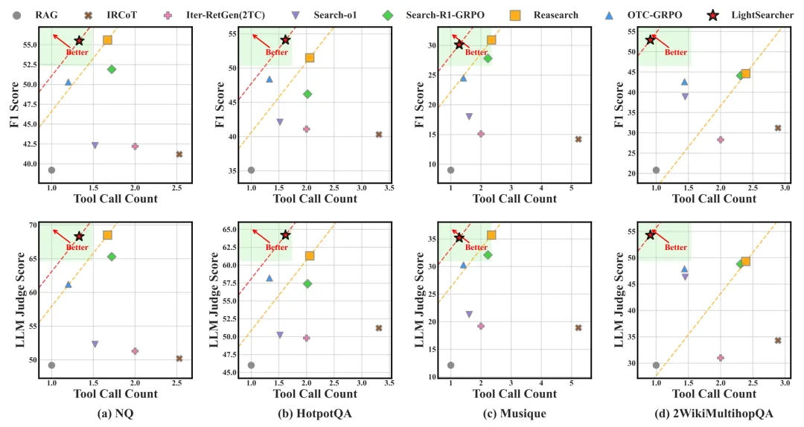
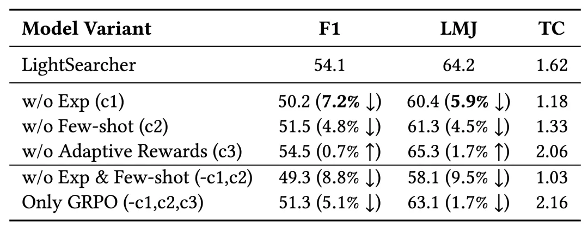

论文标题：LightSearcher: Efficient DeepSearch via Experiential Memory

论文链接：https://arxiv.org/abs/2512.06653

百家 AI 主页：https://baijia.online/homepage/index

如今，以 DeepSeek-R1 为代表的深度思考大模型能够处理复杂的推理任务，而DeepSearch 作为深度思考大模型的核心搜索器，在推理过程中通过迭代调用外部搜索工具，访问参数边界之外的最新、领域特定知识，从而提升推理的深度和事实可靠性。

然而，现有的 RL 驱动的深度思考大模型系统常常面临准确率与效率的「跷跷板」困境：频繁调用搜索工具提升准确性，却带来计算开销和效率低下。具体而言，高频调用外部搜索工具虽能补充实时信息、提升推理准确率，但使得推理延迟大幅升高，等待时间可达几十秒至几分钟。从用户体验角度来看，若信息加载时间超过 10 秒，50% 的移动用户会放弃访问。

北邮百家 AI 团队提出 LightSearcher 框架，首创基于经验记忆的高效 RL 优化技术，通过引入文本化经验记忆和自适应奖励塑造机制，巧妙解决了这一痛点。

在保持与 SOTA 基线 ReSearch 相当准确率的同时，搜索工具调用和模型回复时间显著缩短，搜索工具调用次数减少 39.6%，推理时间缩短 48.6%，Token 消耗降低 21.2%，在保持模型效果的同时显著提升了工具调用效率。

引言

如何教会深度思考大模型策略性地控制搜索工具的使用，优化何时以及如何查询外部知识源，是深度思考大模型亟待解决的问题。现有方法存在以下显著缺陷：

提示工程或监督学习方法依赖人工标注，成本高且泛化差；RL 驱动方法虽能自主优化，但奖励偏重准确性，导致模型为确保正确而频繁调用工具，造成冗余开销；

工具调用「过度依赖」，现有模型往往不分难易，对简单查询也反复检索，导致推理时间延长、token 消耗激增；

准确性与效率失衡，部分方法虽提升准确率，但牺牲效率；另一些虽减少调用，却降低答案质量，无法兼顾双重目标。

这些问题导致现有模型要么答案不准、可靠性差，要么工具调用过多、效率低下，难以同时满足推理准确和高效执行的核心需求。

LightSearcher 框架

为解决上述缺陷，北邮百家 AI 团队提出基于经验记忆的高效 DeepSearch 框架（LightSearcher），核心思路是在大模型强化推理过程中，通过「对比经验学习」将隐性推理轨迹转化为显性指导经验，并结合自适应奖励优化工具调用，具体包含三大关键组件：

对比经验推理机制（Contrastive Experiential Reasoning）：收集高低质量推理轨迹，通过 LLM 生成成功模式的自然语言总结（如「简单查询优先用内部知识」），构建动态经验记忆库；

自适应奖励塑造机制（Adaptive Reward Shaping）：引入最小工具调用基准，仅在答案正确时惩罚冗余调用，使用指数衰减函数动态平衡准确性和效率，避免盲目优化； 

基于经验的 RL 训练机制：采用 GRPO 算法，将积累经验和少样本示例融入提示模板，指导模型生成高效轨迹，确保探索与利用的均衡。 

模型最终优化目标为多目标奖励函数的加权和，确保工具调用精简与答案质量的协同提升。

实验

研究团队在四个多跳 QA 基准数据集（NQ、HotpotQA、Musique、2WikiMultihopQA）上进行了全面评估，对比了多种主流 DeepSearch 方法。

3.1 主实验结果

实验结果显示:

模型准确性保持顶尖：LightSearcher 在 F1 分数和 LLM 评判上与 SOTA 基线 ReSearch 相当，甚至在部分数据集上优于 ReSearch；

效率显著提升：工具调用减少 39.6%，推理时间缩短 48.6%，token 消耗降低 21.2%；

泛化能力强：在不同难度的查询（易 / 难）上均表现稳定，即使在域外测试集也能超越依赖固定检索的迭代方法。

3.2 消融实验

移除经验导致 F1 下降 7.2%，证明其核心作用。

LightSearcher 框架通过「经验记忆」这一核心理念，为构建高效、可靠的深度推理系统提供了新路径。尽管目前限于多跳 QA，未来可扩展到代码合成、策略规划等领域。论文成功解决了现有 DeepSearch 的关键痛点：

从隐性到显性：将对比轨迹转化为可解释的推理指导

精准平衡：通过自适应奖励确保工具调用最小化

效率优先：利用 RL 训练维持准确与开销的连贯性

双重优化：同时提升推理质量和执行效率，而非顾此失彼  

最后，大模型的 DeepSearch 能力需设计有效的经验机制。相比于复杂的手动标注，LightSearcher 通过其「对比经验」的设计思想，在推理过程依赖可靠的外部知识调用，为构建更加高效、可靠的 AI 深度思考系统提供了重要的技术路径。

# 参考

[1] 经验记忆黑科技：LightSearcher让AI工具调用减39.6%、推理快48.6%, https://mp.weixin.qq.com/s/GMyQFBOY_tcp3WLwv5cdJw