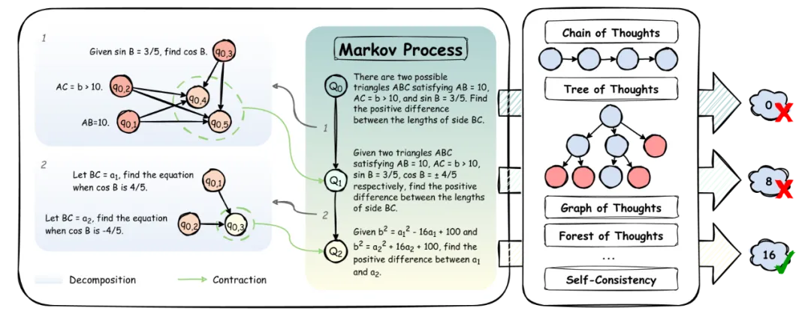
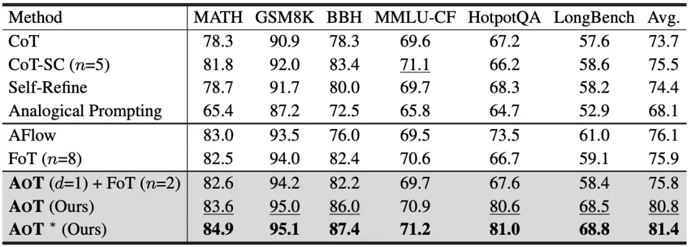
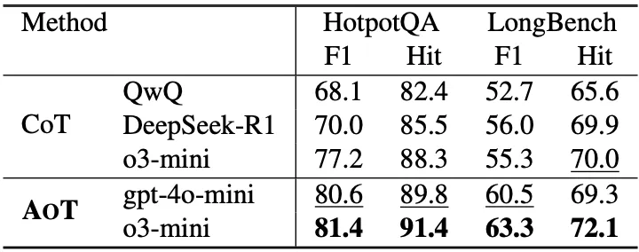

# 1. 资源

- 论文标题：Atom of Thoughts for Markov LLM Test-Time Scaling
- 论文地址：https://arxiv.org/abs/2502.12018
- 项目地址：https://github.com/qixucen/atom

# 2. 原理

大语言模型（LLM）近年来凭借训练时扩展（train-time scaling）取得了显著性能提升。然而，随着模型规模和数据量的瓶颈显现，测试时扩展（test-time scaling）成为进一步释放潜力的新方向。然而，无论是思维链（CoT）、思维树（ToT）等提示策略和推理框架，还是 OpenAI o1/o3 和 DeepSeek-R1 等推理模型，在推理时都过度依赖完整历史信息，导致计算资源浪费，同时冗余信息干扰有效推理。

具体来说，基于链的方法每进行一步推理，都需回顾已有的完整链条；基于树的方法则需要追踪祖先和同层节点；基于图的方法允许节点任意连接，进一步加重了历史信息依赖，导致计算复杂度上升。随着推理规模扩大，特别是以 OpenAI 的 o1/o3 和 DeepSeek-R1 为代表的推理模型，飙升的计算资源需求用于处理不断积累的历史信息。相比之下，人类推理倾向于将复杂问题拆分为独立的子问题，逐步解决并整合后续推理所需的信息，而不执着于保留每步细节。这种 “原子化思考” 启发了 AoT 的设计，使其专注当前状态的推理，摒弃历史依赖。

基于此观察，研究人员推出了 Atom of Thoughts（AoT），AoT 的核心洞察是：复杂推理可通过一系列轻量的 “原子问题” 实现，这些问题的执行仅依赖自身，摆脱历史信息依赖。AoT 将推理过程构建为马尔可夫过程（Markov process），通过不断进行状态转移，逐步简化问题并始终保持和原问题等价，最终求解轻量的原子问题来回答原问题。

AoT 如何推理？

由拆解收缩双阶段组成的马尔可夫转移过程

AoT 的一次状态转移由两个核心步骤组成：拆解（Decomposition）和收缩（Contraction）。这两个步骤共同完成一次状态转换，生成一个简化的问题作为下一轮拆解与收缩的 “原问题”。这一过程不断迭代，直到达到最大次数限制 —— 该限制由首次拆解生成的图的深度确定，以避免无限循环。

1. 拆解（Decomposition）

AoT 首先将当前问题分解为一个临时的、基于依赖关系的有向无环图（DAG）。在这个 DAG 中，节点代表子问题，边则表示它们之间的依赖关系。临时 DAG 提供的结构信息为后续收缩阶段奠定了基础，帮助消除因复杂结构带来的历史信息负担。

2. 收缩（Contraction）

拆解完成后，DAG 以规则化的方式区分子问题：无入边的节点被定义为独立子问题，有入边的节点被定义为依赖子问题。独立子问题的信息转化为已知条件，依赖子问题的描述则被整合为一个更简洁的独立问题，从而形成新的原子状态。这一状态的答案与前一状态的问题保持等价。由于马尔可夫过程从原问题初始化，所有状态均与原问题维持等价关系。

AoT 马尔可夫式的状态转移和原子化的状态表示极大地消除了对历史信息的依赖，将计算资源聚焦于当前的原子问题，提高推理的稳健性。

# 参考

[1] AI大佬曼宁转赞，MetaGPT团队首提「Atom of Thoughts」，原子化思考让4o-mini暴打推理模型？https://mp.weixin.qq.com/s/UPMC6aQ1zHtpHO4FL1eVdA