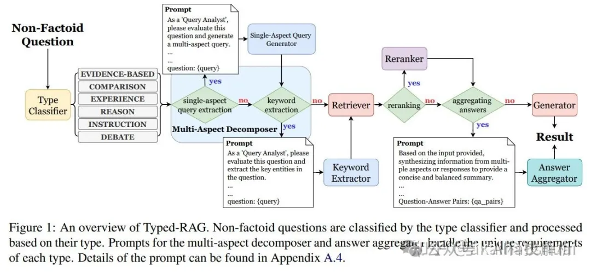

Typed-RAG: Type-aware Multi-Aspect Decomposition for Non-Factoid Question Answering

这是一个针对非事实性问题回答（NFQA）的类型感知多方面分解框架。它通过将问题分类为不同类型（如比较型、经验型、辩论型等），并将多方面问题分解为单方面子查询，优化了检索和生成策略。

该方法通过以下步骤解决问题：

1. 问题类型分类（Type Classification）

    - Typed-RAG 首先将非事实性问题分类为不同的类型（如辩论型、经验型、比较型等）。这一步通过预训练的分类器实现，能够识别问题的意图和所需的回答类型

2. 多方面分解（Multi-Aspect Decomposition）

    - 对于多方面的问题，将其分解为多个单方面子查询。
    - 每个子查询分别进行检索和生成，确保每个方面都能获取到相关的证据和信息。

3. 优化检索和生成策略（Optimized Retrieval and Generation）

    - 针对不同类型的问题，Typed-RAG 采用了不同的检索和生成策略：
    - 基于证据型（Evidence-based）：直接使用 RAG 方法，检索与问题相关的段落并生成答案。
    - 比较型（Comparison）：提取比较目的和关键词，分别检索每个关键词相关的段落，然后合成答案。
    - 经验型（Experience）：提取关键实体，根据实体检索相关段落并进行相似性重排，最后生成答案。
    - 原因型和指令型（Reason/Instruction）：将问题分解为多个子查询，分别检索和生成答案，最后通过答案聚合器合成最终答案。
    - 辩论型（Debate）：提取辩论主题和不同观点，为每个观点生成子查询，分别检索和生成答案，最后通过辩论调解器合成平衡的回答。

4. 答案聚合（Answer Aggregation）

    - 对于分解后的多个子查询，Typed-RAG 通过答案聚合器将各个子查询的答案合并为一个全面且连贯的回答。这一步确保了最终答案能够涵盖所有相关方面，并符合用户意图。