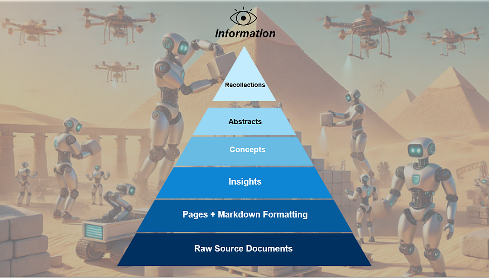
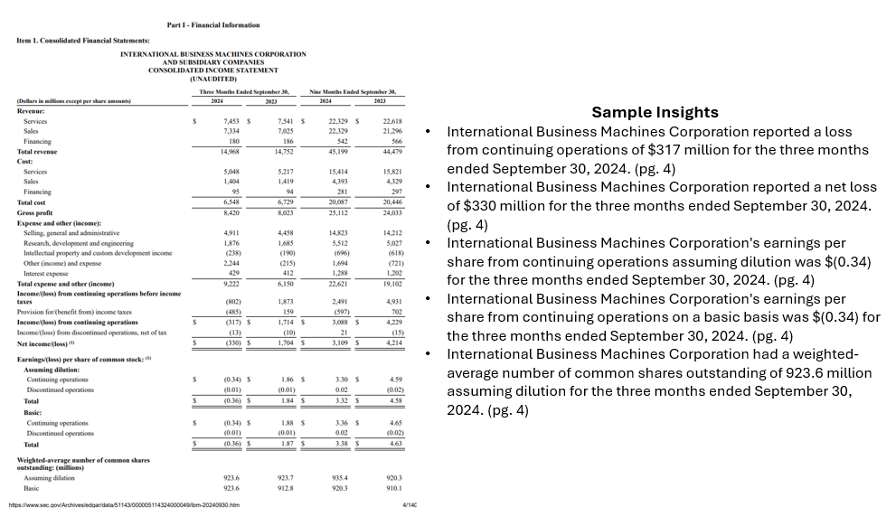
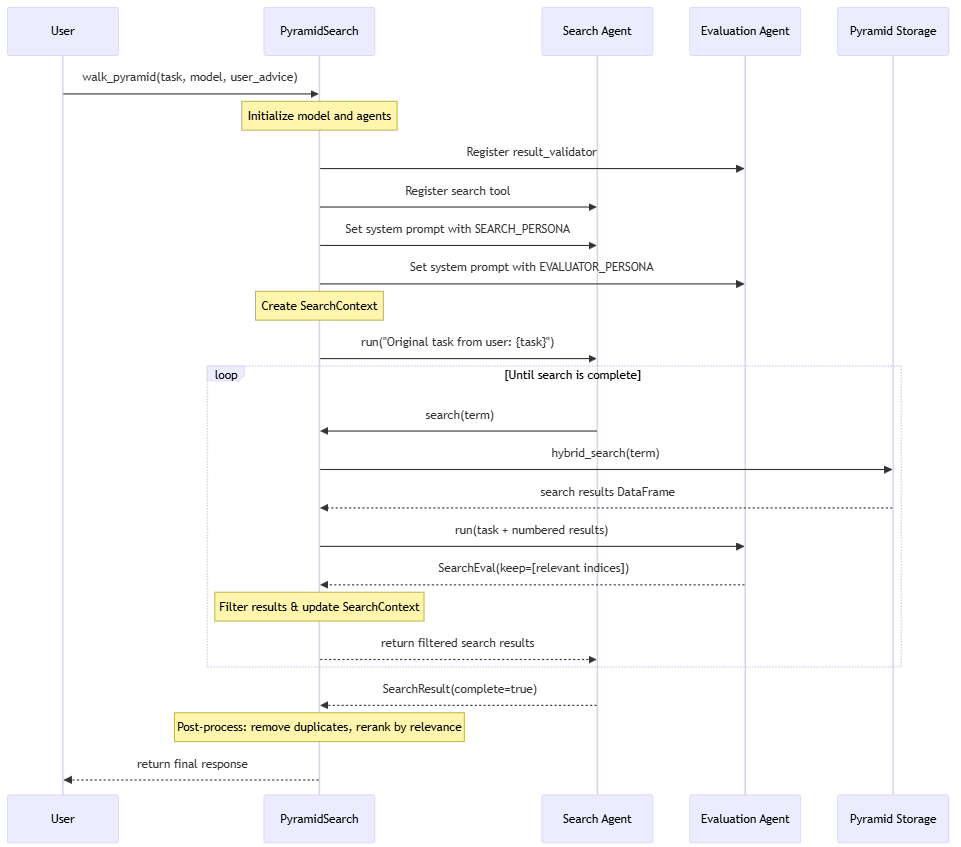
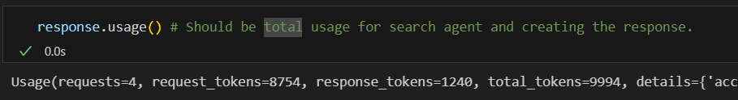
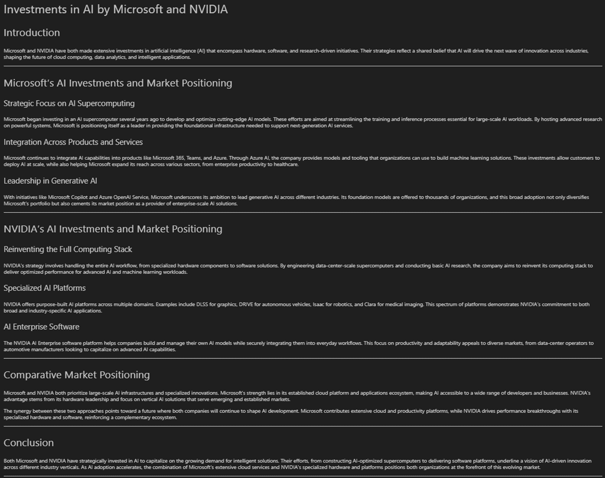
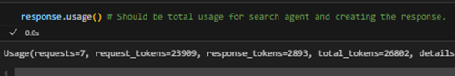
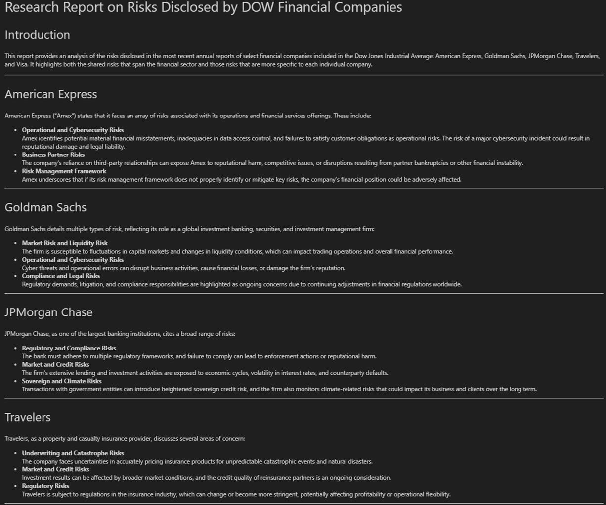
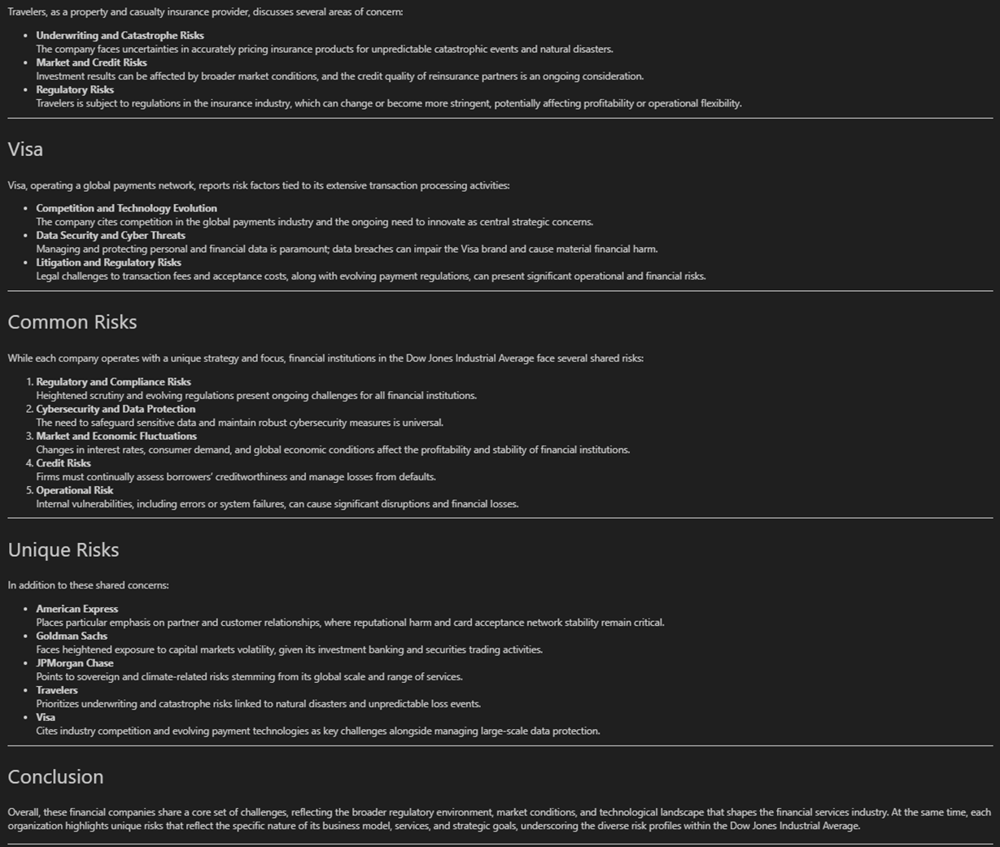
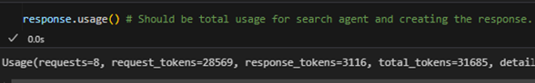

# 1. 资源

原文链接：https://towardsdatascience.com/overcome-failing-document-ingestion-rag-strategies-with-agentic-knowledge-distillation/

通过代理知识蒸馏克服失败的文档摄取和RAG策略

# 2. 简介

许多生成式 AI 用例仍然围绕检索增强生成 （RAG） 展开，但始终达不到用户的期望。尽管对 RAG 改进的研究越来越多，甚至将 Agent 添加到流程中，但许多解决方案仍然无法返回详尽的结果，错过了文档中不常提及的关键信息，需要多次搜索迭代，并且通常难以协调多个文档中的关键主题。最重要的是，许多 implementation 仍然依赖于将尽可能多的 “相关” 信息与详细的系统和用户提示一起塞入模型的上下文窗口。协调所有这些信息通常会超出模型的认知能力，并损害响应质量和一致性。 这就是我们的代理知识蒸馏 + 金字塔搜索方法发挥作用的地方。我的团队 Jim Brown、Mason Sawtell、Sandi Besen 和我没有追求最好的分块策略、检索算法或推理时间推理方法，而是采用代理方法进行文档摄取。 我们在摄取时利用模型的全部功能，专注于从文档数据集中提取和保留最有意义的信息。这允许模型将其推理能力引导到处理用户/系统指令上，而不是费力地理解跨文档块的格式和不同信息，从而从根本上简化了 RAG 流程。 我们专门针对高价值问题，这些问题通常难以评估，因为它们有多个正确答案或解决方案路径。这些情况是传统 RAG 解决方案最困难的地方，现有的 RAG 评估数据集在很大程度上不足以测试这个问题空间。为了实施研究，我们下载了道琼斯工业平均指数中 30 家公司的去年年度和季度报告。这些文件可以通过 SEC EDGAR 网站找到。有关 EDGAR 的信息可访问，可以免费下载，也可以通过 EDGAR 公共搜索进行查询。有关更多详细信息，请参阅 SEC 隐私政策，SEC 网站上的信息“被视为公共信息，网站用户可在未经 SEC 许可的情况下复制或进一步分发”。我们选择这个数据集有两个主要原因：首先，它超出了所评估模型的知识截止点，确保模型无法根据他们从预训练中获得的知识来回答问题;其次，它与现实世界的业务问题非常接近，同时允许我们使用公开可用的数据讨论和分享我们的发现。 虽然典型的 RAG 解决方案擅长于事实检索，在文档数据集中很容易识别答案（例如，“Apple 的年度股东大会是什么时候召开的？”），但它们难以解决需要更深入地理解跨文档概念的细微问题（例如，“哪家 DOW 公司拥有最有前途的 AI 战略？与我们测试的其他标准方法相比，我们的代理知识蒸馏 + 金字塔搜索方法解决了这些类型的问题，并克服了与在 RAG 系统中使用知识图谱相关的限制。 在本文中，我们将介绍我们的知识提炼过程如何运作、这种方法的主要好处、示例和公开讨论ion 关于评估这些类型系统的最佳方法，在许多情况下，没有单一的“正确”答案。 构建金字塔：能动性知识蒸馏如何运作 作者和团队提供的图像描绘了用于文档摄取的金字塔结构。机器人旨在代表构建金字塔的代理人。 概述 我们的知识提炼过程从原始源文档中创建了一个多层信息金字塔。我们的方法受到深度学习基于计算机视觉的任务中使用的金字塔的启发，这些金字塔允许模型在多个尺度上分析图像。我们获取原始文档的内容，将其转换为 markdown，并将内容提炼成一个包含原子见解、相关概念、文档摘要和一般回忆/回忆的列表。在检索过程中，可以访问金字塔的任何或所有级别以响应用户请求。 如何提取文档并构建金字塔： 将文档转换为 Markdown：将所有原始源文档转换为 Markdown。我们发现，与 JSON 等其他格式相比，模型处理 Markdown 最适合此任务，并且令牌效率更高。我们使用 Azure Document Intelligence 为文档的每个页面生成 Markdown，但还有许多其他开源库（如 MarkItDown）可以执行相同的作。我们的数据集包括 331 个文档和 16,601 个页面。 从每个页面中提取原子见解：我们使用两页滑动窗口处理文档，该窗口允许对每个页面进行两次分析。这使代理有机会在最初处理页面时更正任何潜在错误。我们指示模型创建一个带编号的见解列表，该列表会随着它处理文档中的页面而增长。如果上一页的分析不正确，代理可以覆盖这些分析，因为它会看到每个页面两次。我们指示模型按照主语-动词-宾语 （SVO） 格式在简单的句子中提取见解，并像英语是用户的第二语言一样编写句子。这通过鼓励清晰度和精确性来显著提高性能。多次滚动每个页面并使用 SVO 格式也解决了消歧问题，这对知识图谱来说是一个巨大的挑战。洞察生成步骤对于从表中提取信息也特别有用，因为该模型以清晰、简洁的句子从表中捕获事实。我们的数据集总共产生了 216,931 个洞察，每页大约 13 个洞察，每个文档大约 655 个洞察。 从洞察中提炼概念：从详细的洞察列表中，我们确定了连接文档相关信息的更高级别概念。此步骤可显著减少文档中的杂色和冗余信息，同时保留基本信息和主题。我们的数据集总共生成了 14,824 个概念，每页大约 1 个概念，每个文档大约 45 个概念。 从概念创建摘要：鉴于文档中的见解和概念，LLM 编写的摘要看起来比人类编写的任何摘要都要好，并且比原始文档中的任何摘要都信息更密集。LLM 生成的摘要提供了有关文档的非常全面的知识，具有较小的令牌密度，其中包含大量信息。我们每篇论文制作一份摘要，共 331 篇。 跨文档存储回忆/回忆：在金字塔的顶部，我们存储在所有任务中都有用的关键信息。这可以是用户分享的有关任务的信息，也可以是代理通过研究和响应任务随着时间的推移了解数据集的信息。例如，我们可以将 DOW 中的当前 30 家公司存储为回忆，因为此列表与模型知识截止时 DOW 中的 30 家公司不同。随着我们进行越来越多的研究任务，我们可以不断改进我们的回忆，并维护这些回忆来自哪些文件的审计跟踪。例如，我们可以跟踪公司的 AI 战略、公司正在进行重大投资等。这些高级连接非常重要，因为它们揭示了在单个页面或文档中不明显的关系和信息。 从 IBM 2024 年第 3 季度第 10 季度提取的洞察样本子集（第 4 页） 我们将金字塔的每一层（页面及以上）的文本和嵌入存储在 Azure PostgreSQL 中。我们最初使用 Azure AI 搜索，但出于成本原因切换到 PostgreSQL。这需要我们编写自己的混合搜索函数，因为 PostgreSQL 本身尚不支持此功能。此实现适用于您选择的任何 vector 数据库或 vector index。关键要求是在金字塔的任何级别存储和有效地检索文本和向量嵌入。 这种方法本质上是创建知识图谱的本质，但以自然语言存储信息，这是 LLM 原生希望与之交互的方式，并且在令牌检索方面效率更高。我们还让 LLM 选择用于对金字塔的每个级别进行分类的术语，这似乎让模型自己决定描述和区分存储在每个级别的信息的最佳方式。例如，LLM 更喜欢将 “insights” 而不是 “facts” 作为第一级提炼知识的标签。我们这样做的目的是让 LLM 决定如何存储和分组相关信息，从而更好地了解 LLM 如何思考该过程。 使用金字塔：如何与RAG和代理人合作 在推理时，传统的 RAG 和代理方法都受益于我们的知识金字塔中摄取的预处理、提炼信息。金字塔结构允许在传统的 RAG 情况下进行高效检索，其中仅检索前 X 条相关信息，或在 Agent 情况下，Agent 在返回最终响应之前迭代计划、检索和评估信息。 金字塔方法的优点是，在推理过程中可以使用金字塔任何级别的信息。在我们的实现中，我们使用 PydanticAI 创建了一个搜索代理，该代理接收用户请求、生成搜索词、探索与请求相关的想法，并跟踪与请求相关的信息。一旦搜索代理确定有足够的信息来处理用户请求，结果就会重新排名并发送回 LLM 以生成最终回复。我们的实现允许搜索代理在收集有关概念/搜索词的详细信息时遍历金字塔中的信息。这类似于遍历知识图谱，但对 LLM 来说更自然，因为金字塔中的所有信息都以自然语言存储。 根据用例，Agent 可以访问e 金字塔或仅在特定级别（例如，仅从概念中检索信息）。在我们的实验中，我们没有检索原始页面级数据，因为我们想专注于令牌效率，并发现 LLM 生成的见解、概念、摘要和回忆的信息足以完成我们的任务。理论上，Agent 也可以访问页面数据;这将为代理人提供重新检查原始文档文本的额外机会;但是，它也会显著增加使用的总代币。 以下是我们响应用户请求的 Agentic 方法的高级可视化： 由作者和团队创建的图片提供了代理研究和响应过程的概述 金字塔的结果：真实示例 为了评估我们方法的有效性，我们针对各种问题类别对其进行了测试，包括典型的事实调查问题和复杂的跨文档研究和分析任务。 实况调查（鱼叉捕鱼）： 这些任务需要识别隐藏在文档中的特定信息或事实。这些是典型的 RAG 解决方案所针对的问题类型，但通常需要大量搜索并消耗大量令牌才能正确回答。 示例任务：“IBM 在最新财务报告中的总收入是多少？ 使用金字塔法的响应示例：“IBM 2024 年第三季度的总收入为 149.68 亿美元 [ibm-10q-q3-2024.pdf，第 4 页] 用于研究和生成响应的代币总数 此结果是正确的（人工验证），并且仅使用总共 9,994 个令牌生成，生成的最终响应中有 1,240 个令牌。 复杂的研究和分析： 这些任务涉及研究和理解多个概念，以更广泛地理解文档，并根据收集到的事实做出推断和明智的假设。 示例任务：“分析 Microsoft 和 NVIDIA 在 AI 方面的投资，以及他们如何在市场上定位自己。报告应该有明确的格式。 响应示例： 代理分析 Microsoft 和 NVIDIA 的 AI 投资和定位生成的响应。 结果是一份快速执行的综合报告，其中包含有关每家公司的详细信息。总共使用了 26,802 个令牌来研究和响应请求，其中很大一部分用于最终响应（2,893 个令牌或 ~11%）。这些结果也由人工审查以验证其有效性。 指示任务的令牌总使用量的代码段 示例任务：“创建有关分析道琼斯指数中各种金融公司披露的风险的报表。指出哪些风险是共享的和唯一的。 响应示例： 代理人对已披露风险的回应的第 1 部分。 代理人对已披露风险的回应的第 2 部分。 同样，此任务在 42.7 秒内完成，总共使用了 31,685 个令牌，其中 3,116 个令牌用于生成最终报告。 指示任务的令牌总使用量的代码段 事实调查和复杂分析任务的这些结果表明，金字塔方法使用最少的标记有效地创建低延迟的详细报告。用于任务的标记具有密集的含义，几乎没有噪音，允许跨任务进行高质量、全面的响应。 金字塔的好处：为什么要使用它？ 总体而言，我们发现我们的金字塔方法显著提高了高价值问题的回答质量和整体表现。 我们观察到的一些主要好处包括： 减少模型的认知负载：当代理收到用户任务时，它会检索经过预处理的提炼信息，而不是原始的、格式不一致的、不同的文档块。这从根本上改进了检索过程，因为模型不会浪费其认知能力来首次尝试分解页面/块文本。 卓越的表格处理：通过分解表格信息并将其存储在简洁但具有描述性的句子中，金字塔方法可以更轻松地在推理时通过自然语言查询检索相关信息。这对我们的数据集尤其重要，因为财务报告在表格中包含大量关键信息。 提高了对多种类型请求的响应质量：金字塔支持对精确的事实调查问题和基于广泛分析的任务（涉及众多文档中的许多主题）提供更全面的上下文感知响应。 保留关键上下文：由于蒸馏过程会识别并跟踪关键事实，因此可能在文档中只出现一次的重要信息更容易维护。例如，请注意所有表都以数百万美元或特定货币表示。传统的分块方法通常会导致此类信息从裂缝中溜走。 优化的令牌使用、内存和速度：通过在摄取时提取信息，我们显著减少了推理过程中所需的令牌数量，能够最大限度地发挥上下文窗口中信息的价值，并改善内存使用。 可扩展性：随着文档数据集大小的增长，许多解决方案难以执行。此方法提供了一种更有效的方法，即仅保留关键信息来管理大量文本。这还允许更高效地使用 LLM 上下文窗口，只需向其发送有用、清晰的信息。 高效的概念探索：金字塔使代理能够像导航知识图谱一样探索相关信息，但不需要在图中生成或维护关系。代理可以专门使用自然语言，并以高度令牌效率和流畅的方式跟踪与其正在探索的概念相关的重要事实。 对紧急数据集的理解：在我们的测试过程中，这种方法出现了一个意想不到的好处。当询问诸如“您能告诉我关于这个数据集的什么信息”或“我可以问什么类型的问题”之类的问题时，系统能够响应并建议富有成效的搜索主题，因为它通过访问金字塔中的更高级别（如摘要和回忆）对数据集上下文有更强大的理解。 超越金字塔：评估挑战和未来方向 挑战 虽然我们在使用金字塔搜索方法时观察到的结果令人惊叹，但找到建立有意义的指标以在摄取时和信息检索期间评估整个系统的方法具有挑战性。传统的 RAG 和 Agent 评估框架通常无法解决细微的问题和分析响应，而许多不同的响应都是有效的。 我们的团队计划编写未来会发布一篇关于这种方法的研究论文，我们愿意接受来自社区的任何想法和反馈，尤其是在评估指标方面。我们发现的许多现有数据集都侧重于评估一个文档中的 RAG 用例或跨多个文档的精确信息检索，而不是跨文档和域的稳健概念和主题分析。 我们感兴趣的主要用例涉及更广泛的问题，这些问题代表了企业实际希望如何与 GenAI 系统交互。例如，“告诉我我需要了解的有关客户 X 的所有信息”或“客户 A 和 B 的行为有何不同？我更有可能与哪个人成功会面？这些类型的问题需要对许多来源的信息有深入的理解。这些问题的答案通常需要一个人综合来自多个业务领域的数据并对其进行批判性思考。因此，这些问题的答案很少被写入或保存在任何地方，这使得在典型的 RAG 过程中无法简单地通过向量索引存储和检索它们。 另一个考虑因素是，许多实际用例都涉及动态数据集，其中文档会不断被添加、编辑和删除。这使得评估和跟踪什么是“正确”回答变得困难，因为答案会随着可用信息的变化而变化。 未来方向 在未来，我们相信金字塔方法可以通过更有效地处理密集文档并将学习的信息存储为回忆来解决其中的一些挑战。然而，随着时间的推移跟踪和评估回忆的有效性对于系统的整体成功至关重要，并且仍然是我们正在进行的工作的关键重点领域。 在将这种方法应用于组织数据时，金字塔流程还可用于识别和评估业务领域之间的差异。例如，上传公司的所有销售宣传资料可能会在某些产品或服务的定位不一致的地方出现。它还可用于比较从各种业务线数据中提取的见解，以帮助了解团队是否以及在何处对主题或不同优先级产生了相互冲突的理解。此应用程序超越了纯粹的信息检索用例，并允许金字塔作为组织对齐工具，帮助识别消息传递、术语和整体沟通中的差异。 结论：关键要点以及金字塔方法为何重要 知识蒸馏金字塔方法非常重要，因为它在摄取和检索时都利用了 LLM 的全部功能。我们的方法允许您将密集信息存储在更少的令牌中，这具有在推理时减少数据集中噪声的额外好处。我们的方法运行速度也非常快，并且具有令人难以置信的代币效率，我们能够在几秒钟内生成响应，探索潜在的数百次搜索，并且平均使用

许多生成式 AI 用例仍然围绕检索增强生成 （RAG） 展开，但始终达不到用户的期望。尽管对 RAG 改进的研究越来越多，甚至将 Agent 添加到流程中，但许多解决方案仍然无法返回详尽的结果，错过了文档中不常提及的关键信息，需要多次搜索迭代，并且通常难以协调多个文档中的关键主题。最重要的是，许多 implementation 仍然依赖于将尽可能多的 “相关” 信息与详细的系统和用户提示一起塞入模型的上下文窗口。协调所有这些信息通常会超出模型的认知能力，并损害响应质量和一致性。

这就是我们的代理知识蒸馏 + 金字塔搜索方法发挥作用的地方。我的团队 Jim Brown、Mason Sawtell、Sandi Besen 和我没有追求最好的分块策略、检索算法或推理时间推理方法，而是采用代理方法进行文档摄取。

我们在摄取时利用模型的全部功能，专注于从文档数据集中提取和保留最有意义的信息。这从根本上简化了 RAG 流程，它允许模型将其推理能力用于处理用户/系统指令，而不是努力理解跨文档块的格式和不同信息。

我们专门针对高价值问题，这些问题通常难以评估，因为它们有多个正确答案或解决方案路径。这些情况是传统 RAG 解决方案最困难的地方，现有的 RAG 评估数据集在很大程度上不足以测试这个问题空间。为了实施研究，我们下载了道琼斯工业平均指数中 30 家公司的去年年度和季度报告。这些文件可以通过 SEC EDGAR 网站找到。有关 EDGAR 的信息可访问，可以免费下载，也可以通过 EDGAR 公共搜索进行查询。有关更多详细信息，请参阅 SEC 隐私政策，SEC 网站上的信息“被视为公共信息，网站用户可在未经 SEC 许可的情况下复制或进一步分发”。我们选择这个数据集有两个主要原因：首先，它超出了所评估模型的知识截止点，确保模型无法根据他们从预训练中获得的知识来回答问题;其次，它与现实世界的业务问题非常接近，同时允许我们使用公开可用的数据讨论和分享我们的发现。

虽然典型的 RAG 解决方案擅长于事实检索，在文档数据集中很容易识别答案（例如，“Apple 的年度股东大会是什么时候召开的？”），但它们难以解决需要更深入地理解跨文档概念的细微问题（例如，“哪家 DOW 公司拥有最有前途的 AI 战略？与我们测试的其他标准方法相比，我们的代理知识蒸馏 + 金字塔搜索方法解决了这些类型的问题，并克服了与在 RAG 系统中使用知识图谱相关的限制。

在本文中，我们将介绍我们的知识提炼过程是如何运作的、这种方法的主要好处、示例，并就评估这些类型系统的最佳方法进行公开讨论，在许多情况下，没有单一的 “正确” 答案。

# 3. 构建金字塔：能动性知识蒸馏如何运作

概述

我们的知识提炼过程从原始源文档中创建了一个多层信息金字塔。我们的方法受到深度学习基于计算机视觉的任务中使用的金字塔的启发，这些金字塔允许模型在多个尺度上分析图像。我们获取原始文档的内容，将其转换为 markdown，并将内容提炼成一个包含原子见解、相关概念、文档摘要和一般回忆/回忆的列表。在检索过程中，可以访问金字塔的任何或所有级别以响应用户请求。

如何提取文档并构建金字塔：
1. 将文档转换为 Markdown：将所有原始源文档转换为 Markdown。我们发现，与 JSON 等其他格式相比，模型处理 Markdown 最适合此任务，并且令牌效率更高。我们使用 Azure Document Intelligence 为文档的每个页面生成 Markdown，但还有许多其他开源库（如 MarkItDown）可以执行相同的作。我们的数据集包括 331 个文档和 16,601 个页面。
2. 从每个页面中提取原子见解：我们使用两页滑动窗口处理文档，该窗口允许对每个页面进行两次分析。这使代理有机会在最初处理页面时更正任何潜在错误。我们指示模型创建一个带编号的见解列表，该列表会随着它处理文档中的页面而增长。如果上一页的分析不正确，代理可以覆盖这些分析，因为它会看到每个页面两次。我们指示模型按照主语-动词-宾语 （SVO） 格式在简单的句子中提取见解，并像英语是用户的第二语言一样编写句子。这通过鼓励清晰度和精确性来显著提高性能。多次滚动每个页面并使用 SVO 格式也解决了消歧问题，这对知识图谱来说是一个巨大的挑战。见解生成步骤对于从表中提取信息也特别有用，因为该模型以清晰、简洁的句子从表中捕获事实。我们的数据集总共产生了 216,931 个洞察，每页大约 13 个洞察，每个文档大约 655 个洞察。
3. 从洞察中提炼概念：从详细的洞察列表中，我们确定了连接文档相关信息的更高级别概念。此步骤可显著减少文档中的杂色和冗余信息，同时保留基本信息和主题。我们的数据集总共生成了 14,824 个概念，每页大约 1 个概念，每个文档大约 45 个概念。 
4. 从概念创建摘要：鉴于文档中的见解和概念，LLM 编写的摘要看起来比人类编写的任何摘要都要好，并且比原始文档中的任何摘要都信息更密集。LLM 生成的摘要提供了有关文档的非常全面的知识，具有较小的令牌密度，其中包含大量信息。我们每篇论文制作一份摘要，共 331 篇。
5. 跨文档存储回忆/回忆：在金字塔的顶部，我们存储了对所有任务都有用的关键信息。这可以是用户分享的有关任务的信息，也可以是代理通过研究和响应任务随着时间的推移了解数据集的信息。例如，我们可以将 DOW 中的当前 30 家公司存储为回忆，因为此列表与模型知识截止时 DOW 中的 30 家公司不同。随着我们进行越来越多的研究任务，我们可以不断改进我们的回忆，并维护这些回忆来自哪些文件的审计跟踪。例如，我们可以跟踪公司的 AI 战略、公司正在进行重大投资等。这些高级连接非常重要，因为它们揭示了在单个页面或文档中不明显的关系和信息。

从 IBM 2024 年第 3 季度第 10 季度提取的洞察样本子集（第 4 页）
我们将金字塔的每一层（页面及以上）的文本和嵌入存储在 Azure PostgreSQL 中。我们最初使用 Azure AI 搜索，但出于成本原因切换到 PostgreSQL。这需要我们编写自己的混合搜索函数，因为 PostgreSQL 本身尚不支持此功能。此实现适用于您选择的任何 vector 数据库或 vector index。关键要求是在金字塔的任何级别存储和有效地检索文本和向量嵌入。

这种方法本质上是创建知识图谱的本质，但以自然语言存储信息，这是 LLM 原生希望与之交互的方式，并且在令牌检索方面效率更高。我们还让 LLM 选择用于对金字塔的每个级别进行分类的术语，这似乎让模型自己决定描述和区分存储在每个级别的信息的最佳方式。例如，LLM 更喜欢将 “insights” 而不是 “facts” 作为第一级提炼知识的标签。我们这样做的目的是让 LLM 决定如何存储和分组相关信息，从而更好地了解 LLM 如何思考该过程。

# 4. 使用金字塔：如何与RAG和代理人合作

在推理时，传统的 RAG 和代理方法都受益于我们的知识金字塔中摄取的预处理、提炼信息。金字塔结构允许在传统的 RAG 情况下进行高效检索，其中仅检索前 X 条相关信息，或在 Agent 情况下，Agent 在返回最终响应之前迭代计划、检索和评估信息。

金字塔方法的优点是，在推理过程中可以使用金字塔任何级别的信息。在我们的实现中，我们使用 PydanticAI 创建了一个搜索代理，该代理接收用户请求、生成搜索词、探索与请求相关的想法，并跟踪与请求相关的信息。一旦搜索代理确定有足够的信息来处理用户请求，结果就会重新排名并发送回 LLM 以生成最终回复。我们的实现允许搜索代理在收集有关概念/搜索词的详细信息时遍历金字塔中的信息。这类似于遍历知识图谱，但对 LLM 来说更自然，因为金字塔中的所有信息都以自然语言存储。

根据用例，Agent 可以访问金字塔所有级别的信息，也可以仅访问特定级别的信息（例如，仅从概念中检索信息）。在我们的实验中，我们没有检索原始页面级数据，因为我们想专注于令牌效率，并发现 LLM 生成的见解、概念、摘要和回忆的信息足以完成我们的任务。理论上，Agent 也可以访问页面数据;这将为代理人提供重新检查原始文档文本的额外机会;但是，它也会显著增加使用的总代币。

以下是我们响应用户请求的 Agentic 方法的高级可视化：

由作者和团队创建的图片提供了代理研究和响应过程的概述

# 5. 金字塔的结果：真实示例

为了评估我们方法的有效性，我们针对各种问题类别对其进行了测试，包括典型的事实调查问题和复杂的跨文档研究和分析任务。

实况调查（鱼叉捕鱼）：

这些任务需要识别隐藏在文档中的特定信息或事实。这些是典型的 RAG 解决方案所针对的问题类型，但通常需要大量搜索并消耗大量令牌才能正确回答。

示例任务：“IBM 在最新财务报告中的总收入是多少？

使用金字塔法的响应示例：“IBM 2024 年第三季度的总收入为 149.68 亿美元 [ibm-10q-q3-2024.pdf，第 4 页]

用于研究和生成响应的代币总数

此结果是正确的（人工验证），并且仅使用总共 9,994 个令牌生成，生成的最终响应中有 1,240 个令牌。

复杂的研究和分析：

这些任务涉及研究和理解多个概念，以更广泛地理解文档，并根据收集到的事实做出推断和明智的假设。

示例任务：“分析 Microsoft 和 NVIDIA 在 AI 方面的投资，以及他们如何在市场上定位自己。报告应该有明确的格式。

响应示例：

代理分析 Microsoft 和 NVIDIA 的 AI 投资和定位生成的响应。

结果是一份快速执行的综合报告，其中包含有关每家公司的详细信息。总共使用了 26,802 个令牌来研究和响应请求，其中很大一部分用于最终响应（2,893 个令牌或 ~11%）。这些结果也由人工审查以验证其有效性。

指示任务的令牌总使用量的代码段

示例任务：“创建有关分析道琼斯指数中各种金融公司披露的风险的报表。指出哪些风险是共享的和唯一的。

响应示例：

代理人对已披露风险的回应的第 1 部分。

代理人对已披露风险的回应的第 2 部分。

同样，此任务在 42.7 秒内完成，总共使用了 31,685 个令牌，其中 3,116 个令牌用于生成最终报告。

指示任务的令牌总使用量的代码段

事实调查和复杂分析任务的这些结果表明，金字塔方法使用最少的标记有效地创建低延迟的详细报告。用于任务的标记具有密集的含义，几乎没有噪音，允许跨任务进行高质量、全面的响应。

# 6. 金字塔的好处：为什么要使用它？

总体而言，我们发现我们的金字塔方法显著提高了高价值问题的回答质量和整体表现。

我们观察到的一些主要好处包括：
- 减少模型的认知负载：当代理收到用户任务时，它会检索经过预处理的提炼信息，而不是原始的、格式不一致的、不同的文档块。这从根本上改进了检索过程，因为模型不会浪费其认知能力来首次尝试分解页面/块文本。
- 卓越的表格处理：通过分解表格信息并将其存储在简洁但具有描述性的句子中，金字塔方法可以更轻松地在推理时通过自然语言查询检索相关信息。这对我们的数据集尤其重要，因为财务报告在表格中包含大量关键信息。
- 提高了对多种类型请求的响应质量：金字塔支持对精确的事实调查问题和基于广泛分析的任务（涉及众多文档中的许多主题）提供更全面的上下文感知响应。
- 保留关键上下文：由于蒸馏过程会识别并跟踪关键事实，因此可能在文档中只出现一次的重要信息更容易维护。例如，请注意所有表都以数百万美元或特定货币表示。传统的分块方法通常会导致此类信息从裂缝中溜走。
- 优化的令牌使用、内存和速度：通过在摄取时提取信息，我们显著减少了推理过程中所需的令牌数量，能够最大限度地发挥上下文窗口中信息的价值，并改善内存使用。
- 可扩展性：随着文档数据集大小的增长，许多解决方案难以执行。此方法提供了一种更有效的方法，即仅保留关键信息来管理大量文本。这还允许更高效地使用 LLM 上下文窗口，只需向其发送有用、清晰的信息。
- 高效的概念探索：金字塔使代理能够像导航知识图谱一样探索相关信息，但不需要在图中生成或维护关系。代理可以专门使用自然语言，并以高度令牌效率和流畅的方式跟踪与其正在探索的概念相关的重要事实。
- 对紧急数据集的理解：在我们的测试过程中，这种方法出现了一个意想不到的好处。当询问诸如“您能告诉我关于这个数据集的什么信息”或“我可以问什么类型的问题”之类的问题时，系统能够响应并建议富有成效的搜索主题，因为它通过访问金字塔中的更高级别（如摘要和回忆）对数据集上下文有更强大的理解。

# 7. 超越金字塔：评估挑战和未来方向

**挑战**

虽然我们在使用金字塔搜索方法时观察到的结果令人惊叹，但找到建立有意义的指标以在摄取时和信息检索期间评估整个系统的方法具有挑战性。传统的 RAG 和 Agent 评估框架通常无法解决细微的问题和分析响应，而许多不同的响应都是有效的。

我们的团队计划在未来撰写一篇关于这种方法的研究论文，我们愿意接受来自社区的任何想法和反馈，尤其是在评估指标方面。我们发现的许多现有数据集都侧重于评估一个文档中的 RAG 用例或跨多个文档的精确信息检索，而不是跨文档和域的稳健概念和主题分析。

我们感兴趣的主要用例涉及更广泛的问题，这些问题代表了企业实际希望如何与 GenAI 系统交互。例如，“告诉我我需要了解的有关客户 X 的所有信息”或“客户 A 和 B 的行为有何不同？我更有可能与哪个人成功会面？这些类型的问题需要对许多来源的信息有深入的理解。这些问题的答案通常需要一个人综合来自多个业务领域的数据并对其进行批判性思考。因此，这些问题的答案很少被写入或保存在任何地方，这使得在典型的 RAG 过程中无法简单地通过向量索引存储和检索它们。

另一个考虑因素是，许多实际用例都涉及动态数据集，其中文档会不断被添加、编辑和删除。这使得评估和跟踪什么是“正确”回答变得困难，因为答案会随着可用信息的变化而变化。

**未来方向**

在未来，我们相信金字塔方法可以通过更有效地处理密集文档并将学习的信息存储为回忆来解决其中的一些挑战。然而，随着时间的推移跟踪和评估回忆的有效性对于系统的整体成功至关重要，并且仍然是我们正在进行的工作的关键重点领域。

在将这种方法应用于组织数据时，金字塔流程还可用于识别和评估业务领域之间的差异。例如，上传公司的所有销售宣传资料可能会在某些产品或服务的定位不一致的地方出现。它还可用于比较从各种业务线数据中提取的见解，以帮助了解团队是否以及在何处对主题或不同优先级产生了相互冲突的理解。此应用程序超越了纯粹的信息检索用例，并允许金字塔作为组织对齐工具，帮助识别消息传递、术语和整体沟通中的差异。

# 8. 结论：关键要点以及金字塔方法为何重要

知识蒸馏金字塔方法非常重要，因为它在摄取和检索时都利用了 LLM 的全部功能。我们的方法允许您将密集信息存储在更少的令牌中，这具有在推理时减少数据集中噪声的额外好处。我们的方法运行速度非常快，并且具有令人难以置信的代币效率，我们能够在几秒钟内生成响应，探索潜在的数百次搜索，以及平均使用量（这包括所有搜索迭代！

我们发现 LLM 更擅长将原子见解写成句子，并且这些见解有效地从基于文本的数据和表格数据中提取信息。这些以自然语言编写的提炼信息对于 LLM 来说非常容易理解和导航，因为它不必花费不必要的精力来推理和分解文档格式或通过噪音进行过滤。

在金字塔的任何级别检索和聚合信息的能力也为处理各种查询类型提供了极大的灵活性。这种方法为大型数据集提供了有前途的性能，并支持需要细致入微的信息检索和分析的高价值使用案例。

# 参考

[1] Overcome Failing Document Ingestion & RAG Strategies with Agentic Knowledge Distillation, https://onmine.io/overcome-failing-document-ingestion-rag-strategies-with-agentic-knowledge-distillation/