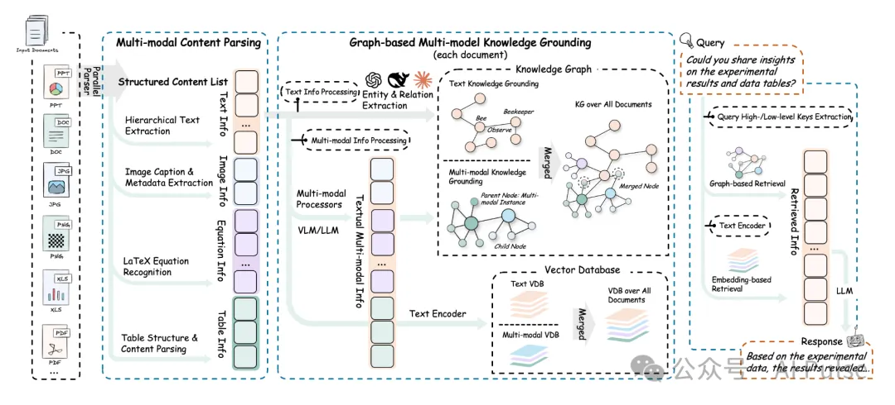

# 资源

官方代码：https://github.com/HKUDS/RAG-Anything

# 介绍

传统RAG其核心假设是信息存在于文本中。处理复杂文档时，采用“提取-切分”策略，如 PyMuPDF 提取文本，然后按固定长度或章节切块。
这种方法的根本缺陷是破坏了文档的二维结构信息和多模态关联性。图表、公式、图片等视觉元素要么被忽略，要么被错误地转录为无意义的文本，导致上下文严重失真。
RAG-Anything的核心思想是，文档的最小可理解单元不是文本块，而是有意义的“元素”。
它通过AI模型（特别是视觉模型）先对文档进行“场景理解”（Scene Understanding），将页面解构成一个由段落、标题、图片、表格、列表等组成的结构化对象图。这种“先理解，后检索”的模式是其技术先进性的根本来源。

2. 万物模型 (Anything-Model)
项目的精髓在于其 Parser 模块。它没有采用传统的基于规则的解析器（如 unstructured.io 的早期版本），而是大胆地使用了开放词汇目标检测模型 (Open-Vocabulary Object Detection)，如 YOLO-World。
泛化能力： 传统布局分析模型通常在特定数据集（如 PubLayNet）上训练，只能识别预定义的类别（如 text, title, list, table, figure）。而 YOLO-World 可以接受任意文本提示作为检测目标。这意味着开发者可以动态定义想要识别的元素类型（例如 "财务报表中的关键指标区域"、"代码块"、"数学公式"），而无需重新训练模型。这为处理高度定制化或罕见的文档格式提供了前所未有的灵活性。
鲁棒性： 对于扫描件、带水印的文档或排版奇特的PPT，基于规则的解析器很容易失效。而视觉模型对这些噪声具有更强的鲁棒性，能更准确地分割出内容区域。

3. 架构设计的优势
高度模块化 (High Modularity): 项目清晰地划分为解析、嵌入、检索、合成四个阶段。这种解耦设计带来了极高的可扩展性和可维护性。用户可以轻松替换任何一个模块：
- 不满意 GPT-4V？可以换成开源的 LLaVA 或 Qwen-VL。
- 觉得 BGE-M3 不适合特定领域的文本？可以换成行业专用的 embedding 模型。
- FAISS 不满足生产需求？可以换成 Milvus 或 Weaviate 等分布式向量数据库。
端到端的多模态一致性 (End-to-End Multimodal Coherency): 项目确保了多模态信息流在整个管道中的一致性。图像不仅仅是被识别出来，它还会被专门的视觉模型进行嵌入，并在最后被多模态大模型进行理解。信息在传递过程中没有降维或丢失，这是生成高质量答案的关键。

4. 限制与未来方向
计算成本与延迟 (Computational Cost & Latency): 这是最显而易见的挑战。运行 YOLO-World、OCR、多个 Embedding 模型，最后再调用 GPT-4V，整个流程的计算开销巨大，实时性较差。在生产环境中，需要对模型进行蒸馏、量化或使用专门的硬件加速，并优化处理流程。
错误传播 (Error Propagation): 这是一个级联系统，Parser 的错误会直接影响后续所有环节。如果 YOLO-World 错误地将一个图表识别为普通图片，那么系统就失去了利用表格结构化信息的机会。系统的整体可靠性取决于其最薄弱的一环。
跨元素关系理解 (Inter-Element Relationship Understanding): 目前的检索机制是“元素级”的，可能难以捕捉跨越多个元素或页面的复杂逻辑关系（例如，“参见第5页的图3.1”、“下图展示了上文提到的趋势”）。
未来的研究方向可能是构建文档知识图谱 (Document Knowledge Graph)，将元素作为节点，将其逻辑关系作为边，从而实现更深层次的推理。 当前对视频的处理（关键帧提取+语音转录）相对初级。更高级的处理应包括动作识别、情绪分析、声纹识别等，以捕捉更丰富的时间序列信息。

总结
RAG-Anything 是一个杰出的开源项目，它精准地抓住了当前 RAG 技术的痛点，并利用最新的 AI 模型（特别是视觉和多模态模型）提出了一个优雅且强大的解决方案。 它不仅是一个功能完备的工具，更是一个思想领先的框架，为如何处理真实世界中的复杂、异构数据提供了重要的启示。

# 参考

[1] 港大开源RAG-Anything，从PDF图表到PPT动画，无所不解, https://mp.weixin.qq.com/s/MuyLxlpN4CBTfhD8oC72qQ